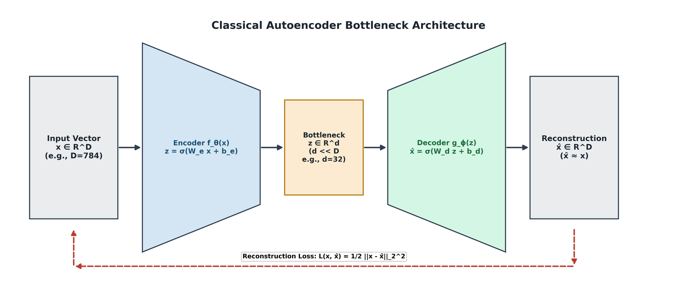
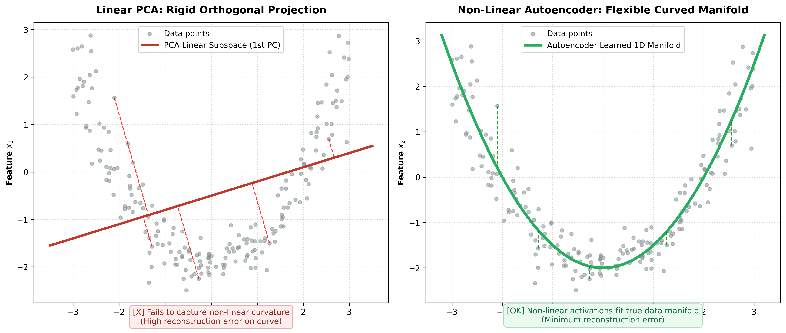
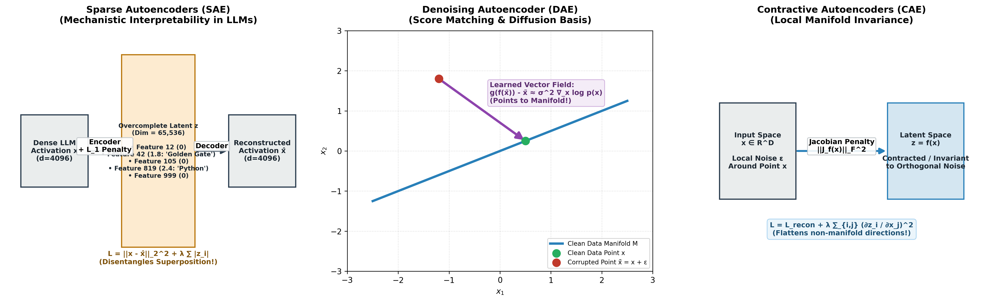
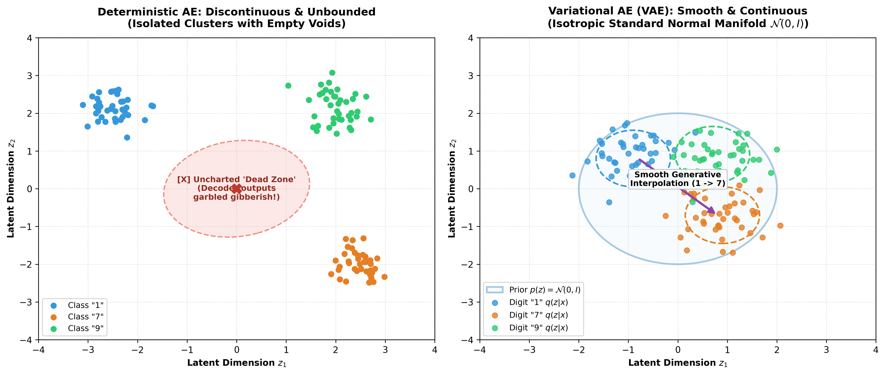
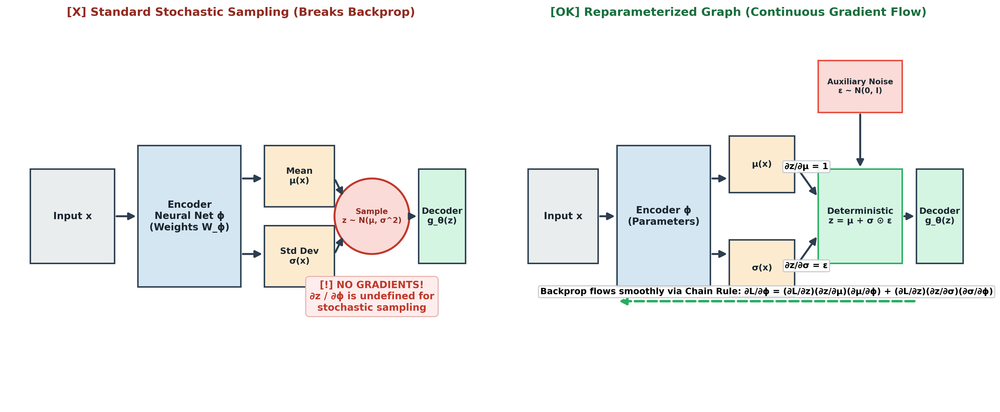
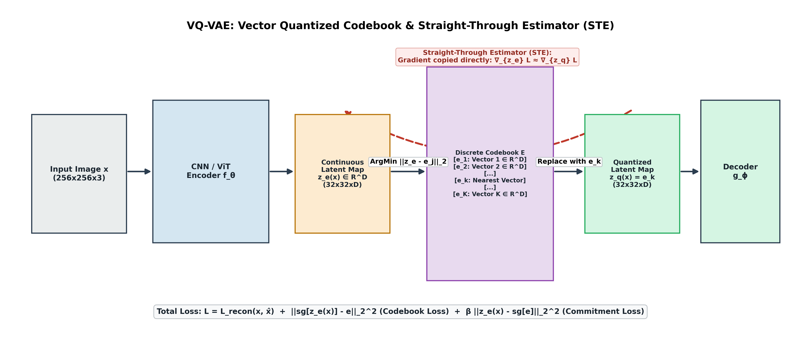
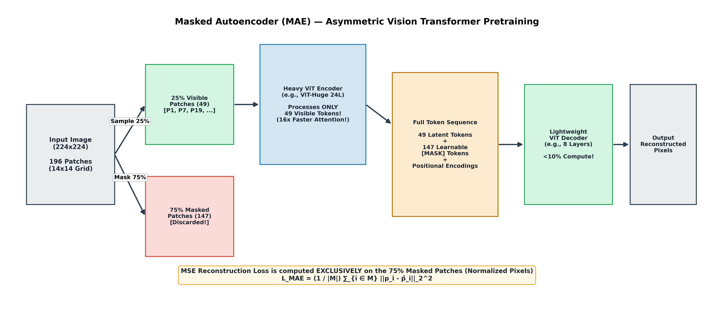

# Autoencoders & Generative Latent Variable Foundations
### Classical AE, VAE (ELBO & Reparameterization), VQ-VAE (STE & Discrete Codebooks), & Masked Autoencoders (MAE)

---

## 📑 Table of Contents

1. [PART 1 — THE CLASSICAL AUTOENCODER PARADIGM](#part-1--the-classical-autoencoder-paradigm)
   - [1.1 Architectural Foundations: The Informational Bottleneck](#11-architectural-foundations-the-informational-bottleneck)
   - [1.2 Reconstruction Objectives: MSE vs. Binary Cross-Entropy](#12-reconstruction-objectives-mse-vs-binary-cross-entropy)
   - [1.3 Undercomplete vs. Overcomplete Bottlenecks](#13-undercomplete-vs-overcomplete-bottlenecks)
2. [PART 2 — LINEAR AUTOENCODERS VS. PRINCIPAL COMPONENT ANALYSIS (PCA)](#part-2--linear-autoencoders-vs-principal-component-analysis-pca)
   - [2.1 The Mathematical Equivalence Proof](#21-the-mathematical-equivalence-proof)
   - [2.2 Critical Distinctions: Orthogonality, Rotational Invariance, and Optimization](#22-critical-distinctions-orthogonality-rotational-invariance-and-optimization)
   - [2.3 Non-Linear Autoencoders: Escaping the Flat Hyperplane](#23-non-linear-autoencoders-escaping-the-flat-hyperplane)
3. [PART 3 — REGULARIZED AUTOENCODER FAMILIES](#part-3--regularized-autoencoder-families)
   - [3.1 Sparse Autoencoders (SAE) & LLM Mechanistic Interpretability](#31-sparse-autoencoders-sae--llm-mechanistic-interpretability)
   - [3.2 Denoising Autoencoders (DAE) & Score-Based Generative Modeling](#32-denoising-autoencoders-dae--score-based-generative-modeling)
   - [3.3 Contractive Autoencoders (CAE) & The Jacobian Frobenius Penalty](#33-contractive-autoencoders-cae--the-jacobian-frobenius-penalty)
4. [PART 4 — VARIATIONAL AUTOENCODERS (VAEs)](#part-4--variational-autoencoders-vaes)
   - [4.1 Why Deterministic Autoencoders Fail as Generative Models](#41-why-deterministic-autoencoders-fail-as-generative-models)
   - [4.2 The Probabilistic Framework & The Intractable Marginal Integral](#42-the-probabilistic-framework--the-intractable-marginal-integral)
   - [4.3 Step-by-Step Derivation of the Evidence Lower Bound (ELBO)](#43-step-by-step-derivation-of-the-evidence-lower-bound-elbo)
   - [4.4 Exact Closed-Form Gaussian KL Divergence Derivation](#44-exact-closed-form-gaussian-kl-divergence-derivation)
   - [4.5 The Reparameterization Trick: Bypassing the Stochastic Bottleneck](#45-the-reparameterization-trick-bypassing-the-stochastic-bottleneck)
   - [4.6 Failure Modes: Posterior Collapse & Disentangled $\beta$-VAEs](#46-failure-modes-posterior-collapse--disentangled-beta-vaes)
5. [PART 5 — VECTOR QUANTIZED VAEs (VQ-VAE & VQ-VAE-2)](#part-5--vector-quantized-vaes-vq-vae--vq-vae-2)
   - [5.1 The Continuous Latent Problem: Blurry Reconstructions](#51-the-continuous-latent-problem-blurry-reconstructions)
   - [5.2 Discrete Codebook Dictionary & Vector Quantization](#52-discrete-codebook-dictionary--vector-quantization)
   - [5.3 Backpropagation through Step Functions: The Straight-Through Estimator (STE)](#53-backpropagation-through-step-functions-the-straight-through-estimator-ste)
   - [5.4 The 3-Part VQ-VAE Loss Function](#54-the-3-part-vq-vae-loss-function)
   - [5.5 Modern Impact: Stable Diffusion Latents & DALL-E Codebooks](#55-modern-impact-stable-diffusion-latents--dall-e-codebooks)
6. [PART 6 — MASKED AUTOENCODERS (MAE) IN VISION TRANSFORMERS](#part-6--masked-autoencoders-mae-in-vision-transformers)
   - [6.1 The Masked Image Modeling Paradigm (He et al., CVPR 2022)](#61-the-masked-image-modeling-paradigm-he-et-al-cvpr-2022)
   - [6.2 Why 75%–80% Masking Ratio is Mandatory for Vision](#62-why-7580-masking-ratio-is-mandatory-for-vision)
   - [6.3 The Asymmetric ViT Encoder-Decoder Architecture](#63-the-asymmetric-vit-encoder-decoder-architecture)
   - [6.4 Comprehensive Comparison: BERT vs. DAE vs. ViT MAE](#64-comprehensive-comparison-bert-vs-dae-vs-vit-mae)
7. [PART 7 — COMPLETE STEP-BY-STEP NUMERICAL MATH TRACE](#part-7--complete-step-by-step-numerical-math-trace)
   - [7.1 Mini-VAE Setup & Encoder Forward Pass](#71-mini-vae-setup--encoder-forward-pass)
   - [7.2 Reparameterization Sampling](#72-reparameterization-sampling)
   - [7.3 Decoder Forward Pass & MSE Loss](#73-decoder-forward-pass--mse-loss)
   - [7.4 Analytical KL Divergence Evaluation](#74-analytical-kl-divergence-evaluation)
   - [7.5 End-to-End Backpropagation Gradient Calculus](#75-end-to-end-backpropagation-gradient-calculus)
8. [PART 8 — PLACEMENT PREP: TOP 15 TECHNICAL INTERVIEW QUESTIONS](#part-8--placement-prep-top-15-technical-interview-questions)

---

# PART 1 — THE CLASSICAL AUTOENCODER PARADIGM

## 1.1 Architectural Foundations: The Informational Bottleneck

An **Autoencoder** is an unsupervised neural network that learns to compress high-dimensional input vectors $\mathbf{x} \in \mathbb{R}^D$ into a lower-dimensional latent representation $\mathbf{z} \in \mathbb{R}^d$ ($d \ll D$), and then reconstruct an output $\hat{\mathbf{x}} \in \mathbb{R}^D$ that closely matches the original input.

1. **The Encoder Network ($f_\theta$):**
   Compresses input vector $\mathbf{x}$ into the low-dimensional latent code $\mathbf{z}$:

   $$\mathbf{z} = f_\theta(\mathbf{x}) = \sigma\left(W_e \mathbf{x} + \mathbf{b}_e\right)$$

   where $W_e \in \mathbb{R}^{d \times D}$, $\mathbf{b}_e \in \mathbb{R}^d$, and $\sigma(\cdot)$ is an activation function (e.g. GELU, ReLU).

2. **The Decoder Network ($g_\phi$):**
   Decompresses the latent representation $\mathbf{z}$ back into data space:

   $$\hat{\mathbf{x}} = g_\phi(\mathbf{z}) = \sigma\left(W_d \mathbf{z} + \mathbf{b}_d\right)$$

   where $W_d \in \mathbb{R}^{D \times d}$ and $\mathbf{b}_d \in \mathbb{R}^D$.

---

## 1.2 Reconstruction Objectives: MSE vs. Binary Cross-Entropy

* **Continuous / Gaussian Data (Mean Squared Error - MSE):**
  When inputs are real-valued continuous vectors:

  $$\mathcal{L}_{\text{MSE}}(\mathbf{x}, \hat{\mathbf{x}}) = \frac{1}{2} \|\mathbf{x} - \hat{\mathbf{x}}\|_2^2 = \frac{1}{2} \sum_{j=1}^D (x_j - \hat{x}_j)^2$$

* **Normalized Pixel Probabilities (Binary Cross-Entropy - BCE):**
  When input features represent pixel intensities scaled to the interval $[0, 1]$ (treated as Bernoulli probabilities):

  $$\mathcal{L}_{\text{BCE}}(\mathbf{x}, \hat{\mathbf{x}}) = -\sum_{j=1}^D \left[ x_j \log \hat{x}_j + (1 - x_j) \log (1 - \hat{x}_j) \right]$$

---

## 1.3 Undercomplete vs. Overcomplete Bottlenecks

* **Undercomplete Autoencoders ($d < D$):**
  The latent bottleneck dimension $d$ is strictly smaller than the input dimension $D$. Because the network does not have enough capacity to memorize all inputs, it is forced to discover the lowest-dimensional manifold containing the dominant variance of the dataset.

* **Overcomplete Autoencoders ($d > D$):**
  The latent dimension is larger than the input dimension. Without structural constraints, the network trivially learns the identity function $\hat{\mathbf{x}} = \mathbf{x}$ (a lookup table) with zero compression. Overcomplete architectures require **sparsity penalties**, **stochastic noise corruption**, or **contractive regularization** to force meaningful representation learning.

---

# PART 2 — LINEAR AUTOENCODERS VS. PRINCIPAL COMPONENT ANALYSIS (PCA)

## 2.1 The Mathematical Equivalence Proof

A classic foundational theorem in machine learning relates linear autoencoders to Principal Component Analysis (Bourlard & Kamp, 1988; Baldi & Hornik, 1989).

Consider a linear autoencoder with no activation functions ($f(\mathbf{x}) = W_e \mathbf{x}$ and $g(\mathbf{z}) = W_d \mathbf{z}$) trained with Mean Squared Error loss on zero-centered data $X \in \mathbb{R}^{N \times D}$:

$$\mathcal{L}(W_e, W_d) = \frac{1}{N} \sum_{i=1}^N \|\mathbf{x}_i - W_d W_e \mathbf{x}_i\|_2^2 = \frac{1}{N} \|X - X W_e^T W_d^T\|_F^2$$

Let $P = W_d W_e \in \mathbb{R}^{D \times D}$. Because $W_e \in \mathbb{R}^{d \times D}$ and $W_d \in \mathbb{R}^{D \times d}$, the matrix $P$ has rank at most $d$.

By the **Eckart-Young-Mirsky Theorem**, the optimal rank-$d$ linear operator minimizing the Frobenius norm $\|X - X P\|_F^2$ is the orthogonal projection matrix onto the subspace spanned by the top $d$ eigenvectors of the sample covariance matrix $\Sigma = \frac{1}{N} X^T X$.

Therefore, the global minimum of the linear autoencoder loss satisfies:

$$W_d W_e = V_d V_d^T$$

where $V_d \in \mathbb{R}^{D \times d}$ contains the top $d$ orthonormal principal component eigenvectors.

---

## 2.2 Critical Distinctions: Orthogonality, Rotational Invariance, and Optimization

| Property | Principal Component Analysis (PCA) | Linear Autoencoder |
| :--- | :--- | :--- |
| **Subspace Spanned** | Spans top $d$ principal components | Spans the **exact same** top $d$ principal subspace |
| **Basis Orthogonality** | Strictly orthonormal ($v_i^T v_j = \delta_{ij}$) | **Non-orthogonal**: Arbitrary linear basis spanning the subspace |
| **Component Ordering** | Ordered strictly by eigenvalue $\lambda_1 \ge \lambda_2 \ge \dots$ | **Un-ordered**: Latent units share arbitrary distributed variances |
| **Rotational Symmetry** | Unique solution (up to sign flips) | Infinite equivalent solutions: $(W_d R)(R^{-1} W_e) = W_d W_e$ for any invertible $R$ |
| **Optimization Solver** | Exact analytical SVD / Eigendecomposition | Iterative Gradient Descent (SGD / Adam) |

---

## 2.3 Non-Linear Autoencoders: Escaping the Flat Hyperplane

When non-linear activation functions (GELU, ReLU, Swish) are added, the Autoencoder transcends linear subspaces. Instead of projecting onto a flat hyperplane, the encoder and decoder parameterize a curved, non-linear Riemannian manifold that wraps around the true underlying data distribution with significantly lower reconstruction error.

---

# PART 3 — REGULARIZED AUTOENCODER FAMILIES

## 3.1 Sparse Autoencoders (SAE) & LLM Mechanistic Interpretability

Sparse Autoencoders enforce that only a tiny fraction of latent neurons fire for any given input:

$$\mathcal{L}_{\text{SAE}} = \mathcal{L}_{\text{recon}}(\mathbf{x}, \hat{\mathbf{x}}) + \lambda \sum_{j=1}^d |z_j|$$

Alternatively, using the Kullback-Leibler (KL) divergence penalty against an ultra-low target average activation $\rho$ (e.g. $\rho = 0.01$):

$$\mathcal{L}_{\text{KL-SAE}} = \mathcal{L}_{\text{recon}}(\mathbf{x}, \hat{\mathbf{x}}) + \beta \sum_{j=1}^d \text{KL}(\rho \parallel \hat{\rho}_j)$$

where $\hat{\rho}_j = \frac{1}{m} \sum_{i=1}^m z_j(\mathbf{x}_i)$ is the batch average activation of neuron $j$, and:

$$\text{KL}(\rho \parallel \hat{\rho}_j) = \rho \log \frac{\rho}{\hat{\rho}_j} + (1 - \rho) \log \frac{1 - \rho}{1 - \hat{\rho}_j}$$

### Modern LLM Superposition & Dictionary Learning
In Large Language Models (GPT-4, Claude 3, LLaMA-3), individual neurons in the residual stream are **polysemantic** (firing for unrelated concepts) because the model packs millions of concepts into limited dimensions via **Superposition** ($D_{\text{concepts}} \gg d_{\text{model}}$).

Anthropic and OpenAI train overcomplete Sparse Autoencoders ($d_{\text{SAE}} = 16\times \text{ to } 64\times d_{\text{model}}$) directly on LLM residual stream activations:

$$\mathbf{z} = \text{ReLU}\left(W_{\text{enc}}(\mathbf{x} - \mathbf{b}_{\text{dec}}) + \mathbf{b}_{\text{enc}}\right), \quad \hat{\mathbf{x}} = W_{\text{dec}} \mathbf{z} + \mathbf{b}_{\text{dec}}$$

$$\mathcal{L}_{\text{LLM-SAE}} = \|\mathbf{x} - \hat{\mathbf{x}}\|_2^2 + \lambda \|\mathbf{z}\|_1$$

The resulting sparse features are **monosemantic**: individual latent units represent pure, interpretable concepts (e.g. "code syntax errors", "the Golden Gate Bridge", or "deceptive reasoning").

---

## 3.2 Denoising Autoencoders (DAE) & Score-Based Generative Modeling

A Denoising Autoencoder is fed an intentionally corrupted input $\tilde{\mathbf{x}} \sim q(\tilde{\mathbf{x}}|\mathbf{x})$ (e.g. Gaussian noise $\tilde{\mathbf{x}} = \mathbf{x} + \mathcal{N}(\mathbf{0}, \sigma^2 I)$) and trained to predict the **original clean input $\mathbf{x}$**:

$$\mathcal{L}_{\text{DAE}} = \mathbb{E}_{\mathbf{x} \sim p_{\text{data}}, \tilde{\mathbf{x}} \sim q(\tilde{\mathbf{x}}|\mathbf{x})} \left[ \|\mathbf{x} - g_\phi(f_\theta(\tilde{\mathbf{x}}))\|_2^2 \right]$$

### The Alain & Bengio (2014) Score-Matching Proof
Minimizing the DAE reconstruction error with small Gaussian noise forces the reconstruction vector $g(f(\tilde{\mathbf{x}})) - \tilde{\mathbf{x}}$ to estimate the **Score Function** (the gradient of the log data density):

$$g_\phi(f_\theta(\tilde{\mathbf{x}})) - \tilde{\mathbf{x}} = \sigma^2 \nabla_{\tilde{\mathbf{x}}} \log p(\tilde{\mathbf{x}})$$

*This equation proves that Denoising Autoencoders learn the vector field pointing directly toward the high-density data manifold — the exact mathematical foundation of modern Denoising Diffusion Probabilistic Models (DDPM)!*

---

## 3.3 Contractive Autoencoders (CAE) & The Jacobian Frobenius Penalty

Contractive Autoencoders encourage the latent representation $\mathbf{z} = f_\theta(\mathbf{x})$ to be robust against local perturbations in the input space by penalizing the **Frobenius norm of the Encoder Jacobian matrix**:

$$\mathcal{L}_{\text{CAE}} = \mathcal{L}_{\text{recon}}(\mathbf{x}, \hat{\mathbf{x}}) + \lambda \|J_f(\mathbf{x})\|_F^2$$

where:

$$\|J_f(\mathbf{x})\|_F^2 = \sum_{i=1}^d \sum_{j=1}^D \left( \frac{\partial z_i}{\partial x_j} \right)^2$$

* **Mechanism:** The Jacobian penalty forces $\frac{\partial z_i}{\partial x_j} \to 0$, flattening variations in directions orthogonal to the data manifold. The reconstruction loss ensures the latent space retains variation along the manifold tangent planes.

---

# PART 4 — VARIATIONAL AUTOENCODERS (VAEs)

## 4.1 Why Deterministic Autoencoders Fail as Generative Models

If we sample a random latent coordinate $\mathbf{z} \sim \mathcal{N}(\mathbf{0}, I)$ and pass it through a deterministic autoencoder decoder, the output is almost always **garbled noise or blurry artifacts**.

* **The Cause:** Deterministic autoencoders have unconstrained latent spaces. Training data is mapped to isolated, compact clusters. The empty space between clusters ("dead zones") is never regularized during training, so the decoder has no valid mapping for random intermediate coordinates.
* **The VAE Solution:** Instead of mapping $\mathbf{x}$ to a single coordinate point $\mathbf{z}$, the encoder maps $\mathbf{x}$ to a **probability distribution** $q_\phi(\mathbf{z}|\mathbf{x}) = \mathcal{N}(\boldsymbol{\mu}(\mathbf{x}), \text{diag}(\boldsymbol{\sigma}^2(\mathbf{x})))$ and regularizes it toward a standard normal prior $p(\mathbf{z}) = \mathcal{N}(\mathbf{0}, I)$.

---

## 4.2 The Probabilistic Framework & The Intractable Marginal Integral

A Variational Autoencoder (Kingma & Welling, 2013) is a latent-variable probabilistic graphical model:

1. **Prior Distribution:** $p(\mathbf{z}) = \mathcal{N}(\mathbf{0}, I)$.
2. **Generative Model (Decoder):** $p_\theta(\mathbf{x}|\mathbf{z})$.
3. **Marginal Likelihood (Evidence):**

   $$p(\mathbf{x}) = \int p_\theta(\mathbf{x}|\mathbf{z}) p(\mathbf{z}) d\mathbf{z}$$

   *The Intractability:* The continuous integral over all latent dimensions $\mathbf{z} \in \mathbb{R}^d$ cannot be computed analytically when $p_\theta(\mathbf{x}|\mathbf{z})$ is parameterized by a non-linear neural network. Monte Carlo sampling fails because random latent points almost always yield $p_\theta(\mathbf{x}|\mathbf{z}) \approx 0$ in high dimensions.

---

## 4.3 Step-by-Step Derivation of the Evidence Lower Bound (ELBO)

We introduce a variational inference network $q_\phi(\mathbf{z}|\mathbf{x})$ (the Encoder) to approximate the intractable true posterior $p_\theta(\mathbf{z}|\mathbf{x})$:

$$\log p(\mathbf{x}) = \log \int p_\theta(\mathbf{x}, \mathbf{z}) d\mathbf{z}$$

Multiply and divide inside the integral by $q_\phi(\mathbf{z}|\mathbf{x})$:

$$\log p(\mathbf{x}) = \log \int q_\phi(\mathbf{z}|\mathbf{x}) \frac{p_\theta(\mathbf{x}, \mathbf{z})}{q_\phi(\mathbf{z}|\mathbf{x})} d\mathbf{z} = \log \mathbb{E}_{q_\phi(\mathbf{z}|\mathbf{x})} \left[ \frac{p_\theta(\mathbf{x}, \mathbf{z})}{q_\phi(\mathbf{z}|\mathbf{x})} \right]$$

Apply **Jensen's Inequality** (since $\log(\cdot)$ is concave, $\log \mathbb{E}[Y] \ge \mathbb{E}[\log Y]$):

$$\log p(\mathbf{x}) \ge \mathbb{E}_{q_\phi(\mathbf{z}|\mathbf{x})} \left[ \log \frac{p_\theta(\mathbf{x}, \mathbf{z})}{q_\phi(\mathbf{z}|\mathbf{x})} \right] \equiv \text{ELBO}(\theta, \phi; \mathbf{x})$$

Expand the joint probability $p_\theta(\mathbf{x}, \mathbf{z}) = p_\theta(\mathbf{x}|\mathbf{z}) p(\mathbf{z})$:

$$\text{ELBO} = \mathbb{E}_{q_\phi(\mathbf{z}|\mathbf{x})} \left[ \log \frac{p_\theta(\mathbf{x}|\mathbf{z}) p(\mathbf{z})}{q_\phi(\mathbf{z}|\mathbf{x})} \right]$$

$$= \mathbb{E}_{q_\phi(\mathbf{z}|\mathbf{x})} [\log p_\theta(\mathbf{x}|\mathbf{z})] + \mathbb{E}_{q_\phi(\mathbf{z}|\mathbf{x})} \left[ \log \frac{p(\mathbf{z})}{q_\phi(\mathbf{z}|\mathbf{x})} \right]$$

$$= \underbrace{\mathbb{E}_{q_\phi(\mathbf{z}|\mathbf{x})} [\log p_\theta(\mathbf{x}|\mathbf{z})]}_{\text{Reconstruction Fidelity Term}} - \underbrace{\mathcal{D}_{\text{KL}}\left( q_\phi(\mathbf{z}|\mathbf{x}) \parallel p(\mathbf{z}) \right)}_{\text{Prior Alignment / Regularization Term}}$$

### Minimizing Total VAE Loss:

$$\mathcal{L}_{\text{VAE}} = -\text{ELBO} = \mathcal{L}_{\text{recon}}(\mathbf{x}, \hat{\mathbf{x}}) + \mathcal{D}_{\text{KL}}\left(q_\phi(\mathbf{z}|\mathbf{x}) \parallel p(\mathbf{z})\right)$$

---

## 4.4 Exact Closed-Form Gaussian KL Divergence Derivation

For a diagonal Gaussian encoder $q_\phi(\mathbf{z}|\mathbf{x}) = \mathcal{N}(\boldsymbol{\mu}, \text{diag}(\boldsymbol{\sigma}^2))$ and standard normal prior $p(\mathbf{z}) = \mathcal{N}(\mathbf{0}, I)$, the KL divergence has an exact closed-form analytical solution.

For a single latent dimension $j$:

$$\mathcal{D}_{\text{KL}}(q_j \parallel p_j) = \int q(z_j) \log \frac{q(z_j)}{p(z_j)} dz_j = \int q(z_j) [\log q(z_j) - \log p(z_j)] dz_j$$

Substituting the 1D Gaussian probability densities:

$$\log q(z_j) = -\frac{1}{2}\log(2\pi) - \frac{1}{2}\log(\sigma_j^2) - \frac{(z_j - \mu_j)^2}{2\sigma_j^2}$$

$$\log p(z_j) = -\frac{1}{2}\log(2\pi) - \frac{z_j^2}{2}$$

Evaluating the expectation $\mathbb{E}_{q(z_j)}[\log q(z_j) - \log p(z_j)]$:

1. $\mathbb{E}\left[ -\frac{1}{2}\log(\sigma_j^2) \right] = -\frac{1}{2}\log(\sigma_j^2)$
2. $\mathbb{E}\left[ -\frac{(z_j - \mu_j)^2}{2\sigma_j^2} \right] = -\frac{1}{2\sigma_j^2} \mathbb{E}[(z_j - \mu_j)^2] = -\frac{1}{2\sigma_j^2}(\sigma_j^2) = -\frac{1}{2}$
3. $\mathbb{E}\left[ \frac{z_j^2}{2} \right] = \frac{1}{2} (\mu_j^2 + \sigma_j^2)$

Summing over all $d$ independent latent dimensions gives:

$$\mathcal{D}_{\text{KL}}\left( \mathcal{N}(\boldsymbol{\mu}, \boldsymbol{\sigma}^2) \parallel \mathcal{N}(\mathbf{0}, I) \right) = -\frac{1}{2} \sum_{j=1}^d \left( 1 + \log(\sigma_j^2) - \mu_j^2 - \sigma_j^2 \right)$$

---

## 4.5 The Reparameterization Trick: Bypassing the Stochastic Bottleneck

* **The Problem:** In direct stochastic sampling $\mathbf{z} \sim \mathcal{N}(\boldsymbol{\mu}, \boldsymbol{\sigma}^2)$, the sample $\mathbf{z}$ is generated by a non-deterministic random node. The derivative $\frac{\partial \mathbf{z}}{\partial \phi}$ does not exist, halting backpropagation at the bottleneck.
* **The Solution:** Reparameterize $\mathbf{z}$ as a deterministic function of parameters $\boldsymbol{\mu}$ and $\boldsymbol{\sigma}$, scaled by an independent standard normal auxiliary noise vector $\boldsymbol{\epsilon} \sim \mathcal{N}(\mathbf{0}, I)$:

  $$\mathbf{z} = \boldsymbol{\mu}(\mathbf{x}) + \boldsymbol{\sigma}(\mathbf{x}) \odot \boldsymbol{\epsilon}, \quad \text{where } \boldsymbol{\epsilon} \sim \mathcal{N}(\mathbf{0}, I)$$

* **Gradient Flow via the Chain Rule:**

  $$\frac{\partial \mathbf{z}}{\partial \boldsymbol{\mu}} = 1, \quad \frac{\partial \mathbf{z}}{\partial \boldsymbol{\sigma}} = \boldsymbol{\epsilon}$$

  $$\frac{\partial \mathcal{L}}{\partial \phi} = \frac{\partial \mathcal{L}}{\partial \mathbf{z}} \frac{\partial \mathbf{z}}{\partial \boldsymbol{\mu}} \frac{\partial \boldsymbol{\mu}}{\partial \phi} + \frac{\partial \mathcal{L}}{\partial \mathbf{z}} \frac{\partial \mathbf{z}}{\partial \boldsymbol{\sigma}} \frac{\partial \boldsymbol{\sigma}}{\partial \phi}$$

*Randomness is shifted to an external auxiliary input $\boldsymbol{\epsilon}$, transforming the entire network into a continuous, end-to-end differentiable computational graph!*

---

## 4.6 Failure Modes: Posterior Collapse & Disentangled $\beta$-VAEs

### Posterior Collapse
* **Symptom:** When paired with a powerful autoregressive decoder (like a causal Transformer or PixelCNN), the decoder models the output using only previous tokens, ignoring the latent code $\mathbf{z}$.
* **Mathematical Signature:** The encoder sets $\boldsymbol{\mu}(\mathbf{x}) \to \mathbf{0}$ and $\boldsymbol{\sigma}^2(\mathbf{x}) \to \mathbf{1}$, forcing $\mathcal{D}_{\text{KL}} \to 0$.
* **Mitigations:**
  1. **KL Annealing / Warmup:** Gradually scale the KL penalty coefficient $\beta_t$ from $0 \to 1$ during the initial training epochs.
  2. **Free Bits (KL Thresholding):** Enforce a minimum KL cost per latent dimension: $\max(\tau, \mathcal{D}_{\text{KL}}(q_j \parallel p_j))$.

### Disentangled Representations via $\beta$-VAE (Higgins et al., 2017)
Setting $\beta > 1$ in the loss function imposes a tighter informational bottleneck:

$$\mathcal{L}_{\beta\text{-VAE}} = \mathcal{L}_{\text{recon}}(\mathbf{x}, \hat{\mathbf{x}}) + \beta \mathcal{D}_{\text{KL}}\left(q_\phi(\mathbf{z}|\mathbf{x}) \parallel p(\mathbf{z})\right)$$

This forces the network to learn statistically independent, disentangled latent generative factors (e.g. separate latent units for 3D rotation, scale, azimuth, and lighting).

---

# PART 5 — VECTOR QUANTIZED VAEs (VQ-VAE & VQ-VAE-2)

## 5.1 The Continuous Latent Problem: Blurry Reconstructions

Standard Gaussian VAEs maximize probability by outputting the conditional expectation of pixel distributions. This variance averaging blurs high-frequency details (textures, hair, sharp edges).

**VQ-VAE (van den Oord et al., 2017)** replaces continuous Gaussian latents with a **discrete codebook of learnable embedding vectors**.

---

## 5.2 Discrete Codebook Dictionary & Vector Quantization

1. **Discrete Codebook Dictionary:** Define $E = \{\mathbf{e}_1, \mathbf{e}_2, \dots, \mathbf{e}_K\} \subset \mathbb{R}^D$, where $K$ is the dictionary vocabulary size (e.g. $K = 512$ or $8192$) and $D$ is the embedding dimension.
2. **Encoder Output:** The encoder outputs a spatial feature tensor $\mathbf{z}_e(\mathbf{x}) \in \mathbb{R}^{H' \times W' \times D}$.
3. **Nearest-Neighbor Vector Quantization:**
   For each spatial feature vector $\mathbf{z}_e(\mathbf{x})_{h,w}$, find the index $k$ of the closest codebook vector:

   $$\mathbf{z}_q(\mathbf{x})_{h,w} = \mathbf{e}_k, \quad \text{where } k = \arg\min_{j \in \{1, \dots, K\}} \|\mathbf{z}_e(\mathbf{x})_{h,w} - \mathbf{e}_j\|_2$$

---

## 5.3 Backpropagation through Step Functions: The Straight-Through Estimator (STE)

The $\arg\min$ vector quantization operator is a discrete step function with zero derivative almost everywhere.

The **Straight-Through Estimator (STE)** copies the reconstruction loss gradient directly from the decoder input $\mathbf{z}_q$ to the encoder output $\mathbf{z}_e$:

$$\mathbf{z}_q(\mathbf{x}) = \mathbf{z}_e(\mathbf{x}) + \text{sg}\left[\mathbf{z}_q(\mathbf{x}) - \mathbf{z}_e(\mathbf{x})\right]$$

where $\text{sg}[\cdot]$ is the **Stop-Gradient operator** (evaluates as identity on forward pass, zero derivative on backward pass: $\frac{\partial \text{sg}[u]}{\partial u} = 0$).

---

## 5.4 The 3-Part VQ-VAE Loss Function

$$\mathcal{L}_{\text{VQ-VAE}} = \underbrace{\mathcal{L}_{\text{recon}}(\mathbf{x}, g_\phi(\mathbf{z}_q(\mathbf{x})))}_{\text{1. Reconstruction Loss}} + \underbrace{\|\text{sg}[\mathbf{z}_e(\mathbf{x})] - \mathbf{z}_q(\mathbf{x})\|_2^2}_{\text{2. Vector Quantization (Codebook) Loss}} + \beta \underbrace{\|\mathbf{z}_e(\mathbf{x}) - \text{sg}[\mathbf{z}_q(\mathbf{x})]\|_2^2}_{\text{3. Commitment Loss}}$$

1. **Reconstruction Loss:** Optimizes the Decoder ($g_\phi$) and Encoder ($f_\theta$) via the Straight-Through Estimator.
2. **Vector Quantization (Codebook) Loss:** Uses $L_2$ dictionary learning to move chosen codebook vectors $\mathbf{e}_k$ toward encoder outputs $\mathbf{z}_e(\mathbf{x})$.
3. **Commitment Loss (scaled by $\beta \approx 0.25$):** Prevents encoder outputs from oscillating excessively by penalizing the encoder if its output drifts away from the chosen codebook vector.

---

## 5.5 Modern Impact: Stable Diffusion Latents & DALL-E Codebooks

* **OpenAI DALL-E 1:** Trained a discrete VAE (dVAE) with an $8192$-token codebook to tokenize $256 \times 256$ images into $32 \times 32 = 1024$ discrete tokens. An autoregressive Transformer then modeled text and image tokens jointly.
* **Stable Diffusion (Latent Diffusion Models):** Pretrains a spatial Autoencoder KL / VQ-reg to compress $512 \times 512 \times 3$ images into $64 \times 64 \times 4$ latent feature tensors (**$48\times$ to $64\times$ reduction in tensor volume**), allowing consumer GPUs to run diffusion in latent space.
* **Neural Audio Codecs:** Meta EnCodec and Google SoundStream apply Residual Vector Quantization (RVQ) to compress continuous audio waveforms into discrete speech tokens for Audio-LLMs.

---

# PART 6 — MASKED AUTOENCODERS (MAE) IN VISION TRANSFORMERS

## 6.1 The Masked Image Modeling Paradigm (He et al., CVPR 2022)

While BERT revolutionized NLP by masking 15% of text tokens, naively masking 15% of image patches fails in computer vision because images have **massive spatial redundancy**. A network can reconstruct missing pixels from immediate neighboring pixels via trivial interpolation without learning high-level scene composition.

---

## 6.2 Why 75%–80% Masking Ratio is Mandatory for Vision

* **NLP (15% Masking):** Words are dense, symbolic, and semantically rich. Masking 15% creates a complex linguistic reasoning task.
* **Vision (75%–80% Masking):** Images are raw, highly correlated sensory signals. Masking 75%–80% removes local continuity, forcing the Transformer to understand global object shapes, depth, occlusion, and 3D geometry.

---

## 6.3 The Asymmetric ViT Encoder-Decoder Architecture

1. **Heavy ViT Encoder Operates ONLY on Visible Patches:**
   For a $224 \times 224$ image with 196 patches ($16 \times 16$), 75% (147 patches) are masked out. The heavy ViT encoder (ViT-Large/Huge) processes **only the 25% (49 visible patches)**.
   * *Compute Reduction:* Because self-attention complexity is $O(N^2)$, processing $N/4$ tokens yields:

     $$\left(\frac{1}{4}\right)^2 = \frac{1}{16} \implies \mathbf{16\times \text{ faster self-attention!}}$$

2. **Lightweight ViT Decoder on Full Token Grid:**
   The 49 encoded latent representations are concatenated with 147 shared learnable `[MASK]` tokens and positional encodings. A small, lightweight decoder ($<10\%$ of total compute) reconstructs raw pixel values.
3. **Loss Computed on Masked Pixels Only:**

   $$\mathcal{L}_{\text{MAE}} = \frac{1}{|\mathcal{M}|} \sum_{i \in \mathcal{M}} \|\mathbf{p}_i - \hat{\mathbf{p}}_i\|_2^2$$

   where $\mathcal{M}$ is the set of masked patch indices, $\mathbf{p}_i$ is the normalized ground truth patch, and $\hat{\mathbf{p}}_i$ is the reconstructed patch.

---

## 6.4 Comprehensive Comparison: BERT vs. DAE vs. ViT MAE

| Attribute | BERT (Devlin et al., 2018) | Denoising Autoencoder (DAE) | Masked Autoencoder (MAE) |
| :--- | :--- | :--- | :--- |
| **Data Modality** | Natural Language Text | Continuous / Image / Tabular | Computer Vision (Images/Video) |
| **Masking Ratio** | **15%** of Tokens | Gaussian noise ($\sigma$) | **75% to 80%** of Patches |
| **Encoder Input** | Full sequence (with `[MASK]`) | Full noisy input $\tilde{\mathbf{x}}$ | **Visible patches only (No `[MASK]`!)** |
| **Encoder Complexity**| $O(N^2)$ on full length | $O(N^2)$ on full image | **$O((0.25N)^2) \approx 16\times$ Compute Reduction** |
| **Loss Target** | Cross-Entropy on vocabulary | MSE on all pixels | MSE on **masked pixels only** |
| **Downstream Use** | Fine-tune Transformer on NLP | Feature extraction / Pretraining | Fine-tune Heavy Encoder on Vision Tasks |

---

# PART 7 — COMPLETE STEP-BY-STEP NUMERICAL MATH TRACE

Let's walk through an explicit, step-by-step numerical calculation of a 1D VAE forward pass, ELBO loss evaluation, and backward gradient computation.

---

## 7.1 Mini-VAE Setup & Encoder Forward Pass

* **Input Data:** Scalar sample $x = 1.0$.
* **Encoder Output:**
  * Mean parameter: $\mu = 0.5$.
  * Log-variance parameter: $v \equiv \log(\sigma^2) = -0.2$.
  * Standard deviation: $\sigma = \sqrt{e^{-0.2}} = e^{-0.1} \approx 0.9048$.

---

## 7.2 Reparameterization Sampling

* **Auxiliary Noise Sampled:** $\epsilon \sim \mathcal{N}(0, 1)$. Let $\epsilon = 0.4000$.
* **Latent Value $z$:**

  $$z = \mu + \sigma \cdot \epsilon = 0.5000 + (0.9048)(0.4000) = 0.5000 + 0.3619 = \mathbf{0.8619}$$

---

## 7.3 Decoder Forward Pass & MSE Loss

* Let the linear decoder be $\hat{x} = w_d \cdot z$ with weight $w_d = 1.05$.
* **Reconstructed Output:**

  $$\hat{x} = (1.05)(0.8619) = \mathbf{0.9050}$$

* **MSE Reconstruction Loss:**

  $$\mathcal{L}_{\text{recon}} = \frac{1}{2}(x - \hat{x})^2 = \frac{1}{2}(1.0000 - 0.9050)^2 = \frac{1}{2}(0.0950)^2 = \mathbf{0.00451}$$

---

## 7.4 Analytical KL Divergence Evaluation

Using the closed-form 1D Gaussian formula with $\mu = 0.5$ and $\sigma^2 = e^{-0.2} = 0.8187$:

$$\mathcal{D}_{\text{KL}} = -\frac{1}{2} \left( 1 + \log(\sigma^2) - \mu^2 - \sigma^2 \right)$$

$$\mathcal{D}_{\text{KL}} = -\frac{1}{2} \left( 1 + (-0.2000) - (0.5)^2 - 0.8187 \right)$$

$$\mathcal{D}_{\text{KL}} = -\frac{1}{2} \left( 1 - 0.2000 - 0.2500 - 0.8187 \right) = -\frac{1}{2}(-0.2687) = \mathbf{0.13435}$$

### Total VAE Loss:

$$\mathcal{L}_{\text{total}} = \mathcal{L}_{\text{recon}} + \mathcal{D}_{\text{KL}} = 0.00451 + 0.13435 = \mathbf{0.13886}$$

---

## 7.5 End-to-End Backpropagation Gradient Calculus

1. **Gradient with respect to Decoder Output $\hat{x}$:**

   $$\frac{\partial \mathcal{L}_{\text{recon}}}{\partial \hat{x}} = -(x - \hat{x}) = -(1.0000 - 0.9050) = -0.0950$$

2. **Gradient with respect to Latent $z$:**

   $$\frac{\partial \mathcal{L}}{\partial z} = \frac{\partial \mathcal{L}_{\text{recon}}}{\partial \hat{x}} \frac{\partial \hat{x}}{\partial z} = (-0.0950)(1.05) = \mathbf{-0.09975}$$

3. **Gradient with respect to Encoder Mean $\mu$:**
   * From reconstruction: $\frac{\partial \mathcal{L}_{\text{recon}}}{\partial \mu} = \frac{\partial \mathcal{L}}{\partial z} \frac{\partial z}{\partial \mu} = (-0.09975)(1) = -0.09975$.
   * From KL divergence: $\frac{\partial \mathcal{D}_{\text{KL}}}{\partial \mu} = -\frac{1}{2}(-2\mu) = \mu = 0.5000$.
   * **Total Gradient on $\mu$:**

     $$\frac{\partial \mathcal{L}_{\text{total}}}{\partial \mu} = -0.09975 + 0.5000 = \mathbf{+0.40025}$$

4. **Gradient with respect to Log-Variance $v = \log(\sigma^2)$:**
   * Recall $\sigma = e^{v/2} \implies \frac{\partial \sigma}{\partial v} = \frac{1}{2} e^{v/2} = \frac{\sigma}{2} = \frac{0.9048}{2} = 0.4524$.
   * From reconstruction: $\frac{\partial \mathcal{L}_{\text{recon}}}{\partial v} = \frac{\partial \mathcal{L}}{\partial z} \frac{\partial z}{\partial \sigma} \frac{\partial \sigma}{\partial v} = (-0.09975)(\epsilon)\left(\frac{\sigma}{2}\right) = (-0.09975)(0.4)(0.4524) = -0.01805$.
   * From KL divergence: $\frac{\partial \mathcal{D}_{\text{KL}}}{\partial v} = -\frac{1}{2}(1 - e^v) = -\frac{1}{2}(1 - 0.8187) = -0.09065$.
   * **Total Gradient on $v$:**

     $$\frac{\partial \mathcal{L}_{\text{total}}}{\partial v} = -0.01805 - 0.09065 = \mathbf{-0.10870}$$

---

# PART 8 — PLACEMENT PREP: TOP 15 TECHNICAL INTERVIEW QUESTIONS

1. **Q: What is the fundamental mathematical relationship between a Linear Autoencoder and PCA?**
   * **A:** Both find the $d$-dimensional subspace minimizing $L_2$ reconstruction error, spanning the identical subspace of the top $d$ eigenvectors of sample covariance matrix $X^T X$. However, PCA enforces strict orthonormality and eigenvalue ordering ($v_i \perp v_j$), whereas a linear autoencoder learns an unconstrained, non-orthogonal rotational basis because $(W_d R)(R^{-1} W_e) = W_d W_e$ for any invertible $R$.

2. **Q: What is "Superposition" in Large Language Models, and how do Sparse Autoencoders resolve it?**
   * **A:** Superposition occurs when an LLM represents more features than residual stream dimensions ($N \gg d$) by assigning non-orthogonal, polysemantic directions to features and exploiting activation sparsity. Overcomplete Sparse Autoencoders expand activations into a high-dimensional dictionary ($16\times$ to $64\times d_{\text{model}}$) with an $L_1$ penalty, isolating individual monosemantic concepts into dedicated single-neuron activations.

3. **Q: How does a Denoising Autoencoder connect mathematically to modern Diffusion Models?**
   * **A:** Alain & Bengio (2014) proved that the optimal reconstruction vector of a Denoising Autoencoder trained with Gaussian noise estimates the Score Function: $g(f(\tilde{\mathbf{x}})) - \tilde{\mathbf{x}} = \sigma^2 \nabla_{\tilde{\mathbf{x}}} \log p(\tilde{\mathbf{x}})$. Diffusion models train neural networks on this exact principle to predict added noise and reverse the diffusion trajectory along the score field.

4. **Q: Why does a standard deterministic Autoencoder fail as a generative model?**
   * **A:** Deterministic autoencoders map data to unconstrained points in latent space, leaving empty "dead zones" between clusters. Because intermediate coordinates are never regularized, sampling random latent points causes the decoder to produce garbled artifacts. VAEs resolve this by mapping inputs to distributions regularized against a continuous standard normal prior $\mathcal{N}(\mathbf{0}, I)$.

5. **Q: State the Evidence Lower Bound (ELBO) and explain the role of its two terms.**
   * **A:** $\text{ELBO} = \mathbb{E}_{q_\phi(\mathbf{z}|\mathbf{x})}[\log p_\theta(\mathbf{x}|\mathbf{z})] - \mathcal{D}_{\text{KL}}(q_\phi(\mathbf{z}|\mathbf{x}) \parallel p(\mathbf{z}))$. The first term maximizes reconstruction fidelity (ensuring the latent code reconstructs $\mathbf{x}$). The second term penalizes divergence between the variational posterior and the standard normal prior $\mathcal{N}(\mathbf{0}, I)$, ensuring smooth latent interpolation and sampleability.

6. **Q: Why is the Reparameterization Trick necessary for training VAEs?**
   * **A:** Stochastic sampling $\mathbf{z} \sim \mathcal{N}(\boldsymbol{\mu}, \boldsymbol{\sigma}^2)$ creates a non-differentiable random node that halts backpropagation. The trick reformulates $\mathbf{z} = \boldsymbol{\mu} + \boldsymbol{\sigma} \odot \boldsymbol{\epsilon}$ where $\boldsymbol{\epsilon} \sim \mathcal{N}(\mathbf{0}, I)$, isolating randomness into an auxiliary input and enabling continuous gradient flow: $\frac{\partial \mathbf{z}}{\partial \boldsymbol{\mu}} = 1$ and $\frac{\partial \mathbf{z}}{\partial \boldsymbol{\sigma}} = \boldsymbol{\epsilon}$.

7. **Q: What is "Posterior Collapse" in VAEs and how is it prevented?**
   * **A:** Posterior collapse occurs when the encoder outputs the prior for all inputs ($q_\phi(\mathbf{z}|\mathbf{x}) \to p(\mathbf{z}) \implies \mathcal{D}_{\text{KL}} \to 0$), meaning the decoder completely ignores the latent code. It is mitigated by KL annealing (gradually increasing the KL coefficient from 0 to 1) or Free Bits (enforcing a minimum KL divergence cost per dimension).

8. **Q: What is $\beta$-VAE and what trade-off does $\beta > 1$ introduce?**
   * **A:** $\beta$-VAE scales the KL divergence term by $\beta > 1$. This tightens the informational bottleneck, encouraging the discovery of statistically independent, disentangled latent factors (e.g. separate dimensions for azimuth, shape, and lighting), at the expense of slightly higher reconstruction error.

9. **Q: Why do continuous Gaussian VAEs produce blurry images, and how does VQ-VAE fix this?**
   * **A:** Continuous Gaussian priors force variance averaging across textural possibilities to maximize conditional likelihood, creating blurry reconstructions. VQ-VAE replaces continuous distributions with a discrete codebook of learned embeddings and nearest-neighbor quantization, preserving sharp boundaries and textures.

10. **Q: How does the Straight-Through Estimator (STE) enable backpropagation in VQ-VAEs?**
    * **A:** Nearest-neighbor vector quantization ($\arg\min$) is a step function with zero derivative. STE defines $\mathbf{z}_q = \mathbf{z}_e + \text{sg}[\mathbf{z}_q - \mathbf{z}_e]$, copying the reconstruction loss gradient directly from the decoder input $\mathbf{z}_q$ to the encoder output $\mathbf{z}_e$ during the backward pass.

11. **Q: What are the three components of the VQ-VAE loss function?**
    * **A:** (1) Reconstruction Loss $\mathcal{L}_{\text{recon}}(\mathbf{x}, \hat{\mathbf{x}})$ updates encoder and decoder; (2) Vector Quantization Loss $\|\text{sg}[\mathbf{z}_e(\mathbf{x})] - \mathbf{e}\|_2^2$ updates codebook vectors toward encoder outputs; (3) Commitment Loss $\beta \|\mathbf{z}_e(\mathbf{x}) - \text{sg}[\mathbf{e}]\|_2^2$ prevents encoder activations from fluctuating wildly.

12. **Q: How does Stable Diffusion utilize Latent Autoencoders to optimize compute?**
    * **A:** Pixel-space diffusion on $512 \times 512 \times 3$ images requires computing score functions across 786,432 values per step. Stable Diffusion trains a spatial Autoencoder KL / VQ-reg to compress images to $64 \times 64 \times 4$ latents ($16,384$ values), achieving a **$48\times$ to $64\times$ reduction in compute and memory** while allowing real-time consumer GPU inference.

13. **Q: Why does Masked Autoencoding (MAE) mask 75%–80% of image patches, whereas BERT masks only 15% of text tokens?**
    * **A:** Text is dense, human-engineered, and symbolic; masking 15% creates a challenging linguistic problem. Images have high spatial redundancy; adjacent pixels share almost identical values. Masking 15% allows trivial local pixel interpolation, whereas masking 75%–80% forces the Transformer to learn high-level semantic scene structure.

14. **Q: What is the computational advantage of MAE's asymmetric design?**
    * **A:** MAE passes *only* the 25% visible patches through the deep, heavy ViT encoder, reducing $O(N^2)$ self-attention compute by $(1/4)^2 = 1/16\times$. Learnable `[MASK]` tokens are appended only before a shallow, lightweight decoder, resulting in over $3\times$ to $4\times$ total wall-clock training speedups.

15. **Q: Why is per-patch pixel normalization beneficial during MAE pretraining?**
    * **A:** Normalizing each patch by its local mean and standard deviation before computing MSE loss removes sensitivity to global illumination and contrast variations, forcing the ViT to focus on structural shapes, edges, and object boundaries.

---
