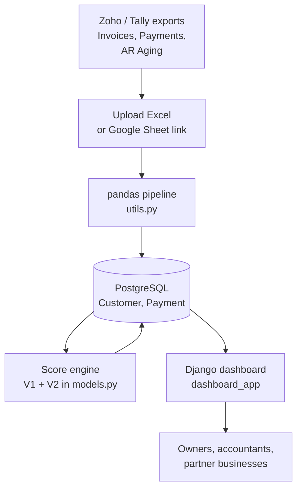
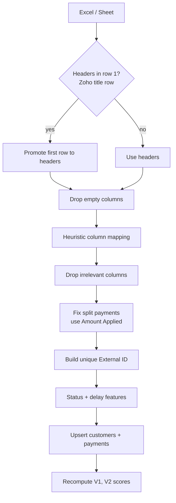
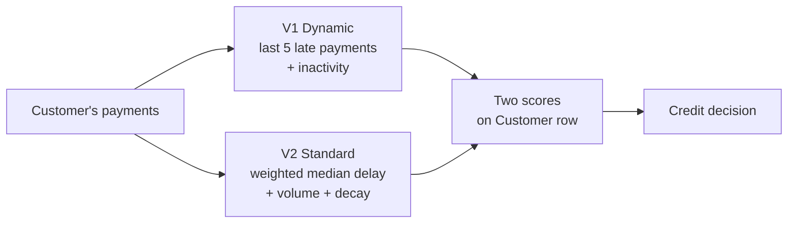
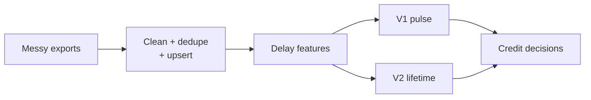

# SBM Traders — Internship Project Dossier (SDE + Data)

Sep 23, 2026 · @Someone

## 0. Hurry mode

During my internship at SBM Traders I built a Django + PostgreSQL receivables dashboard that ingests Zoho/Tally Excel exports, computes each customer's payment delays, and scores every customer with two in-house credit scores — used by SBM Traders and partner businesses to decide who gets credit.

**Core sentence to remember**

> "I turned messy accounting exports into a clean payments database and two customer credit scores — a short-term 'pulse' score and a long-term 'lifetime' score — so the business could decide credit limits from data instead of memory."

### SDE card

| Topic | What to say |
| --- | --- |
| Stack | Django 5.2, PostgreSQL (psycopg2, dj-database-url), Gunicorn, WhiteNoise; Celery + Redis in dependencies |
| Ingestion | Upload Excel or paste a Google Sheets link → pandas pipeline → database |
| Performance | `bulk_create` with upsert on `external_id` (batches of 2,000), `bulk_update` (500), scores computed in memory with one payments query |
| Idempotency | Re-uploading the same file updates rows instead of duplicating them |
| Testing | Generated edge-case and integration datasets; comparison report of expected vs actual |

### Data card

| Topic | What to say |
| --- | --- |
| Features | Days to pay, delay after credit terms, late-only delay, payment status (Paid / Pending / Advance) |
| Score V1 "Dynamic" | 1000 − 5 × amount-weighted avg delay of last 5 late payments − 2 × days inactive; range 100–1000 |
| Score V2 "Standard" | 300 base + delay tier (Gold ≤ 4 days, Average ≤ 15) using amount-weighted **median** delay + log₁₀(total sales) × 25 volume boost − inactivity decay after 90 days; range 300–1000 |
| Validation | 10 stress-test customer profiles (Perfect Whale, Fallen Angel, Forgotten Invoice…) with interpretations |
| Insight | Found two scoring flaws through the stress tests and proposed fixes |

**Hardest question:** *"How do you know the scores are right?"* → There's no default label to validate against, so I validated behaviour: stress-test profiles where the right answer is obvious, parameter-sensitivity analysis, and business feedback. With outcome data I'd back-test scores against actual late payments.

**Fill in before interviews:** number of customers, rows of transactions, number of businesses using it, and one concrete decision the owners made with it.

## 1. Internship and business context

SBM Traders sells goods on credit to other businesses; the dashboard I built became the tool the whole business — and partner companies — used to track receivables and decide which customers to trust with credit.

**Repo:** [divyansh070/sbm\_traders\_personal\_page](https://github.com/divyansh070/sbm_traders_personal_page) · **Live:** [sbm-traders-personal-page.vercel.app](https://sbm-traders-personal-page.vercel.app) · **Tracks:** SDE (backend, data pipeline, performance) and Data (feature engineering, scoring models, validation).

### The business problem

- In B2B trading, customers buy now and pay later. Money owed but not yet paid is **accounts receivable (AR)**.
- Some customers pay on time, some pay weeks late, some forget small invoices, some stop ordering.
- Decisions like *"Should we extend ₹5 lakh credit to this customer?"* were made from memory and scattered Zoho/Tally reports.
- Exports were messy: title rows above headers, different column names per report, one payment repeated across several invoice rows.

### What the system does

| Capability | What it gives the business |
| --- | --- |
| Import Zoho/Tally Excel or a Google Sheet | No manual retyping; accounting stays the source of truth |
| Clean and normalise columns | Invoices, payments and AR-aging reports all land in one schema |
| Compute delays per payment | Days to pay, delay beyond credit terms, pending vs paid vs advance |
| Two credit scores per customer | V1 = recent behaviour; V2 = lifetime value and reliability |
| Dashboard | See customers, scores, delays and outstanding amounts in one place |
| Company website (`sbm_website`) | Public-facing page for SBM Traders |

### Users and impact (fill in real numbers)

| Item | Value |
| --- | --- |
| Businesses using it | SBM Traders + \_\_\_ partner companies |
| Customers scored | \_\_\_ |
| Transactions processed | \_\_\_ rows |
| Who used it | \_\_\_ (owners, accountants, sales) |
| Time saved / decision improved | \_\_\_ (e.g. "monthly credit review went from X hours to Y minutes") |
| Internship dates | \_\_\_ |

> Numbers here are what make this project stand out. Even rough, honest figures ("about 300 customers, \~20,000 payment rows") beat adjectives. Ask the business if you don't know them.

### Why this is a strong internship story

- **Real users, real money:** used to make actual credit decisions, not a classroom demo.
- **Messy real-world data:** most of the engineering went into making unreliable exports trustworthy.
- **Both halves of the stack:** backend performance *and* a scoring model designed from business logic.
- **Ownership:** you found flaws in your own scoring through stress testing and proposed fixes.

## 2. System architecture

It's a Django monolith: an ingestion pipeline turns exports into `Customer` and `Payment` rows in PostgreSQL, then a scoring step recomputes both credit scores for every affected customer.



### Flow A — importing a file



### Flow B — scoring a customer



### Data model (from the fields written in `utils.py`)

| Model | Key fields | Notes |
| --- | --- | --- |
| `Customer` | `customer_id_str`, `name`, `last_order_date`, `cibil_score_v1`, `cibil_score_v2` | One row per customer; scores stored for fast dashboard reads |
| `Payment` | `customer` (FK), `date`, `invoice_date`, `amount`, `unused_amount`, `payment_status`, `delay`, `late_only_delay`, `external_id` (unique) | One row per invoice/payment line; `external_id` makes imports idempotent |

*(Verify field types in `dashboard_app/models.py` — especially whether `amount` is a `DecimalField`.)*

### Deployment

- `vercel.json` + `build_files.sh` → deployed on Vercel; WhiteNoise serves static files; Gunicorn in requirements for a standard WSGI host.
- `dj-database-url` reads the database URL from the environment; `psycopg2-binary` for PostgreSQL.
- Celery, Redis and `django_celery_results` are in requirements — *verify whether imports run as background tasks*. If yes, it's a strong SDE talking point.

## 3. SDE deep dive — what I built

The hardest engineering was making imports correct and repeatable on messy real data, then making them fast with bulk database operations.

### 3.1 Robust file loading

```python
df = pd.read_excel(filepath)
if any('Unnamed:' in str(c) for c in df.columns):   # Zoho puts a title row above headers
    new_headers = df.iloc[0]
    df = df[1:]
    df.columns = new_headers
df = df.dropna(axis=1, how='all')                   # drop fully empty columns
```

- Detects Zoho's title-row format automatically and promotes the real header row.
- Accepts a file path, an uploaded Django file object, or a **public Google Sheets URL** (extracts the sheet ID with a regex and downloads `export?format=csv`).

### 3.2 Heuristic column mapping ("zero-latency")

Different reports name the same thing differently. `map_columns` normalises names (lowercase, strip spaces/underscores) and maps them:

| Canonical column | Accepted source names |
| --- | --- |
| `Date` | payment date, receipt date, date, last payment date |
| `Amount` | amount, payment amount, total — or `balance` in AR-aging reports |
| `Invoice Date` | invoice date, due date |
| `Invoice ID` | invoice id, invoice number |
| `External ID` | customer payment id, entity id, transaction number, payment number |
| `Unused Amount` | unused amount |

The docstring says "zero-latency" — the repo also depends on `google-generativeai`, so if you once used Gemini to map columns and replaced it with rules for speed and determinism, that's a great story. *(Verify.)*

### 3.3 Correctness fixes you should be able to explain

**Split payments inflating totals.** In Zoho's "Payments Received" export, one ₹1,00,000 payment covering three invoices appears on three rows, each showing ₹1,00,000. Summing gives ₹3,00,000. Fix: use the **"Amount Applied to Invoice"** column per row; fall back to the total only for unapplied advances.

**Duplicate IDs after splitting.** The same payment ID now appears on several rows. Fix: `External ID = payment_id + "_" + invoice_id`, so each split row is unique.

**Files with no ID.** Invoice files use the invoice ID; if nothing exists, a synthetic key `CustomerID_Date_Amount` is built.

**AR-aging semantics.** An AR-aging row is *money still owed*, even if it shows a "last payment date". Fix: mark all such rows `Pending` and clear the date so the delay keeps growing until today.

### 3.4 Idempotent, bulk imports

```python
Payment.objects.bulk_create(
    payments_to_create,
    batch_size=2000,
    update_conflicts=True,
    unique_fields=['external_id'],
    update_fields=['date', 'invoice_date', 'amount', 'unused_amount',
                   'payment_status', 'delay', 'late_only_delay'])
```

- **Upsert:** a row with an existing `external_id` is updated, a new one inserted — in PostgreSQL this becomes `INSERT … ON CONFLICT (external_id) DO UPDATE`.
- **Idempotent:** uploading the same export twice doesn't duplicate data; uploading a newer export updates balances.
- **Customers:** pre-fetch existing customers in one query, then `bulk_create` new ones and `bulk_update` renamed ones (batch 500).

### 3.5 Fast score recomputation

- Load payments once, group them by customer in a `defaultdict` in memory.
- Compute V1 and V2 for each affected customer with **zero extra queries**.
- Save all scores with one `bulk_update` (batch 500).

That replaces the naive pattern — one query per customer plus one save per customer (the N+1 problem) — with a handful of queries total. The repo also has `test_speed.py` and `fix_db_delays.py`, so measure before/after and quote it: *"import of \_\_\_ rows went from \_\_\_ s to \_\_\_ s"*.

### 3.6 Testing assets

| File | Purpose |
| --- | --- |
| `generate_edge_cases_excel.py`, `generate_unpaid_edge_cases.py`, `generate_net_outstanding_edge_cases.py` | Synthetic datasets for tricky cases |
| `generate_complex_real_life_cases.py` | Realistic mixed scenarios |
| `generate_integration_test_data.py` → `Test_Integration_*.xlsx` | End-to-end import tests |
| `cibil_comprehensive_test.py` → `cibil_comprehensive_report.xlsx` | 10 scoring stress profiles |
| `Reports_Test - COMPARISON.csv` | Expected vs actual report comparison |
| `test_utils.py`, `test_import.py`, `test_amount_fix.py`, `test_speed.py` | Unit, import, regression and speed checks |

`test_amount_fix.py` reads like a regression test for the split-payment bug — mention it: *"after fixing the inflated-totals bug I added a test so it can't come back."*

## 4. Data deep dive — features and scoring models

I designed two interpretable credit scores that answer different questions: V1 asks "is this customer paying well *right now*?", V2 asks "is this customer valuable and reliable *overall*?".

### 4.1 Feature engineering per payment row

| Feature | Definition | Why |
| --- | --- | --- |
| `Days_to_Pay` | payment date − invoice date; if unpaid, today − invoice date | Unpaid invoices keep getting "later" every day |
| `Delay` | Days\_to\_Pay − credit terms | Being late only counts after agreed credit days |
| `Late_Only_Delay` | max(Delay, 0) | Paying early isn't rewarded as "negative lateness" |
| `Payment_Status` | Pending (no date) / Advance (unused amount > ₹1) / Paid | Distinguishes debt, prepayments and settled invoices |
| `Payment_Fraction` | Unused Amount ÷ Amount | Share of a payment not yet applied |
| `last_order_date` | Latest invoice date with amount > 0 | Measures inactivity |

### 4.2 Score V1 — "Dynamic" (short-term pulse)

$$
\text{V1} = \text{clip}_{[100,\,1000]}\Big(1000 - 5 \cdot \bar{d}_{w} - 2 \cdot \text{days\_inactive}\Big)
$$

- `d̄_w` = **amount-weighted average delay** of the customer's **last 5 late payments**: Σ(delay × amount) ÷ Σ(amount).
- Weighting by amount: a ₹5 lakh invoice paid 30 days late matters more than a ₹500 one.
- The inactivity term drops the score for customers who stopped ordering.

### 4.3 Score V2 — "Standard" (lifetime value)

**Step 1 — baseline delay:** sort late payments by delay and take the delay at which **50% of late money** has been covered — an amount-weighted median. Robust to one extreme outlier, unlike a mean.

**Step 2 — delay tier (starting from 300):**

| Weighted median delay | Tier | Points added |
| --- | --- | --- |
| ≤ 4 days | Gold | +300 |
| ≤ 15 days | Average | +200 |
| > 15 days | Poor | +100 − 10 × (delay − 15) |

**Step 3 — volume boost:** + 25 × log₁₀(total sales). Log scale: ₹10,000 → +100, ₹10 lakh → +150. Big buyers get credit for value, with diminishing returns.

**Step 4 — inactivity decay:** − 0.5 × (days since last order − 90), only after 90 days.

Final V2 clipped to 300–1000. All weights are named parameters (`gold_limit`, `average_limit`, `v2_delay_penalty_mult`, `v2_volume_boost_mult`, `v2_decay_start_days`, `v2_decay_penalty_mult`, `v2_volume_percentile`) so the business can tune them.

### 4.4 Why two scores

| V1 high, V2 high | V1 high, V2 medium | V1 low, V2 high/medium | V1 low, V2 low |
| --- | --- | --- | --- |
| VIP: raise limits | Good new or small customer | Recently slipping: watch closely | Don't extend credit |

### 4.5 Stress-test results (from `CIBIL_Analysis_Report.md`)

| Profile | Total sales (₹) | V1 | V2 | Takeaway |
| --- | --- | --- | --- | --- |
| Perfect Whale | 35,00,000 | 990 | 763 | Big and punctual → top tier |
| Micro Newbie | 1,000 | 996 | 675 | Punctual but tiny → not yet VIP |
| Reformed Defaulter | 1,70,000 | 470 | 300 | Past defaults still dominate *(flaw 1)* |
| Fallen Angel | 50,000 | 680 | 300 | Recent 60-day delays caught |
| 'Oops' Payer | 10,000 | 985 | 700 | Always 1 day late → barely penalised |
| Late Whale | 15,00,000 | 890 | 504 | Always 20 days late, volume keeps them Medium |
| One-Hit Wonder | 10,00,000 | 100 | 445 | Inactive 2 years → both drop |
| Installment Grinder | 10,000 | 900 | 600 | Many small, progressively late payments |
| Forgotten Invoice | 1,00,010 | 100 | 300 | One ₹10 bill 500 days late wrecks both *(flaw 2)* |
| Advance Payer | 50,000 | 996 | 717 | Prepayments treated as perfect |

### 4.6 Flaws I found and fixes I proposed

1. **Reformed Defaulter:** V1 looks at the last 5 *late* payments, ignoring recent on-time ones, so a customer can never recover. **Fix:** use the last 5 payments overall.
2. **Forgotten Invoice:** a single tiny late invoice dominates both scores. **Fix:** ignore late payments below a materiality threshold (e.g. ₹1,000), or weight V1 by amount share.

> This is your best Data story: "I stress-tested my own model with adversarial customer profiles, found two cases where the score contradicted business common sense, and proposed specific fixes."

### 4.7 Parameter-sensitivity analysis

`cibil_simulator.py` shows how V2 changes for one customer when you vary the percentile (50% → 80%), the delay penalty (10 → 5), the Gold limit (4 → 10) and the volume multiplier (25 → 50). That lets the business see the effect of a policy change before applying it. Graphs are generated with matplotlib/seaborn (`generate_cibil_graphs.py`).

## 5. Key engineering decisions and trade-offs

Each decision is tagged **\[SDE\]**, **\[Data\]** or both, written as problem → decision → trade-off.

### 5.1 Rule-based, interpretable scores instead of an ML model — \[Data\]

**Problem:** no labelled history of which customers defaulted; owners need to understand and trust the number.

**Decision:** transparent formulas with named, tunable parameters.

| Pros | Cons |
| --- | --- |
| Works with zero labelled data | Weights are judgement calls, not learned |
| Every point can be explained to the owner | Doesn't automatically find new risk patterns |
| Easy to tune policy (Gold limit, decay start) | Needs manual review when business changes |

### 5.2 Two scores instead of one — \[Data\]

**Why:** "recently risky" and "overall valuable" are different questions. One blended number hides a whale who just started paying late.

**Trade-off:** users must learn to read two numbers; the 2×2 interpretation table solves that.

### 5.3 Amount-weighted median for V2 — \[Data\]

**Why:** a plain average is dragged by one extreme delay; a plain median ignores invoice size. The amount-weighted median answers "how late is the typical rupee?".

**Trade-off:** still sensitive when there's only one late payment (the Forgotten Invoice case).

### 5.4 Log-scaled volume boost — \[Data\]

**Why:** rewards bigger customers without letting size overwhelm payment behaviour — 100× more sales adds only +50 points.

### 5.5 Heuristic column mapping — \[SDE\] \[Data\]

**Why:** instant, deterministic, free, and debuggable. **Trade-off:** a new export format with unexpected column names needs a new rule.

### 5.6 Idempotent upsert on `external_id` — \[SDE\]

**Why:** accountants re-export and re-upload constantly; duplicates would double-count receivables and corrupt scores.

**Trade-off:** correctness depends on building a truly unique key — hence the payment\_id + invoice\_id fix.

### 5.7 Bulk operations and in-memory scoring — \[SDE\]

**Why:** row-by-row saves and per-customer queries don't scale past a few thousand rows.

**Trade-off:** loading payments into memory is fine at tens of thousands of rows; at millions you'd compute in SQL or in batches.

### 5.8 Store scores on the customer row — \[SDE\]

**Why:** the dashboard reads scores instantly instead of recomputing per page view (denormalisation for read speed).

**Trade-off:** scores go stale until the next import — and V1's inactivity term changes daily even without new data. A nightly recompute job fixes that.

### 5.9 Django monolith + PostgreSQL — \[SDE\]

**Why:** one team, one app, relational data (customers → payments), admin panel for free, ORM with bulk operations.

**Trade-off:** fine for this scale; would split only if parts needed independent scaling.

### Four strongest engineering stories

1. **The ₹3 lakh that didn't exist** — found that split payments were triple-counted in Zoho exports; fixed with applied amounts and composite IDs; added a regression test. \[SDE + Data\]
2. **Idempotent imports** — re-uploading the same file updates instead of duplicating. \[SDE\]
3. **Two-score credit model** — short-term pulse vs lifetime value, with amount-weighted median and log volume boost. \[Data\]
4. **Breaking my own model** — 10 adversarial customer profiles exposed two flaws; proposed concrete fixes. \[Data\]

## 6. Suggested feature upgrades (future work — not yet built)

These make great answers to "what would you build next?"; present them as your roadmap, and only claim one as built after you've actually shipped it.

### 6.1 Highest impact (do these first if you want resume upgrades)

| Feature | What it does | Track | Effort |
| --- | --- | --- | --- |
| **Fix the two scoring flaws** | V1 uses last 5 payments overall; ignore late invoices below ₹1,000 | Data | Small |
| **Nightly score refresh** | Celery Beat job recomputes scores daily so inactivity and pending delays stay current | SDE | Small (Celery + Redis already in requirements) |
| **Background imports** | Upload returns immediately; Celery worker processes the file; progress shown in UI | SDE | Medium |
| **Credit-limit recommendation** | Suggested limit per customer from score tier × average monthly sales | Data | Small |
| **Overdue alerts** | Daily email/WhatsApp list of invoices crossing 30/60/90 days | SDE | Medium |

### 6.2 Data science upgrades

| Feature | Idea |
| --- | --- |
| **Score back-testing** | Take scores as of 3 months ago; check whether low-score customers actually paid later over the next 3 months. Report the late-payment rate per score band. |
| **Payment-delay prediction** | Gradient-boosted model predicting days-to-pay for each open invoice from customer history, invoice size, month and credit terms |
| **Cash-flow forecast** | Expected collections per week = Σ open invoices × probability of payment by that week |
| **Customer segmentation** | RFM (recency, frequency, monetary) + delay behaviour → clusters like "loyal whales", "slipping", "dormant" |
| **Anomaly detection** | Flag unusual invoices, sudden order spikes, or a customer's delay jumping far above their norm |
| **Score explanations** | Show the breakdown: "+300 Gold tier, +137 volume, −40 inactivity" |

### 6.3 SDE upgrades

| Feature | Idea |
| --- | --- |
| **Role-based access** | Owner, accountant, sales and partner-company roles; each partner sees only its own customers (multi-tenancy with a `company` foreign key) |
| **Audit log** | Who uploaded what, when; which rows changed |
| **Direct Zoho Books API sync** | Scheduled pull instead of manual Excel exports |
| **Score history table** | Store daily scores to show trends and support back-testing |
| **REST API** | Django REST Framework endpoints so other tools can read scores |
| **Import validation report** | After upload: rows added, updated, skipped, and why |
| **CI pipeline** | GitHub Actions running the edge-case tests on every push |

### 6.4 How to talk about the roadmap

> "The next step I'd prioritise is back-testing: comparing past scores with what customers actually did afterwards. That turns the scores from sensible rules into validated predictors, and it's the natural bridge to a delay-prediction model."

## 7. Concepts to know from first principles

These are the topics interviewers branch into from this project.

### 7.1 Finance basics — \[both\]

- **Accounts receivable (AR):** money customers owe for goods already delivered.
- **Credit terms:** e.g. "Net 30" = pay within 30 days of the invoice.
- **Days Past Due (DPD):** days beyond the due date. Lenders bucket it: current, 1–30, 31–60, 61–90, 90+.
- **AR aging report:** outstanding invoices grouped by age bucket.
- **DSO (Days Sales Outstanding):** average collection time = (AR ÷ credit sales) × days in period.
- **Advance / unapplied payment:** money received before an invoice exists to apply it to.
- **Why "CIBIL-style":** TransUnion CIBIL is India's credit bureau (scores 300–900). Your score is an *internal* trade-credit score inspired by the idea — say that clearly.

### 7.2 Money in software — \[SDE\]

- Never use binary floats for money: 0.1 + 0.2 ≠ 0.3. Use `decimal.Decimal` in Python, `DecimalField` / `NUMERIC(12,2)` in the database, or integer paise.
- Rounding mode must be explicit (half-up is common in Indian invoicing).
- *Check your code:* `utils.py` converts amounts with `pd.to_numeric` and `float()`. If the model stores `DecimalField`, say pandas is used for analysis only and the stored values are decimals; if not, name it as a fix.

### 7.3 Django ORM performance — \[SDE\]

| Technique | What it solves |
| --- | --- |
| `bulk_create(batch_size=…)` | One INSERT per batch instead of per row |
| `bulk_create(update_conflicts=True, unique_fields=…)` | Upsert (`ON CONFLICT DO UPDATE`) in bulk |
| `bulk_update(fields, batch_size)` | Batched UPDATEs |
| `select_related` | JOIN for foreign keys — avoids N+1 on forward relations |
| `prefetch_related` | Second query + in-Python join for reverse/many relations |
| `.only()` / `.values()` | Fetch fewer columns |
| DB indexes | `external_id` (unique), `customer_id`, `(customer_id, invoice_date)` |
| `transaction.atomic()` | All-or-nothing import |

**N+1 problem:** 1 query for N customers, then 1 query each for their payments = N+1 queries. Fix with prefetching or one grouped query, which is what the in-memory grouping does.

### 7.4 Idempotency and upserts — \[SDE\]

An operation is idempotent if running it twice gives the same result as once. For imports: a stable natural key (`external_id`) + upsert. Without it, retries and re-uploads create duplicates. Needs a **unique constraint** in the database — not just an application check — to be safe under concurrency.

### 7.5 Background jobs — \[SDE\]

- **Celery:** task queue; web process enqueues a job, a worker executes it.
- **Broker:** Redis or RabbitMQ holds the queue.
- **Result backend:** `django_celery_results` stores task status in the DB.
- **Celery Beat:** cron-like scheduler (nightly score refresh).
- Why: long imports shouldn't block a web request or hit HTTP timeouts.

### 7.6 Robust statistics — \[Data\]

- **Mean** is pulled by outliers; **median** isn't.
- **Weighted median:** sort values, accumulate weights, pick the value where cumulative weight crosses 50% of total. Here weights = invoice amounts.
- **Log transforms** compress skewed quantities like sales (₹1k to ₹35 lakh) so they're comparable.

### 7.7 Scorecards vs ML credit models — \[Data\]

|  | Rule-based scorecard (yours) | Statistical / ML model |
| --- | --- | --- |
| Needs labels | No | Yes (who defaulted/paid late) |
| Interpretability | Full | Logistic regression: high; boosted trees: needs SHAP |
| Adapts to data | Manual tuning | Learned |
| Validation | Stress tests, expert review | AUC, KS, calibration, back-testing |

Industry credit scorecards are often **logistic regression on binned features (WoE — weight of evidence)** because they're interpretable and regulators accept them. Good to mention as the next step once labels exist.

### 7.8 Validating a score without labels — \[Data\]

- **Face validity:** extreme profiles give the scores a domain expert expects.
- **Sensitivity analysis:** how much each parameter moves the score.
- **Monotonicity checks:** more delay should never raise the score; more volume should never lower it.
- **Back-testing (once time passes):** do low scores today predict late payments tomorrow? Metrics: late-payment rate by score band, AUC, KS statistic.

### 7.9 Data cleaning principles — \[Data\]

Normalise schemas, deduplicate with stable keys, understand what each report *means* (AR aging = still owed), handle missing dates explicitly, and test every fix with a dataset that would have caught the bug.

## 8. Interview questions with answers — SDE track

Lead with the messy-data correctness story, then performance.

### A. Overview

**Q1. Tell me about your internship project.** See the SDE pitch in section 11.

**Q2. Who used it and for what?** SBM Traders and partner businesses used it to track receivables and decide customer credit — *(add numbers: customers, rows, users).*

**Q3. Why Django?** Relational data (customers → payments), a mature ORM with bulk operations and upserts, built-in admin and auth, and Python — so the pandas pipeline and the web app share one codebase.

### B. Ingestion and correctness

**Q4. Walk me through an import.** Load Excel or Google Sheet → detect Zoho's title row and promote headers → drop empty columns → map column names to a canonical schema → drop irrelevant columns → fix split payments → build a unique external ID → compute status and delays → upsert customers and payments → recompute scores.

**Q5. What was the hardest bug?** Totals were inflated because Zoho's Payments Received export repeats the full payment amount on every invoice row a payment covers. A ₹1 lakh payment across three invoices counted as ₹3 lakh. I switched to the "Amount Applied to Invoice" column, made each row's ID payment\_id + invoice\_id, and added a regression test (`test_amount_fix.py`).

**Q6. How do you avoid duplicates when files are uploaded again?** Every row gets a stable `external_id`, the database enforces uniqueness, and inserts use `bulk_create(update_conflicts=True, unique_fields=['external_id'])` — an upsert. Uploading the same file twice leaves the data unchanged.

**Q7. How do you handle different export formats?** A normalising heuristic mapper: lowercase, strip spaces and underscores, then match against known synonyms. AR-aging files are treated specially because every row is still-unpaid debt.

**Q8. How do you handle invoices that haven't been paid?** No payment date → status Pending, and the delay is computed up to today, so it keeps growing daily.

### C. Performance

**Q9. How did you make imports fast?** Replaced per-row saves with `bulk_create` in batches of 2,000 and `bulk_update` in batches of 500; pre-fetched existing customers in one query; loaded payments once and grouped them by customer in memory, so score recomputation needs no per-customer queries. *(Quote your before/after timing.)*

**Q10. What's the N+1 problem?** Loading N parent rows then running one query per parent for children — N+1 round trips. Fix with `select_related` (JOIN), `prefetch_related` (one extra query), or grouping manually as I did.

**Q11. What would break at 10× or 100× the data?** Loading all payments into memory. Fix: only load payments for affected customers, compute aggregates in SQL (window functions, `percentile_cont`), process in chunks, and move imports to a Celery worker.

**Q12. Which indexes matter?** Unique index on `payments.external_id` (upsert target), index on `payments.customer_id` (FK lookups), and `(customer_id, invoice_date)` for per-customer history ordered by date.

### D. Reliability and data integrity

**Q13. What if an import fails halfway?** Wrap it in `transaction.atomic()` so it's all-or-nothing; because upserts are idempotent, the user can safely retry. *(Verify whether it's wrapped today; if not, that's an easy improvement.)*

**Q14. How do you handle money precisely?** Money should be `Decimal` / `NUMERIC`, never binary floats. *(Answer according to what your model uses; if amounts are floats, say you'd migrate to `DecimalField` and quantise to 2 decimals.)*

**Q15. Two people upload at the same time?** The unique constraint on `external_id` plus upsert means both writes converge to the same rows; for score recomputation, running it in a single background job (or with a lock) avoids interleaving.

**Q16. How did you test it?** Generated synthetic edge-case workbooks (unpaid invoices, net outstanding, advances, split payments), integration datasets run through the real import, a comparison report of expected vs actual outputs, and speed tests.

### E. Security and deployment

**Q17. How is it deployed?** Vercel (`vercel.json`, `build_files.sh`), WhiteNoise for static files, database URL via `dj-database-url`, PostgreSQL via psycopg2.

**Q18. How would you secure it for multiple companies?** Login required, role-based permissions, and a `company` foreign key on every customer/payment with all queries filtered by the user's company — plus an audit log of uploads.

### F. Practise out loud

1. Draw the import pipeline.
2. Explain upsert and write the SQL `INSERT … ON CONFLICT` by hand.
3. Explain the split-payment bug with a 3-row example.
4. Design the Celery background import.
5. Design multi-tenancy for partner companies.

## 9. Interview questions with answers — Data track

Lead with the two-score design and the stress tests; they show judgement, not just code.

### A. Problem framing

**Q1. What question were the scores answering?** "How much should we trust this customer with credit?" — split into "how are they behaving right now?" (V1) and "how valuable and reliable are they over time?" (V2).

**Q2. Why not a machine-learning model?** There was no labelled outcome (no record of defaults), the owners needed to understand every number, and the data volume was modest. A transparent scorecard was the right first version; ML becomes possible once outcomes are logged.

**Q3. Is this a real CIBIL score?** No — CIBIL is a national credit bureau. This is an internal trade-credit score inspired by the same idea, built only from SBM Traders' own invoice and payment history. I call it "CIBIL-style" for familiarity.

### B. Features

**Q4. How do you measure lateness?** Days from invoice to payment, minus the credit terms, floored at zero. Unpaid invoices use today's date, so their delay grows each day.

**Q5. Why weight by amount?** A ₹5 lakh invoice paid a month late hurts cash flow far more than a ₹500 one. Amount weighting measures lateness of money, not of invoices.

**Q6. How did you handle advances and partial payments?** Advances (unused amount > ₹1 with no invoice applied) get zero delay. Split payments use the amount applied to each invoice, so each invoice gets its own delay.

### C. The scores

**Q7. Explain V1.** Start at 1000; subtract 5 × the amount-weighted average delay of the last five late payments and 2 × days since the last order; clip to 100–1000. It reacts fast to recent problems and to customers going quiet.

**Q8. Explain V2.** Start at 300. Take the amount-weighted median delay of late payments; add 300 if ≤ 4 days (Gold), 200 if ≤ 15 (Average), else 100 minus 10 per extra day. Add 25 × log₁₀(total sales). Subtract 0.5 per day of inactivity beyond 90 days. Clip to 300–1000.

**Q9. Why a weighted median in V2 and an average in V1?** V1 should react to recent problems, so an average over a short window is fine. V2 represents typical long-run behaviour, so it should resist a single outlier — hence a median, weighted by amount.

**Q10. Why log of sales?** Sales are highly skewed (₹1,000 to ₹35 lakh). Log scaling rewards size with diminishing returns: 100× more sales adds 50 points, so volume can't buy a good score on its own.

**Q11. How did you choose the weights?** Business judgement first (what counts as "Gold" payment behaviour), then tuned with the simulator and stress profiles until each extreme profile landed where the owners agreed it should. I'd validate them with back-testing next.

### D. Validation

**Q12. How do you know the scores work?** Three ways: (1) face validity — 10 stress profiles where the right answer is obvious; (2) sensitivity analysis of each parameter; (3) feedback from the people making credit decisions. What's missing is outcome back-testing, which is my first next step.

**Q13. What did the stress tests reveal?** Two flaws. The Reformed Defaulter couldn't recover because V1 looks only at late payments, not the most recent ones. The Forgotten Invoice showed one ₹10 bill 500 days late could destroy a perfect payer's scores. Fixes: last 5 payments overall, and a materiality threshold.

**Q14. How would you back-test?** Freeze scores as of a past date; over the following 3 months measure late-payment rate and average delay per score band. A good score should be monotonic — lower bands pay later. Summarise with AUC or KS for "paid more than 30 days late".

**Q15. What monotonicity properties should hold?** More delay → score never increases; more sales → V2 never decreases; more inactivity → never increases. These are easy unit tests.

### E. Extensions

**Q16. How would you predict when an open invoice will be paid?** A regression or survival model on customer history (median delay, recent trend, score), invoice size, month, and credit terms. Survival analysis fits well because unpaid invoices are censored observations.

**Q17. How would you forecast cash flow?** For each open invoice, predict the probability of payment in each coming week; sum amount × probability per week.

**Q18. How would you segment customers?** RFM features plus delay behaviour, standardised, then k-means; name clusters by their centroids ("loyal whales", "slipping", "dormant").

### F. Practise out loud

1. Compute V1 and V2 for a customer with 3 payments you invent.
2. Compute an amount-weighted median by hand.
3. Explain why a single ₹10 invoice breaks the scores.
4. Design the back-test and the table you'd show the owner.
5. Explain survival analysis and censoring in one minute.

## 10. Presenting it strongly — and safely

The project is already impressive because real businesses relied on it; the way to make it sound bigger is concrete numbers and sharp stories, not inflated claims an interviewer can break with one follow-up.

### 10.1 What makes it sound strong

| Instead of | Say |
| --- | --- |
| "I built a dashboard" | "I built the receivables and credit-scoring system SBM Traders and \_\_\_ partner businesses used to decide customer credit" |
| "I cleaned data" | "I found split payments were triple-counted in Zoho exports and fixed the import so totals reconciled" |
| "I optimised the database" | "I replaced per-row saves with batched upserts and in-memory scoring — \_\_\_ rows import in \_\_\_ s instead of \_\_\_" |
| "I made a CIBIL score" | "I designed two interpretable credit scores — a short-term pulse and a lifetime score — and stress-tested them with 10 adversarial customer profiles" |
| "I tested it" | "I generated edge-case datasets and a regression test for every bug I fixed" |

### 10.2 Old prep notes vs the actual repo — fix these

| Old claim | What the repo shows | Say instead |
| --- | --- | --- |
| "Lending workflows, loan amortization, interest accrual" | Trade receivables: invoices, payments, delays | "B2B receivables and customer credit scoring" |
| "CIBIL calculations according to credit bureau standards" | Internal V1/V2 scores from payment history | "Internal CIBIL-style trade-credit scores" |
| "Django REST Framework" | Not in requirements | "Django" (DRF is a future feature) |
| "Decimal only, never float" | Pipeline uses pandas numerics and `float()` in scoring | Check `models.py`; phrase accordingly |
| "select\_related / prefetch\_related, 200 → 2 queries" | Uses bulk upserts and manual in-memory grouping | Describe what's actually there; quote a measured number |
| "Composite index on (account\_id, payment\_date)" | Not verified | Say what indexes exist, or "I'd add…" |
| "Pessimistic locking with select\_for\_update" | Not seen in code | Present as how you'd handle concurrency |
| "Regression testing for historically audited periods" | Edge-case datasets + comparison report + fix tests | "Edge-case and regression test datasets" |

### 10.3 🔴 Fix before sharing the repo with any recruiter

The public repo contains files that look like **real business data**: `Invoice.xlsx`, `Customer_Payment.xlsx`, `Payments Received.xlsx`, `AR Aging Details By Invoice Due Date.xls`, and a `CIBIL_Report` folder.

- [ ] Check with SBM Traders whether these are real customers' names and amounts.
- [ ] If yes: make the repo private or remove the files **and purge them from git history** (deleting in a new commit leaves them in history).
- [ ] Replace them with the synthetic datasets you already generate.

An interviewer spotting real client financial data in a public repo is a serious negative — and it's the business's customers' privacy at stake.

### 10.4 Other things to tidy

- Add a README: problem, users, architecture diagram, how to run, screenshots.
- Move test scripts into a `tests/` folder and generated workbooks into `test_data/`.
- Remove `.ipynb` scratch work or move it to `notebooks/`.
- Rename "CIBIL" to something like "Customer Credit Score" in the UI and README, or add one line explaining it's internal.

## 11. Pitches, resume bullets and final recall

Same internship, two framings: data-pipeline correctness and performance for SDE; feature design and scoring validation for Data.

### 11.1 30-second pitch — SDE version

> "At SBM Traders I built the receivables and credit system the business and its partner companies used to manage customer finances. It's a Django and PostgreSQL app that ingests messy Zoho and Tally exports or Google Sheets, normalises them into one schema, and upserts customers and payments idempotently, so re-uploads never duplicate data. The hardest bug was split payments being triple-counted in Zoho exports; I fixed it and added a regression test. For performance I used batched upserts and in-memory score computation instead of per-row queries."

### 11.2 30-second pitch — Data version

> "At SBM Traders I designed a customer credit-scoring system for a B2B trading business with no historical default labels. From invoice and payment data I engineered delay features — days late beyond credit terms, pending versus advance payments — and built two interpretable scores: a short-term score from recent late payments and inactivity, and a lifetime score using an amount-weighted median delay, a log-scaled volume boost and an inactivity decay. I stress-tested it with ten adversarial customer profiles, found two cases where it contradicted business sense, and proposed fixes. The owners used it to set credit."

### 11.3 2-minute pitch (combined)

> "SBM Traders sells on credit to other businesses, and credit decisions were made from memory and scattered accounting reports. I built a system to fix that, which the business and partner companies then used.
>
> On the engineering side, it's Django with PostgreSQL. Users upload Zoho or Tally exports, or paste a Google Sheets link. The pipeline detects Zoho's header format, maps different column names to one schema, and computes each payment's status and delay. Getting the data right was the hard part — for example, Zoho repeats a payment's full amount on every invoice it covers, which tripled totals. I switched to per-invoice applied amounts, built unique IDs from payment and invoice numbers, and made the import an idempotent bulk upsert.
>
> On the data side, I designed two credit scores. V1 is a short-term pulse: 1000 minus penalties for the weighted delay of the last five late payments and for inactivity. V2 is lifetime value: a tier from the amount-weighted median delay, a log-scaled boost for sales volume, and a decay for going quiet. Two scores separate a customer who's recently slipping from one who's always been risky.
>
> I validated it with ten stress-test profiles and a parameter simulator, which exposed two flaws I proposed fixes for. Next I'd back-test scores against actual later payments and add a delay-prediction model."

### 11.4 Resume bullets

**SDE version**

- Built a Django + PostgreSQL receivables platform used by SBM Traders and \_\_\_ partner businesses to manage customer finances; idempotent bulk-upsert ingestion of Zoho/Tally/Google Sheets exports (\_\_\_ rows), fixing a split-payment bug that triple-counted totals.
- Cut import time from \_\_\_ to \_\_\_ by replacing per-row saves with batched upserts (2,000/batch) and in-memory score computation.

**Data version**

- Designed two interpretable customer credit scores (short-term and lifetime) for \_\_\_ B2B customers from invoice/payment data — amount-weighted median delay, log-scaled volume and inactivity decay — used to set credit limits.
- Validated scoring with 10 adversarial customer profiles and parameter-sensitivity simulation; identified two scoring flaws and proposed fixes.

### 11.5 Draw from memory

1. Architecture: exports → pandas pipeline → PostgreSQL → scoring → dashboard.
2. The import pipeline steps in order.
3. The split-payment bug with a 3-row example.
4. V1 and V2 formulas.
5. The 2×2 V1/V2 interpretation grid.
6. The back-test you'd run next.

### 11.6 Final mental model



**One-line recall:** I turned messy accounting exports into a trustworthy payments database and two interpretable credit scores that SBM Traders and partner businesses used to decide who gets credit.
