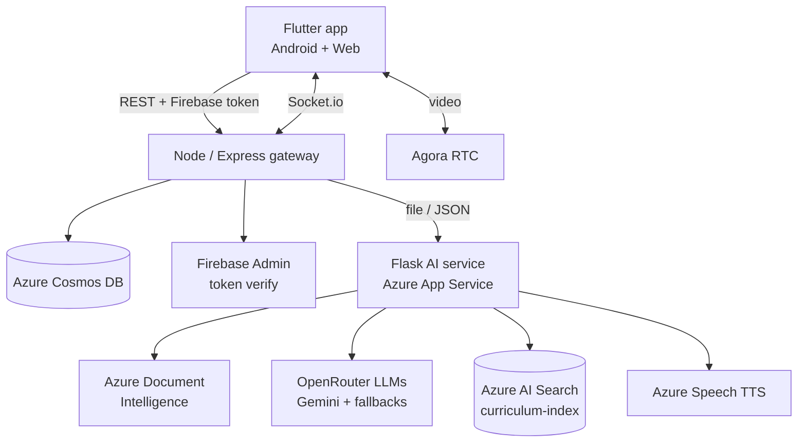
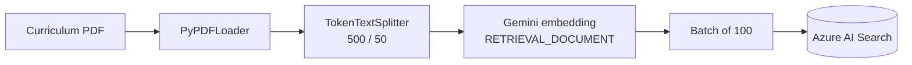
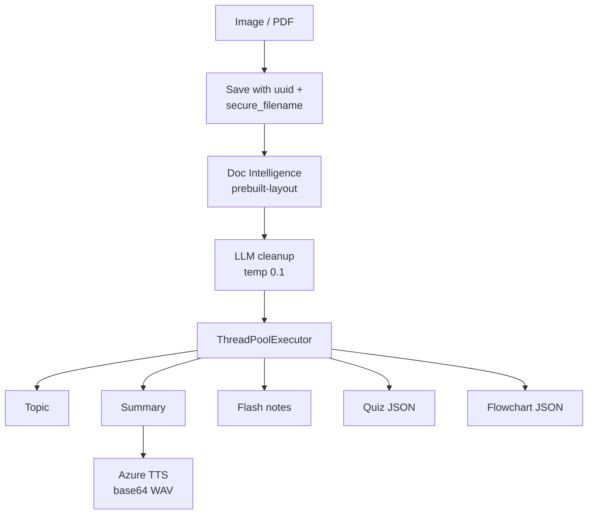
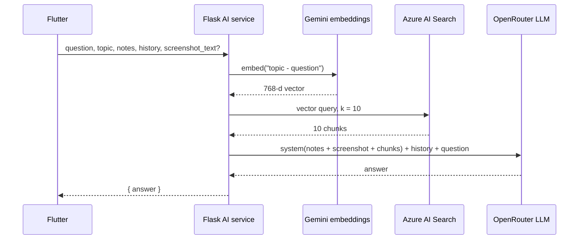
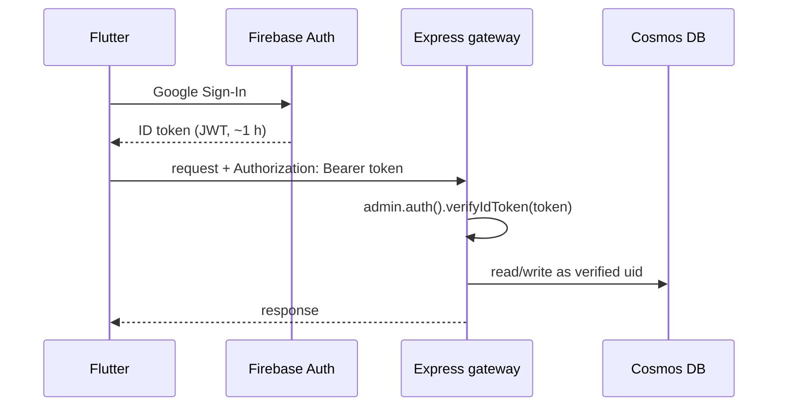
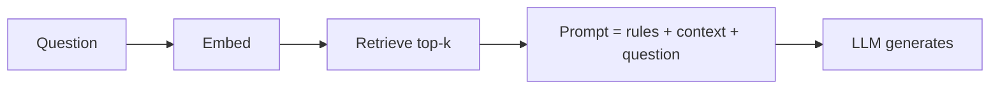
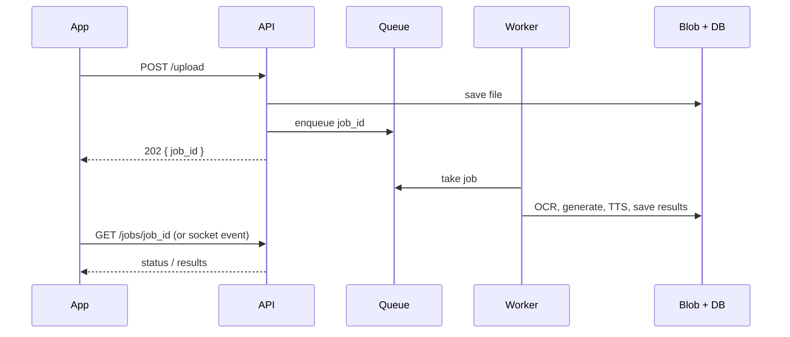
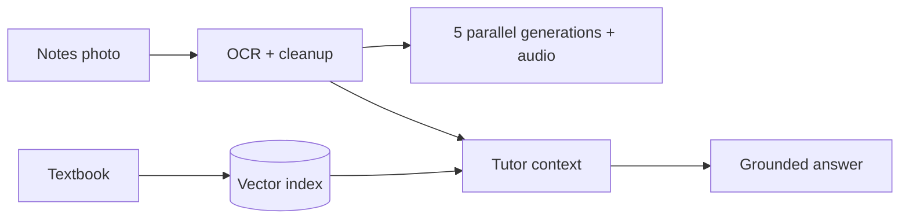

# Study Buddy — Project Interview Dossier

Sep 23, 2026 · @Someone

## 0. Hurry mode (read this in the last 10 minutes)

Study Buddy turns photographed handwritten notes into summaries, flash notes, quizzes, flowcharts and audio, and answers questions with a RAG tutor grounded in the notes plus a textbook index.

**Core sentence to remember**

> "OCR gets the text, one LLM pass cleans it, five generation calls run in parallel, and the tutor answers from the student's notes plus the top-10 textbook chunks from vector search."

**Numbers I can defend** (these are configuration values, not performance claims)

| What | Value |
| --- | --- |
| Chunk size / overlap | 500 / 50 tokens (`cl100k_base`) |
| Embedding model / size | `gemini-embedding-001`, 768 dimensions |
| Retrieved chunks per question | k = 10 |
| Upload batch to Azure AI Search | 100 documents |
| LLMs in fallback chain | 4 (Gemini 2.0 Flash first) |
| Temperature | 0.2 chat, 0.1 OCR cleanup |
| Parallel generation tasks | 5 |
| Gunicorn timeout | 600 s |

**Three flows to draw from memory**

1. Ingestion: PDF → chunks → embeddings → Azure AI Search.
2. Upload: image → OCR → LLM cleanup → 5 parallel generations + TTS → one JSON response.
3. Chat: topic + question → embed → top-10 search → prompt with notes + chunks + history → LLM.

**Three hardest questions**

- *Is it hybrid search?* No. Retrieval is pure vector (`search_text=None`). Hybrid is a one-line change in Azure AI Search, fused with RRF.
- *How did you evaluate it?* Not quantitatively yet. Plan: 50–100 gold questions, Recall@k for retrieval, faithfulness for answers.
- *What breaks first?* The upload endpoint: OCR + 6 LLM calls + TTS inside one synchronous request on one sync worker.

**Weakest point (say it before they do):** no retrieval evaluation, no auth on the AI service, long synchronous uploads.

**Before any interview:** fill in "My exact role" in section 1.

## 1. Project overview

Study Buddy is a team-built learning app with three parts: a Flutter client, a Node.js gateway, and a Python AI service that does OCR, generation and retrieval.

**Primary track:** Data Science / ML engineering (RAG, LLM systems), with a strong SDE angle (API design, concurrency, cloud deployment).

### Repositories

| Part | Repo | Stack | Hosted on |
| --- | --- | --- | --- |
| AI / RAG service | [divyansh070/ragpipeline](https://github.com/divyansh070/ragpipeline) | Python 3.11, Flask, Gunicorn, LangChain | Azure App Service (Southeast Asia) |
| API gateway | [Arindam229/studybuddybackend](https://github.com/Arindam229/studybuddybackend) | Node.js, Express 5, Cosmos DB, Socket.io | Vercel |
| Client | [Arindam229/studybuddyfrontend](https://github.com/Arindam229/studybuddyfrontend) | Flutter (Android + Web) | Vercel (web) |

**My exact role:** \_\_\_\_\_\_\_\_\_\_\_\_\_\_\_\_\_\_\_\_\_\_ (fill this in; the AI service is in my account, the gateway and client are in a teammate's).

### The problem

- Students' notes are often handwritten, messy and incomplete, so plain OCR output is noisy.
- Re-reading notes is passive; active recall (quizzes, flash notes) works better but takes effort to create.
- Generic chatbots answer from general knowledge, which can drift from the syllabus or contradict the textbook.
- Studying alone is harder; students want to share boards and study together live.

### What the product does

1. **Capture:** the student photographs notes or uploads a PDF.
2. **Extract:** Azure Document Intelligence reads the text; an LLM fixes OCR mistakes.
3. **Generate:** topic, summary, flash notes, a 5-question MCQ quiz, and a flowchart, plus an audio summary.
4. **Ask:** a tutor chat answers questions using the student's notes and retrieved textbook passages; it can also read a screenshot.
5. **Collaborate:** study boards sync between buddies (Socket.io) and they can join a video room (Agora).

### Tech stack at a glance

| Layer | Technology | Why it's there |
| --- | --- | --- |
| OCR | Azure AI Document Intelligence, `prebuilt-layout` | Layout-aware text, markdown output |
| LLM | Gemini 2.0 Flash via OpenRouter | Fast, cheap, good at structured output |
| LLM fallbacks | Gemini Flash 1.5 → Gemini Pro 1.5 → Claude 3 Haiku | Availability if the primary fails |
| Embeddings | `gemini-embedding-001`, 768-d | Vectors for textbook retrieval |
| Vector store | Azure AI Search, index `curriculum-index` | Managed vector search |
| Text-to-speech | Azure AI Speech, `en-IN-PrabhatNeural` | Audio summary in Indian-English voice |
| AI API | Flask + Gunicorn + flask-cors | Simple HTTP service for the gateway |
| Gateway | Express 5, Multer, Axios, form-data | Uploads, auth, routing to AI service |
| Database | Azure Cosmos DB (NoSQL) | Flexible JSON documents for boards and artifacts |
| Auth | Firebase Auth + Google Sign-In, `firebase-admin` | Identity; server verifies ID tokens |
| Real-time | Socket.io, Agora RTC | Board sync, video rooms |
| Export | PDFKit + node-canvas | Notes as PDF |
| Client | Flutter, Provider, `graphview`, `flutter_markdown`, `audioplayers` | Cross-platform UI, renders AI output |
| CI | GitHub Actions (all three repos) | Automated build/deploy |

## 2. System architecture

The design splits into a client, a gateway that owns users and data, and a stateless AI service that owns OCR, generation and retrieval.



The gateway is the only component that knows who the user is. The AI service is stateless: every request carries everything it needs.

### Flow A — Offline ingestion (building the textbook index)



Run once per textbook with `hybrid_pipeline.py`. Each chunk becomes `{chunk_id, content, content_vector}`.

### Flow B — Upload notes (`POST /api/upload`)



Everything returns in one JSON response: `extracted_notes`, `topic`, `summary`, `flash_notes`, `quiz`, `flowchart`, `audio_base64`. Temp files are deleted in `finally`.

### Flow C — Tutor chat (`POST /api/chat`)



### Flow D — OCR only (`POST /api/ocr`)

Same OCR + cleanup as Flow B, nothing else. Used when a student sends a screenshot in chat; the text comes back as `screenshot_text` for Flow C.

### API surface of the AI service

| Method | Path | Input | Output |
| --- | --- | --- | --- |
| GET | `/` | – | `{status, message}` health check |
| POST | `/api/upload` | multipart `file` (PDF/JPG/PNG) | notes, topic, summary, flash notes, quiz, flowchart, audio |
| POST | `/api/ocr` | multipart `file` | `{extracted_text}` |
| POST | `/api/chat` | JSON: `question`, `notes`, `topic`, `chat_history?`, `screenshot_text?` | `{answer}` |

## 3. What I built — the AI service, file by file

The AI service is four modules: ingestion (`hybrid_pipeline.py`), OCR (`ocr_handler.py`), generation + retrieval (`query_pipeline.py`) and TTS (`tts_handler.py`), wired together by `app.py`.

### 3.1 `hybrid_pipeline.py` — building the textbook index

```python
loader = PyPDFLoader(pdf_path)
documents = loader.load()
text_splitter = TokenTextSplitter(encoding_name="cl100k_base",
                                  chunk_size=500, chunk_overlap=50)
chunks = text_splitter.split_documents(documents)

for i, chunk in enumerate(chunks):
    vector_array = gemini_embeddings.embed_query(chunk.page_content)
    time.sleep(1.1)                     # free tier ~60 req/min
    docs_to_upload.append({"chunk_id": str(uuid.uuid4()),
                           "content": chunk.page_content,
                           "content_vector": vector_array})
    if len(docs_to_upload) % 100 == 0:
        search_client.upload_documents(documents=docs_to_upload)
        docs_to_upload = []
```

What to say about each line:

- **`PyPDFLoader`** returns one LangChain `Document` per page, with page number in metadata.
- **`TokenTextSplitter` with `cl100k_base`** counts real tokens, so 10 chunks ≈ 5,000 tokens of context. Character splitting can't guarantee that.
- **500 / 50** — big enough for one complete explanation, small enough that one embedding represents one idea; 10% overlap keeps sentences that straddle a boundary.
- **`task_type="RETRIEVAL_DOCUMENT"`** tells the embedding model this text is a passage to be found (queries use `RETRIEVAL_QUERY`).
- **`output_dimensionality=768`** must equal the vector field size defined in the Azure index, or uploads fail.
- **`sleep(1.1)`** is a free-tier rate-limit workaround — honest limitation, not a design choice.
- **Batches of 100** reduce network round trips to Azure AI Search.

> **Know this:** the name says "hybrid", but the file only ingests. Nothing here or at query time does keyword search.

Weaknesses to own: page metadata is dropped (so no citations), one embedding call per chunk instead of `embed_documents` batching, no deduplication, and re-running the script adds duplicate chunks with new UUIDs.

### 3.2 `ocr_handler.py` — reading handwritten notes

```python
poller = client.begin_analyze_document(
    model_id="prebuilt-layout",
    body=f,
    output_content_format="markdown",
    content_type=content_type)
return poller.result().content
```

- **`prebuilt-layout`** detects text, reading order, paragraphs, headings, tables and selection marks. It's more structure-aware than `prebuilt-read`.
- **`begin_analyze_document` returns a poller** — Azure processes documents as a long-running operation; `.result()` blocks until done.
- **Markdown output** keeps headings and tables, which helps the LLM understand structure later.

Then `clean_ocr_text` sends the raw OCR to the LLM at **temperature 0.1** with four instructions: fix cursive misspellings from context, drop bleed-through numbers and gibberish, extract valid text from HTML fragments the layout model emits, return clean markdown only.

> **Interview answer:** "I used a two-stage OCR: a deterministic, layout-aware OCR model extracts what's on the page, and a low-temperature LLM only corrects it. That keeps the source of truth on the page and uses the LLM where it's strong — using context to fix errors."

Risk to know: the correction LLM can "fix" a correct but unusual term into a common one, or smooth over a formula. Low temperature and a narrow instruction reduce this but don't remove it.

### 3.3 `query_pipeline.py` — generation and retrieval

**LLM setup with fallbacks**

```python
primary_llm = ChatOpenAI(model="google/gemini-2.0-flash-001",
                         openai_api_key=openrouter_key,
                         base_url="https://openrouter.ai/api/v1",
                         temperature=0.2)
llm = primary_llm.with_fallbacks([gemini_flash_15, gemini_pro_15, claude_3_haiku])
```

- OpenRouter exposes many providers behind an **OpenAI-compatible API**, so LangChain's `ChatOpenAI` works with a different `base_url`.
- `.with_fallbacks()` tries the next model only when the current one **raises an exception**.

**Five generation functions** (all take the cleaned notes):

| Function | Prompt goal | Output |
| --- | --- | --- |
| `extract_core_topic` | Core scientific topic as a 3–7 word search query | string |
| `generate_summary` | 1–2 encouraging sentences, English only | string (also sent to TTS) |
| `generate_flash_notes` | Concise bullet points, key concepts and definitions | markdown string |
| `generate_quiz` | 5 MCQs, 4 options, 1 answer, raw JSON list | list of `{question, options, answer}` |
| `generate_flowchart` | Key process as graph JSON | `{nodes:[{id,label}], edges:[{from,to}]}` |

JSON handling: strip a leading ```` ``` ```` fence and a `json` language tag, then `json.loads`. On failure the quiz returns `[]` and the flowchart returns empty nodes/edges, so one bad generation doesn't fail the upload.

**`fetch_top_10_and_answer` — the RAG step**

```python
combined_search_query = f"{core_topic} - {user_question}"
query_vector = gemini_embeddings.embed_query(combined_search_query)   # RETRIEVAL_QUERY
vector_query = VectorizedQuery(vector=query_vector,
                               k_nearest_neighbors=10,
                               fields="content_vector")
results = search_client.search(search_text=None,
                               vector_queries=[vector_query],
                               select=["content"])
```

Then the prompt is assembled:

1. **System message** — tutor persona and rules (base answers on notes and excerpts, use chat history for references, answer in the student's language, prioritise image content when present), then the full student notes, the screenshot text if any, and the 10 chunks labelled `--- CHUNK n ---`.
2. **Chat history** — each `{role, content}` becomes a `HumanMessage` or `AIMessage`.
3. **Current question** as the final `HumanMessage`.

> **Key point:** notes are **stuffed** (always fully in context), the textbook is **retrieved** (only the top 10 chunks). Know why: notes are small and always relevant; the textbook is large.

### 3.4 `tts_handler.py` — audio summary

- Azure Speech SDK, region `southeastasia`, voice `en-IN-PrabhatNeural` (Indian-English neural voice).
- `speak_text_async(text).get()` synthesises to a WAV file and blocks until done.
- Checks `ResultReason.SynthesizingAudioCompleted`; on cancel or exception returns `None` so the upload still succeeds without audio.

### 3.5 `app.py` — wiring it together

- `CORS(app)` so the web client can call it from another origin.
- Upload path: `secure_filename` + `uuid4().hex` prefix → avoids path traversal (`../../etc/passwd`) and name collisions between users.
- OCR runs first (everything depends on the text), then **five generation tasks are submitted to a `ThreadPoolExecutor`** and awaited with `.result()`.
- TTS runs after the summary is ready; the WAV is read and base64-encoded into the JSON.
- `finally` deletes the uploaded file and audio file even when something fails — no disk leak on the App Service instance.
- Errors return `{"error": str(e)}` with HTTP 500.
- Deployed with `gunicorn --bind=0.0.0.0:8000 --timeout 600 app:app`.

### 3.6 Support scripts

`check_models.py` / `list_models.py` (which model IDs are available), `limitchecker.py` (rate limits), `test_key.py`, `test_reality.py`, `test_upload_features.py`, `verify_dependencies.py`. These are manual checks, not an automated test suite.

## 4. Gateway and client

The gateway owns identity, data and real-time; the client renders the AI output. This section comes from the dependency files, `vercel.json` and the README — GitHub blocked reading the source folders, so verify each point in the code before claiming it.

### 4.1 Node / Express gateway (`studybuddybackend`)

Folder layout: `config/`, `controllers/`, `routes/`, `middleware/`, `db.js`, `index.js` — a standard layered Express app (routes → middleware → controllers → DB).

| Dependency | What it most likely does | What to be able to explain |
| --- | --- | --- |
| `express` 5 | HTTP API | Express 5 forwards rejected promises from async handlers to error middleware |
| `firebase-admin` | Verifies Firebase ID tokens | Why the server must verify, never trust a client-sent user ID |
| `@azure/cosmos` | Stores users, boards, artifacts | Partition keys, RU cost, document model |
| `socket.io` | Real-time board sync | Rooms, broadcast, reconnect, scaling |
| `agora-access-token` | Mints short-lived RTC tokens | Why tokens are server-side |
| `multer` | Receives multipart uploads | Memory vs disk storage, size limits |
| `axios` + `form-data` | Forwards files to the Flask service | Re-streaming multipart between services |
| `pdfkit` + `canvas` | Generates PDF exports | Server-side rendering cost |
| `cors`, `dotenv`, `uuid` | CORS policy, env config, IDs | Standard |

`vercel.json` rewrites every `/api/*` path to `index.js`, so the whole Express app runs as one Vercel serverless function.

### 4.2 Authentication flow



> **Interview answer:** "The client proves identity with a Firebase ID token. The gateway verifies the token's signature with Firebase Admin and uses the uid inside it. It never trusts a user ID sent in the request body."

### 4.3 Real-time: Socket.io and Agora

- **Socket.io**: each study board is a room; an edit is emitted to the server and broadcast to others in that room. It falls back to HTTP long-polling when WebSockets aren't available and reconnects automatically.
- **Agora**: the video itself flows through Agora's network, not our server. Our server only issues a token signed with the App Certificate, scoped to one channel and uid, with an expiry.

> **Know this risk:** Vercel serverless functions don't keep long-lived WebSocket connections. If Socket.io runs inside the Vercel deployment, it either falls back to polling or breaks. Check where the socket server actually runs.

### 4.4 Cosmos DB

- Document store: a board with nested notes, quiz arrays and flowchart graphs is one JSON document; no migrations when the shape changes.
- Cost is measured in **Request Units (RUs)**; a point read by id + partition key is the cheapest operation.
- **Partition key** decides scaling. `userId` (or `boardId` for shared boards) keeps related data together; a low-cardinality or time-based key creates hot partitions.

### 4.5 Flutter client (`studybuddyfrontend`)

| Package | Role |
| --- | --- |
| `firebase_auth`, `google_sign_in` | Login |
| `image_picker`, `file_picker`, `permission_handler` | Capture notes, pick files, camera/mic permissions |
| `http` | REST calls to the gateway |
| `flutter_markdown` | Renders flash notes and chat answers |
| `graphview` | Draws the flowchart from `{nodes, edges}` |
| `audioplayers` | Plays the base64 TTS summary |
| `socket_io_client` | Board sync |
| `agora_rtc_engine` | Video rooms |
| `provider` (per README) | State management with `ChangeNotifier` |

The contract between services is the nice detail here: the AI service returns the flowchart as nodes and edges precisely so `graphview` can draw it without any parsing on the client.

## 5. Key engineering decisions and trade-offs

Each decision below has the story in problem → decision → trade-off form, so it can be told in 30 seconds.

### 5.1 Two-stage OCR (layout model + LLM correction)

**Problem:** handwritten notes produce noisy OCR — misread cursive, bleed-through numbers, broken HTML fragments.

**Decision:** Azure Document Intelligence extracts the text; an LLM at temperature 0.1 only corrects it.

| Option | Pros | Cons |
| --- | --- | --- |
| OCR only | Deterministic, cheap | Noisy text hurts every later step |
| Vision LLM only | One call, simple | Can hallucinate text not on the page; harder to debug |
| **OCR + LLM cleanup (chosen)** | Page stays the source of truth; LLM fixes errors with context | Two calls; LLM may "over-correct" rare terms |

### 5.2 Parallel generation with threads

**Problem:** five independent LLM calls in sequence make upload latency ≈ the sum of all five.

**Decision:** `ThreadPoolExecutor` runs them concurrently; latency ≈ the slowest one.

**Why threads work despite the GIL:** the work is I/O-bound (waiting on HTTP). Python releases the GIL while waiting on the network, so threads overlap the waits.

**Trade-off:** five simultaneous calls hit provider rate limits faster, and one hanging call still delays the whole response (no per-call timeout).

### 5.3 Notes stuffed, textbook retrieved

**Problem:** the tutor needs both the student's own notes and authoritative textbook content.

**Decision:** the full notes always go in the prompt; only the top 10 textbook chunks are retrieved.

| Source | Size | Relevance | Strategy |
| --- | --- | --- | --- |
| Student notes | Small (one session) | Always relevant | Stuff whole |
| Textbook corpus | Large | Mostly irrelevant to one question | Retrieve top-k |

**Trade-off:** very long notes cost tokens on every chat turn.

### 5.4 Topic-prefixed queries

**Problem:** follow-ups like "why does that happen?" embed to a vague vector.

**Decision:** query = `"{topic} - {question}"`.

**Trade-off:** crude compared with LLM query rewriting, but costs zero extra LLM calls.

### 5.5 Asymmetric embedding task types, 768 dimensions

**Decision:** `RETRIEVAL_DOCUMENT` for chunks, `RETRIEVAL_QUERY` for questions; vectors reduced to 768 dimensions.

**Why:** questions and passages look different; task-specific embeddings map them better. 768-d means a smaller index and faster search with little quality loss.

**Trade-off:** changing the dimension later means re-embedding the whole corpus and rebuilding the index.

### 5.6 OpenRouter with a fallback chain

**Decision:** one OpenAI-compatible client, four models, automatic failover.

| Pros | Cons |
| --- | --- |
| One key, one client for several providers | Extra hop and dependency |
| Survives an outage or rate limit on the primary | Fallback only on exceptions, not bad answers |
| Easy to swap models | Different models format JSON differently; retired model IDs silently break the chain |

### 5.7 Stateless chat API

**Decision:** the client sends notes, topic and history with every request; the server stores nothing.

**Pros:** any instance can serve any request, trivial horizontal scaling, no session store.

**Cons:** payload and tokens grow with conversation length; the client can send anything, so the server can't trust it.

### 5.8 Managed cloud services over self-hosting

**Decision:** Azure OCR, Azure Search, Azure Speech, hosted LLMs — no local models.

**Pros:** no GPU, small deploy, fast to build. **Cons:** per-call cost, latency, vendor lock-in, student data leaves our system.

### 5.9 Base64 audio inside JSON

**Decision:** return the WAV as base64 in the upload response.

**Pros:** one round trip, simple client. **Cons:** \~33% size overhead and a bigger JSON; for long audio, Blob Storage + a URL is better.

### 5.10 Graceful degradation

**Decision:** a failed quiz returns `[]`, a failed flowchart returns an empty graph, a failed TTS returns `null` audio — the upload still succeeds.

**Trade-off:** failures are silent to the user unless the client shows "quiz unavailable".

### Four strongest engineering stories

1. **Two-stage OCR** — kept the page as source of truth, used the LLM only for correction.
2. **Parallel generation** — cut upload latency from the sum of five LLM calls to roughly the slowest one.
3. **Hybrid context** — stuffed small, always-relevant notes; retrieved from a large textbook.
4. **Service contract** — flowchart as `{nodes, edges}` JSON so the client renders it directly.

## 6. Concept deep dives (know these from first principles)

These are the concepts an interviewer will pull on once the project is on the table.

### 6.1 RAG — Retrieval-Augmented Generation

An LLM only knows its training data. RAG retrieves relevant documents at question time and puts them in the prompt, so the answer is grounded in your own sources.



| Why RAG | Instead of |
| --- | --- |
| Answers from a specific corpus (the syllabus) | General knowledge that may drift |
| Update knowledge by re-indexing | Fine-tuning, which is slow and costly |
| Can cite sources (if metadata is kept) | Unverifiable answers |

**RAG failure modes:** the answer isn't in the corpus; retrieval misses the right chunk; the right chunk is retrieved but the model ignores it; the model mixes context with its own knowledge.

### 6.2 Embeddings and cosine similarity

An embedding maps text to a vector so that similar meaning ≈ nearby vectors. Similarity is usually cosine:

$$
\cos(\theta) = \frac{a \cdot b}{\lVert a \rVert \, \lVert b \rVert}
$$

It measures the angle, not the length: 1 = same direction, 0 = unrelated. If vectors are normalised, cosine equals the dot product.

**Asymmetric retrieval:** queries are short questions, documents are long passages. Task types (`RETRIEVAL_QUERY` vs `RETRIEVAL_DOCUMENT`) let the model encode each for its role.

**Dimensionality:** more dimensions can capture more nuance but cost storage and search time. Models trained with Matryoshka-style representation learning keep most quality when truncated, which is why 768-d is a reasonable reduction.

### 6.3 Chunking

| Strategy | How | Good for | Weakness |
| --- | --- | --- | --- |
| Fixed tokens (used) | N tokens, M overlap | Predictable context size | Cuts mid-thought, ignores headings |
| Recursive character | Split on paragraphs → sentences → words | General prose | Sizes vary |
| Structure-aware | Split on headings / sections | Textbooks, docs | Needs clean structure |
| Semantic | Split where embedding similarity drops | Topic shifts | Slower, more tuning |
| Parent-child | Retrieve small chunks, return the parent section | Precision + context | More complex index |

**Size trade-off:** small chunks = precise matches but little context; large chunks = more context but diluted embeddings and more tokens. **Overlap** protects ideas that cross a boundary; too much overlap duplicates results.

### 6.4 Vector search, ANN and HNSW

Exact nearest-neighbour search compares the query with every vector — O(N). Vector databases use **approximate nearest neighbour (ANN)** indexes instead. Azure AI Search uses **HNSW** (Hierarchical Navigable Small World) by default: a layered graph where search starts at a sparse top layer and greedily moves closer, dropping to denser layers. It trades a little recall for much faster search. Key knobs: `m` (links per node), `efConstruction` (build quality), `efSearch` (search breadth).

### 6.5 Keyword search, hybrid search and RRF

**BM25** scores documents by term frequency (with saturation), inverse document frequency (rare words matter more) and document-length normalisation.

|  | Vector | BM25 keyword |
| --- | --- | --- |
| Strength | Paraphrases, synonyms, meaning | Exact terms, formulas, names, codes |
| Weakness | Rare exact terms, numbers | Different wording for the same idea |

**Hybrid** runs both and fuses the rankings. Azure AI Search uses **Reciprocal Rank Fusion**:

$$
\text{RRF}(d) = \sum_{i} \frac{1}{k + \text{rank}_i(d)}, \quad k \approx 60
$$

It uses ranks, not raw scores, so BM25 scores and cosine similarities (different scales) can be combined. A document ranked high in both lists wins.

**Re-ranking:** a cross-encoder (or Azure's semantic ranker) reads query and passage *together* and scores relevance more accurately than comparing two separate embeddings — too slow for the whole corpus, ideal for the top 30–50.

### 6.6 Evaluating a RAG system

| Stage | Metric | Question it answers |
| --- | --- | --- |
| Retrieval | Recall@k | Is a correct chunk anywhere in the top k? |
| Retrieval | MRR | How high is the first correct chunk? |
| Retrieval | nDCG | Are the most relevant chunks ranked first? |
| Generation | Faithfulness | Is every claim supported by the retrieved context? |
| Generation | Answer relevance | Does it actually answer the question? |
| Generation | Correctness | Does it match a reference answer? |

$$
\text{MRR} = \frac{1}{|Q|} \sum_{q \in Q} \frac{1}{\text{rank of first relevant result for } q}
$$

Tools: a hand-built gold set, RAGAS, or LLM-as-judge (validated against some human labels).

### 6.7 OCR and Document Intelligence

- Classic OCR finds text regions, then recognises characters/words; handwriting is harder because shapes vary per writer and letters join.
- Layout models add structure: reading order, paragraphs, headings, tables.
- Azure's API is **asynchronous**: submit → get an operation → poll until done (`begin_analyze_document` + poller).
- LLM post-correction uses language context ("thermodynamcs" → "thermodynamics"), but can also change rare-but-correct terms.

### 6.8 Concurrency in Python

| Tool | Best for | Why |
| --- | --- | --- |
| `threading` / `ThreadPoolExecutor` | I/O-bound (network, disk) | GIL released while waiting on I/O |
| `multiprocessing` / `ProcessPoolExecutor` | CPU-bound | Separate processes, separate GILs |
| `asyncio` | Many concurrent I/O tasks | One thread, event loop, needs async libraries |

The **GIL** (Global Interpreter Lock) lets only one thread run Python bytecode at a time. LLM calls spend almost all their time waiting on the network, so threads still give near-full parallelism here.

### 6.9 WSGI, Gunicorn and workers

- Flask is a **WSGI** app; Gunicorn is the production server that runs it.
- Default: **one sync worker** — it handles one request at a time.
- Options: more workers (`-w 4`, rule of thumb 2 × CPU + 1), threaded workers (`--threads`, gthread) for I/O-heavy apps, or async workers (gevent).
- `--timeout 600` kills a worker silent for 600 s. A long timeout hides slow requests; the real fix is moving long work out of the request.

### 6.10 LLM structured output

| Approach | Reliability |
| --- | --- |
| Prompt "return raw JSON" + strip fences (used) | Works most of the time; fails silently |
| JSON mode | Guarantees valid JSON, not the right fields |
| Schema-constrained output / function calling | Valid JSON matching the schema |
| + Pydantic validation + one retry with the error | Also checks semantics (4 options, answer ∈ options) |

### 6.11 Prompt injection

Text that the model reads can contain instructions. OCR'd notes and screenshot text are untrusted input placed in the prompt. Defences: keep untrusted text in the user turn with clear delimiters, tell the model to treat it as data, give the model no tools or privileges, and validate outputs.

### 6.12 Temperature

Temperature rescales the token probability distribution before sampling. Low (0.1–0.2) = more deterministic, good for correction and grounded answers; high = more varied, good for brainstorming. It doesn't make a model factual — grounding does.

## 7. Interview questions with answers

Every answer here matches what the code actually does; where it doesn't do something, the answer says so and gives the fix.

### A. Project understanding

**Q1. Explain the project in 30 seconds.** See section 9. Lead with the flow: OCR → cleanup → parallel generation → RAG tutor.

**Q2. What was your input and final output?** Input: a photo or PDF of notes, then questions. Output: cleaned notes, topic, summary, flash notes, quiz JSON, flowchart JSON, audio; per question, a grounded answer.

**Q3. Why build a RAG tutor instead of just asking an LLM?** A bare LLM answers from general knowledge and can contradict the syllabus. Retrieval puts the actual textbook passages in front of the model, and the notes keep it aligned with what the student studied.

**Q4. Why is the AI a separate Python service instead of inside the Node gateway?** The ML ecosystem (LangChain, Azure AI SDKs) is strongest in Python. Separation also lets the AI service scale and deploy independently, and keeps slow AI work away from the gateway's real-time traffic.

### B. OCR

**Q5. Why Azure Document Intelligence and not Tesseract?** Tesseract is weak on handwriting and has no layout understanding. `prebuilt-layout` handles handwriting better and returns reading order, headings and tables as markdown. Trade-off: cost and a cloud dependency.

**Q6. Why clean OCR with an LLM? Isn't that risky?** Cursive OCR errors are often obvious from context, which is exactly what LLMs are good at. The risk is over-correction of rare terms or formulas, so I used temperature 0.1 and a narrow instruction: fix errors, drop noise, don't add content. A stronger version would diff the output against the raw OCR and flag large changes.

**Q7. How would you measure OCR quality?** Character Error Rate / Word Error Rate against hand-typed transcriptions of a sample of notes — before and after LLM cleanup, to prove the cleanup helps.

### C. Retrieval

**Q8. Explain chunking choices — why 500 with 50 overlap?** See 6.3. 500 tokens ≈ a few paragraphs, one coherent idea; 10% overlap protects boundary sentences; token counting makes context size predictable (10 × 500 ≈ 5k tokens).

**Q9. Why k = 10?** Recall vs noise. More chunks raise the chance the answer is present but add irrelevant text and cost. The principled way: measure Recall@k on a gold set, or retrieve \~30 and re-rank down to 5–10.

**Q10. Is this hybrid search?** No — pure vector (`search_text=None`), despite the file name `hybrid_pipeline.py`, which is ingestion. Adding `search_text=query` makes Azure run BM25 + vector and fuse with RRF. For a STEM textbook this matters: formula names, units and symbols are exact-match terms.

**Q11. Why prefix the topic to the query?** Follow-ups are underspecified. The topic anchors the embedding to the right region of the corpus. Better: an LLM rewrites the follow-up into a standalone question using chat history.

**Q12. Why different task types for queries and documents?** Queries are short questions, documents are long passages. Task-specific encoding places a question near passages that *answer* it, not near other similar questions.

**Q13. What if the answer isn't in the textbook index?** Today the model falls back on the notes or its own knowledge, with nothing marking that. Fix: tell it to say when the context doesn't contain the answer, and use a similarity-score threshold to detect weak retrieval.

**Q14. How would you add citations?** Store `source` and `page` from `PyPDFLoader` metadata in the index, retrieve them with `select`, label chunks with them in the prompt, and ask the model to cite `[book, p. N]`.

**Q15. What vector index does Azure AI Search use, and what's the trade-off?** HNSW by default — approximate nearest neighbour, trading a little recall for large speed-ups. See 6.4.

### D. Generation and LLMs

**Q16. How do you reduce hallucination?** Grounding (notes + chunks), low temperature, explicit instruction to base answers on the material. Missing: "say I don't know" instruction, citations, and a faithfulness check.

**Q17. Why OpenRouter?** One OpenAI-compatible API over many providers, which made the fallback chain across Gemini and Claude trivial with LangChain's `ChatOpenAI`.

**Q18. What does `.with_fallbacks()` protect against — and not?** Exceptions: rate limits, timeouts, outages. Not bad answers, not malformed JSON, and not a retired model ID in the middle of the chain (which just errors to the next one). `check_models.py` exists to check availability.

**Q19. Why does the quiz sometimes come back empty? Fix it.** It relies on "return raw JSON" + fence stripping. Any extra prose breaks `json.loads` and it returns `[]`. Fix: schema-constrained output, Pydantic validation (exactly 4 options, `answer` ∈ `options`), one retry with the validation error.

**Q20. How do you handle long chat histories?** Currently the whole history is sent every time. Fix: keep the last N turns, summarise older ones, or cap by tokens.

**Q21. Why is the summary English-only but chat answers in the student's language?** The summary feeds an English TTS voice (`en-IN-PrabhatNeural`). Chat is text, so it mirrors the student (including Hinglish).

### E. Backend and systems

**Q22. Why threads for the five generation calls?** I/O-bound; GIL released during network waits; drop-in for sync Flask. See 6.8.

**Q23. What happens if one of the five calls hangs?** `.result()` has no timeout, so the whole upload waits (up to Gunicorn's 600 s). Fix: `future.result(timeout=…)` per task and return partial results.

**Q24. What breaks first under load?** The upload endpoint. One sync Gunicorn worker handles one request at a time, and an upload can take many seconds (OCR + 6 LLM calls + TTS). Everyone else queues. Fixes in order: more workers/threads → async job pattern → queue + workers.

**Q25. Design the async upload.**



Add retries with backoff, a dead-letter queue, idempotency by job id, and a file-hash cache so re-uploads are free.

**Q26. Why delete temp files in `finally`?** App Service disk is limited and shared by requests; without cleanup every failed request leaks a file. `finally` runs on success and on exceptions.

**Q27. Why `secure_filename` and a UUID prefix?** `secure_filename` strips path components, blocking path traversal. The UUID prevents two users uploading `notes.jpg` from overwriting each other.

**Q28. How is the service secured?** Honestly, it isn't yet: open CORS, no auth, `str(e)` returned to clients, API-key prefixes printed in logs. Fix: only the gateway may call it (shared secret, managed identity or private networking), rate limits per user at the gateway, generic error messages, no key logging.

**Q29. How would you scale chat to thousands of students?** The chat API is stateless, so scale horizontally behind a load balancer. Also: trim history, cache query embeddings and popular retrievals, stream tokens (SSE) for perceived latency, batch ingestion embeddings.

**Q30. How would you test this?** Unit: JSON parsing, prompt assembly, history conversion. Integration: endpoints with mocked Azure/LLM clients. Evaluation: a gold question set for retrieval and answer quality, run on every prompt or index change. Don't make CI depend on live paid APIs.

### F. Gateway, data and real-time

**Q31. Authentication vs authorization here?** Authentication: Firebase verifies who you are. Authorization: the gateway checks you may access *this* board (owner or invited buddy). A valid token alone must not unlock another user's board — that's an IDOR.

**Q32. Why Cosmos DB over PostgreSQL?** Artifacts are nested JSON whose shape changes; a document store avoids migrations. PostgreSQL (with JSONB) would win if we needed joins, strong relational constraints, or complex reporting.

**Q33. What partition key would you choose?** `userId` for personal data, `boardId` for shared boards: high cardinality, and the common queries hit one partition. Avoid dates or low-cardinality fields (hot partitions).

**Q34. Socket.io on Vercel — does it work?** Serverless functions don't hold persistent connections. Real-time needs a long-running server or a managed pub/sub service (Azure Web PubSub, Ably, Pusher). Scaling Socket.io across servers needs the Redis adapter.

**Q35. Why generate Agora tokens on the server?** The token is signed with the App Certificate. On the client, anyone could extract it and mint tokens for any channel. The server checks membership, then issues a short-lived token for one channel and uid.

**Q36. Why WebSockets and not polling for board sync?** Edits need to appear in near real time. Polling wastes requests and adds delay; a persistent connection lets the server push changes immediately.

### G. Behavioural and reflective

**Q37. What was the hardest part?** Pick a real one. Candidates: making handwritten OCR usable, getting reliable JSON out of the LLM, or keeping upload latency acceptable with many AI calls.

**Q38. What would you do differently?** Async uploads from day one, hybrid search with metadata, an evaluation set before tuning anything, and auth on the AI service.

**Q39. How did you work with the rest of the team?** The contract: the AI service's JSON shapes (quiz, flowchart, audio) were agreed with the gateway and Flutter side so they could build UI in parallel. Fill in your real experience.

### Questions to practise out loud (no answer given)

1. Draw the whole architecture and all four flows.
2. Explain HNSW in two minutes.
3. Derive RRF for a document ranked 1st in vector and 5th in BM25 (k = 60).
4. Explain the GIL and why threads still helped.
5. Walk through what happens if OpenRouter is down entirely.
6. Estimate the token count of one chat request with 3 pages of notes and 10 turns of history.

## 8. Limitations, security issues and what I'd improve

Owning these clearly is what separates a strong answer from a defensive one.

### 8.1 Fix before linking the repos on a resume

- [ ] **`b64_key.txt` is committed in the public backend repo.** If it's a base64 service-account key, rotate it, delete it, and purge it from git history (a new commit that deletes it isn't enough).
- [ ] **Flutter bundles `.env` as an asset** (`pubspec.yaml`). Anything in it ships in the app and the public web build — only non-secret config belongs there.
- [ ] **Python prints API-key prefixes** (`openrouter_key[:10]`). Remove.
- [ ] **README drift:** it says `/api/chat` returns `audio_base64` and a Hinglish answer; the code returns only `answer`. Update the README.
- [ ] Remove `.DS_Store` from the repo.

### 8.2 Known limitations

| Area | Limitation | Impact | Fix |
| --- | --- | --- | --- |
| Retrieval | Pure vector, no BM25 | Misses exact terms (formulas, units, names) | Hybrid search + RRF, semantic ranker |
| Retrieval | No metadata (source, page) | No citations, no filtering by subject | Store metadata, add filters |
| Retrieval | Single global index | Every subject competes in one space | Filter by subject/grade, or index per curriculum |
| Evaluation | No gold set, no metrics | Can't prove quality or compare changes | Gold set + Recall@k + faithfulness |
| Ingestion | One embed call per chunk + 1.1 s sleep | Slow indexing | `embed_documents` batching, paid tier |
| Ingestion | Re-runs create duplicates | Repeated chunks in results | Deterministic IDs (hash of content) |
| Generation | JSON by prompt only | Silent empty quiz/flowchart | Schema output + validation + retry |
| Chat | Unbounded history | Rising tokens, eventual context overflow | Window or summarise |
| Chat | No "I don't know" rule | Confident answers outside the corpus | Instruction + retrieval-score threshold |
| Serving | Long synchronous upload, one sync worker | Requests queue behind uploads | Workers/threads now; async jobs later |
| Serving | No per-call timeout | One hung call stalls the upload | `future.result(timeout=…)` |
| Security | Open CORS, no auth | Anyone can call and run up cost | Gateway-only access + rate limits |
| Security | `str(e)` in responses | Leaks internals | Generic messages, log details server-side |
| Security | OCR text in system prompt | Prompt injection | Move to user turn, delimit, treat as data |
| Real-time | Socket.io on serverless (verify) | Unreliable sync | Long-running host or managed pub/sub |
| Testing | Manual scripts only | Regressions go unnoticed | Unit + mocked integration + eval in CI |

### 8.3 Failure handling — what happens when a dependency fails

| Dependency down | Current behaviour | Better behaviour |
| --- | --- | --- |
| Document Intelligence | Upload returns 500 | Retry with backoff, clear "try again" message |
| Primary LLM | Fallback chain tries 3 more models | Also alert when fallbacks are in use |
| All LLMs | Upload/chat return 500 | Queue the job; notify when ready |
| Azure AI Search | Chat returns 500 | Answer from notes only, flagged as not textbook-checked |
| Azure Speech | Upload succeeds, `audio_base64` is null | Same, and the client hides the play button |
| Quiz/flowchart JSON invalid | Empty result, upload succeeds | Retry once with the parse error |

### 8.4 Observability I would add

- **API:** latency per endpoint (p50/p95), error rate, request volume.
- **AI calls:** latency and failures per provider, fallback rate, tokens and cost per request.
- **Retrieval:** top similarity score per query (low scores = corpus gaps), empty-result rate.
- **Quality:** JSON parse failure rate, thumbs up/down on answers.

### 8.5 Improvement roadmap (in priority order)

1. Security fixes in 8.1, then auth between gateway and AI service.
2. Build a 50–100 question gold set; measure the current system.
3. Hybrid search + metadata + citations; re-measure.
4. Schema-validated JSON with retry.
5. Async upload jobs with a queue; per-call timeouts.
6. History windowing and query rewriting for follow-ups.
7. Re-ranking (semantic ranker or cross-encoder) over top 30.
8. Observability and cost tracking.

### 8.6 Claims to phrase carefully

| Don't say | Say instead |
| --- | --- |
| "I built a hybrid RAG pipeline." | "I built a vector-search RAG pipeline; hybrid is the next step." |
| "The tutor doesn't hallucinate." | "Answers are grounded in retrieved context, which reduces hallucination; I haven't measured faithfulness yet." |
| "It's production-ready and scalable." | "The chat API is stateless so it scales horizontally; uploads need an async redesign." |
| "I built Study Buddy." (if it was a team) | "I built the AI service; teammates built the gateway and Flutter app." |

## 9. Pitches, resume bullets and final recall

### 9.1 30-second pitch

> "Study Buddy is a learning app that turns photographed handwritten notes into study material and a tutor. I built the AI service in Python. It runs Azure Document Intelligence for OCR, uses a low-temperature LLM pass to fix handwriting errors, then generates a topic, summary, flash notes, a quiz and a flowchart in parallel, plus an audio summary. The tutor chat uses RAG: it embeds the question with Gemini embeddings, retrieves the top 10 textbook chunks from Azure AI Search, and answers using those chunks plus the student's own notes, with a four-model fallback chain for reliability."

### 9.2 2-minute pitch

> "The problem was that students' notes are handwritten and messy, re-reading them is passive, and generic chatbots answer from general knowledge that may not match the syllabus.
>
> The system has three parts: a Flutter app, a Node gateway that handles Firebase auth, Cosmos DB and real-time collaboration, and a Python AI service, which is my part.
>
> When a student uploads notes, Azure Document Intelligence's layout model extracts the text as markdown. OCR on cursive is noisy, so a low-temperature LLM pass corrects it using context — the page stays the source of truth. Then five independent generations run concurrently in a thread pool: topic, summary, flash notes, a five-question quiz and a flowchart as nodes and edges, which the Flutter app draws directly. The summary also goes through Azure TTS. Because the calls are I/O-bound, running them in parallel cuts latency to roughly the slowest call.
>
> For the tutor, I indexed the textbook offline: 500-token chunks with 50 overlap, 768-dimensional Gemini embeddings, uploaded to Azure AI Search. At question time I prefix the topic to the question, embed it, retrieve the top 10 chunks, and build a prompt with the student's full notes, those chunks, any screenshot text, and the chat history. LLM calls go through OpenRouter with a fallback chain across Gemini and Claude.
>
> The limitations I'd fix next are adding hybrid keyword + vector search with citations, building a gold question set to measure retrieval and faithfulness, and moving uploads to an async job queue, since they currently run as one long synchronous request."

### 9.3 Resume bullets (safe versions)

- Built the AI service for a collaborative study app (Flask, Azure App Service): Azure Document Intelligence OCR with LLM post-correction and concurrent generation of summaries, flash notes, MCQ quizzes and flowchart graphs, plus Azure TTS audio.
- Implemented a RAG tutor over curriculum textbooks: token-based chunking (500/50), 768-d Gemini embeddings with asymmetric task types, top-10 vector retrieval from Azure AI Search, and a 4-model LLM fallback chain via OpenRouter.

### 9.4 Draw these from memory before the interview

1. The full architecture (client, gateway, AI service, cloud services).
2. Ingestion flow.
3. Upload flow with the parallel fan-out.
4. Chat / RAG sequence.
5. Firebase token verification flow.
6. The async-upload redesign.
7. Hybrid search with RRF.

### 9.5 Final mental model



**One-line recall:** Study Buddy is an OCR-plus-RAG study system where the page is the source of truth, generation runs in parallel, and the tutor answers from the student's notes plus retrieved textbook passages.
