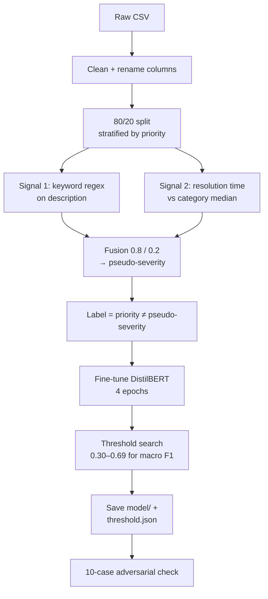
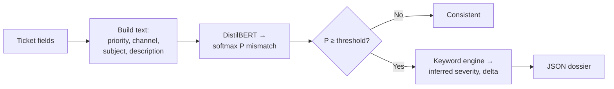
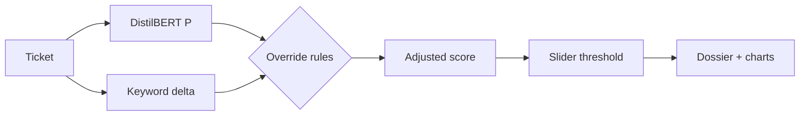
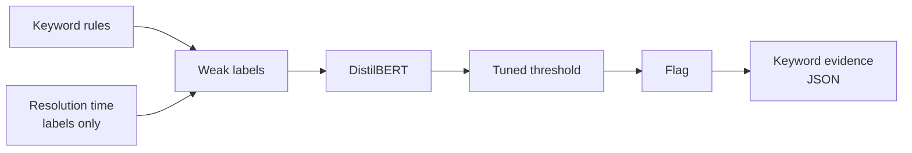

# Support Integrity Auditor (SIA) — Project Interview Dossier

Sep 23, 2026 · @Someone

## 0. Hurry mode (read this in the last 10 minutes)

SIA flags support tickets whose assigned priority looks wrong. It builds its own labels with keyword rules plus a resolution-time signal, fine-tunes DistilBERT on them, and wraps predictions in a JSON "evidence dossier" in a Streamlit app on Hugging Face Spaces.

**Core sentence to remember**

> "There were no mismatch labels, so I generated weak labels from two signals, distilled them into a DistilBERT classifier, tuned the decision threshold for macro F1, and explained each flag with deterministic keyword evidence."

**Numbers (all on the 20% validation split, measured against pseudo-labels)**

| Metric | Value |
| --- | --- |
| Accuracy | 0.8708 |
| Macro F1 | 0.8639 |
| Recall — Consistent | 0.8408 |
| Recall — Mismatch | 0.8895 |
| Adversarial set | 10 / 10 |
| Tuned threshold | ≈ 0.42 (searched 0.30–0.69) |
| Label fusion weights | 0.80 keywords, 0.20 resolution time |
| Training | 4 epochs, batch 16, lr 3e-5, max\_length 256 |

**Three things the code actually does that you must know**

1. **The labels are \~88% (14 of 16 cases) just the keyword rule.** With 0.8/0.2 weights and rounding, resolution time only changes the label in 2 of 16 signal combinations.
2. **The metrics are on the validation split that was also used to pick the best epoch and tune the threshold.** There is no separate test set.
3. **All 10 adversarial cases expect "Mismatch".** A model that always says "Mismatch" also scores 10/10.

**Three hardest questions**

- *What does 87% accuracy mean?* How well DistilBERT reproduces the weak labels — not real-world mismatch detection.
- *What's your baseline?* The keyword rule itself nearly defines the label; be ready to say the model mainly distils that rule, and why that can still be useful.
- *Is the explanation really zero-hallucination?* The keyword part is. But some dossier text is templated ("evaluated against SLA baselines", "semantic cluster") and describes computations the code doesn't do.

**Weakest point (say it before they do):** no ground-truth labels, so there's no measurement of true mismatch detection; next step is hand-labelling 200–300 tickets.

## 1. Project overview

SIA is a solo NLP project: a weak-supervision training pipeline, an inference CLI, and a Streamlit auditing dashboard deployed on Hugging Face Spaces.

**Primary track:** Data Science / NLP. **Repo:** [divyansh070/mars\_project\_ml\_sia](https://github.com/divyansh070/mars_project_ml_sia). **Live demo:** [SIA Ticket Auditor on Hugging Face Spaces](https://huggingface.co/spaces/divyansh89/SIA-Ticket-Auditor).

### The problem

- Support agents or customers set ticket priority by hand, and it's often wrong.
- **Hidden crisis:** a real outage filed as "Low" waits in the queue and breaches its SLA.
- **False alarm:** a password reset filed as "Critical" steals attention from real incidents.
- There is no column that says "this priority was wrong", and labelling thousands of tickets by hand is expensive.

So the task is: detect priority mismatches **without ground-truth labels**, and explain every flag with evidence a support lead can check.

### Data

| Item | Detail |
| --- | --- |
| File | `customer_support_tickets.csv` (4.34 MB); also `enhanced_customer_support_data.csv` |
| Columns used | ticket subject, description, channel, priority, time to resolution, ticket type |
| Renamed to | `ticket_subject`, `ticket_description`, `ticket_channel`, `priority_level`, `resolution_time_hours`, `issue_category` |
| Priority classes | Low, Medium, High, Critical |
| Cleaning | Priority normalised to 4 classes; resolution time coerced to numeric; rows missing any key field dropped |
| Split | 80 / 20 train / validation, stratified by `priority_level`, `random_state=42` |

> **Verify before the interview:** where the CSV came from (e.g. a public Kaggle dataset) and whether it's synthetic. If priorities in the source were assigned randomly, say so — it changes what "mismatch" means.

### Tech stack

| Layer | Technology |
| --- | --- |
| Data | pandas, NumPy, regex |
| Weak supervision | Keyword rules, category-median resolution ratios, weighted fusion; Cohen's kappa for signal agreement |
| Model | `distilbert-base-uncased` via Hugging Face `transformers` (`AutoModelForSequenceClassification`, `Trainer`) |
| Training | PyTorch, `TrainingArguments`, `evaluate` (macro F1) |
| Evaluation | scikit-learn (accuracy, F1, recall, classification report, kappa) |
| Explainability | Deterministic keyword engine → JSON dossier |
| App | Streamlit, Plotly (pie, bar, density heatmap) |
| Hosting | Hugging Face Spaces (free CPU tier) |

### Files

| File | Role |
| --- | --- |
| `train_pipeline.py` | Load → split → pseudo-label → train → tune threshold → save → adversarial test (8 steps) |
| `predict.py` | CLI inference for one ticket or a CSV, outputs JSON dossiers |
| `app.py` | Streamlit dashboard: analytics, single-ticket form, batch CSV upload, JSON export |
| `notebook.ipynb` | Exploration |
| `model/` | Saved fine-tuned model + tokenizer |

## 2. System architecture

There are two paths: an offline training pipeline that creates labels and a model, and an online path that scores a ticket and builds a dossier.

### Flow A — Training (`train_pipeline.py`)



### Flow B — Inference (`predict.py`, CLI)



### Flow C — Dashboard (`app.py`, Streamlit) — differs from the CLI



The dashboard adds a rule-based override the CLI doesn't have:

| Keyword delta (inferred − assigned) | Model probability | Score used |
| --- | --- | --- |
| \|delta\| ≥ 2 | any | max(P, 0.88 + 0.03 × \|delta\|) → at least 0.94 |
| delta = 0 | P > 0.50 | min(P, 0.12) |
| otherwise | any | P unchanged |

> **Know this:** in the live demo, big keyword gaps force a mismatch and zero keyword gap suppresses one. The comment calls this "preventing shortcut learning"; an interviewer will see it as rules overriding the model. The reported metrics are for the raw model, not this adjusted score.

### Model input format (identical in training and inference)

```text
Assigned Priority: Low | Channel: Email | Subject: Database Outage | Description: URGENT: Entire production database wiped.
```

Resolution time is **not** in the model input — it's only used to build labels. That's what avoids inference-time leakage.

## 3. What I built — file by file

The training script is the core; the two inference paths reuse its input format and keyword lists.

### 3.1 Step 1 — loading and splitting

```python
df = df_raw.dropna(subset=['ticket_description', 'ticket_subject', 'priority_level',
                          'ticket_channel', 'resolution_time_hours', 'issue_category'])
df_train, df_val = train_test_split(df, test_size=0.2, random_state=42,
                                    stratify=df['priority_level'])
```

- Split **before** creating labels, so validation statistics can't leak into training labels.
- Stratified by priority so each priority class keeps the same share in both splits. (Stratifying by the final label would also be reasonable, but the label doesn't exist yet at split time.)

### 3.2 Step 2 — weak supervision (the heart of the project)

**Signal 1 — keyword rules on the description**

| Inferred severity | Trigger words (regex, word boundaries) |
| --- | --- |
| Critical | outage, breach, lawsuit, security, fraud, wiped, gone, down, fatal |
| High | urgent, asap, escalate, manager, unacceptable, broken, crash, immediately |
| Medium | delay, waiting, cancel, refund, error, issue, problem, help, stuck |
| Low | none of the above |

The first matching tier wins, checked from Critical down.

**Signal 2 — resolution time vs category median**

```python
train_medians = df_train.groupby('issue_category')['resolution_time_hours'].median()
median_times  = df_train.groupby('priority_level')['resolution_time_hours'].median()
sla_reversed  = median_times['Critical'] < median_times['Low']
ratio = resolution_time / category_median
```

| Mode | Critical | High | Low | Else |
| --- | --- | --- | --- | --- |
| `sla_reversed` (critical tickets resolved faster) | ratio < 0.35 | ratio < 0.75 | ratio > 1.50 | Medium |
| normal (critical tickets take longer) | ratio > 2.0 | ratio > 1.5 | ratio < 0.5 | Medium |

The `sla_reversed` check is a nice detail: it decides from the data whether "fast" means urgent (SLA-driven) or "slow" means severe (hard problem), instead of assuming. Medians come from the **training split only**.

**Fusion**

```python
pseudo = round(0.80 * sev(signal_1) + 0.20 * sev(signal_2))     # Low=0 … Critical=3
is_mismatch = int(assigned_priority != pseudo_severity)
```

What this fusion actually does (work it out once — interviewers love this):

| Keyword says ↓ / Resolution says → | Low | Medium | High | Critical |
| --- | --- | --- | --- | --- |
| Low | Low | Low | Low | **Medium** |
| Medium | Medium | Medium | Medium | Medium |
| High | High | High | High | High |
| Critical | **High** | Critical | Critical | Critical |

In 14 of 16 combinations the result equals the keyword signal. Resolution time only matters when the two signals are at opposite extremes.

The script also prints **signal agreement** and **Cohen's kappa** between the two signals, and the overall mismatch rate. *(Write your actual printed numbers here: agreement \_\_\_, kappa \_\_\_, mismatch rate \_\_\_.)*

### 3.3 Step 3 — building the model input

```python
f"Assigned Priority: {p} | Channel: {c} | Subject: {s} | Description: {d}"
```

The assigned priority is in the text because a mismatch is a relationship between the priority and the content — the model can't judge "wrong priority" without seeing the priority.

### 3.4 Steps 4–5 — DistilBERT fine-tuning

| Setting | Value | Why |
| --- | --- | --- |
| Model | `distilbert-base-uncased`, 2 labels | Small, fast on CPU, good general English |
| max\_length | 256 tokens | Tickets are short; caps compute |
| Epochs | 4 | Enough for a small binary task |
| Batch size | 16 | Fits CPU/GPU memory |
| Learning rate | 3e-5 | Standard BERT fine-tuning range (2e-5 – 5e-5) |
| Weight decay | 0.01 | Regularisation |
| Warmup | 10% of steps | Stabilises early updates to pretrained weights |
| Eval / save | every epoch |  |
| Best model | `load_best_model_at_end`, by macro F1 | Keeps the best epoch |

A custom `TicketDataset` wraps the tokenizer output and labels for the `Trainer`.

### 3.5 Step 6 — threshold auto-tuner

```python
for t in np.arange(0.3, 0.7, 0.01):
    f1 = f1_score(val_labels, probs[:, 1] >= t, average='macro')
```

Picks the threshold with the best macro F1 on the validation set (≈ 0.42), prints a classification report, and saves it to `threshold.json`.

### 3.6 Step 8 — adversarial check

Ten hand-written tickets testing negation ("NOT urgent"), sarcasm ("I love when your servers crash"), terse severity ("Database wiped."), buried severity ("No rush, but all customer records disappeared"), and inflated trivial issues (typo, invoice, password reset filed as High/Critical). **All ten have expected label = 1 (mismatch).**

### 3.7 `predict.py` — CLI inference and dossier

1. Load `model/` and `threshold.json` (clamped to 0.10–0.95; defaults to 0.50 if missing).
2. Build the same input text, run DistilBERT under `torch.inference_mode()`, softmax → P(mismatch).
3. If below threshold → `{"binary_judgment": "Consistent", ...}`.
4. Otherwise run the keyword engine → inferred severity, **delta** (inferred − assigned), type = **Hidden Crisis** (delta > 0) or **False Alarm** (delta < 0), matched keywords.
5. Return a dossier with four evidence items (keywords, resolution time, channel, "semantic cluster") and a summary sentence.

Batch mode reads a CSV, maps column names, loops row by row, and writes all results to JSON.

### 3.8 `app.py` — Streamlit dashboard

- Model cached with `@st.cache_resource` (loaded once per server, not per click).
- Sidebar slider sets the live threshold (0.10–0.95, starts at the saved one).
- **Dashboard page:** total mismatches, average confidence, mismatches by channel (pie), by assigned priority (bar), channel × priority heatmap.
- **Single ticket page:** form → score with the override rules (section 2) → dossier.
- **Batch page:** validates required columns, scores each row with a progress bar, stores every candidate above 0.10 so the slider filters them live, de-duplicates by ticket ID.
- **Export:** download all dossiers as JSON.
- Results live in `st.session_state`, so they're per browser session and vanish on restart.

## 4. Results and how to read them honestly

The model agrees with the weak labels 87% of the time on validation; that measures how well it learned the labelling rules, not how well it finds real mispriorities.

### 4.1 Reported metrics

| Metric | Achieved | Target in README | What it means |
| --- | --- | --- | --- |
| Accuracy | 0.8708 | ≥ 0.83 | 87% of validation tickets predicted the same as their pseudo-label |
| Macro F1 | 0.8639 | ≥ 0.82 | Average of F1 for each class — treats both classes equally |
| Recall — Consistent | 0.8408 | ≥ 0.78 | Of tickets labelled consistent, 84% predicted consistent |
| Recall — Mismatch | 0.8895 | ≥ 0.78 | Of tickets labelled mismatch, 89% caught |
| Adversarial | 10/10 | ≥ 7/10 | All ten hand-written cases flagged as mismatch |

The targets look like they came from a brief or competition. If so, mention it: "The brief set minimum thresholds and the pipeline exceeded each."

### 4.2 Three caveats you must be able to state

**1. The labels are mostly the keyword rule.** From the fusion table in 3.2, pseudo-severity equals the keyword tier in 14 of 16 signal combinations. So the label is close to *"does the assigned priority equal the tier of the first matched keyword?"* The model sees both the priority and the description, so it can learn to recompute that rule. The 13% error is partly the model not perfectly learning it, and partly the resolution-time cases it can't see (resolution time isn't in the input).

**2. There's no untouched test set.** The same 20% validation split was used to (a) choose the best epoch, (b) choose the threshold, and (c) report the final metrics. Each choice slightly overfits to that split, so the numbers are optimistic. The README calls it a "held-out test split" — say "validation split" instead.

**3. The adversarial test only has positive cases.** Every expected label is 1, so a model that always predicts "Mismatch" also scores 10/10. It shows the model catches these cases, not that it avoids false alarms.

A nice detail to mention: one case — "No rush, but all customer records disappeared", assigned Low — contains **no** keyword from the lists. The rule alone would call it consistent. If the model flagged it, that's a real sign it learned something beyond the exact keywords. (The other nine can be solved by the keyword rule.)

### 4.3 What the numbers do and don't prove

| Proves | Doesn't prove |
| --- | --- |
| The pipeline trains end-to-end and the model reproduces the weak labels well | That flagged tickets are truly mis-prioritised |
| Threshold tuning shifted the balance toward mismatch recall | That 0.42 is optimal on new data |
| The model handles 10 targeted edge cases | That it's robust to negation or sarcasm in general (10 examples, all positive) |
| The app works as a demo | That DistilBERT beats the keyword rule on real data |

### 4.4 How to say it in the interview

> "The 87% accuracy and 89% mismatch recall are measured against pseudo-labels on a validation split, so they show the model learned the weak-supervision signal. Because the labels are mostly keyword-driven, the real value of the neural model is generalising beyond exact keywords — which I can only prove with human-labelled tickets. That's the first thing I'd add."

### 4.5 Fill in before the interview

- Dataset size after cleaning: train \_\_\_ / validation \_\_\_
- Overall pseudo-label mismatch rate: \_\_\_%
- Signal agreement \_\_\_% and Cohen's kappa \_\_\_
- Exact tuned threshold: \_\_\_
- Training time and hardware: \_\_\_

## 5. Key engineering decisions and trade-offs

Each decision is written as problem → decision → trade-off so it can be told in 30 seconds.

### 5.1 Weak supervision instead of manual labels

**Problem:** no "is this priority wrong?" column exists.

**Decision:** create labels programmatically from two independent signals.

| Pros | Cons |
| --- | --- |
| Thousands of labels in seconds | Labels carry the rules' errors and biases |
| Easy to change a rule and relabel | The model learns the rules, including their mistakes |
| No annotator cost | Quality can't be measured without some gold labels |

### 5.2 Two signals of different kinds

**Decision:** one signal from *what the ticket says* (keywords), one from *what happened* (resolution time vs the category's median).

**Why:** signals built on different evidence make independent errors, so combining them should beat either alone. Cohen's kappa measures how much they agree beyond chance.

**Trade-off:** with 0.8 / 0.2 weights plus rounding, the resolution signal barely changes labels (see 3.2). If it's meant to matter, the weights or the combination rule (e.g. a vote, or a probabilistic label model like Snorkel) need to change.

### 5.3 Resolution time only as a label signal, never as a feature

**Problem:** resolution time is known only after a ticket closes.

**Decision:** use it to create training labels, but keep it out of the model input.

**Why:** at prediction time — when the ticket arrives — it doesn't exist. Feeding it in would be target leakage and the model would fail in real use.

### 5.4 DistilBERT instead of TF-IDF + logistic regression

| Option | Pros | Cons |
| --- | --- | --- |
| Keyword rule alone | Transparent, instant | Misses anything not on the list |
| TF-IDF + logistic regression | Fast, cheap, easy to explain | Bag of words: weak on negation and word order |
| **DistilBERT (chosen)** | Contextual; can generalise past exact keywords | Heavier; mainly mimics the rules if labels come from rules |
| BERT-base | Slightly more accurate | \~2× slower, 110M vs 66M parameters |

The honest reason DistilBERT can add value here: it can flag "all customer records disappeared" even though "disappeared" isn't a keyword. Proving that needs gold labels.

### 5.5 Threshold tuning for macro F1

**Problem:** 0.5 isn't automatically the best cut-off, especially if classes are imbalanced.

**Decision:** grid-search 0.30–0.69 and pick the best macro F1 (≈ 0.42).

**Effect:** a lower threshold flags more tickets → higher mismatch recall, more false alarms.

**Business framing:** missing a hidden crisis (SLA breach) costs more than a lead glancing at a false alarm, so leaning toward recall is sensible. A more direct method: set explicit costs for FN and FP and pick the threshold that minimises expected cost.

### 5.6 Deterministic explanations instead of LLM-written ones

**Decision:** explanations come from regex matches and priority arithmetic, not a generative model.

**Pros:** reproducible, auditable, no invented reasons for the keyword and delta parts.

**Cons:** the explanation comes from the rule, not from what the neural model actually attended to. It can disagree with the model — e.g. a "Mismatch Detected" dossier whose keyword delta is 0. Some templated evidence lines also describe checks that aren't computed (see section 8).

### 5.7 Hybrid override in the dashboard

**Decision:** big keyword gaps force a flag; zero gap suppresses one.

**Pros:** fewer embarrassing misses in a live demo.

**Cons:** the demo isn't what was evaluated; the "confidence" shown is no longer a probability; CLI and dashboard can give different answers for the same ticket.

### 5.8 Streamlit on Hugging Face Spaces

**Pros:** free CPU hosting with enough memory for DistilBERT, fast to build, shareable link.

**Cons:** state is per session, row-by-row inference is slow for big CSVs, not an API other systems can call.

### Four strongest engineering stories

1. **Labels from nothing** — built weak supervision from two independent signals when no ground truth existed.
2. **Leakage avoided by design** — resolution time used for labels only, never as an input.
3. **Threshold tuned to business cost** — moved the cut-off to favour catching hidden crises.
4. **Auditable output** — every flag ships with inferred severity, delta, mismatch type and the exact keywords.

## 6. Concept deep dives (know these from first principles)

These are the ideas an interviewer will pull on once they see weak labels, DistilBERT and threshold tuning.

### 6.1 Weak supervision

Instead of hand-labelling, you write **labelling functions** — rules, heuristics, other models — that each give a noisy label, then combine them.

| Combination method | How | Notes |
| --- | --- | --- |
| Majority vote | Most common label wins | Simple; ignores which rules are more accurate |
| Weighted sum (used here) | Fixed weights, then round | Weights chosen by hand |
| Label model (e.g. Snorkel) | Learns each rule's accuracy and correlations from agreements/disagreements, outputs probabilistic labels | No gold labels needed to estimate accuracies |

**Key risk — label noise and bias:** the end model learns the rules' blind spots too. **Key benefit:** a discriminative model trained on noisy labels can generalise beyond the rules, because it learns from all the text features, not just the triggers.

### 6.2 Cohen's kappa

Agreement between two raters, corrected for agreement by chance:

$$
\kappa = \frac{p_o - p_e}{1 - p_e}
$$

`p_o` = observed agreement, `p_e` = agreement expected by chance. κ = 1 perfect, 0 = no better than chance, < 0 worse than chance. Rough guide: 0.2–0.4 fair, 0.4–0.6 moderate, 0.6–0.8 substantial. Low κ between the two signals means they carry different information — good for diversity, but also means at least one is noisy.

### 6.3 Transformers, BERT and DistilBERT

- **BERT:** a stack of transformer encoder layers trained by masked-language modelling (predict hidden words using context on *both* sides).
- **Self-attention:** each token builds its representation as a weighted mix of all tokens.

$$
\text{Attention}(Q,K,V) = \text{softmax}\left(\frac{QK^\top}{\sqrt{d_k}}\right)V
$$

- **DistilBERT:** 6 layers instead of 12, trained by **knowledge distillation** from BERT (a student learns to match the teacher's output distribution). About 40% smaller, \~60% faster, keeping \~97% of BERT's language-understanding score.
- **Uncased:** text is lower-cased — "URGENT" and "urgent" look the same, so capitals as an urgency cue are lost.
- **WordPiece tokens:** rare words split into pieces ("unacceptable" → "una", "##cc", "##ept", "##able"), so there are no unknown words.

### 6.4 Fine-tuning for classification

1. Tokenise; add `[CLS]` at the start.
2. The encoder produces a vector per token; the `[CLS]` vector (via a pre-classifier layer) summarises the sequence.
3. A new linear layer maps it to 2 logits; softmax gives probabilities.
4. Train all weights with cross-entropy at a small learning rate (2e-5 – 5e-5) so pretrained knowledge isn't wiped out.

**Warmup:** the learning rate rises from 0 over the first 10% of steps, then decays — prevents large early updates from damaging pretrained weights. **Weight decay:** L2-style penalty on weights to reduce overfitting.

### 6.5 Precision, recall, F1 and macro averaging

$$
\text{Precision} = \frac{TP}{TP+FP} \qquad \text{Recall} = \frac{TP}{TP+FN} \qquad F_1 = \frac{2PR}{P+R}
$$

- **Macro F1:** compute F1 per class, then average equally. The minority class counts as much as the majority.
- **Micro F1:** pool all TP/FP/FN first — equals accuracy for single-label classification.
- **Weighted F1:** average weighted by class size.
- **Why not accuracy alone:** with 80% consistent tickets, "always consistent" gets 80% accuracy and catches nothing.

### 6.6 Thresholds, precision–recall trade-off and calibration

- Lowering the threshold → more positives → recall up, precision down.
- **PR curve** shows this trade-off; better than ROC when positives are rare.
- **Cost-based threshold:** pick t minimising `C_FN × FN(t) + C_FP × FP(t)`.
- **Calibration** is a different thing: whether a predicted 0.8 means an 80% chance. Measured with reliability diagrams or Brier score; fixed with temperature scaling or Platt scaling. Threshold tuning ≠ calibration.

### 6.7 Train / validation / test and data leakage

| Split | Used for |
| --- | --- |
| Train | Fitting weights |
| Validation | Choosing epochs, hyperparameters, threshold |
| Test | One final, untouched estimate |

Every decision made on a split makes that split's score optimistic. **Leakage types to know:** target leakage (a feature that's only known after the outcome — resolution time here), train–test contamination (statistics computed on all data before splitting), and temporal leakage (training on the future).

### 6.8 Explainability options

| Method | Type | Pros | Cons |
| --- | --- | --- | --- |
| Rule-based evidence (used) | Separate rule engine | Deterministic, fast, readable | Explains the rule, not the model |
| Attention weights | Model-internal | Free to extract | Attention ≠ explanation; debated |
| LIME | Local surrogate via perturbation | Model-agnostic | Unstable; slow |
| SHAP | Shapley-value attribution | Solid theory, consistent | Slow for transformers |
| Integrated gradients | Gradient attribution | Faithful to the model | Needs model access, baseline choice |

### 6.9 Distillation (two meanings — don't mix them up)

- **Model distillation:** DistilBERT learned from BERT's outputs.
- **Rule distillation:** your DistilBERT learns to imitate the labelling rules. That's effectively what this pipeline does.

## 7. Interview questions with answers

Every answer matches what the code does; where the code falls short, the answer says so and gives the fix.

### A. Problem and data

**Q1. Explain the project in 30 seconds.** See section 9.

**Q2. Why is this problem hard?** No ground-truth labels, "correct priority" is subjective, and both errors matter differently: a missed hidden crisis breaches SLAs; a false alarm wastes attention.

**Q3. How did you split the data, and why before labelling?** 80/20, stratified by priority, fixed seed. Splitting first means category medians for the resolution signal come from training data only, so no validation statistics leak into training labels.

**Q4. Where is the data from? Is it real?** *(Fill in the true source.)* If it's a public synthetic dataset, say so: "It's synthetic, so the patterns are cleaner or more random than real tickets; I'd need real tickets and some human labels before trusting it in production."

### B. Weak supervision

**Q5. Why weak supervision?** Hand-labelling thousands of tickets for "was this priority wrong?" is slow, expensive and subjective. Rules encode domain knowledge and produce labels instantly.

**Q6. Walk me through your labelling functions.** Keyword tiers on the description (Critical → High → Medium → Low, first match wins) and a resolution-time ratio against the category median, with the direction chosen by `sla_reversed`. Fused 0.8/0.2, rounded, compared with the assigned priority.

**Q7. What does `sla_reversed` do?** If Critical tickets are resolved faster than Low ones in the training data, the SLA is doing its job, so *fast* resolution signals urgency. Otherwise *slow* resolution signals severity. The code checks this from the data instead of assuming.

**Q8. How much does the resolution signal actually change the labels?** Very little. With 0.8/0.2 and rounding, it only changes the fused severity when keywords say Low and resolution says Critical (→ Medium), or keywords say Critical and resolution says Low (→ High). In the other 14 of 16 combinations the keyword tier wins. If I wanted it to matter, I'd use a vote or a learned label model.

**Q9. Why use resolution time at all if it's a leak?** It's only a leak as an *input*. Here it's used offline to create labels; the model never sees it, and it's unknown when a new ticket arrives.

**Q10. How do you know the pseudo-labels are any good?** Honestly, I don't yet. I measured agreement and Cohen's kappa between the two signals, which shows consistency, not correctness. The fix is a small gold set — 200–300 tickets labelled by two people, with inter-annotator kappa — to measure label precision and recall.

**Q11. What are the risks of weak labels?** The model learns the rules' mistakes; correlated rules double-count the same error; systematic bias (e.g. against short tickets with no keywords) becomes "ground truth".

### C. Model

**Q12. Why DistilBERT and not TF-IDF + logistic regression?** Context: it can use word order and negation, and generalise to words that aren't in the rule list. It's 40% smaller and \~60% faster than BERT, so it runs on a free CPU host. But I'd still train TF-IDF + LR as a baseline — if it matches DistilBERT on these labels, that tells you the labels are keyword-driven.

**Q13. What's your baseline, and does the model beat it?** *Say this carefully.* The natural baseline is the keyword rule compared with the assigned priority. Because it nearly defines the labels, it would score very high on them. So on pseudo-labels the model isn't meant to beat the rule; its value would show on human-labelled data, especially tickets without trigger words. I'd evaluate both on a gold set.

**Q14. Why put the assigned priority in the input text?** A mismatch is a relationship between priority and content. Without the priority, the model could only predict severity, not whether the assigned one is wrong.

**Q15. Explain your hyperparameters.** lr 3e-5 (standard fine-tuning range), 4 epochs, batch 16, weight decay 0.01, 10% warmup, max\_length 256, best epoch by macro F1.

**Q16. Uncased model — any downside?** "URGENT" in caps is a real urgency cue and it's lost. A cased model could keep it.

**Q17. How does DistilBERT handle negation like "NOT urgent"?** Self-attention lets "not" change the representation of "urgent". But in my adversarial case "This is NOT urgent" filed as Critical, the rule also flags it (urgent → High ≠ Critical) — so that case doesn't prove the model understood the negation.

### D. Evaluation

**Q18. What do your metrics measure?** Agreement with pseudo-labels on the validation split — how well the model learned the labelling signal.

**Q19. Did you use a held-out test set?** No — the README says so but it's a validation split, used for epoch selection, threshold tuning and final reporting. I'd split 70/15/15 and report once on the untouched test set.

**Q20. Why macro F1?** Mismatches are the minority class; macro F1 weights both classes equally, so the model can't win by ignoring mismatches.

**Q21. Why threshold 0.42 instead of 0.5?** Grid search over 0.30–0.69 on validation for the best macro F1. A lower threshold raises mismatch recall — good because missing a hidden crisis costs more than a false alarm. Better still: cost-weighted threshold selection.

**Q22. Is 0.42 calibrated?** Threshold tuning and calibration are different. I didn't calibrate; I'd check a reliability diagram and apply temperature scaling if probabilities are over-confident.

**Q23. Your adversarial set scored 10/10 — impressive?** It's useful but limited: all ten are positive cases, so a model that always says "Mismatch" scores 10/10 too. I'd add consistent cases (e.g. "Production database down" filed as Critical) and grow it to 50+ with both labels.

**Q24. Which adversarial case best shows the model adds value?** "No rush, but all customer records disappeared" filed Low — it has no keyword, so the rule calls it consistent. Catching it requires understanding beyond the list.

### E. Explainability

**Q25. How does the evidence engine work?** It re-runs the keyword tiers on the description, computes inferred severity and delta (inferred − assigned), labels it Hidden Crisis (+) or False Alarm (−), lists the matched keywords, and packages them into JSON.

**Q26. Is it truly "zero-hallucination"?** The keyword, severity and delta parts are deterministic and verifiable. But three evidence lines are fixed templates: "Evaluated against category SLA baselines" (no comparison is computed at inference), "Modifies routing urgency tier" (channel isn't used), and "semantic cluster" (no clustering exists). I'd either compute those or remove them.

**Q27. Does the explanation explain the model?** No — it explains the rule. They can disagree: the model can flag a ticket while the keyword delta is 0, giving a "Mismatch Detected" dossier with type "Consistent". For faithful explanations of the model, I'd use integrated gradients or SHAP on the tokens.

**Q28. Why not SHAP or LIME?** Slower per ticket and perturbation-based methods can be unstable. The rule engine gives an instant, readable reason. The honest trade-off is faithfulness.

### F. Deployment and engineering

**Q29. How is it deployed?** Streamlit on Hugging Face Spaces (free CPU). Model cached with `@st.cache_resource`; threshold from `threshold.json`; live slider to adjust it.

**Q30. Why do the CLI and dashboard give different answers?** The dashboard adds override rules: keyword delta ≥ 2 forces the score to ≥ 0.94; delta 0 with P > 0.5 caps it at 0.12. The CLI uses the raw model. I'd unify them into one scoring function and report metrics for whichever runs in production.

**Q31. How would you productionise this?** FastAPI endpoint with batched inference, ONNX or quantised model for CPU speed, dossiers stored in a database, monitoring of flag rate and drift, a feedback button so leads' decisions become gold labels, and periodic retraining.

**Q32. How would you scale batch auditing to a million tickets?** Batch tokenisation and inference (not row by row), GPU or quantised CPU model, run as an offline job, write results to a table.

**Q33. How would you monitor it?** Flag rate per day/channel, distribution of model scores, share of flags with delta 0 (model–rule disagreement), and lead feedback (confirm/reject rate) as live precision.

### G. Improvements and reflection

**Q34. With 5,000 human labels, what would you do?** Hold out 1,000 as a true test set. Train on gold + weak labels (gold weighted higher), or fine-tune first on weak then on gold. Use active learning: send the most uncertain tickets to annotators next. Measure the rules and the model against gold.

**Q35. What's the weakest part?** The labels. Everything downstream inherits their quality, and without gold data I can't measure real performance.

**Q36. What would you do differently?** Build a small gold set first, keep a real test split, add negative adversarial cases, make the resolution signal actually matter, and keep dossier text strictly to computed facts.

### Questions to practise out loud

1. Rebuild the fusion table from the weights without looking.
2. Compute Cohen's kappa for a 2×2 agreement table.
3. Explain why tuning the threshold on the reporting set is optimistic.
4. Explain knowledge distillation in one minute.
5. Design a 200-ticket gold-labelling study (who labels, guidelines, kappa).

## 8. Limitations, risks and what I'd improve

The biggest risk isn't the model — it's claims in the old prep doc and README that the code doesn't back up.

### 8.1 Old prep doc / README vs the actual code

Fix these in your main prep doc and README before interviews.

| Claim | What the code does | Say instead |
| --- | --- | --- |
| "Evaluated on a strictly held-out test split" | 80/20 split; the 20% picks the epoch, tunes the threshold and reports metrics | "Validation split" |
| Model input includes "metadata embeddings", category and user tier | Input is one text string: priority, channel, subject, description | "Priority, channel, subject and description as one text input" |
| "Threshold calibrated" | Grid search for best macro F1 | "Threshold tuned for macro F1" |
| Two signals fused into labels | 0.8/0.2 + rounding: keywords decide 14 of 16 combinations | "Keyword-dominant fusion with a resolution-time tiebreak" |
| "Weak supervision generated high-confidence labels" | Label quality never measured | "Labels generated programmatically; quality unmeasured without a gold set" |
| Evidence "traces decision to SLA thresholds" | No SLA comparison at inference; text is templated | "Traces flags to matched keywords and the severity delta" |
| "Zero-hallucination" / "100% adherence" | Keyword parts are deterministic; 3 evidence lines are fixed templates | "Deterministic keyword evidence; no generative model in the explanation" |
| "10/10 adversarial pass rate" | All 10 cases are positive | "Caught all 10 targeted mismatch cases" |

### 8.2 Known limitations

| Area | Limitation | Impact | Fix |
| --- | --- | --- | --- |
| Labels | Keyword-dominant fusion | Model mostly learns the keyword list | Voting or Snorkel-style label model; more signals |
| Labels | No gold set | True performance unknown | Label 200–300 tickets, two annotators, measure kappa |
| Evaluation | No separate test split | Optimistic metrics | 70/15/15 split; report test once |
| Evaluation | No baselines reported | Can't show the model adds value | Rule-only and TF-IDF + LR baselines |
| Evaluation | Adversarial set all positive | Can't detect over-flagging | Balanced set of 50+ |
| Model | Uncased | Loses caps as urgency cue | Try a cased model |
| Model | No calibration | Scores aren't true probabilities | Temperature scaling, reliability diagram |
| Explainability | Rule explains rule, not model | Explanation can contradict the flag | Token attributions (integrated gradients) |
| Explainability | Templated evidence text | Unverifiable claims in the dossier | Compute or remove SLA, channel, cluster lines |
| Explainability | Hard-coded weight "0.55" | Doesn't match the 0.80 in training | Use the real weight or drop it |
| Serving | Dashboard override ≠ CLI | Two different systems | One shared scoring function |
| Serving | Row-by-row inference | Slow batches | Batched tokenisation/inference |
| Serving | Session-only state | Results lost on refresh | Persist to a database |
| Repo | `.DS_Store`, large CSVs committed | Messy repo | `.gitignore`, Git LFS or a data link |

### 8.3 Failure modes to discuss

- **Tickets with no keywords but real severity** ("all records disappeared") — the rule misses them; the model might not.
- **Keyword false positives** — "Is my account security settings page down for maintenance?" contains *security* and *down*, but may be routine.
- **Sarcasm and negation** — "NOT urgent" still matches *urgent*.
- **Domain shift** — a different company's vocabulary won't match the lists.
- **Feedback loop** — if agents re-prioritise based on SIA flags, future labels start to reflect SIA itself.

### 8.4 Improvement roadmap (priority order)

1. Correct the claims in 8.1 in the README and your prep doc.
2. Build a gold set of 200–300 tickets with two annotators.
3. Proper 70/15/15 split; report rule-only, TF-IDF + LR and DistilBERT on the gold test set.
4. Balanced adversarial set.
5. One scoring function for CLI and dashboard; remove templated evidence lines.
6. Better label fusion (vote or label model) so resolution time matters.
7. Calibration and cost-based thresholding.
8. FastAPI + batched inference + monitoring + a feedback loop for active learning.

## 9. Pitches, resume bullets and final recall

### 9.1 30-second pitch

> "SIA audits customer-support tickets for wrong priorities — outages filed as Low, trivial requests filed as Critical. There were no labels for this, so I generated them with weak supervision: keyword severity rules plus a resolution-time signal compared against each category's median. I fine-tuned DistilBERT on those labels, tuned the decision threshold for macro F1 to favour catching hidden crises, and every flag comes with a deterministic JSON dossier showing the inferred severity, the gap from the assigned priority, and the exact keywords. It's deployed as a Streamlit dashboard on Hugging Face Spaces."

### 9.2 2-minute pitch

> "Support teams rely on ticket priority to decide what to fix first, but priorities are set by hand and often wrong. A real outage filed as Low breaches its SLA; a password reset filed as Critical steals attention.
>
> The challenge was that no dataset says which priorities are wrong. So I used weak supervision. One signal reads the description with severity keyword tiers. The other uses what actually happened: how long the ticket took compared with its category's median, with the direction decided from the data — if critical tickets are resolved faster, fast resolution means urgent. I fused them, compared the result with the assigned priority, and that gave a binary mismatch label. Importantly, resolution time is only used to build labels, never as a model input, because it isn't known when a ticket arrives.
>
> I fine-tuned DistilBERT on a text input combining the assigned priority, channel, subject and description, then searched thresholds for the best macro F1 — it landed around 0.42, favouring recall on mismatches. On the validation split it reached 87% accuracy and 89% mismatch recall against the pseudo-labels.
>
> For explainability I avoided generative text: a rule engine reports the inferred severity, the delta, whether it's a hidden crisis or false alarm, and the matched keywords.
>
> The honest limitation is that the metrics measure agreement with weak labels, which are mostly keyword-driven. My next steps are a human-labelled gold set, a proper test split with baselines, and a balanced adversarial set."

### 9.3 Resume bullets (safe versions)

- Built a weak-supervision pipeline to detect support-ticket priority mismatches without ground-truth labels, fusing keyword severity rules with a category-normalised resolution-time signal; resolution time kept out of model inputs to avoid leakage.
- Fine-tuned DistilBERT on the pseudo-labels and tuned the decision threshold for macro F1 (0.87 accuracy, 0.89 mismatch recall on validation vs pseudo-labels); deployed a Streamlit auditing dashboard on Hugging Face Spaces with deterministic JSON evidence per flag.

### 9.4 Draw these from memory before the interview

1. Training pipeline (Flow A).
2. The 4 × 4 fusion table.
3. Inference + dossier flow (Flow B) and how the dashboard differs.
4. Confusion matrix → precision, recall, F1, macro F1.
5. The precision–recall trade-off as the threshold moves.
6. Train / validation / test and where each decision was made.

### 9.5 Final mental model



**One-line recall:** SIA turns keyword and resolution-time heuristics into weak labels, distils them into DistilBERT with a recall-leaning threshold, and backs every flag with deterministic keyword evidence — and its honest next step is a human-labelled gold set.
