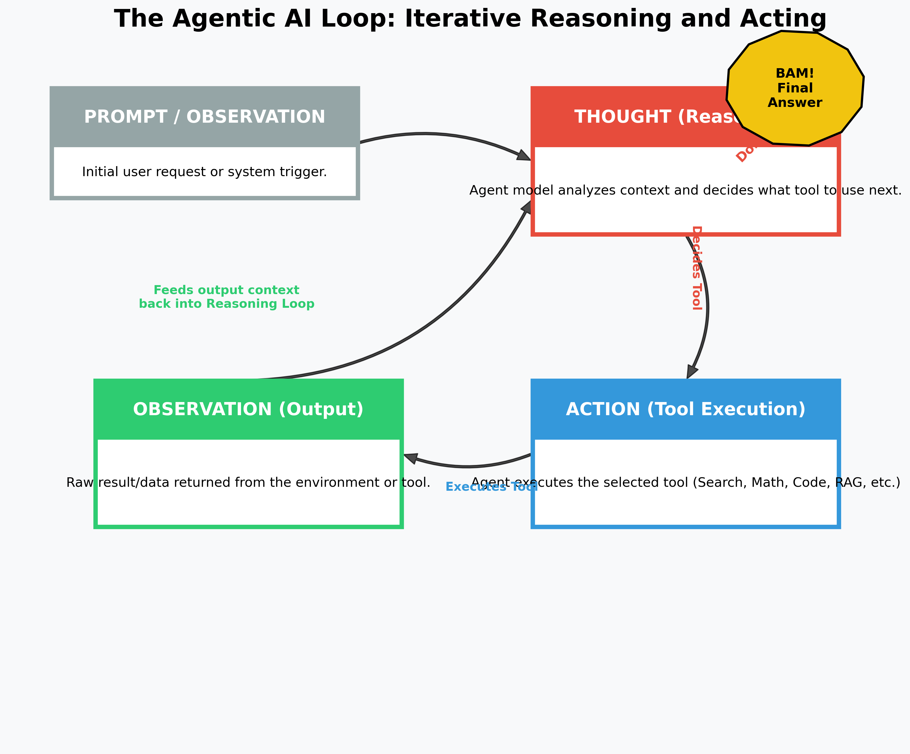

# Agentic AI & Advanced Topics

**Table of Contents:**

- [Topic 1: The Agentic AI Loop (ReAct Framework)](#topic-1-the-agentic-ai-loop-react-framework)
  - [The Core Components of the Loop](#the-core-components-of-the-loop)
  - [Closing the Loop](#closing-the-loop)

---

Agentic AI represents a massive shift from "passive" LLMs (which just answer questions based on their static training data) to "active" agents that can reason about a problem and autonomously use external tools to solve it. 

The most standard and fundamental framework for building Agentic AI is **ReAct (Reasoning + Acting)**. This framework forces the LLM to explicitly "think out loud" before it takes an action, creating a continuous, self-correcting loop of reasoning, tool execution, and observation.

### The Core Components of the Loop

1. **PROMPT (The Trigger):** The cycle begins with an initial user prompt (e.g., *"What is the weather in Tokyo today, and how does it compare to the historical average?"*).
2. **THOUGHT (Reasoning):** The LLM acts as the "brain." It analyzes the prompt and realizes it cannot answer this reliably from its training data. It explicitly writes out its reasoning: *"I need to find the current weather in Tokyo first. I should use the Weather Search tool."*
3. **ACTION (Tool Execution):** The agent halts its text generation and triggers an external tool (a Python function, a web search API, a SQL query, etc.) based on its Thought. It calls: `weather_search(location="Tokyo")`.
4. **OBSERVATION (Output):** The tool executes in the real environment and returns raw data (e.g., `{"temp": "75F", "condition": "Sunny"}`). 

### Closing the Loop
The magic of ReAct is that it is iterative. The data from the **Observation** is appended to the chat history and fed directly back into the LLM as new context. 

The LLM reads this new context and starts a new **THOUGHT**: *"Okay, the current weather is 75F and Sunny. Now, I need to find the historical average for Tokyo in this month. I will use the Web Search tool."* 

This cycle of **Thought $\rightarrow$ Action $\rightarrow$ Observation** repeats continuously. The agent keeps looping and pulling in new data until its reasoning determines it finally has all the pieces required to answer the original prompt. At that point, it breaks the loop and generates the final answer. **BAM!**
