# Machine Learning & Deep Learning Placement Master Notes


**Table of Contents:**

- [Part 1: Linear Regression & Regularization](#part-1-linear-regression--regularization)
  - [1. Core Concept of Linear Regression](#1-core-concept-of-linear-regression)
  - [2. How We Train Linear Regression (Optimization Methods)](#2-how-we-train-linear-regression-optimization-methods)
  - [2.6 Mathematical Derivation of the Gradient (Optional but highly recommended)](#26-mathematical-derivation-of-the-gradient-optional-but-highly-recommended)
  - [3. The 5 Core Assumptions (L.I.N.E. + M)](#3-the-5-core-assumptions-line--m)
  - [4. Regularization: Ridge (L2) vs. Lasso (L1)](#4-regularization-ridge-l2-vs-lasso-l1)
  - [5. Regression Evaluation Metrics](#5-regression-evaluation-metrics)
  - [6. Linear Regression Interview Cheatsheet](#6-linear-regression-interview-cheatsheet)
- [Part 1.5: Data Transformations & Feature Scaling](#part-15-data-transformations--feature-scaling)
  - [1. Feature Scaling (Changes the Range, NOT the Shape)](#1-feature-scaling-changes-the-range-not-the-shape)
  - [2. Distribution Transformations (Changes the Shape)](#2-distribution-transformations-changes-the-shape)
  - [3. Non-Linear Transformations](#3-non-linear-transformations)
- [Part 2: Logistic Regression (Classification Baseline)](#part-2-logistic-regression-classification-baseline)
  - [1. The Core Mathematical Intuition](#1-the-core-mathematical-intuition)
  - [2. The Cost Function (Log-Loss / Cross-Entropy)](#2-the-cost-function-log-loss--cross-entropy)
  - [2.5 How We Train Logistic Regression (Gradient Descent Example)](#25-how-we-train-logistic-regression-gradient-descent-example)
  - [2.6 Mathematical Derivation of Log-Loss Gradient (Optional)](#26-mathematical-derivation-of-log-loss-gradient-optional)
  - [3. The 4 Core Assumptions](#3-the-4-core-assumptions)
  - [4. Thresholding & Business Context](#4-thresholding--business-context)
  - [5. Multiclass Classification & The Softmax Function](#5-multiclass-classification--the-softmax-function)
- [Part 3: Classification Evaluation Metrics](#part-3-classification-evaluation-metrics)
  - [1. The Confusion Matrix](#1-the-confusion-matrix)
  - [2. Core Metrics](#2-core-metrics)
  - [3. ROC Curve & PR Curve](#3-roc-curve--pr-curve)
  - [4. Classification & Logistic Regression Interview Cheatsheet](#4-classification--logistic-regression-interview-cheatsheet)
  - [5. Interview Trap: R-Squared ($R^2$) Score](#5-interview-trap-r-squared-r2-score)
- [Part 4: Support Vector Machines (SVM)](#part-4-support-vector-machines-svm)
  - [1. The Geometry & Math of the Margin](#1-the-geometry--math-of-the-margin)
  - [2. The Main Idea: Maximal Margin & Soft Margins (The Mice Analogy)](#2-the-main-idea-maximal-margin--soft-margins-the-mice-analogy)
  - [3. The Polynomial Kernel (The Drug Dosage Analogy)](#3-the-polynomial-kernel-the-drug-dosage-analogy)
  - [4. The Radial Basis Function (RBF) Kernel](#4-the-radial-basis-function-rbf-kernel)
  - [5. Support Vector Regression (SVR): Flipping the Goal](#5-support-vector-regression-svr-flipping-the-goal)
  - [6. Placement Prep: SVMs in the Real World](#6-placement-prep-svms-in-the-real-world)
- [Part 5: Decision Trees (Classification)](#part-5-decision-trees-classification)
  - [1. The Core Intuition: Slicing the Space](#1-the-core-intuition-slicing-the-space)
  - [2. The Math of the Split: Gini Impurity](#2-the-math-of-the-split-gini-impurity)
  - [3. The Overfitting Trap & Pruning](#3-the-overfitting-trap--pruning)
  - [4. Visualizing the Tree & Pruning in Python](#4-visualizing-the-tree--pruning-in-python)
  - [5. Placement Prep: Top Decision Tree Interview Questions & Must-Knows](#5-placement-prep-top-decision-tree-interview-questions--must-knows)
  - [6. Solving a Decision Tree Split "By Hand" (Categorical)](#6-solving-a-decision-tree-split-by-hand-categorical)
  - [7. Decision Tree Regression](#7-decision-tree-regression)
  - [8. Ultimate Decision Tree Interview & OA Question Bank](#8-ultimate-decision-tree-interview--oa-question-bank)
- [Part 6: Ensemble Learning](#part-6-ensemble-learning)
  - [1. Voting Classifiers](#1-voting-classifiers)
  - [2. Visualizing Voting Classifiers in Python](#2-visualizing-voting-classifiers-in-python)
  - [3. Why Ensembles Work: The Law of Large Numbers](#3-why-ensembles-work-the-law-of-large-numbers)
  - [4. Bagging and Pasting](#4-bagging-and-pasting)
  - [5. Visualizing Bagging & OOB Evaluation in Python](#5-visualizing-bagging--oob-evaluation-in-python)
  - [6. Placement Prep: Voting Classifiers & Bagging (Flashcards)](#6-placement-prep-voting-classifiers--bagging-flashcards)
  - [7. Random Forests](#7-random-forests)
  - [8. AdaBoost (Adaptive Boosting)](#8-adaboost-adaptive-boosting)
  - [9. Solving AdaBoost "By Hand" (Step-by-Step Example)](#9-solving-adaboost-by-hand-step-by-step-example)
  - [6. Gradient Boosting (GBM)](#6-gradient-boosting-gbm)
  - [7. The Titans of Tabular Data: XGBoost & LightGBM](#7-the-titans-of-tabular-data-xgboost--lightgbm)
- [Part 7: Principal Component Analysis (PCA)](#part-7-principal-component-analysis-pca)
  - [1. The Engine of PCA: Singular Value Decomposition (SVD)](#1-the-engine-of-pca-singular-value-decomposition-svd)
  - [2. Kernel PCA (kPCA) and The Kernel Trick](#2-kernel-pca-kpca-and-the-kernel-trick)
  - [3. The Reversal Problem: Pre-Image Error](#3-the-reversal-problem-pre-image-error)
  - [4. Placement Prep: PCA Flashcards](#4-placement-prep-pca-flashcards)
  - [5. Locally Linear Embedding (LLE)](#5-locally-linear-embedding-lle)
- [Part 8: Unsupervised Learning — Clustering](#part-8-unsupervised-learning--clustering)
  - [1. The K-Means Algorithm (Lloyd's Algorithm)](#1-the-k-means-algorithm-lloyds-algorithm)
  - [2. The Objective Function: Inertia (WCSS)](#2-the-objective-function-inertia-wcss)
  - [3. Finding the Optimal *k* (Hyperparameter Tuning)](#3-finding-the-optimal-k-hyperparameter-tuning)
  - [4. The Three Fatal Flaws of K-Means (Interview Gold)](#4-the-three-fatal-flaws-of-k-means-interview-gold)
  - [5. Placement Prep: K-Means Flashcards](#5-placement-prep-k-means-flashcards)
  - [2. DBSCAN (Density-Based Spatial Clustering of Applications with Noise)](#2-dbscan-density-based-spatial-clustering-of-applications-with-noise)
- [Deep Learning Part 1: Multi-Layer Perceptrons (MLPs) & Non-Linearity](#deep-learning-part-1-multi-layer-perceptrons-mlps--non-linearity)
  - [1. The Architecture of an MLP](#1-the-architecture-of-an-mlp)
  - [2. The Secret Sauce: Activation Functions](#2-the-secret-sauce-activation-functions)
  - [3. Placement Prep: MLP Flashcards](#3-placement-prep-mlp-flashcards)
- [Part 2: How Neural Networks Learn (Forward & Backpropagation)](#part-2-how-neural-networks-learn-forward--backpropagation)
  - [1. Forward Propagation (Making the Guess)](#1-forward-propagation-making-the-guess)
  - [2. The Loss Function (Calculating the Error)](#2-the-loss-function-calculating-the-error)
  - [3. Backpropagation (The Engine of Learning)](#3-backpropagation-the-engine-of-learning)
  - [4. Gradient Descent (The Weight Update)](#4-gradient-descent-the-weight-update)
  - [5. Placement Prep: Forward & Backprop Flashcards](#5-placement-prep-forward--backprop-flashcards)
- [Part 3: The Engine of Learning — Optimizers](#part-3-the-engine-of-learning--optimizers)
  - [1. The Flaw of SGD: Pathological Curvature](#1-the-flaw-of-sgd-pathological-curvature)
  - [2. SGD with Momentum](#2-sgd-with-momentum)
  - [3. AdaGrad (Adaptive Gradient Algorithm)](#3-adagrad-adaptive-gradient-algorithm)
  - [4. RMSProp (Root Mean Square Propagation)](#4-rmsprop-root-mean-square-propagation)
  - [5. Adam (Adaptive Moment Estimation)](#5-adam-adaptive-moment-estimation)
  - [6. Placement Prep: Optimizers Flashcards](#6-placement-prep-optimizers-flashcards)
- [Part 4: Regularization (Preventing Memorization)](#part-4-regularization-preventing-memorization)
  - [1. Mathematical Weight Penalties (L1 and L2)](#1-mathematical-weight-penalties-l1-and-l2)
  - [2. Architectural Regularization Techniques](#2-architectural-regularization-techniques)
  - [3. Placement Prep: Regularization Flashcards](#3-placement-prep-regularization-flashcards)
- [Part 5: Computer Vision — Convolutional Neural Networks (CNNs)](#part-5-computer-vision--convolutional-neural-networks-cnns)
  - [Topic 1: The Convolution Operation (Kernels & Feature Maps)](#topic-1-the-convolution-operation-kernels--feature-maps)
  - [Topic 1 Placement Prep: Convolution Flashcards](#topic-1-placement-prep-convolution-flashcards)
  - [Topic 2: Padding & Stride (Controlling Dimensions)](#topic-2-padding--stride-controlling-dimensions)
  - [Topic 2 Placement Prep: Padding & Stride Flashcards](#topic-2-placement-prep-padding--stride-flashcards)
  - [Topic 2 Placement Prep: Advanced Padding & Stride Flashcards](#topic-2-placement-prep-advanced-padding--stride-flashcards)
  - [Topic 2 Placement Prep: Senior-Level Padding & Stride Flashcards](#topic-2-placement-prep-senior-level-padding--stride-flashcards)
  - [Topic 3: Pooling Layers (Downsampling, Invariance, & Receptive Fields)](#topic-3-pooling-layers-downsampling-invariance--receptive-fields)
  - [Topic 3 Placement Prep: Senior-Level Pooling Flashcards](#topic-3-placement-prep-senior-level-pooling-flashcards)
- [Topic 4: The Classification Head & Dimensionality Manipulation](#topic-4-the-classification-head--dimensionality-manipulation)
  - [Topic 4 Placement Prep: Elite-Level Classification Head Flashcards](#topic-4-placement-prep-elite-level-classification-head-flashcards)
- [Topic 5: The Math of CNN Backpropagation](#topic-5-the-math-of-cnn-backpropagation)
  - [Topic 5 Placement Prep: Elite Backprop Flashcards](#topic-5-placement-prep-elite-backprop-flashcards)
- [Topic 6: Complete CNN End-to-End Math Walkthrough](#topic-6-complete-cnn-end-to-end-math-walkthrough)
  - [Part 1: The Forward Pass](#part-1-the-forward-pass)
  - [Part 2: The Backward Pass](#part-2-the-backward-pass)
- [Topic 7: Advanced Architectural Blocks (Modern CNNs)](#topic-7-advanced-architectural-blocks-modern-cnns)
  - [1. Residual Connections (ResNet)](#1-residual-connections-resnet)
  - [2. Depthwise Separable Convolutions (MobileNet)](#2-depthwise-separable-convolutions-mobilenet)
  - [3. Inception Modules (GoogLeNet)](#3-inception-modules-googlenet)
- [Topic 8: Receptive Field Calculation](#topic-8-receptive-field-calculation)
- [Topic 9: Spatial Batch Normalization (BatchNorm2d)](#topic-9-spatial-batch-normalization-batchnorm2d)
- [Topic 10: CNN-Specific Regularization](#topic-10-cnn-specific-regularization)
  - [1. Spatial Dropout](#1-spatial-dropout)
  - [2. Modern Augmentation (Mixup & CutMix)](#2-modern-augmentation-mixup--cutmix)
  - [Placement Prep: Elite Architecture Flashcards](#placement-prep-elite-architecture-flashcards)
- [Part 6: Sequential Data — Recurrent Neural Networks (RNNs)](#part-6-sequential-data--recurrent-neural-networks-rnns)
  - [Topic 1: The Vanilla RNN Architecture & The Hidden State](#topic-1-the-vanilla-rnn-architecture--the-hidden-state)
  - [Topic 2: The Math of the Forward Pass](#topic-2-the-math-of-the-forward-pass)
  - [Topic 3: Backpropagation Through Time (BPTT) & The Fatal Flaw](#topic-3-backpropagation-through-time-bptt--the-fatal-flaw)
  - [Topic 3 Placement Prep: Elite RNN Flashcards](#topic-3-placement-prep-elite-rnn-flashcards)
- [Topic 4: Complete End-to-End RNN Math Walkthrough (BPTT)](#topic-4-complete-end-to-end-rnn-math-walkthrough-bptt)
  - [1. The Forward Pass (Unrolling Through Time)](#1-the-forward-pass-unrolling-through-time)
  - [2. Backpropagation Through Time (BPTT)](#2-backpropagation-through-time-bptt)
  - [Topic 4 Placement Prep: BPTT Flashcards](#topic-4-placement-prep-bptt-flashcards)
- [Topic 5: Different Types of RNN Architectures](#topic-5-different-types-of-rnn-architectures)
- [Topic 6: Bidirectional RNNs (BiRNN)](#topic-6-bidirectional-rnns-birnn)
- [Topic 5: Long Short-Term Memory (LSTMs) & The Cure for Amnesia](#topic-5-long-short-term-memory-lstms--the-cure-for-amnesia)
  - [1. The Two Memory States](#1-the-two-memory-states)
  - [2. The Three Mathematical Gates](#2-the-three-mathematical-gates)
  - [4. Why LSTMs Fix the Vanishing Gradient](#4-why-lstms-fix-the-vanishing-gradient)
  - [Topic 5 Placement Prep: Elite LSTM Flashcards](#topic-5-placement-prep-elite-lstm-flashcards)
- [Topic 6: End-to-End LSTM Math Walkthrough (StatQuest Style)](#topic-6-end-to-end-lstm-math-walkthrough-statquest-style)
  - [Stage 1: The Forget Gate (What % of long-term memory is remembered?)](#stage-1-the-forget-gate-what--of-long-term-memory-is-remembered)
  - [Stage 2: The Input Gate (Creating and Adding Potential Memory)](#stage-2-the-input-gate-creating-and-adding-potential-memory)
  - [Stage 3: The Output Gate (Updating the Short-Term Memory)](#stage-3-the-output-gate-updating-the-short-term-memory)
- [Topic 7: The Backward Pass (Calculus Trace)](#topic-7-the-backward-pass-calculus-trace)
- [Topic 8: Modern LSTM Architectural Variants](#topic-8-modern-lstm-architectural-variants)
  - [1. Bidirectional LSTMs (BiLSTMs)](#1-bidirectional-lstms-bilstms)
  - [2. Peephole Connections](#2-peephole-connections)
  - [Placement Prep: Elite LSTM Flashcards](#placement-prep-elite-lstm-flashcards)
- [Topic 9: The Fall of the LSTM (Why we needed Transformers)](#topic-9-the-fall-of-the-lstm-why-we-needed-transformers)
  - [1. The Sequential Bottleneck (No Parallelization)](#1-the-sequential-bottleneck-no-parallelization)
  - [2. The Information Bottleneck (Fixed-Length Vector)](#2-the-information-bottleneck-fixed-length-vector)

---


## Part 1: Linear Regression & Regularization

### 1. Core Concept of Linear Regression
*   **Goal:** Predict a continuous target variable (*y*) based on one or more input features (*X*) by fitting a "best-fit" straight line.
*   **Equation:** $y = \beta_0 + \beta_1X_1 + \beta_2X_2 + ... + \epsilon$
    *   $\beta_0$: Intercept (where the line crosses the y-axis)
    *   $\beta_i$: Coefficients (weights). *Interpretation: A 1-unit increase in $X_i$ changes *y* by $\beta_i$, assuming all else is held constant.*
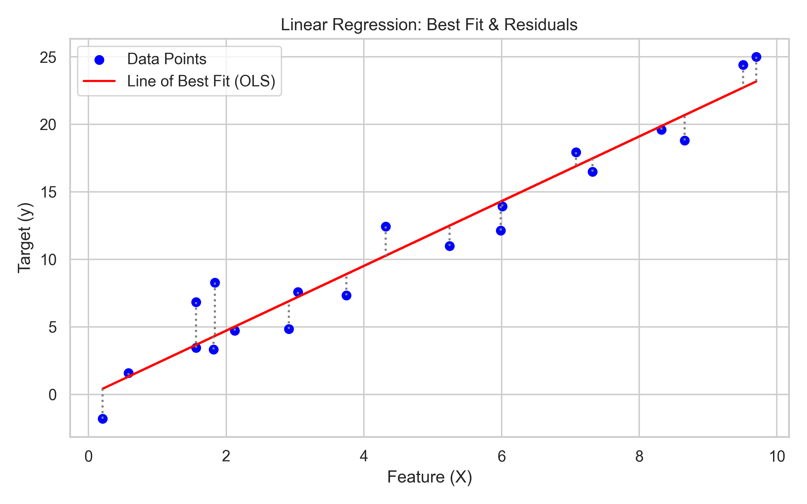
*   **Algorithm (Optimization):**
    *   **Ordinary Least Squares (OLS):** Finds the exact best line mathematically by minimizing the sum of squared residuals. Good for small datasets.
    *   **Gradient Descent:** Iteratively updates coefficients ($\beta$) to minimize the loss using a learning rate. Crucial for large datasets.
*   **Loss Function (MSE Cost Function):** $J(\beta) = \frac{1}{n} \sum (y_i - \hat{y}_i)^2$. 
    *   *Why do we square the errors?* 1) It heavily penalizes larger errors. 2) It mathematically ensures the cost function is differentiable and strictly convex (a perfect bowl shape), guaranteeing Gradient Descent finds the single global minimum.
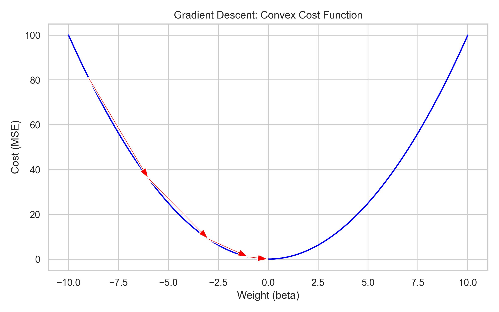

### 2. How We Train Linear Regression (Optimization Methods)
To find the best weights ($\beta$), we have two primary methods: The Normal Equation and Gradient Descent.

**A. The Normal Equation (The Analytical Way)**
*   **Formula:** $\beta = (X^T X)^{-1} X^T y$
*   **Pros:** No need to choose a learning rate ($\alpha$), no iterations, gives the exact mathematical global minimum.
*   **Cons:** Matrix inversion $(X^T X)^{-1}$ is computationally expensive (roughly $O(n^3)$).

**B. Gradient Descent (The Iterative Way)**
*   **Batch Gradient Descent:** Uses the **entire training dataset** for one step. Slow on large data, smooth convergence.
*   **Stochastic Gradient Descent (SGD):** Uses **exactly one random data point** per step. Extremely fast, jumps out of local minima, noisy convergence.
*   **Mini-Batch Gradient Descent:** Uses a **small batch** (e.g., 32, 64) per step. Industry standard. Fast, stable, hardware-optimized.

**C. Hand-Worked Example: Gradient Descent in Action**
*   **Dataset:** $X = [1, 2, 3]$, $y = [2, 4, 6]$ *(True rule: $y = 2X$)*
*   **Step 1 (Initialize):** Guess $\beta_1 = 1$, $\beta_0 = 0$. Model: $\hat{y} = 1X$.
*   **Step 2 (Predict):** Predictions $\hat{y} = [1, 2, 3]$.
*   **Step 3 (Calculate Error):** Errors $(y - \hat{y}) = [1, 2, 3]$. MSE Loss = $(1^2 + 2^2 + 3^2) / 3 = 14 / 3 = 4.67$.
*   **Step 4 (Find the Gradient):** Gradient $= \frac{-2}{n} \sum X_i (y_i - \hat{y}_i)$. 
    *   $= \frac{-2}{3} \times [ (1\times1) + (2\times2) + (3\times3) ] = -9.33$
*   **Step 5 (Update Weight):** Learning rate $\alpha = 0.05$.
    *   $\text{New } \beta_1 = 1 - (0.05 \times -9.33) = 1 + 0.466 = 1.466$ *(Closer to 2.0!)*

### 2.6 Mathematical Derivation of the Gradient (Optional but highly recommended)
Walking through the calculus step-by-step builds an incredibly strong foundation for understanding how Gradient Descent actually learns.

**The Setup:**
* **Hypothesis (Prediction):** $h_\theta(x) = \theta^T x$
* **Cost Function (MSE):**
```math
J(\theta) = \frac{1}{2m} \sum_{i=1}^{m} (h_\theta(x^{(i)}) - y^{(i)})^2
```
*Explanation of the Cost Function:* We use *m* to represent the total number of training examples. We add a $\frac{1}{2}$ to the formula purely as a mathematical convenience—when we take the derivative, the exponent 2 will drop down and cancel out the $\frac{1}{2}$, making the final math cleaner without changing where the global minimum is located.

**Step 1: Set up the Partial Derivative**
Our goal is to find how a tiny change in a single specific weight, $\theta_j$, impacts the overall error. We do this by taking the partial derivative of $J(\theta)$ with respect to $\theta_j$.
```math
\frac{\partial}{\partial \theta_j} J(\theta) = \frac{\partial}{\partial \theta_j} \left[ \frac{1}{2m} \sum_{i=1}^{m} (h_\theta(x^{(i)}) - y^{(i)})^2 \right]
```
**Step 2: Apply the Power Rule and Chain Rule**
In calculus, the Power Rule tells us to bring the exponent 2 down to the front. The Chain Rule tells us we then have to multiply the whole thing by the derivative of whatever was *inside* the parentheses.
```math
\frac{\partial}{\partial \theta_j} J(\theta) = \frac{1}{m} \sum_{i=1}^{m} (h_\theta(x^{(i)}) - y^{(i)}) \cdot \frac{\partial}{\partial \theta_j} (h_\theta(x^{(i)}) - y^{(i)})
```
*Explanation:* Notice how the $\frac{1}{2}$ and the 2 canceled each other out, leaving just $\frac{1}{m}$. Now, we just need to solve that lingering derivative on the far right.

**Step 3: Differentiate the Inside**
Remember that our hypothesis $h_\theta(x)$ is just a sum of all weights multiplied by their features: $\theta_0x_0 + \theta_1x_1 + \dots + \theta_jx_j$. Because we are taking a *partial* derivative with respect to just $\theta_j$, every other weight acts like a constant (a flat number) and turns to 0. The true label *y* is also a constant, so it turns to 0. The derivative of $\theta_jx_j$ with respect to $\theta_j$ is simply the feature $x_j$.
```math
\frac{\partial}{\partial \theta_j} (h_\theta(x^{(i)}) - y^{(i)}) = x_j^{(i)}
```
**Step 4: The Final Gradient**
We substitute $x_j^{(i)}$ back into our equation from Step 2 to get the final gradient.
```math
\frac{\partial}{\partial \theta_j} J(\theta) = \frac{1}{m} \sum_{i=1}^{m} (h_\theta(x^{(i)}) - y^{(i)}) x_j^{(i)}
```
### 3. The 5 Core Assumptions (L.I.N.E. + M)
1.  **Linearity:** Relationship between *X* and *y* must be linear. *(Fix: Polynomial features or log transform).*
2.  **Independence:** Observations must be independent (no autocorrelation).
3.  **Normality of Residuals:** Errors ($\epsilon$) should be normally distributed.
4.  **Equal Variance (Homoscedasticity):** Residuals should have a constant variance, not fanning out like a cone. *(Fix: Log transform target *y*).*
    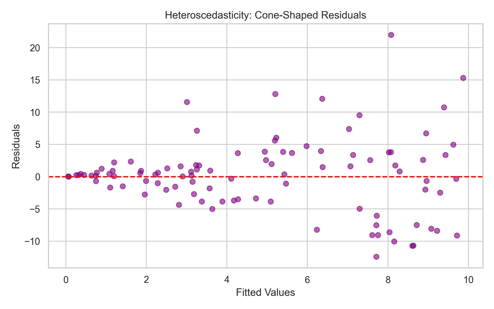
5.  **No Multicollinearity:** Features should not be highly correlated. *(Fix: Drop redundant features, PCA, or L1/L2 Regularization).*

### 4. Regularization: Ridge (L2) vs. Lasso (L1)
*Used when the model overfits, or when you have multicollinearity.*
*   **Bias-Variance Tradeoff:** By intentionally adding a little bit of *bias* (penalizing the weights), we can massively reduce the model's *variance* (overfitting to training data).
*   **Ridge Regression (L2 Penalty):** Minimizes $MSE + \lambda \sum \beta_i^2$. Shrinks coefficients close to zero, but **never exactly zero**. Good for multicollinearity.
*   **Lasso Regression (L1 Penalty):** Minimizes $MSE + \lambda \sum |\beta_i|$. Shrinks coefficients to **exactly zero**. Acts as built-in **Feature Selection**.
*   **Elastic Net:** Combines L1 and L2 penalties. 

### 5. Regression Evaluation Metrics
*   **MSE (Mean Squared Error):** Average squared errors. Heavily penalizes outliers.
*   **RMSE (Root Mean Squared Error):** $\sqrt{MSE}$. Brings error back to original units.
*   **MAE (Mean Absolute Error):** Average absolute errors. **Robust to outliers**.
*   **$R^2$ (Coefficient of Determination):** Measures the proportion of variance in the dependent variable (*y*) that is predictable from the independent variables (*X*). **Range:** $(-\infty, 1]$.
    *   *Formula:* $R^2 = 1 - \frac{\text{Sum of Squared Residuals (SSR)}}{\text{Total Sum of Squares (SST)}}$
    *   *Flaw:* It assumes every independent variable in the model helps to explain variation in the dependent variable. It mathematically **never decreases** as you add more features, leading to overfitting if relied upon blindly.
*   **Adjusted $R^2$:** 
    *   *Formula:* $1 - [\frac{(1 - R^2)(n - 1)}{n - k - 1}]$ (where *n* is sample size, *k* is number of features).
    *   *Why we need it:* It penalizes the model for adding features that do not actually improve predictions. It will **decrease** if a useless feature is added. **Always use Adjusted $R^2$ when evaluating multiple linear regression.**

### 6. Linear Regression Interview Cheatsheet
*   **Q: When does Linear Regression fail?**
    *   A: When relationships are non-linear, when outliers drag the OLS line away (because OLS squares errors, outliers exert massive leverage), or when features are highly correlated.
*   **Q: How do you handle outliers in Linear Regression?**
    *   A: Remove them, cap/clip them, use MAE to evaluate, or switch to robust models.
*   **Q: What is the difference between R-squared and Adjusted R-squared?**
    *   A: R-squared mathematically always increases as you add more features. Adjusted R-squared penalizes you for adding features that do not actually improve the model.
*   **Q: Does Linear Regression require feature scaling?**
    *   A: If using Ordinary Least Squares (OLS), no. However, if using **Gradient Descent**, **Ridge**, or **Lasso**, then **YES**. Feature scaling is required to ensure gradient descent converges efficiently and regularization penalties are applied equally.
*   **Q: How do you handle categorical variables?**
    *   A: Use One-Hot Encoding. *Interview Trap:* Always drop one of the newly created columns to avoid the "Dummy Variable Trap" (perfect multicollinearity).

---

## Part 1.5: Data Transformations & Feature Scaling
*(Often used to fix regression assumptions or prepare data for gradient descent)*

### 1. Feature Scaling (Changes the Range, NOT the Shape)
These techniques do not change the underlying distribution of your data; they just put all features on the same numerical playing field so the algorithm doesn't get biased by large numbers.
*   **Standardization (Z-Score / StandardScaler):** Centers data so the mean is 0 and the standard deviation is 1.
    *   *When to use:* This is your default choice for algorithms that use Gradient Descent (Logistic Regression, Neural Networks) or calculate distances between points (KNN, SVM). It is more robust to outliers than Min-Max scaling.
*   **Normalization (MinMaxScaler):** Squishes all values to fit strictly between 0 and 1.
    *   *When to use:* When your algorithm requires a strict bounded range (e.g., image pixels from $0-255$ scaled to $0-1$).
    *   *Interview Warning:* It is extremely sensitive to outliers! A single massive outlier will crush all your normal data points down to $0.0001$.

### 2. Distribution Transformations (Changes the Shape)
These techniques fundamentally alter the physical shape of the data curve.
*   **Log Transformation ($\log(x)$ or $\log(x+1)$):** Heavily compresses massive numbers while slightly spreading out smaller numbers.
    *   *When to use:* To fix **Right-Skewed data** (e.g., Income, House Prices, where a few massive values drag the tail to the right). To fix **Heteroscedasticity** (the expanding "cone" of errors in linear models) by applying it to the target variable *y*.
*   **Square Root Transformation ($\sqrt{x}$):** A milder version of the log transform.
    *   *When to use:* Typically used for Count Data (e.g., number of customers arriving per hour, number of defects) to stabilize variance.
*   **Box-Cox & Yeo-Johnson:** Advanced power transformations that use machine learning to automatically find the mathematically optimal exponent to make your data perfectly Normal (Gaussian).
    *   *When to use:* When your algorithm strictly assumes normality (like Gaussian Naive Bayes or Linear Discriminant Analysis).
    *   *Interview Gotcha:* Box-Cox only works on strictly positive numbers ($> 0$). If your data contains zeros or negatives, you must use Yeo-Johnson.

### 3. Non-Linear Transformations
*   **Polynomial Features ($X^2, X^3$):** Squares or cubes your existing features to create brand new columns.
    *   *When to use:* When the relationship between *X* and *y* is a curve, violating the Linearity assumption. It allows a linear algorithm to draw a curved line through the data.

---

## Part 2: Logistic Regression (Classification Baseline)

### 1. The Core Mathematical Intuition
**Goal:** Predict the probability that an instance belongs to a specific class (binary classification: 0 or 1).

**A. Why Linear Regression Fails for Classification**
1. **Outlier Sensitivity:** A straight line shifts drastically if you introduce an extreme outlier, changing your 0.5 decision boundary and ruining predictions.
2. **Meaningless Bounds:** Linear regression predicts continuous values that can fall below 0 or exceed 1 (meaningless probabilities).

**B. Odds vs. Probability & The Logit Function**
*   **Probability (*p*):** Bound between 0 and 1.
*   **Odds ($\frac{p}{1-p}$):** Bound between 0 and $\infty$.
*   **The Logit Function (Log-Odds):** Taking the natural log of the odds stretches the bounds to $[-\infty, \infty]$. This allows us to map it to a linear equation:
    *   $\ln(\frac{p}{1-p}) = \beta_0 + \beta_1X$
    *   *Interpretation:* A 1-unit increase in *X* changes the **log-odds** of the outcome by $\beta_1$ (not the probability directly).

**C. The Sigmoid Function**
Working backward (taking the inverse of the logit) gives us the Sigmoid function. To convert log-odds back into a usable probability, we pass the linear equation ($z = \beta_0 + \beta_1X$) through it:
*   **Formula:** $p = \frac{1}{1 + e^{-z}}$
*   *Effect:* It squishes any linear output into an S-curve strictly between 0 and 1.
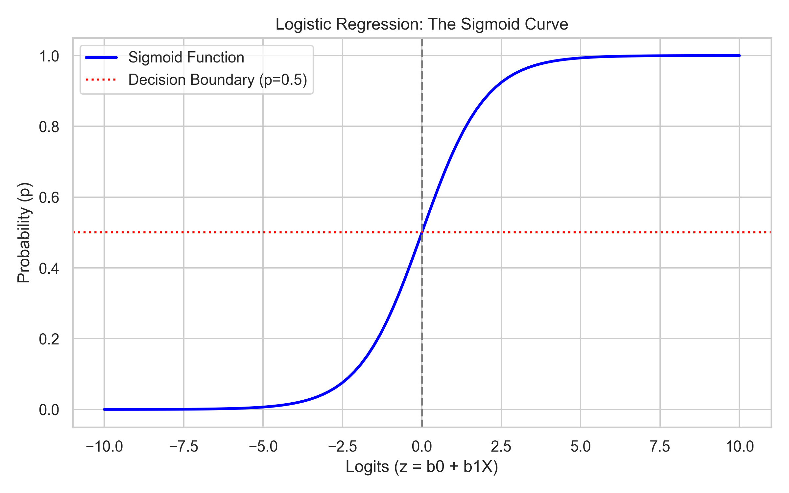

### 2. The Cost Function (Log-Loss / Cross-Entropy)
*Interviewers love to ask why we don't use MSE for Logistic Regression.*

*   **The Problem with MSE:** Plugging the non-linear Sigmoid function into the MSE formula results in a **non-convex** error landscape (wavy with local minima). Gradient Descent will get permanently stuck. It also suffers from the *vanishing gradient* problem when predictions are confidently wrong.
*   **Log-Loss (Cross-Entropy):** The correct cost function. It creates a strictly **convex** bowl shape, guaranteeing a global minimum.
    *   **Formula:** $J(\beta) = - \frac{1}{N} \sum \left[ y_i \log(\hat{y}_i) + (1 - y_i) \log(1 - \hat{y}_i) \right]$
    *   **Behavior:** It heavily penalizes models that are "confidently wrong" (e.g., predicting 0.99 for a target that is actually 0) because the logarithmic penalty shoots to infinity.
*   **MLE Connection:** Log-Loss is mathematically derived from Maximum Likelihood Estimation (specifically, taking the Negative Log-Likelihood of a Bernoulli distribution).
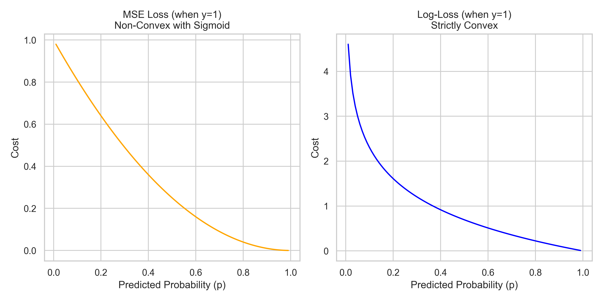

### 2.5 How We Train Logistic Regression (Gradient Descent Example)
*The mathematical magic: Even though Log-Loss looks terrifying, its derivative simplifies to the EXACT same gradient formula as Linear Regression!*

Let's do a 1-variable hand-worked example: predicting class *y* from feature *X*.
*   **Dataset:** $X = [1, 2]$, $y = [0, 1]$ *(Higher *X* means class 1).*
*   **Step 1 (Initialize):** Let's guess the weight $\beta_1 = 0$ and intercept $\beta_0 = 0$.
*   **Step 2 (Linear Output):** Calculate $z = \beta_0 + \beta_1X$. For both data points, $z = 0$.
*   **Step 3 (Sigmoid Probabilities):** Pass *z* through the Sigmoid function: $p = \frac{1}{1 + e^0} = \frac{1}{1+1} = 0.5$. Our predicted probabilities $\hat{y} = [0.5, 0.5]$.
*   **Step 4 (Find the Gradient):** The derivative of Log-Loss simplifies beautifully to: $\text{Gradient} = \frac{1}{n} \sum X_i (\hat{y}_i - y_i)$.
    *   Gradient for $\beta_1 = \frac{1}{2} \times [ 1(0.5 - 0) + 2(0.5 - 1) ]$
    *   $= \frac{1}{2} \times [ 0.5 - 1.0 ] = -0.25$
*   **Step 5 (Update Weight):** We move opposite to the gradient. Using learning rate $\alpha = 0.1$:
    *   $\text{New } \beta_1 = \text{Old } \beta_1 - (\alpha \times \text{Gradient})$
    *   $\text{New } \beta_1 = 0 - (0.1 \times -0.25) = 0.025$
*   **Result:** $\beta_1$ correctly increased to a positive number! Now, higher values of *X* will result in higher probabilities (closer to 1), moving perfectly in the right direction.

### 2.6 Mathematical Derivation of Log-Loss Gradient (Optional)
**The Setup:**
* **Hypothesis:** $h_\theta(x) = \sigma(\theta^T x) = \frac{1}{1 + e^{-\theta^T x}}$
* **Cost Function (Log-Loss):**
```math
J(\theta) = -\frac{1}{m} \sum_{i=1}^{m} \left[ y^{(i)} \log(h_\theta(x^{(i)})) + (1 - y^{(i)}) \log(1 - h_\theta(x^{(i)})) \right]
```
**Step 1: The Prerequisite Sigmoid Derivative**
Because the math gets messy, we first need to know the derivative of the Sigmoid function itself. A known property of the Sigmoid function $\sigma(z)$ is that its derivative is the function multiplied by one minus the function:
```math
\frac{\partial}{\partial z} \sigma(z) = \sigma(z)(1 - \sigma(z))
```
*   **Crucial Interview Fact:** What is the maximum possible value for the gradient of the Sigmoid function? **0.25**. At $z=0$, $\sigma(0)=0.5$, so the gradient is $0.5 \times (1-0.5) = 0.25$. This tiny maximum gradient is the primary cause of the *Vanishing Gradient Problem* in deep neural networks!

When we apply the Chain Rule to take the derivative of our hypothesis with respect to our specific weight $\theta_j$, we get the Sigmoid derivative multiplied by the feature $x_j$:
```math
\frac{\partial}{\partial \theta_j} h_\theta(x) = h_\theta(x)(1 - h_\theta(x)) x_j
```
**Step 2: Differentiate the Log Terms**
To make the algebra easier to see, let's ignore the summation and the $-\frac{1}{m}$ for a moment and just take the derivative of a single example's loss, which we will call *L*. In calculus, the derivative of $\log(x)$ is $\frac{1}{x}$. Applying the Chain Rule to both parts of the Log-Loss equation gives us:
```math
\frac{\partial L}{\partial \theta_j} = y \left( \frac{1}{h_\theta(x)} \right) \frac{\partial h_\theta(x)}{\partial \theta_j} + (1 - y) \left( \frac{1}{1 - h_\theta(x)} \right) (-1) \frac{\partial h_\theta(x)}{\partial \theta_j}
```
*Explanation:* The $(-1)$ in the second term is incredibly important. It comes from applying the Chain Rule to the $(1 - h_\theta(x))$ part inside the second log.

**Step 3: Factor and Find a Common Denominator**
Let's factor out the $\frac{\partial h_\theta(x)}{\partial \theta_j}$ term that is shared by both sides, and combine the fractions by finding a common denominator of $h_\theta(x)(1 - h_\theta(x))$.
```math
\frac{\partial L}{\partial \theta_j} = \left( \frac{y(1 - h_\theta(x)) - (1 - y)h_\theta(x)}{h_\theta(x)(1 - h_\theta(x))} \right) \frac{\partial h_\theta(x)}{\partial \theta_j}
```
If you expand the numerator ($y - y \cdot h_\theta(x) - h_\theta(x) + y \cdot h_\theta(x)$), the $y \cdot h_\theta(x)$ terms cancel out, leaving just:
```math
\frac{\partial L}{\partial \theta_j} = \left( \frac{y - h_\theta(x)}{h_\theta(x)(1 - h_\theta(x))} \right) \frac{\partial h_\theta(x)}{\partial \theta_j}
```
**Step 4: The Beautiful Cancellation**
Now, substitute the Sigmoid derivative we calculated in Step 1 back into the equation.
```math
\frac{\partial L}{\partial \theta_j} = \left( \frac{y - h_\theta(x)}{h_\theta(x)(1 - h_\theta(x))} \right) \left[ h_\theta(x)(1 - h_\theta(x)) x_j \right]
```
*Explanation:* Look closely! The denominator of our fraction is perfectly identical to the first half of the Sigmoid derivative. They completely cancel each other out. This reduces the massive equation down to:
```math
\frac{\partial L}{\partial \theta_j} = (y - h_\theta(x)) x_j
```
**Step 5: Final Assembly**
Finally, we bring back the summation and the $-\frac{1}{m}$ that we temporarily dropped from the very beginning.
```math
\frac{\partial}{\partial \theta_j} J(\theta) = -\frac{1}{m} \sum_{i=1}^{m} (y^{(i)} - h_\theta(x^{(i)})) x_j^{(i)}
```
To make this match our Linear Regression formula perfectly, we distribute the negative sign into the parentheses, which flips the *y* and the $h_\theta(x)$ around. This gives us the exact same gradient formula as Linear Regression:
```math
\frac{\partial}{\partial \theta_j} J(\theta) = \frac{1}{m} \sum_{i=1}^{m} (h_\theta(x^{(i)}) - y^{(i)}) x_j^{(i)}
```
### 3. The 4 Core Assumptions
Unlike Linear Regression's L.I.N.E., remember these for Logistic Regression:
1.  **Binary Outcome:** The target must be binary (for standard Logistic Regression).
2.  **Linearity of Log-Odds:** The features (*X*) must have a linear relationship with the *log-odds* of the target. *(Tested via Box-Tidwell test).*
3.  **No Multicollinearity:** Independent variables should not be highly correlated. *(Fix: Remove features, L1/L2 Regularization).*
4.  **Large Sample Size:** MLE needs more data to converge accurately compared to some algorithms like Naive Bayes or simple Decision Trees.

### 4. Thresholding & Business Context
*   **Default:** Classify as 1 if $p \ge 0.5$.
*   **When to Lower Threshold (e.g., to 0.3):** When missing a positive is dangerous/expensive (e.g., Cancer detection, Fraud). You are optimizing for **Recall**.
*   **When to Raise Threshold (e.g., to 0.8):** When false alarms are annoying/expensive (e.g., Spam filters). You are optimizing for **Precision**.

### 5. Multiclass Classification & The Softmax Function
*How to handle 3+ categories (e.g., Red, Green, Blue) instead of just binary 0 or 1:*
*   **One-vs-Rest (OvR):** Trains a separate binary classifier for each class (Red vs. Not Red, Green vs. Not Green) and chooses the one with the highest probability.
*   **Multinomial Logistic Regression (Softmax):** This is the true multi-class extension. Instead of using the Sigmoid function (which gives one probability for one class), it uses the **Softmax function**.
*   **The Softmax Formula:** $P(y=k) = \frac{e^{z_k}}{\sum_{j=1}^{K} e^{z_j}}$
    *   *How it works:* It takes the raw output scores (logits, *z*) for all classes, exponentiates them to make them positive, and then divides each by the sum of all exponentiated scores.
    *   *The Result:* It outputs a **Probability Distribution**. All class probabilities will be strictly between 0 and 1, and they will **sum up to exactly 1.0**. (e.g., [Red: 0.7, Green: 0.2, Blue: 0.1]).

---

## Part 3: Classification Evaluation Metrics

### 1. The Confusion Matrix
For a binary classification problem (e.g., 1 = Positive/Defect, 0 = Negative/Normal):
*   **True Positive (TP):** Predicted 1, actual 1. (Correct detection).
*   **True Negative (TN):** Predicted 0, actual 0. (Correct rejection).
*   **False Positive (FP) - "Type I Error":** Predicted 1, actual 0. (False alarm).
*   **False Negative (FN) - "Type II Error":** Predicted 0, actual 1. (Missed detection).
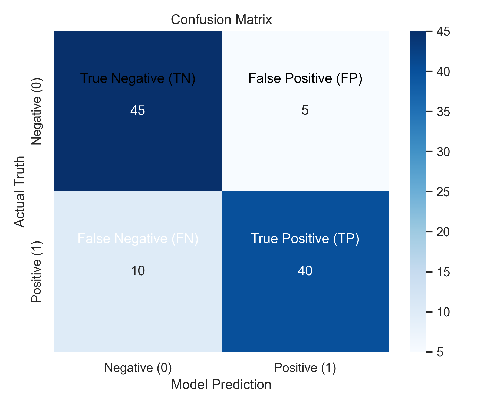

### 2. Core Metrics
*   **Accuracy:** $\frac{TP + TN}{TP + TN + FP + FN}$. 
    *   *Avoid when:* **Highly Imbalanced Datasets.** (e.g., a model that always predicts "Not Fraud" on a 99% legitimate dataset has 99% accuracy but is useless).
*   **Precision (Quality of Positives):** $\frac{TP}{TP + FP}$. 
    *   *Use case:* When **False Positives** are costly (e.g., Spam detection - don't want good emails in spam).
*   **Recall / Sensitivity (Quantity of Positives):** $\frac{TP}{TP + FN}$. 
    *   *Use case:* When **False Negatives** are costly (e.g., Cancer detection - better to false alarm than miss cancer).
*   **F1-Score:** $2 \times \frac{Precision \times Recall}{Precision + Recall}$. 
    *   *Use case:* The harmonic mean. Use when you need an equal balance between Precision and Recall.
*   **F-$\beta$ Score:** A generalized version of the F1-score where you can assign more weight to either Precision or Recall based on business needs.
    *   *Formula:* $(1 + \beta^2) \times \frac{Precision \times Recall}{(\beta^2 \times Precision) + Recall}$
    *   *How $\beta$ affects it:*
        *   $\beta = 1$: Weights Precision and Recall equally (This is exactly the F1-score).
        *   $\beta > 1$ (e.g., F2-score): **Weights Recall higher**. Use when False Negatives are worse than False Positives (e.g., Disease detection).
        *   $\beta < 1$ (e.g., F0.5-score): **Weights Precision higher**. Use when False Positives are worse than False Negatives (e.g., Spam filter).

### 3. ROC Curve & PR Curve
*   **ROC Curve (Receiver Operating Characteristic):** Plots True Positive Rate (Recall) vs. False Positive Rate ($\frac{FP}{FP + TN}$) across thresholds.
    *   **AUC (Area Under the Curve):** Scalar value [0, 1]. *Interview Definition:* "Probability that the model ranks a random positive example more highly than a random negative example."
    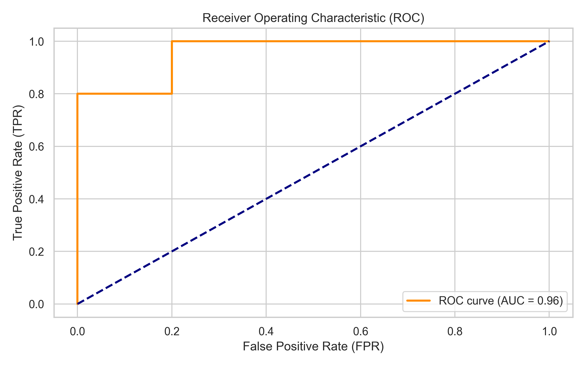
*   **Precision-Recall (PR) Curve:** Plots Precision vs. Recall. 
    *   **When to use over ROC?** Use PR Curve for **severe class imbalance**. ROC can be overly optimistic due to True Negatives diluting the FPR formula.

### 4. Classification & Logistic Regression Interview Cheatsheet
*   **Q: What is the difference between Type I and Type II errors?**
    *   A: Type I is a False Positive (False Alarm). Type II is a False Negative (Missed Detection).
*   **Q: My model has 99% accuracy on a fraud detection dataset, but catches 0 frauds. Why?**
    *   A: Accuracy is misleading on imbalanced datasets (majority class trap). Look at Recall to see how many frauds you actually caught.
*   **Q: How do you decide whether to optimize for Precision or Recall?**
    *   A: Look at business costs. If false alarms are expensive (e.g., permanent bans), optimize Precision. If missing events is dangerous (e.g., engine failure), optimize Recall.
*   **Q: What happens to Precision and Recall if we increase the decision threshold from 0.5 to 0.7?**
    *   A: The model becomes more conservative. **Precision increases** (fewer false alarms), but **Recall decreases** (we miss more actual Positives).
*   **Q: Why is it called Logistic *Regression* if it's used for Classification?**
    *   A: Because under the hood, it fits a linear regression line to the *log-odds* of the probability: $\log(\frac{P}{1-P}) = \beta_0 + \beta_1X$.
*   **Q: Does Logistic Regression require feature scaling?**
    *   A: Yes! Because it uses Gradient Descent for optimization and often includes L1/L2 regularization. Unscaled features will distort regularization and slow down convergence.
*   **Q: Is Logistic Regression a Linear or Non-Linear classifier?**
    *   A: It is a **Linear Classifier**. Even though the output is a non-linear S-curve (Sigmoid), the underlying *decision boundary* that separates the classes in the feature space is a straight line (or flat hyperplane).
*   **Q: What is the `C` parameter in scikit-learn's Logistic Regression?**
    *   A: It controls Regularization (which scikit-learn applies by default!). ***C* is the inverse of regularization strength ($\lambda$)**. Smaller *C* = stronger penalty = simpler model (less overfitting). Larger *C* = weaker penalty = fits training data more closely.
*   **Q: What is the maximum possible value for the gradient of the Sigmoid function $\sigma(z)$?**
    *   A: **0.25**. The derivative is $\sigma(z)(1-\sigma(z))$. At $z=0$, $\sigma(0)=0.5$, so the gradient is $0.5 \times 0.5 = 0.25$. This tiny maximum gradient is a primary cause of the *Vanishing Gradient Problem* in deep learning.

### 5. Interview Trap: R-Squared ($R^2$) Score
*(Note: $R^2$ is technically a **Regression** metric, not a Classification metric. However, it is highly likely to come up alongside classification metrics as a trick question during interviews, or disguised as McFadden's Pseudo-$R^2$ for Logistic Regression).*

The $R^2$ score (Coefficient of Determination) measures how much better your model is compared to a completely naive "baseline" model. 

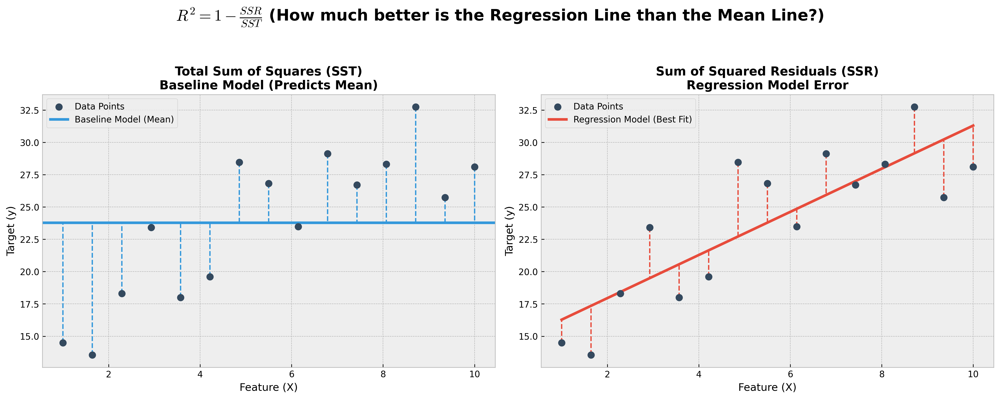

#### The Standard Formula (Using the Mean)
By default, the naive "baseline model" just predicts the **Mean** of the target variable for every single point (the blue line in the graph above).
$$ R^2 = 1 - \frac{\text{Sum of Squared Residuals (SSR)}}{\text{Total Sum of Squares (SST)}} $$
*   **SSR (Red):** The squared errors of your actual regression line.
*   **SST (Blue):** The squared errors of the naive *Mean* line.
*   *Interpretation:* If $R^2 = 0.80$, your model explains 80% of the variance that the naive mean model couldn't.

#### Robust R-Squared (Using the Median)
Sometimes, your data has massive outliers. Because standard $R^2$ uses squared errors against the Mean, these outliers will severely distort the Total Sum of Squares (SST). 
To fix this, we can calculate a **Robust $R^2$**. Instead of the *Mean*, the baseline model predicts the **Median**. 
*   **Why the Median?** The median is mathematically the optimal constant prediction to minimize Mean Absolute Error (MAE), whereas the mean is optimal for Mean Squared Error (MSE). 
*   By replacing the Mean with the Median in the baseline, and replacing Squared errors with Absolute errors, we create a robust metric (sometimes called $R^2_{MAD}$ or similar variants) that prevents extreme outliers from falsely inflating or destroying our model's perceived performance.

---

## Part 4: Support Vector Machines (SVM)

*These notes are heavily inspired by Josh Starmer's StatQuest series, blending his brilliant analogies (Mice & Drug Dosages) with interview-ready mathematical explanations.*

### 1. The Geometry & Math of the Margin

Before looking at data analogies, we must understand how SVM mathematically draws its boundaries. Unlike Logistic Regression, which draws any line to separate classes, SVM wants to build the **widest possible street** between the classes.
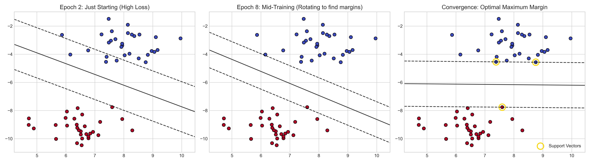

**The Equations of the Street:**
*   **The Hyperplane (Decision Boundary):** The median of the street. Its equation is $w^T x + b = 0$.
*   **The Positive Gutter:** The right guardrail touching the closest positive data point. Its equation is $w^T x + b = 1$.
*   **The Negative Gutter:** The left guardrail touching the closest negative data point. Its equation is $w^T x + b = -1$.
*   **Support Vectors:** The specific data points that physically touch these guardrails. If you delete all other data points in the dataset, the model does not change.

**Why do we use exactly 1 and -1? (Scale Invariance)**
The actual geometric street doesn't care if the boundaries are labeled 1 and $-1$, or 100 and $-100$. If you multiply the weights *w* and bias *b* by 100, it represents the exact same geometric street, just scaled differently. To stop the math from having infinite possible answers, we mathematically force (constrain) the closest points to equal exactly $+1$ and $-1$. This locks in a single, unique mathematical solution for *w* and *b*.

**How Inference Works (Making Predictions):**
The $+1$ and $-1$ gutters are *only* used during training to calculate the margin width. Once the model is trained (we found the optimal *w* and *b*), inference is incredibly simple. We take a new, unseen data point $x_{new}$ and calculate its score:
```math
z = w^T x_{new} + b
```
*   If $z \ge 0 \implies$ Classify as **Positive (+1)**
*   If $z < 0 \implies$ Classify as **Negative (-1)**
*(Notice how the $\pm 1$ margins don't matter anymore for the final prediction; inference only cares which side of the 0 hyperplane the point lands on!)*

**The Margin Math (Core Interview Question):**
The total width of this street (from the left guardrail to the right guardrail) is mathematically defined as:
```math
\text{Margin Width} = \frac{2}{||w||}
```
Because SVM's primary goal is to make this street as wide as possible (maximize the margin), the optimization algorithm must do the exact mathematical opposite to the denominator. Therefore, the core optimization goal of SVM is to **minimize**:
```math
\frac{1}{2} ||w||^2
```
**Hard Margin vs. Soft Margin (The *C* Parameter):**
*   **Hard Margin (The Flawed Ideal):** A strict margin that allows absolutely zero data points inside the street or on the wrong side. If there is a single extreme outlier, a Hard Margin will severely contort the street to avoid it, leading to massive **Overfitting**.
*   **Soft Margin (The Realistic Fix):** We allow some data points to violate the margin. We control this using the ***C* Parameter (Cost of Misclassification)**.
    *   **High *C* (Strict):** The model severely penalizes mistakes. It draws a very **narrow margin** to get almost every training point correct. (Low Bias, High Variance $\rightarrow$ Overfitting).
    *   **Low *C* (Relaxed):** The model doesn't mind a few mistakes. It prefers to keep the **margin as wide as possible**, ignoring extreme outliers. (High Bias, Low Variance $\rightarrow$ Underfitting).

---

### 2. The Main Idea: Maximal Margin & Soft Margins (The Mice Analogy)

**The Problem with Simple Thresholds:**
Imagine we are classifying mice based on their mass into **Not Obese (Red)** and **Obese (Green)**. 
If we just draw a line halfway between the closest Red and Green mouse, we create a **Maximal Margin Classifier**. 
*   **The Margin:** The shortest distance between the threshold and the closest observations.
*   **The Flaw:** It is super sensitive to outliers. If one skinny mouse randomly has a high mass, the threshold shifts drastically, and we suddenly misclassify lots of normal mice.

**The Solution: Support Vector Classifiers (Soft Margin)**
To solve the outlier problem, we must allow **misclassifications**. 
*   We use **Cross-Validation** to determine exactly how many misclassifications we should allow to get the best results on unseen data.
*   This introduces the **Bias-Variance Tradeoff**: By allowing a few mistakes on the training data (higher bias), the model becomes much more robust to new data (lower variance).
*   **Support Vectors:** The specific observations that sit on the edge of, or inside, this new "Soft Margin". 
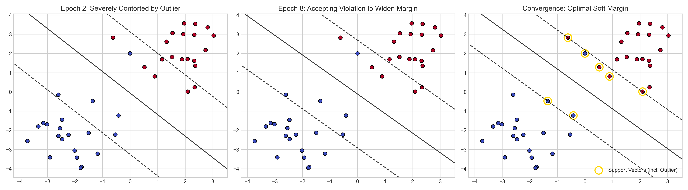

---

### 3. The Polynomial Kernel (The Drug Dosage Analogy)

**When 1D Lines Fail:**
Imagine testing a drug dosage. 
*   Dosage too low = Not Cured (Red)
*   Dosage just right = Cured (Green)
*   Dosage too high = Not Cured (Red)

In a 1D number line, the Green dots are trapped between the Red dots. **No single point (threshold) can separate them.**

**Projecting to 2D:**
To fix this, we move the data into a higher dimension. We create a Y-axis by taking the **Dosage Squared ($X^2$)**.
*   Now, the low dosages have a small Y value.
*   The high dosages have a massive Y value.
*   The "just right" dosages have a medium Y value.
Suddenly, we can draw a straight 2D line (a Support Vector Classifier) right underneath the high/low Red dots and above the medium Green dots!
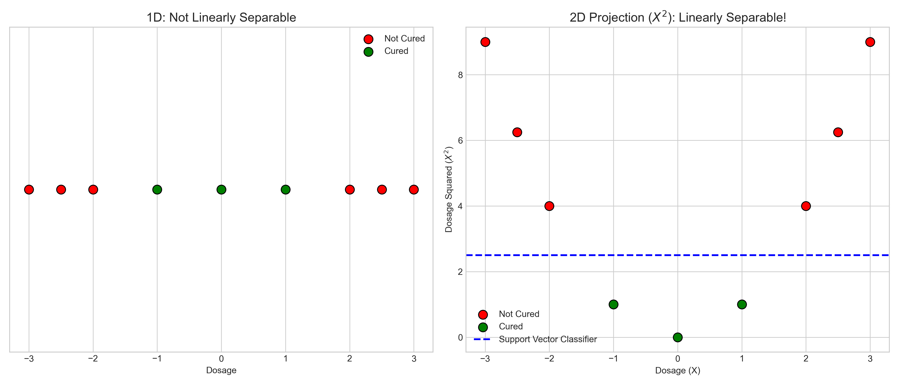

**The Kernel Trick:**
Transforming data into higher dimensions is computationally expensive. 
*   The **Polynomial Kernel** calculates the high-dimensional relationships (the dot product) between every pair of points *as if* they were in a higher dimension, without actually transforming the data! 

---

### 4. The Radial Basis Function (RBF) Kernel

If the Polynomial Kernel moves data to 2D or 3D, the **RBF Kernel finds Support Vector Classifiers in Infinite Dimensions.**

**How it Works (Weighted Nearest Neighbor):**
Because we can't draw infinite dimensions, we visualize RBF as a **Weighted Nearest Neighbor** model. 
*   The influence one observation has on another is a function of the **Squared Distance** between them. 
*   The closer two points are, the more influence they have on each other's classification.

**The Gamma ($\gamma$) Parameter:**
Gamma scales the squared distance, controlling the influence:
*   **High Gamma:** Influence drops off very quickly. Points only care about their immediate neighbors. (Very strict, can lead to overfitting).
*   **Low Gamma:** Influence drops off slowly. Points care about neighbors far away. (Very relaxed, leads to smoother boundaries).
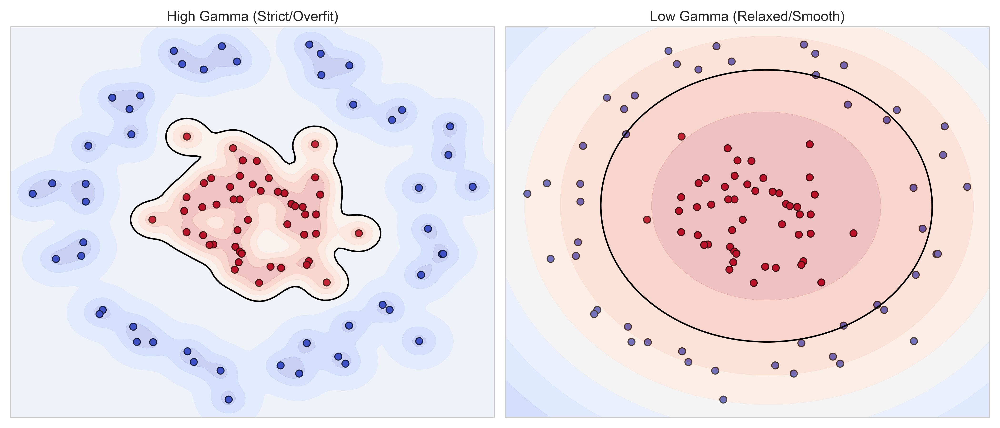

**The Math of Infinity:**
How does it calculate infinite dimensions? 
The RBF kernel uses the exponential function ($e^{- \gamma \cdot \text{distance}^2}$). Using a **Taylor Series Expansion**, the function $e^x$ can be expanded into an infinite sum of polynomial terms ($1 + x + x^2/2! + x^3/3! ...$). Because it uses this infinite sum, it mathematically evaluates the dot product in infinite dimensions!

---

### 5. Support Vector Regression (SVR): Flipping the Goal

**How to Explain SVR in an Interview (The Garden Hose Analogy):**
Imagine laying down a thick, transparent garden hose over a scatter plot of data points on the floor. Your goal is to cover as many data points as possible with the hose. 
*   The thickness of the hose is **$\epsilon$**. 
*   You don't care exactly where the points sit *inside* the hose; as long as they are covered, their error is completely ignored (it is precisely 0). 
*   You only penalize the points that stick out *outside* of the hose. SVR's mathematical goal is to lay the hose down in a way that minimizes the total distance of those outside points.

**The Core Intuition:**
SVM Classification tries to fit the widest possible empty street between two classes while keeping margin violations out. **SVM Regression (SVR) does the exact mathematical opposite:** it tries to fit as many training instances as possible *inside* the street while limiting margin violations (points that fall *outside* the street).

**The $\epsilon$ (Epsilon) Tube:**
Instead of a margin, SVR creates an $\epsilon$-insensitive tube around the regression line. 
*   The width of this tube is controlled by the hyperparameter **$\epsilon$**.
*   A **higher $\epsilon$** creates a wider tube (fitting more points inside, creating a simpler/flatter model).
*   A **lower $\epsilon$** creates a narrower tube (forcing the model to bend more tightly to the data, risking overfitting).
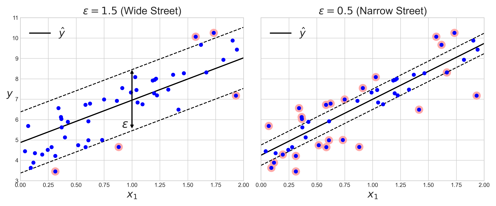
*(In the image above, the pink highlighted points are the Support Vectors! Notice how the wider street on the left captures almost all points easily, while the narrower street on the right has many points spilling out).*

**The $\epsilon$-Insensitive Property (Core Interview Fact):**
Any data point that falls *inside* the $\epsilon$-tube is considered "correct" and incurs zero loss. Because of this, adding more training points inside the margin does **not affect the model's predictions at all**. The model is completely insensitive to them!

**Slack Variables & Support Vectors in SVR:**
What happens to the points that fall *outside* the tube? 
*   We use **Slack Variables ($\xi$)** to measure how far outside the tube these errors are. 
*   The *C* parameter dictates how heavily we penalize these slack variables (High *C* = strict penalty for points outside the tube).
*   *Mind-Bending Fact:* In SVR, the points that fall **outside or on the edge** of the tube are the actual **Support Vectors**! They are the only points that dictate the shape of the regression line. 

**Non-Linear Regression:**
Just like classification, SVR can use the **Kernel Trick** (Polynomial or RBF kernels) to map data into higher dimensions. This allows SVR to draw incredibly complex, curved $\epsilon$-tubes to fit non-linear data effortlessly!
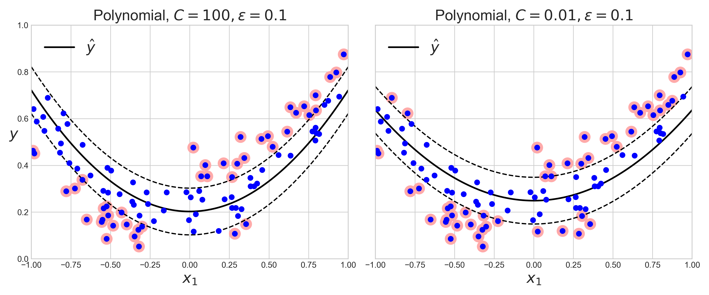
*(In the image above, the model on the left has $C=100$, meaning it strictly penalizes points outside the tube, forcing the curve to wiggle and overfit. The model on the right has $C=0.01$, meaning it is very relaxed, resulting in a smoother, more generalized curve).*

#### The Mathematics of Support Vector Regression (SVR)

To formalize the "Garden Hose" analogy, we must define the prediction function, the loss function, and the optimization objective.

**1. The Prediction Function (The Center of the Tube)**
Just like in linear regression, the SVR model predicts a continuous value *y* by computing the dot product of the weights *w* and the input features *x*, plus a bias term *b*:
```math
f(x) = w^T x + b
```
**2. The $\epsilon$-Insensitive Loss Function (The Tube Walls)**
The defining mathematical feature of SVR is its loss function. It states that if the absolute difference between the actual value *y* and the predicted value $f(x)$ is less than $\epsilon$, the error is exactly zero. The model only incurs a penalty if the prediction falls outside this boundary:
```math
L_\epsilon(y, f(x)) = \max(0, |y - f(x)| - \epsilon)
```
**3. The Optimization Objective (Soft Margin SVR)**
In reality, it is rarely possible to fit every single data point perfectly inside the $\epsilon$-tube. We must allow some points to exist outside the tube while still trying to keep the tube as flat and robust as possible.

To do this, we introduce **Slack Variables** ($\xi$ and $\xi^*$):

* $\xi_i$ represents the distance of a point that falls *above* the upper boundary of the tube.
* $\xi_i^*$ represents the distance of a point that falls *below* the lower boundary of the tube.

The goal of SVR is to keep the weights as small as possible (to keep the model simple and flat) while minimizing the sum of these slack variables (the errors outside the tube).

**The Core SVR Cost Function:**
```math
\min_{w, b, \xi, \xi^*} \frac{1}{2} ||w||^2 + C \sum_{i=1}^{m} (\xi_i + \xi_i^*)
```
**Subject to the following constraints:**

1. The upper boundary constraint (points cannot be too high above the tube):
```math
y_i - (w^T x_i + b) \leq \epsilon + \xi_i
```
2. The lower boundary constraint (points cannot be too far below the tube):
```math
(w^T x_i + b) - y_i \leq \epsilon + \xi_i^*
```
3. Slack variables must be non-negative (distance cannot be negative):
```math
\xi_i, \xi_i^* \geq 0
```
**How the Hyperparameters fit into the Math:**

* **Minimizing $\frac{1}{2} ||w||^2$:** This flattens the function, maximizing the generalized robustness of the tube.
* **The *C* Parameter:** This is the trade-off multiplier attached to the sum of the slack variables $\sum (\xi_i + \xi_i^*)$. If *C* is massive, the math heavily penalizes any $\xi$ greater than 0, forcing the model to violently contort the tube to capture outliers (Overfitting). If *C* is small, the math allows $\xi$ to grow, creating a smoother, more generalized tube (Underfitting).

---

### 6. Placement Prep: SVMs in the Real World

#### A: The Visual Guide to the *C* Parameter
The *C* parameter dictates how strictly the model avoids misclassifications. It physically alters both the margin width and the number of Support Vectors.

| Parameter State | Margin Width | Number of Support Vectors | Impact on Bias/Variance |
| :--- | :--- | :--- | :--- |
| **Low *C* (Relaxed)** | **Wide Margin** | **MORE Support Vectors** | High Bias, Low Variance (Underfitting risk) |
| **High *C* (Strict)** | **Narrow Margin** | **FEWER Support Vectors** | Low Bias, High Variance (Overfitting risk) |

*Counter-intuitive fact:* A wider margin physically covers more space, meaning more data points will fall inside of it. Therefore, a lower *C* results in **MORE** Support Vectors!

#### B: Solving an SVM "By Hand" (The Geometric Toy Example)
Let's solve a 2D SVM geometrically.
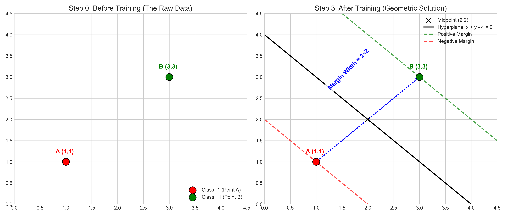

**The Dataset:**
*   **Negative Class (-1):** Point *A* at $(1, 1)$
*   **Positive Class (+1):** Point *B* at $(3, 3)$

**Step 1: Place the Hyperplane**
The best decision boundary separates the classes perfectly in the middle. 
*   The midpoint between $(1,1)$ and $(3,3)$ is **$(2,2)$**.
*   The boundary must be perpendicular to the line connecting *A* and *B*. Since the line $A \rightarrow B$ has a slope of 1, the boundary must have a slope of $-1$. 
*   Equation of the boundary: $y - 2 = -1(x - 2) \implies x + y = 4 \implies$ **$x + y - 4 = 0$**.

**Step 2: Calculate the Margin**
The margin distance is the perpendicular distance from the midpoint $(2,2)$ to either point. 
*   Distance from $(2,2)$ to $(3,3)$: $\sqrt{(3-2)^2 + (3-2)^2} = \sqrt{1^2 + 1^2} =$ **$\sqrt{2}$**.
*   Both Point A and Point B lie exactly on the margin boundaries, meaning **both A and B are Support Vectors**.

**Step 3: Finding Weights (*w*) and Bias (*b*)**
Our SVM equations are $w^Tx + b = \pm 1$.
*   Since the normal vector to $x + y = 4$ is $(1, 1)$, *w* must be some scalar multiple: $w = c(1, 1)$.
*   We know Margin Width $= \frac{2}{||w||}$.
*   The distance from the center to one margin is $\sqrt{2}$, so the total width is $2\sqrt{2}$.
*   $\frac{2}{||w||} = 2\sqrt{2} \implies ||w|| = \frac{1}{\sqrt{2}}$.
*   Since $w = c(1, 1)$, its magnitude is $\sqrt{c^2 + c^2} = c\sqrt{2}$. 
*   $c\sqrt{2} = \frac{1}{\sqrt{2}} \implies c = \frac{1}{2}$.
*   Therefore, **$w = [\frac{1}{2}, \frac{1}{2}]$**. 

To find *b*, plug *w* and Point B $(3,3)$ into the positive margin equation:
*   $w^T x_B + b = 1 \implies (\frac{1}{2} \cdot 3) + (\frac{1}{2} \cdot 3) + b = 1 \implies 3 + b = 1 \implies$ **$b = -2$**.

*Final SVM Equation:* $0.5x_1 + 0.5x_2 - 2 = 0$.

#### C: Top 5 OA & Interview Questions
1.  **Q: Why do we need to scale features before applying SVM?**
    *   **A:** Because SVM relies on physical distances (margins and dot products) to draw boundaries. Unscaled features will drastically distort the geometry and ruin the margin calculation.
2.  **Q: How does SVM handle outliers?**
    *   **A:** Via the Soft Margin *C* parameter. A low *C* tells the model to ignore outliers and prioritize a wider, more generalized margin.
3.  **Q: What is the time complexity of training an SVM?**
    *   **A:** Roughly $O(N^2)$ to $O(N^3)$, depending on the kernel and implementation. This makes standard SVMs very bad for massive datasets.
4.  **Q: What happens if you delete a non-support vector from the dataset and retrain?**
    *   **A:** Nothing. The decision boundary is entirely defined by the Support Vectors. Deleting any other point has zero effect on the model.
5.  **Q: Why is the RBF kernel said to map to infinite dimensions?**
    *   **A:** Because the RBF kernel utilizes the exponential function ($e^x$). By the Taylor Series expansion, the exponential function expands into an infinite sum of polynomial terms, effectively computing the dot product in infinite dimensional space.


## Part 5: Decision Trees (Classification)

Decision Trees represent a shift from geometry to pure logic. Instead of measuring spatial distances or calculating margins, this algorithm plays a game of "20 Questions" with the data, making it highly interpretable and completely immune to the scale of your features. **You never need to apply feature scaling to a Decision Tree.**

### 1. The Core Intuition: Slicing the Space
A Decision Tree splits the dataset into smaller and smaller orthogonal (axis-parallel) boxes. 
*   It looks at a single feature and finds a threshold (e.g., `Weight > 20`).
*   It draws a straight horizontal or vertical line at that threshold.
*   It repeats this process inside the newly created boxes until the boxes contain mostly a single class.

### 2. The Math of the Split: Gini Impurity
To decide *which* feature to split on and at *what* threshold, the tree uses a cost function called **Gini Impurity** to measure how "mixed" a node is. The algorithm desperately wants to minimize this impurity.
```math
G_i = 1 - \sum_{k=1}^{n} p_{i,k}^2
```
*   *n* is the total number of classes.
*   $p_{i,k}$ is the ratio of class *k* instances inside that specific node *i*.

**Gini Extremes:**
*   **0 (Perfectly Pure):** The box contains only one class. The tree stops splitting.
*   **$0.5$ (Maximum Impurity for Binary):** The box is a perfect 50/50 coin flip. The tree must split this node again.

---

### 3. The Overfitting Trap & Pruning
Because Decision Trees are **non-parametric**, they have no predefined constraints. If left alone, a tree will keep slicing the data until every single leaf has a Gini Impurity of 0. This results in a massive, hyper-complex tree that memorizes outliers (100% training accuracy) but fails miserably on new data. 

To fix this, we apply **Pruning** (cutting back the branches).

**Pre-Pruning (Early Stopping):**
We set strict hyperparameters before training to force the tree to stop growing early.
*   `max_depth`: The maximum number of levels the tree can grow.
*   `min_samples_split`: The minimum number of instances a node must have to be allowed to split.
*   `min_samples_leaf`: The minimum number of instances that must exist inside a final leaf node.

**Post-Pruning (Cost Complexity Pruning):**
We let the tree overfit completely, then work backwards from the leaves, snipping off specific branches that do not provide statistically significant improvements to accuracy.

---

### 4. Visualizing the Tree & Pruning in Python

To truly understand how Decision Trees slice the feature space, we can visualize the catastrophic effects of an unconstrained tree versus a pruned tree trained on a noisy dataset:


**Output 1: Decision Boundaries**
Notice how the Unconstrained Tree creates jagged, unnatural slivers to capture single outlier points (100% training accuracy but terrible generalization). The Pruned Tree draws clean, robust rectangular boundaries that ignore the noise!
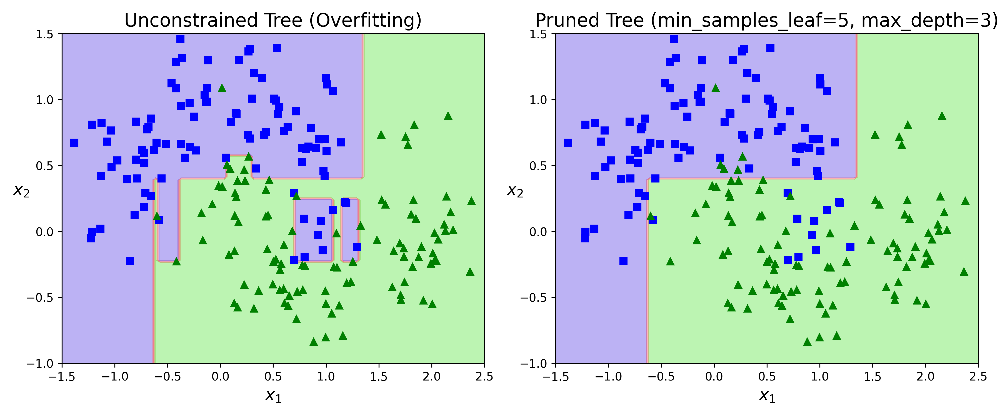

**Output 2: The Structural Map**
Here is the actual logic that the pruned model generated to draw those boxes. Notice how the root node splits on $x_2 \le 0.177$, and how the Gini impurity drops closer to 0 as the boxes become purer!
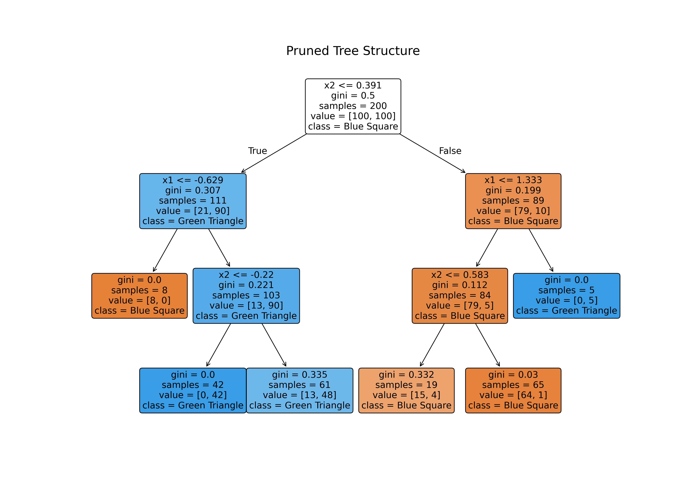

---

### 5. Placement Prep: Top Decision Tree Interview Questions & Must-Knows

To ace a technical round on Decision Trees, you need to understand not just how they work, but their mathematical flaws and when *not* to use them.

#### A. The Advantages vs. Disadvantages (The "Trade-off" Question)
*   **Pros:** 
    *   **Highly Interpretable:** You can literally print out the tree and show stakeholders exactly *why* a decision was made (unlike Neural Networks).
    *   **No Scaling Required:** Because it splits on hard thresholds (`Age > 20`), it is completely immune to the scale of the features. You do not need to standardize or normalize your data.
    *   **Handles Collinearity:** If two features are highly correlated, the tree will just pick one to split on and ignore the other. It doesn't break the math (like it does in Linear Regression).
*   **Cons:**
    *   **High Variance (Instability):** This is the biggest flaw. A tiny change in the training data can cause the root node to choose a different feature, completely altering the entire structure of the tree below it. 
    *   **Orthogonal Boundaries Only:** Trees can only draw straight horizontal or vertical lines. If your true decision boundary is diagonal, the tree has to draw a jagged staircase to approximate it, which is highly inefficient.

#### B. Entropy vs. Gini Impurity
Interviewers will often ask how a tree decides to split. Scikit-learn defaults to **Gini Impurity**, but you can also use **Entropy / Information Gain**.
*   **Gini Impurity:** Measures the probability of misclassifying a random sample. It is slightly faster to compute because it doesn't use logarithms.
*   **Entropy:** Derived from thermodynamics and information theory, it measures the level of "disorder" or uncertainty in a node. 
    *   $H = -\sum p_k \log_2(p_k)$
    *   The goal of a split is to maximize **Information Gain** (the drop in Entropy from the parent node to the child nodes).

#### C. Feature Importance
Scikit-learn calculates feature importance by measuring how much a specific feature reduces Gini impurity across all the nodes it is used in. This reduction is heavily weighted by the number of training samples passing through those nodes. Features that split a massive amount of data at the top of the tree (like the root node) will inherently have a much higher importance score than features used deep in the leaves.

#### D. Top 7 Interview Questions
1.  **Q: Are Decision Trees parametric or non-parametric?**
    *   **A:** They are **non-parametric**. They do not assume a predetermined structure or mathematical function (like a straight line in regression). The number of parameters (nodes) grows with the complexity of the training data.
2.  **Q: What is the difference between a Classification Tree and a Regression Tree?**
    *   **A:** A Classification Tree splits data to minimize **Gini Impurity** and predicts the majority class in a leaf. A Regression Tree splits data to minimize **Mean Squared Error (MSE)** and predicts the average (mean) value of the instances in a leaf.
3.  **Q: Why do Decision Trees tend to overfit?**
    *   **A:** Because they are "greedy" algorithms that make the locally optimal choice at every split without looking ahead. Without constraints (like `max_depth`), they will recursively split the data until every single leaf contains exactly 1 data point (perfectly memorizing the training data and noise).
4.  **Q: Can a Decision Tree handle categorical data?**
    *   **A:** Conceptually, yes. However, implementation matters. Scikit-learn's CART implementation currently requires categorical variables to be converted to numerical values (e.g., via One-Hot Encoding) before training.
5.  **Q: What specific algorithm does scikit-learn use to build trees, and what is its main characteristic?**
    *   **A:** It uses the CART algorithm, which produces strictly binary trees where every node has exactly two children.
6.  **Q: Why is the Decision Tree algorithm considered 'Greedy'?**
    *   **A:** Because it searches for the locally optimum split at the current node without looking ahead. Finding the globally optimal tree is NP-Complete.
7.  **Q: What is the time complexity of a Decision Tree?**
    *   **A:** Prediction is blazingly fast at $O(\log_2(m))$, but training is slow at $O(n \times m \log_2(m))$ because it must sort and compare all features across all samples.

### 6. Solving a Decision Tree Split "By Hand" (Categorical)

To truly understand how CART builds a tree, we must freeze the algorithm and do the math by hand. We will use **Gini Impurity** (*G*) to measure node purity, and a **Weighted Cost Function** (*J*) to evaluate the quality of a split.

#### 1. The Dataset
We have $m = 5$ training instances predicting if we should "Go for a Walk":

| Instance | Weather ($x_1$) | Weekend ($x_2$) | Go for a Walk (*y*) |
| :--- | :--- | :--- | :--- |
| 1 | Sunny | Yes | **Yes** |
| 2 | Sunny | No | **Yes** |
| 3 | Rainy | Yes | **Yes** |
| 4 | Rainy | No | **No** |
| 5 | Rainy | No | **No** |

#### 2. The Formula for Gini Impurity
It measures the purity of a node (0 means perfectly pure, meaning all instances belong to one class).
```math
G = 1 - \sum_{k=1}^{K} (p_k)^2
```
Where $p_k$ is the ratio of instances belonging to class *k* in that node.

#### 3. Step 1: Calculate Total Impurity at the Root Node
Before making any splits, let's look at all 5 target labels: `[Yes, Yes, Yes, No, No]`
*   Total instances = 5
*   Probability of 'Yes' ($p_1$) = $3/5 = 0.6$
*   Probability of 'No' ($p_2$) = $2/5 = 0.4$
```math
G_{root} = 1 - (0.6^2 + 0.4^2) = 1 - (0.36 + 0.16) = 0.48
```
#### 4. Step 2: Evaluate Potential Splits
We evaluate the cost function for both features to see which one provides the lowest weighted Gini impurity for the child nodes. The weighted cost function is:
```math
J(k, t_k) = \frac{m_{left}}{m} G_{left} + \frac{m_{right}}{m} G_{right}
```
**Option A: Split by "Weather == Sunny"**
*   **Left Node (Sunny):** Instances 1, 2 $\rightarrow$ Labels: `[Yes, Yes]`
    *   $m_{left} = 2$
    *   $G_{left} = 1 - ((2/2)^2 + (0/2)^2) = 1 - 1 = 0$ *(Perfect purity)*
*   **Right Node (Rainy):** Instances 3, 4, 5 $\rightarrow$ Labels: `[Yes, No, No]`
    *   $m_{right} = 3$
    *   $G_{right} = 1 - ((1/3)^2 + (2/3)^2) = 1 - (1/9 + 4/9) = 1 - 5/9 = 0.444$
*   **Weighted Gini (*J*):** $(2/5 \times 0) + (3/5 \times 0.444) = 0 + 0.266 = 0.266$

**Option B: Split by "Weekend == Yes"**
*   **Left Node (Weekend):** Instances 1, 3 $\rightarrow$ Labels: `[Yes, Yes]`
    *   $m_{left} = 2$
    *   $G_{left} = 1 - ((2/2)^2 + (0/2)^2) = 0$ *(Perfect purity)*
*   **Right Node (Weekday):** Instances 2, 4, 5 $\rightarrow$ Labels: `[Yes, No, No]`
    *   $m_{right} = 3$
    *   $G_{right} = 1 - ((1/3)^2 + (2/3)^2) = 0.444$
*   **Weighted Gini (*J*):** $(2/5 \times 0) + (3/5 \times 0.444) = 0.266$

*Tie-breaker:* Both splits yield the exact same impurity reduction. Let's arbitrarily choose **Weather == Sunny** as our root split.

#### 5. Step 3: Build the Next Level of the Tree
Our tree currently looks like this:
*   **Root:** Is Weather Sunny?
    *   **True (Left):** Leaf node containing `[Yes, Yes]`. Because Gini is 0, this stops here. Prediction: **Yes**.
    *   **False (Right):** Sub-node containing remaining Rainy instances (3, 4, 5) with labels `[Yes, No, No]`. We must split this node further.

Let's look only at the remaining data in the **Right Sub-node**:
| Instance | Weather | Weekend | Go for a Walk |
| :--- | :--- | :--- | :--- |
| 3 | Rainy | Yes | **Yes** |
| 4 | Rainy | No | **No** |
| 5 | Rainy | No | **No** |

Since Weather is identical for all three, our only remaining choice is to split by **Weekend == Yes**.
*   **Left Child (Weekend is Yes):** Instance 3 $\rightarrow$ Label: `[Yes]`
    *   $m_{left} = 1$
    *   $G_{left} = 1 - (1^2) = 0$
*   **Right Child (Weekend is No):** Instances 4, 5 $\rightarrow$ Labels: `[No, No]`
    *   $m_{right} = 2$
    *   $G_{right} = 1 - (1^2) = 0$
*   **Weighted Gini for this sub-split:** $(1/3 \times 0) + (2/3 \times 0) = 0$

#### Final Trained Tree Structure
Every branch now terminates in a pure leaf node ($G = 0$). Training is complete.

```text
         [Is Weather Sunny?]
             /         \
       (True)/         \(False)
           /             \
    [Leaf: Go Walk]   [Is it the Weekend?]
    (Gini=0, Recs=2)      /           \
                  (True)/             \(False)
                      /                 \
               [Leaf: Go Walk]    [Leaf: Stay Home]
               (Gini=0, Recs=1)   (Gini=0, Recs=2)
```


### 7. Decision Tree Regression

Decision Trees can also be used for **regression tasks** (predicting continuous target values instead of discrete classes). While Classification Trees predict a class based on majority vote, Regression Trees predict a continuous number ($\hat{y}$).

#### 1. The Core Intuition: The Step Function
Instead of drawing a curved line through the data (like Polynomial Regression), a Decision Tree Regressor slices the input space into rectangular regions and predicts a **constant value** for each region.

*   **Prediction Value ($\hat{y}_{\text{node}}$):** The predicted value for any instance falling into a leaf node is simply the **average (mean) target value (*y*)** of all training instances in that node.
*   **The Curve Shape:** Geometrically, this creates a **piecewise constant step function**. 
    *   `max_depth = 2`: Slices the data into 4 coarse steps.
    *   `max_depth = 3`: Slices the data into 8 finer steps, fitting the curve much closely.
    *   *Warning:* If `max_depth` is too high, the tree creates hundreds of tiny steps around noise points, causing severe overfitting.

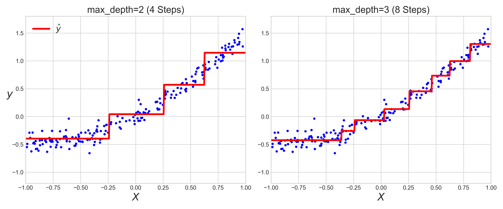

---

#### 2. The CART Algorithm Cost Function for Regression
The CART algorithm works mostly the same way as in classification, except that instead of trying to split the training set to minimize Gini Impurity, **it tries to split the training set to minimize Mean Squared Error (MSE)**.

To evaluate a split using feature *k* and threshold $t_k$, CART minimizes the weighted cost function $J(k, t_k)$:
```math
J(k, t_k) = \frac{m_{\text{left}}}{m} \text{MSE}_{\text{left}} + \frac{m_{\text{right}}}{m} \text{MSE}_{\text{right}}
```
Where:
1.  **Node Prediction ($\hat{y}_{\text{node}}$):** The mean target value of instances in the node.
```math
\hat{y}_{\text{node}} = \frac{1}{m_{\text{node}}} \sum_{i \in \text{node}} y^{(i)}
```
2.  **Node Squared Error ($\text{MSE}_{\text{node}}$):** The total error/variance of instances relative to that node's mean prediction.
```math
\text{MSE}_{\text{node}} = \sum_{i \in \text{node}} \left( \hat{y}_{\text{node}} - y^{(i)} \right)^2
```
---

#### 3. Classification vs. Regression Trees (Quick Summary)

| Feature | Classification Tree | Regression Tree |
| :--- | :--- | :--- |
| **Target Variable (*y*)** | Categorical (e.g., Cat vs. Dog) | Continuous (e.g., Price, Temperature) |
| **Node Prediction ($\hat{y}$)** | Majority class in the leaf | Mean value of instances in the leaf |
| **Split Criterion** | Minimizes Gini Impurity / Entropy | Minimizes Weighted MSE |
| **Output Shape** | Axis-aligned boundary boxes | Piecewise constant step function |
| **Scaling Required?** | **No** | **No** |

---

### 8. Ultimate Decision Tree Interview & OA Question Bank

#### A. Technical Interview & OA Questions (With In-Depth Answers)

**1. Q: Why don't Decision Trees require feature scaling (normalization or standardization)?**
*   **A:** Unlike algorithms such as Support Vector Machines, KNN, or Neural Networks that rely on calculating spatial distances (like Euclidean distance) between data points, Decision Trees rely entirely on discrete, monotonic thresholds (e.g., "Is `Salary > 50,000`?"). The algorithm simply sorts the feature values and evaluates splits; shrinking or scaling those values does not change the order or the resulting split points.

**2. Q: How does a Decision Tree handle missing values during training and inference?**
*   **A:** While scikit-learn's current CART implementation doesn't natively handle missing values (requiring imputation beforehand), advanced algorithms like XGBoost or traditional CART can handle them using **Surrogate Splits**. If a node is missing a value for a feature being evaluated, the tree looks for a "surrogate" feature that mimics the primary split as closely as possible and uses that instead.

**3. Q: Explain the difference between Gini Impurity and Entropy. When would you choose one over the other?**
*   **A:** Both measure node impurity, but they originate from different concepts. **Gini Impurity** measures the probability of misclassifying a random sample, whereas **Entropy** originates from information theory and measures the "disorder" of a node (using logarithms). 
    *   *When to choose:* They generate nearly identical trees 98% of the time. However, Gini is slightly faster to compute (no computationally expensive $\log$ functions), making it the preferred default. Entropy sometimes creates slightly more balanced trees.

**4. Q: Why are Decision Trees considered 'unstable' or high-variance models, and how do ensemble methods fix this?**
*   **A:** Trees are incredibly unstable because they are highly sensitive to small variations in the training data. A tiny change might cause the root node to select a completely different feature to split on, which cascades and fundamentally alters the entire tree structure below it. **Ensemble methods**, like Random Forests, fix this by training hundreds of different trees on random subsets of the data (bagging) and averaging their predictions, which drastically reduces the variance.

**5. Q: How does a Regression Tree decide where to split, and what value does it predict in its leaf nodes?**
*   **A:** Instead of splitting to minimize Gini Impurity, a Regression Tree splits the data at a threshold that minimizes the **Mean Squared Error (MSE)** (the variance) between the left and right child nodes. Once the tree is built, the predicted value ($\hat{y}$) for any instance falling into a leaf node is simply the **average (mean)** of all training target values in that specific leaf.

**6. Q: What is the time complexity of building (training) a Decision Tree vs. making predictions with it?**
*   **A:** 
    *   **Inference (Prediction):** Blazingly fast. Traversing a balanced binary tree takes $O(\log_2(m))$, where *m* is the number of leaves. It is completely independent of the number of features.
    *   **Training:** Slow. Finding the optimal split requires sorting every feature and evaluating the Gini/MSE for every possible threshold. The training complexity is $O(n \times m \log_2(m))$, where *n* is features and *m* is samples.

#### B. "Questions to Remember" (Flashcard Review)

1.  **Q: Are Decision Trees parametric or non-parametric?**
    *   **A:** Non-parametric. They make no assumptions about the underlying data distribution and adapt their structure to the data.
2.  **Q: What is the main characteristic of the CART algorithm used by scikit-learn?**
    *   **A:** It produces strictly **binary** trees (every node splits into exactly two children, True or False).
3.  **Q: Why is the Decision Tree algorithm considered "Greedy"?**
    *   **A:** It searches for the locally optimum split at the current node without looking ahead to see if a suboptimal split now might lead to a better tree overall.
4.  **Q: Finding the absolute globally optimal Decision Tree is known to be what type of problem?**
    *   **A:** NP-Complete (computationally intractable), which is why we settle for the greedy heuristic.
5.  **Q: What hyperparameter should you decrease to combat overfitting?**
    *   **A:** `max_depth` (restricts how deep the tree can grow).
6.  **Q: What hyperparameter should you increase to combat overfitting?**
    *   **A:** `min_samples_leaf` or `min_samples_split` (forces the tree to generalize by requiring more samples per node).
7.  **Q: How does scikit-learn calculate feature importance?**
    *   **A:** By measuring how much a specific feature reduces Gini impurity across all nodes it is used in, weighted by the number of samples passing through those nodes.
8.  **Q: Does a Decision Tree suffer from multicollinearity?**
    *   **A:** No. If two features are highly correlated, the tree will just split on one and ignore the other.
9.  **Q: What is the maximum Gini Impurity for a binary classification node?**
    *   **A:** 0.5 (A perfect 50/50 split of classes, resembling a random coin toss).
10. **Q: What shape do Decision Tree boundaries always take?**
    *   **A:** Orthogonal (axis-parallel). They can only draw straight horizontal or vertical boundary lines.


## Part 6: Ensemble Learning

Ensemble learning relies on a simple yet powerful mathematical principle: **"The Wisdom of the Crowd."** A group of diverse models working together will almost always outperform even the single best individual model.

### 1. Voting Classifiers
A **Voting Classifier** is the simplest form of ensemble learning. Instead of relying on a single algorithm, you train several distinct, independent models (such as Logistic Regression, SVM, and a Decision Tree) on the same dataset and aggregate their predictions to make a final decision.

**Hard Voting vs. Soft Voting:**
*   **Hard Voting (Majority Rule):** Each individual classifier casts a "vote" for a class label. The ensemble outputs the class that receives the strict majority of votes. It treats all votes equally, regardless of how confident the individual model is.
*   **Soft Voting (Probability Average):** Instead of looking at the final class labels, the ensemble averages the predicted **class probabilities** from all models. The class with the highest average probability wins. This is generally superior to Hard Voting because it gives greater weight to highly confident predictions. *(Note: Base models must be able to estimate probabilities for this to work).*

### 2. Visualizing Voting Classifiers in Python

To truly see the power of "The Wisdom of the Crowd," you can run the following Python script. It trains three separate models on a noisy `make_moons` dataset:
1.  **A Single Decision Tree** (Unconstrained)
2.  **Hard Voting Ensemble** (500 Decision Trees voting by majority rule)
3.  **Soft Voting Ensemble** (500 Decision Trees voting by probability averaging)

**Output: Boundary Smoothing**
Notice how the single tree severely overfits to the noise, drawing jagged and erratic boundaries. The Hard Voting ensemble smooths out the boundaries significantly by majority rule, but still has a few rigid edges. The Soft Voting ensemble achieves the smoothest, most generalized boundary by weighing the confidence of each tree!
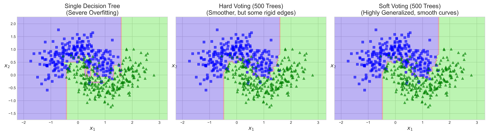

---

### 3. Why Ensembles Work: The Law of Large Numbers
To understand why combining models works mathematically, consider a biased coin that lands on heads exactly **51%** of the time (representing a weak learner).

*   If you flip it once, you have a 51% chance of getting heads.
*   If you flip it 1,000 times, the chance of getting a majority of heads jumps to over **73%**.
*   If you flip it 10,000 times, the probability rises above **99%**.

Similarly, if you combine 1,000 independent classifiers that are each individually only 51% accurate, their collective majority vote can approach near-perfect accuracy. 

**The Diversity Rule:**
The math only works if the errors the models make are completely **uncorrelated**. Combining 500 identical Decision Trees trained on the exact same data won't help because they will all make the exact same mistakes. Ensemble methods require **diversity**, which is achieved by either using completely different mathematical algorithms (e.g., SVM + Logistic Regression + Trees) or by training the same algorithm on completely different random subsets of the data.


### 4. Bagging and Pasting
To get a diverse set of predictors, one approach is to use completely different training algorithms (like we did with Voting Classifiers). Another approach is to use the exact same training algorithm for every predictor, but train them on different random subsets of the training set.

#### A. The Core Concepts: Bagging vs. Pasting
*   **Bagging (Bootstrap Aggregating):** Sampling is performed *with replacement*. This means the same training instance can be sampled multiple times for the same predictor.
*   **Pasting:** Sampling is performed *without replacement*. Once an instance is picked for a predictor, it cannot be picked again for that same predictor.

**How Aggregation Works:**
Once all predictors are trained, the ensemble makes a prediction for a new instance by simply aggregating the predictions of all predictors:
*   **Classification:** The statistical mode (i.e., the most frequent prediction, just like hard voting).
*   **Regression:** The average of all the predictions.

#### B. Why Bagging Reduces Overfitting (Variance)
Individual predictors trained on subsets of data have higher bias than if they were trained on the entire original dataset. However, aggregation reduces both bias and variance.

The net result is that the ensemble has a similar bias but a significantly lower variance than a single predictor trained on the original dataset. Geometrically, bagging completely smooths out the jagged, overfitted decision boundaries of single Decision Trees. Because bagging allows training instances to be sampled multiple times, it is generally preferred over pasting as it results in slightly better models.

#### C. Out-of-Bag (OOB) Evaluation (The "Free" Validation Set)
This is a massive advantage of Bagging and a concept interviewers absolutely love to ask about.

When you sample with replacement (Bagging), some instances may be sampled several times for any given predictor, while others may not be sampled at all. Mathematically, as the dataset grows large, a predictor samples only about **63%** of the training instances on average.

The remaining **37%** of the training instances that are not sampled are called **Out-of-Bag (OOB)** instances. Note that they are not the same 37% for all predictors.

**The Magic Trick:**
Because the predictor never saw the OOB instances during training, it can be evaluated on these instances without the need for a separate validation set or cross-validation. You can evaluate the overall ensemble itself by averaging out the OOB evaluations of each individual predictor. This gives you a highly accurate generalization score for "free" while preserving your actual training data.

---

### 5. Visualizing Bagging & OOB Evaluation in Python

To see how Bagging dramatically improves generalization over a single Decision Tree, we simulated a Bagging Ensemble of 500 trees on a noisy `make_moons` dataset.

**1. Decision Boundary Smoothing**
Notice how the single, unconstrained tree severely overfits by creating highly jagged slivers to memorize the training data. The Bagged Ensemble, however, completely smooths out the boundaries and isolates the noise perfectly!

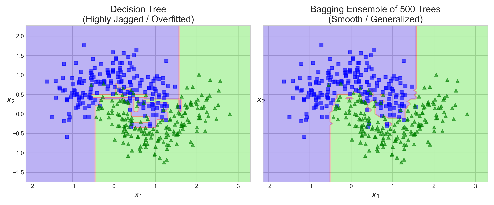

**2. The Power of the OOB Score**
By setting `oob_score=True` when training the Bagging Classifier, scikit-learn automatically evaluated the ensemble using the 37% "Out-of-Bag" data points that each tree never saw. We then compared this "free" OOB score to the accuracy on an actual, unseen Test set:

*   **Bagging OOB Score (Free Validation):** `0.8960` (89.60%)
*   **Actual Test Set Accuracy:** `0.9120` (91.20%)

This proves that the OOB evaluation is a remarkably close estimate of true generalization accuracy, and we got it without sacrificing any training data to a validation set!

### 6. Placement Prep: Voting Classifiers & Bagging (Flashcards)

**Q1: What is the exact difference between Hard Voting and Soft Voting?**
*   **Answer:** Hard Voting aggregates the predicted class *labels* and outputs the strict majority vote. Soft Voting averages the predicted class *probabilities* across all models and outputs the class with the highest average probability. Soft voting generally yields higher accuracy but requires all base models to support `predict_proba()`.

**Q2: Why is it crucial to use diverse base models in a Voting Classifier?**
*   **Answer:** Ensemble learning relies on the "Wisdom of the Crowd" and the Law of Large Numbers. If all models are mathematically similar and trained on the same data, they will make the exact same highly correlated errors. Combining completely different algorithms (e.g., SVM, Logistic Regression, Trees) ensures their errors are uncorrelated, allowing the majority vote to correct individual mistakes.

**Q3: Explain the difference between Bagging and Pasting.**
*   **Answer:** Both techniques train the exact same algorithm on random subsets of the training data. **Bagging** (Bootstrap Aggregating) samples instances *with replacement* (instances can be picked multiple times). **Pasting** samples *without replacement*. Bagging is generally preferred because it introduces more diversity, resulting in better generalization.

**Q4: How does Bagging affect the Bias and Variance of an algorithm like a Decision Tree?**
*   **Answer:** A single unconstrained Decision Tree has low bias but very high variance (severe overfitting). Bagging averages hundreds of these trees together. The resulting ensemble maintains a **similar low bias** but achieves a drastically **lower variance**, effectively smoothing out the overfitted decision boundaries.

**Q5: What is Out-of-Bag (OOB) Evaluation and what mathematical constant drives it?**
*   **Answer:** When sampling *with replacement* (Bagging), mathematically, only about 63% of the training instances are sampled for any given predictor. The remaining **37%** are "Out-of-Bag" (OOB). This ratio is derived from the limit $(1 - 1/m)^m \approx 1/e$. 

**Q6: Why is the OOB score so valuable in Machine Learning pipelines?**
*   **Answer:** Because an individual predictor never saw its specific 37% OOB instances during training, those instances act as a dynamically generated, "free" validation set. You can get a highly accurate generalization score (`oob_score_`) without sacrificing any rows of data to a traditional 80/20 train/test split.

**Q7: Why is it a catastrophic error to perform feature selection on your entire dataset before using a Bagging classifier with `oob_score=True`?**
*   **Answer:** This causes **Data Leakage**. If you run feature selection on the entire dataset first, the algorithm has indirectly "peeked" at the patterns in the OOB instances. The OOB instances are no longer mathematically isolated, making the `oob_score_` artificially inflated and completely untrustworthy for real-world generalization.


### 7. Random Forests

A **Random Forest** is simply an ensemble of Decision Trees, generally trained via the Bagging method. However, it introduces one crucial algorithmic tweak to make the individual trees even more mathematically diverse, which dramatically lowers the overall variance of the model.

#### 1. The Magic of Random Subspaces (Feature Sampling)
When a standard Decision Tree grows, it scans **every single feature** at every node to find the absolute best split. 

If you have a dataset where one specific feature (e.g., "Account Balance") is massively more predictive than the others, almost every single tree in a standard Bagging ensemble will use that exact same feature as its root node. The trees become highly correlated, meaning they all make the same mistakes, defeating the purpose of the ensemble.

**The Random Forest Fix:**
When you train a Random Forest, the algorithm is forced to pick the best split from a **random subset of features** at each node (controlled by the `max_features` hyperparameter), rather than looking at all features. This restricts dominant features from taking over, forces the trees to explore alternative paths, and trades a slight increase in bias for a massive drop in variance.

#### 2. Extremely Randomized Trees (Extra-Trees)
If you want to push this randomness even further to prevent overfitting and speed up training, you can use an **Extra-Trees** ensemble (`ExtraTreesClassifier`). 

*   **The Speedup:** Finding the mathematically perfect split threshold is the most computationally expensive part of training a tree because it requires sorting the data. Extra-Trees skip this step. They pick completely **random thresholds** for the features being evaluated.
*   **The Result:** Because they do not sort and search, Extra-Trees train blazingly fast. This extreme randomness makes them even more resilient to overfitting than standard Random Forests.

#### 3. Feature Importance (The White-Box Superpower)
Because Random Forests force hundreds of trees to evaluate completely different combinations of features, they are the ultimate tool for measuring **Feature Importance**. 

A Random Forest calculates a feature's importance mathematically:
*   It looks at every single node across all trees where a specific feature was used to make a split.
*   It measures exactly how much the **Gini Impurity** dropped after that split.
*   It weights that impurity drop by the number of training samples that passed through that node.
*   It averages that weighted impurity reduction across the entire forest. Features that consistently create the purest child nodes get the highest scores.

---

### 8. AdaBoost (Adaptive Boosting)

If Bagging is about building a massive committee of independent trees that vote simultaneously, **Boosting** is about building a highly focused relay team. Models are trained **sequentially**. Each new model pays close attention to the specific data points that the previous model got wrong, actively tweaking its weights to correct its predecessor's mistakes.

AdaBoost typically uses **Decision Stumps** (a Decision Tree with `max_depth=1`) as its base estimators.

#### 1. The Core Intuition: Weighting the Mistakes
1.  **Initialize Weights:** Every instance in the training dataset starts with an equal weight ($w^{(i)} = 1/m$).
2.  **Train & Evaluate:** The first Decision Stump makes its predictions.
3.  **Punish the Mistakes:** AdaBoost increases the weights of the instances that were misclassified.
4.  **Train the Next Model:** The second Stump is trained. Because the misclassified points now have heavier weights, the algorithm is forced to focus intensely on getting those specific points right.
5.  **Repeat:** This process repeats until a perfect predictor is found or the maximum number of estimators is reached.

---

#### 2. The Math of AdaBoost (Step-by-Step)

To truly understand AdaBoost for high-level interviews, you need to know how it updates these weights mathematically.

**Step 1: Calculate the Weighted Error Rate ($r_j$)**
For the $j^{th}$ predictor, we calculate its error rate by summing the weights of all the instances it got wrong, divided by the total sum of all weights.
```math
r_j = \frac{\sum_{\substack{i=1 \\ \hat{y}_j^{(i)} \ne y^{(i)}}}^{m} w^{(i)}}{\sum_{i=1}^{m} w^{(i)}}
```
*(Where $\hat{y}_j^{(i)}$ is the $j^{th}$ predictor's prediction for the $i^{th}$ instance).*

**Step 2: Calculate the Predictor's Voting Weight ($\alpha_j$)**
Based on its error rate, we determine how much "say" this predictor gets in the final vote. 
```math
\alpha_j = \eta \log \frac{1 - r_j}{r_j}
```
*(Where $\eta$ is the learning rate hyperparameter. If a predictor is highly accurate, its error rate $r_j$ is close to 0, making its weight $\alpha_j$ very high. If it is just guessing randomly, its weight will be close to 0).*

**Step 3: The Weight Update Rule ($w^{(i)}$)**
Now, we update the weights of the individual training instances for the *next* predictor to use.
```math
w^{(i)} \leftarrow \begin{cases} w^{(i)} & \text{if } \hat{y}_j^{(i)} = y^{(i)} \\ w^{(i)} \exp(\alpha_j) & \text{if } \hat{y}_j^{(i)} \ne y^{(i)} \end{cases}
```
*(If the predictor got the instance right, the weight stays the same. If it got it wrong, the weight is multiplied by $e^{\alpha_j}$, making it heavier for the next round). Then, all instance weights are normalized (divided by $\sum_{i=1}^{m} w^{(i)}$).*

**Step 4: Making the Final Prediction ($\hat{y}(\mathbf{x})$)**
To make a prediction on new data, AdaBoost computes the predictions of all *N* predictors and weighs them by their predictor weight ($\alpha_j$). The predicted class is the one that receives the majority of the weighted votes.
```math
\hat{y}(\mathbf{x}) = \underset{k}{\text{argmax}} \sum_{\substack{j=1 \\ \hat{y}_j(\mathbf{x}) = k}}^{N} \alpha_j
```
---

#### 3. The One Major Trade-off: No Parallelization
Because AdaBoost relies strictly on sequential learning—Model 2 mathematically cannot be trained until Model 1 finishes calculating its errors and updating the instance weights—**it cannot be parallelized**. Unlike a Random Forest, you cannot distribute the training of an AdaBoost ensemble across multiple CPU cores. It will always take significantly longer to train on massive datasets.

---

#### 4. Placement Prep: AdaBoost (Flashcards)

**Q1: What base estimator does AdaBoost typically use?**
*   **Answer:** A Decision Stump (a Decision Tree with a `max_depth` of 1, meaning it only makes a single split before predicting).

**Q2: How does AdaBoost force subsequent models to focus on difficult instances?**
*   **Answer:** After a predictor evaluates the data, the algorithm increases the relative weights of the misclassified training instances. The next predictor is trained on this updated dataset, forcing its cost function to prioritize the heavily weighted (previously misclassified) points.

**Q3: In a Random Forest, every tree gets an equal vote. Is this true for AdaBoost?**
*   **Answer:** No. AdaBoost uses a weighted majority vote. A predictor's voting power ($\alpha_j$) is calculated based on its accuracy during training. Highly accurate predictors have a massive influence on the final prediction, while poor predictors have almost none.

**Q4: Why might you choose a Random Forest over AdaBoost if you are under a strict time constraint with a massive dataset?**
*   **Answer:** Random Forests are "embarrassingly parallel," meaning hundreds of trees can be trained simultaneously across multiple CPU cores. AdaBoost is strictly sequential; the next tree cannot be trained until the previous one finishes updating the weights, making it much slower to train.


### 9. Solving AdaBoost "By Hand" (Step-by-Step Example)

To truly cement how AdaBoost forces models to learn from past mistakes, let's freeze the algorithm and calculate the first two rounds of boosting by hand.

#### The Setup

Imagine a tiny dataset with $m = 5$ instances. We are classifying whether an email is **Spam (Class 1)** or **Not Spam (Class 0)**. We will set the learning rate hyperparameter ($\eta$) to 1 to keep the math simple.

Initially, every instance is given the exact same weight: $w^{(i)} = \frac{1}{m}$.

* **Initial Weights:** `0.2, 0.2, 0.2, 0.2, 0.2`

| Instance (*i*) | True Label (*y*) | Initial Weight ($w^{(i)}$) |
| --- | --- | --- |
| 1 | 1 | 0.2 |
| 2 | 1 | 0.2 |
| 3 | 0 | 0.2 |
| 4 | 0 | 0.2 |
| 5 | 1 | 0.2 |

---

#### Round 1: Training the First Predictor ($j = 1$)

We train our first weak model (a Decision Stump) on this data. It makes the following predictions:

* **Predictor 1 ($\hat{y}_1$):** `[1, 1, 0, 1, 1]`

Notice that it got **Instance 4** wrong (predicted 1, but the true label is 0).

**Step 1: Calculate the Weighted Error Rate ($r_1$)**
Using **Equation 7-1**, we sum the weights of all the incorrect predictions and divide by the total sum of all weights.

* Sum of all weights = $1.0$
* Incorrect instance: Instance 4 (weight = 0.2)
```math
r_1 = \frac{0.2}{1.0} = 0.2
```
**Step 2: Calculate the Predictor Weight ($\alpha_1$)**
Using **Equation 7-2**, we calculate how much "say" this predictor gets in the final vote. A lower error rate means a higher weight.
```math
\alpha_1 = 1 \cdot \log \left( \frac{1 - 0.2}{0.2} \right) = \log(4) \approx 1.386
```
**Step 3: Update Instance Weights ($w^{(i)}$)**
Using **Equation 7-3**, we increase the weight of the instance our model got wrong so the next model pays more attention to it.

* **For correct instances (1, 2, 3, 5):** The weight stays the same (before normalization). $w^{(i)} = 0.2$
* **For the incorrect instance (4):** We multiply its weight by $\exp(\alpha_1)$.
```math
w^{(4)} = 0.2 \times \exp(1.386) = 0.2 \times 4 = 0.8
```
**Step 4: Normalize the Weights**
The bottom of Equation 7-3 tells us to divide all weights by their total sum so they add up to 1 again.

* New Sum = $0.2 + 0.2 + 0.2 + 0.8 + 0.2 = 1.6$
* Normalized Correct Instances: $0.2 / 1.6 = 0.125$
* Normalized Incorrect Instance: $0.8 / 1.6 = 0.5$

| Instance (*i*) | True Label | Predictor 1 | New Weight ($w^{(i)}$) |
| --- | --- | --- | --- |
| 1 | 1 | Correct | 0.125 |
| 2 | 1 | Correct | 0.125 |
| 3 | 0 | Correct | 0.125 |
| 4 | 0 | **Wrong** | **0.500** |
| 5 | 1 | Correct | 0.125 |

*Notice how Instance 4 now holds 50% of the entire dataset's weight!*

---

#### Round 2: Training the Second Predictor ($j = 2$)

When we train Predictor 2, the algorithm is heavily penalized if it gets Instance 4 wrong again. It alters its logic to fix that specific mistake. Let's assume Predictor 2 successfully fixes Instance 4, but messes up on Instance 2:

* **Predictor 2 ($\hat{y}_2$):** `[1, 0, 0, 0, 1]`

**Step 1: Calculate the Error Rate ($r_2$)**
It only got Instance 2 wrong. Look at the table above: the current weight of Instance 2 is 0.125.
```math
r_2 = \frac{0.125}{1.0} = 0.125
```
**Step 2: Calculate the Predictor Weight ($\alpha_2$)**
Because its weighted error rate is lower than Predictor 1, Predictor 2 gets a larger say in the final ensemble.
```math
\alpha_2 = 1 \cdot \log \left( \frac{1 - 0.125}{0.125} \right) = \log(7) \approx 1.946
```
*(We would then update and normalize the instance weights again for a 3rd predictor, but let's stop here and see how they vote together).*

---

#### Making the Final Prediction (Equation 7-4)

Now we have an ensemble of two predictors, and we want to evaluate our problem child: **Instance 4**.

Equation 7-4 dictates that for each possible class (*k*), we sum the weights ($\alpha_j$) of the predictors that voted for that class. The class with the highest total weight wins.

Let's look at how the ensemble votes on **Instance 4**:

* **Predictor 1** votes for **Class 1**. Its voting power is $\alpha_1 = 1.386$.
* **Predictor 2** votes for **Class 0**. Its voting power is $\alpha_2 = 1.946$.

**Tallying the votes:**

* Total votes for Class 1: 1.386
* Total votes for Class 0: 1.946

**The Result:**
The `argmax` (the highest value) belongs to **Class 0**. Even though Predictor 1 got it wrong initially, Predictor 2 recognized the pattern and was awarded a higher voting weight because it made fewer weighted mistakes overall. The ensemble correctly predicts **Class 0**.


### 6. Gradient Boosting (GBM)

Just like AdaBoost, Gradient Boosting works sequentially by building a relay team of trees where each new tree tries to fix the mistakes of the previous one. However, **how** it fixes those mistakes is fundamentally different.

*   **AdaBoost** tweaks the *weights* of the data points. 
*   **Gradient Boosting** does not touch weights. Instead, it forces the new tree to train directly on the **residual errors** (the mathematical difference between the actual target value and the previous tree's prediction).

#### 1. The Core Intuition: The Golf Analogy
Imagine you are playing a hole of golf:
1.  **Tree 1 (The Drive):** You hit the ball toward the hole. You get most of the way there, but there is a remaining distance (the error).
2.  **Tree 2 (The Pitch):** You walk to where the ball landed and take a swing aimed *only* at the remaining distance to the hole. 
3.  **Tree 3 (The Putt):** You are on the green. Your final stroke is a tiny tap to cover the last few inches.

To get your final score (prediction), you simply add up the distances of all your individual shots.

#### 2. The Math of Gradient Boosting (Regression Example)
Let's assume we are predicting house prices (*y*) using input features (*X*).

1.  **Step 1:** Train Tree 1 on the normal data to predict the target. 
    *   Tree 1 predicts: $\hat{y}_1$
2.  **Step 2:** Calculate the **Residual Error** ($r_1$). 
    *   $r_1 = y - \hat{y}_1$
3.  **Step 3:** Train Tree 2. **Crucially, the target label is no longer the house price.** Tree 2 is trained to predict the leftover error ($r_1$) from the previous tree.
    *   Tree 2 predicts: $\hat{r}_1$
4.  **Step 4:** Calculate the new Residual Error ($r_2$).
    *   $r_2 = r_1 - \hat{r}_1$
5.  **Step 5:** Train Tree 3 to predict $r_2$, and so on.

**Making the Final Prediction:**
When a new data point ($\mathbf{x}$) comes in, you pass it through all the trees and simply sum their predictions:
```math
\hat{y}_{\text{final}} = \text{Tree}_1(\mathbf{x}) + \text{Tree}_2(\mathbf{x}) + \text{Tree}_3(\mathbf{x}) + \dots
```
#### 3. Shrinkage (The Learning Rate)
If we just add up the raw predictions of 100 trees, the model will quickly overfit and memorize the noise in the training data. To prevent this, Gradient Boosting uses a regularization technique called **Shrinkage** via a learning rate hyperparameter ($\eta$).

Instead of adding the full prediction of a tree, we multiply it by a small learning rate (e.g., $0.1$):
```math
\hat{y}_{\text{final}} = \text{Tree}_1(\mathbf{x}) + \eta \text{Tree}_2(\mathbf{x}) + \eta \text{Tree}_3(\mathbf{x}) + \dots
```
*   **The Trade-off:** A lower learning rate means the algorithm will need more trees (`n_estimators`) to fit the training set, but the resulting model will usually generalize much better to unseen data.

---

#### 4. Placement Prep: Gradient Boosting (Flashcards)

**Q1: What is the fundamental difference in how AdaBoost and Gradient Boosting handle the mistakes of previous models?**
*   **Answer:** AdaBoost updates the *weights* of the misclassified training instances to force the next model to focus on them. Gradient Boosting leaves the instance weights alone and instead changes the *target label* for the next model, forcing it to predict the residual error ($y - \hat{y}$) of the previous model.

**Q2: How do you make a final prediction with a Gradient Boosting Regressor?**
*   **Answer:** You pass the input data through every single tree in the sequence and simply sum up all of their individual predictions (scaled by the learning rate).

**Q3: What happens if you set the learning rate too high in Gradient Boosting?**
*   **Answer:** The model will take steps that are too large when trying to correct the residuals, causing it to rapidly overfit the training data (and the noise within it), leading to high variance and poor generalization.

**Q4: You will likely be asked about XGBoost or LightGBM in an interview. What are they?**
*   **Answer:** They are highly optimized, extremely fast, third-party library implementations of Gradient Boosting. They introduce advanced regularizations (like $L_1$ and $L_2$ penalties on leaf weights) and hardware optimizations (like histogram-based split finding) that make them the undisputed kings of tabular data competitions.


#### 5. Visualizing the Sequential Residuals
To truly see how Gradient Boosting builds its relay team, we can visualize the step-by-step process:
*   In this depiction of Gradient Boosting, the first predictor is trained normally on the actual training set.
*   Each consecutive predictor is then trained specifically on the previous predictor's residuals.
*   The resulting ensemble's predictions are created by summing these trees together, creating a curve that gets progressively closer to the true data distribution.

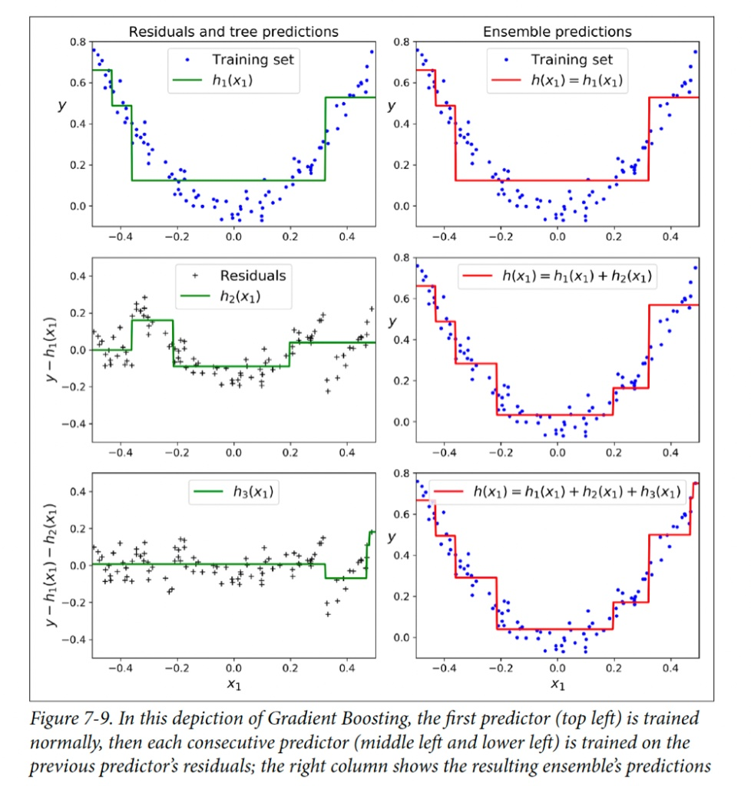

#### 6. The Overfitting Trap (`n_estimators` vs. `learning_rate`)
Finding the mathematical sweet spot for the number of trees is critical in Gradient Boosting Regression Trees (GBRT):
*   GBRT ensembles with not enough predictors will underfit the data, looking like a blocky, inaccurate step-function.
*   Conversely, ensembles with too many predictors will severely overfit, drawing jagged lines to memorize the exact noise of the training data. 

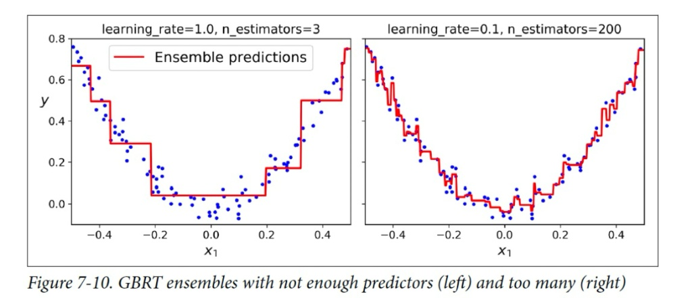

#### 7. Stochastic Gradient Boosting (The Variance Fix)
To prevent the severe overfitting shown above and speed up the sequential training, we can introduce randomness (similar to Bagging) into the Gradient Boosting algorithm:
*   The `GradientBoostingRegressor` class supports a `subsample` hyperparameter, which specifies the fraction of training instances to be used for training each tree.
*   For example, if `subsample=0.25`, then each tree is trained on 25% of the training instances, selected randomly.
*   This specific technique is called Stochastic Gradient Boosting.
*   By randomly sampling the data, this technique trades a higher bias for a lower variance, and it also speeds up training considerably.


### 7. The Titans of Tabular Data: XGBoost & LightGBM

While standard Gradient Boosting is mathematically brilliant, its standard `scikit-learn` implementation is slow on massive datasets and prone to overfitting. To solve this, researchers built independent, hyper-optimized libraries that have become the industry standard for tabular data.

#### 1. XGBoost (Extreme Gradient Boosting)
Developed by Tianqi Chen, XGBoost dominated machine learning competitions for years. It takes the sequential residual-fitting of Gradient Boosting and adds severe engineering and mathematical optimizations:

*   **Regularized Learning:** Standard GBM has no direct regularization on the tree structure itself. XGBoost introduces both $L_1$ (Lasso) and $L_2$ (Ridge) regularization penalties directly onto the weights of the leaf nodes. This forces the model to keep leaf predictions conservative, drastically reducing overfitting.
*   **Sparsity Awareness (Missing Data):** You do not need to impute (fill in) missing values for XGBoost. During training, it automatically learns the best "default direction" (left or right branch) to send data points that have missing features.
*   **Hardware Optimization:** XGBoost is "cache-aware" and allocates internal buffers to store gradients, making the sorting of data (the slowest part of tree building) incredibly fast on modern CPUs.

#### 2. LightGBM (Light Gradient Boosting Machine)
Developed by Microsoft, LightGBM was built specifically to train faster and use less memory than XGBoost on massive datasets (millions of rows). It achieved this through two massive algorithmic shifts:

*   **Histogram-Based Splitting:** Instead of sorting continuous features to find the exact perfect split threshold, LightGBM buckets continuous features into discrete "bins" (e.g., 256 bins). This reduces the time complexity of finding a split from $O(\text{data} \times \text{features})$ to $O(\text{bins} \times \text{features})$, making it blazingly fast. *(Note: XGBoost later adopted this feature too, but LightGBM pioneered it for the masses).*
*   **Leaf-Wise Tree Growth (The Game Changer):** 
    *   Standard trees and XGBoost grow **Level-Wise** (Depth-first). They split all nodes at depth 1, then all nodes at depth 2, expanding symmetrically.
    *   LightGBM grows **Leaf-Wise** (Best-first). It looks at all current leaves and chooses to split *only* the single leaf that will reduce the mathematical loss the most, regardless of its depth. 
    *   *Warning:* Leaf-wise growth creates asymmetrical, deep trees. It reduces error faster but can severely overfit if you do not strictly constrain the `max_depth` hyperparameter.

#### 3. XGBoost vs. LightGBM (Quick Comparison)

| Feature | XGBoost | LightGBM |
| :--- | :--- | :--- |
| **Tree Growth Strategy** | Level-wise (Symmetrical) | Leaf-wise (Asymmetrical, Best-first) |
| **Speed & Memory** | Fast, moderate memory | Extremely fast, highly memory efficient |
| **Overfitting Risk** | Lower (due to Level-wise growth) | Higher (Leaf-wise can create deep branches) |
| **Best Use Case** | When accuracy is paramount on small/medium datasets | When you have massive datasets and need speed |

---

#### 4. The Algorithmic Secrets (For Top-Tier Interviews)

To truly stand out, you need to know *why* these libraries are so fast. It comes down to a few specific algorithms under the hood.

**XGBoost's Secret: 2nd Order Math & Parallel Split Finding**
*   **The Math:** Standard Gradient Boosting only uses the first derivative (the gradient) to optimize the loss function. XGBoost uses a **Taylor Expansion** (second-order derivatives, using the Hessian) to approximate the loss function, allowing it to converge on the optimal solution much faster.
*   **The Parallelization Trick:** While XGBoost cannot train *trees* in parallel (because it is a boosting algorithm), it **does** parallelize the *split finding* process. It distributes the sorting of features and calculation of gradients across multiple CPU cores at each individual node.

**LightGBM's Secrets: GOSS and EFB**
LightGBM's speed comes from two proprietary algorithms designed to reduce the size of the dataset without losing accuracy:
1.  **GOSS (Gradient-based One-Side Sampling):** Not all data points are equally important. Instances with small gradients (errors) are already well-trained. GOSS keeps all instances with large gradients and randomly drops a high percentage of instances with small gradients, vastly reducing the number of rows the model has to process.
2.  **EFB (Exclusive Feature Bundling):** In sparse datasets (like those heavily One-Hot Encoded), many features never take non-zero values at the same time. EFB mathematically bundles these mutually exclusive features into a single feature, vastly reducing the number of columns.

---

#### 5. Placement Prep: Expanded XGBoost & LightGBM Question Bank

**Q1: The Parallelization Trap**
*   **Question:** "Random Forests are parallelized, while Gradient Boosting is sequential. However, XGBoost is known for being highly parallelized. How is this possible if it's a Boosting algorithm?"
*   **Answer:** XGBoost does *not* build trees in parallel; Tree 2 must still wait for Tree 1 to finish. However, it parallelizes the **node-building phase**. Building a node requires sorting data to find the best split. XGBoost stores data in in-memory units called "blocks" and distributes the sorting and gradient calculations for all features across multiple CPU threads simultaneously.

**Q2: The Pruning Mechanism**
*   **Question:** "How does XGBoost prevent overfitting when growing a tree, and how does it differ from a standard Decision Tree's stopping criteria?"
*   **Answer:** XGBoost uses a hyperparameter called `gamma` (the minimum loss reduction required to make a split). It grows the tree to its maximum depth first, and then aggressively prunes it backwards. If a bottom-level split's loss reduction is negative (or less than `gamma`), XGBoost deletes that branch.

**Q3: LightGBM's Data Reduction Strategy**
*   **Question:** "If I have a dataset with 10 million rows, LightGBM trains significantly faster than XGBoost. What specific sampling technique does LightGBM use to ignore rows during training?"
*   **Answer:** It uses **GOSS (Gradient-based One-Side Sampling)**. It calculates the gradients (errors) for all rows. It keeps all the rows with large errors but randomly drops a large percentage of the rows with small errors, allowing the tree to focus its computational power only on the instances it is currently struggling to predict.

**Q4: Handling High-Cardinality Categorical Features**
*   **Question:** "You have a categorical feature 'City' with 1,000 unique values. Standard models require One-Hot Encoding this, creating 1,000 new sparse columns. Does LightGBM require this?"
*   **Answer:** No. LightGBM has native support for categorical features. Instead of One-Hot Encoding, it uses an internal algorithm (similar to Fisher's method) to find optimal splits across the categorical groupings directly. This prevents the tree from becoming wildly unbalanced and saves massive amounts of memory compared to One-Hot Encoding.

**Q5: The Regularization Differentiator**
*   **Question:** "Standard Gradient Boosting has no concept of a 'weight penalty' on its leaves. How does XGBoost mathematically regularize its predictions?"
*   **Answer:** XGBoost adds an explicit regularization term to its objective function. It applies both $L_1$ (Lasso) and $L_2$ (Ridge) penalties to the leaf weights. This prevents any single leaf from outputting an extreme prediction, naturally smoothing the model and preventing it from memorizing outliers.

## Part 7: Principal Component Analysis (PCA)

When you are handed a dataset with 1,000 features, feeding all of them into a model will cause it to train slowly and overfit (the "Curse of Dimensionality"). **PCA** is a mathematical tool that compresses those 1,000 features down to just the most important 10 or 20, filtering out the noise while preserving the core essence of the data.

### 1. The Engine of PCA: Singular Value Decomposition (SVD)

Under the hood, PCA tears your dataset apart using a linear algebra technique called **SVD**. SVD takes your original dataset matrix (*A*) and decomposes it into three fundamental building blocks: 
```math
A = U \Sigma V^T
```
Here is how we solve this step-by-step for a simple 2x2 matrix:
```math
A = \begin{pmatrix} 2 & 2 \\ -1 & 1 \end{pmatrix}
```
#### Step 1: Find *V* (Right Singular Vectors / Principal Components)
First, we find the absolute best directions to view our data from. We do this by calculating the eigenvectors of $A^T A$.

1. **Calculate $A^T A$:**
```math
A^T A = \begin{pmatrix} 2 & -1 \\ 2 & 1 \end{pmatrix} \begin{pmatrix} 2 & 2 \\ -1 & 1 \end{pmatrix} = \begin{pmatrix} 5 & 3 \\ 3 & 5 \end{pmatrix}
```
2. **Find the Eigenvalues ($\lambda$):** 
   We solve the characteristic equation $\det(A^T A - \lambda I) = 0$:
```math
\det \begin{pmatrix} 5 - \lambda & 3 \\ 3 & 5 - \lambda \end{pmatrix} = (5 - \lambda)^2 - 9 = 0
```
```math
\lambda^2 - 10\lambda + 16 = 0 \implies (\lambda - 8)(\lambda - 2) = 0
```
   The eigenvalues are $\lambda_1 = 8$ and $\lambda_2 = 2$.

3. **Find the Eigenvectors (and normalize them):**
   * For $\lambda_1 = 8$, the normalized unit vector is $v_1 = \begin{pmatrix} 1/\sqrt{2} \\ 1/\sqrt{2} \end{pmatrix}$
   * For $\lambda_2 = 2$, the normalized unit vector is $v_2 = \begin{pmatrix} -1/\sqrt{2} \\ 1/\sqrt{2} \end{pmatrix}$

4. **Construct *V* and $V^T$:**
   We place $v_1$ and $v_2$ as columns in *V*:
```math
V = \begin{pmatrix} 1/\sqrt{2} & -1/\sqrt{2} \\ 1/\sqrt{2} & 1/\sqrt{2} \end{pmatrix} \implies V^T = \begin{pmatrix} 1/\sqrt{2} & 1/\sqrt{2} \\ -1/\sqrt{2} & 1/\sqrt{2} \end{pmatrix}
```
#### Step 2: Find $\Sigma$ (Singular Values)
Now we weigh the importance of those directions. The singular values ($\sigma$) are simply the square roots of our eigenvalues, placed on the diagonal of a matrix in descending order.
* $\sigma_1 = \sqrt{8} = 2\sqrt{2}$
* $\sigma_2 = \sqrt{2}$
```math
\Sigma = \begin{pmatrix} 2\sqrt{2} & 0 \\ 0 & \sqrt{2} \end{pmatrix}
```
#### Step 3: Find *U* (Left Singular Vectors)
Finally, we map our right singular vectors (*v*) through the original matrix *A* and scale them down by their corresponding singular value ($\sigma$). The formula is $u_i = \frac{1}{\sigma_i} A v_i$.

1. **Calculate $u_1$:**
```math
u_1 = \frac{1}{2\sqrt{2}} \begin{pmatrix} 2 & 2 \\ -1 & 1 \end{pmatrix} \begin{pmatrix} 1/\sqrt{2} \\ 1/\sqrt{2} \end{pmatrix} = \frac{1}{2\sqrt{2}} \begin{pmatrix} 4/\sqrt{2} \\ 0 \end{pmatrix} = \begin{pmatrix} 1 \\ 0 \end{pmatrix}
```
2. **Calculate $u_2$:**
```math
u_2 = \frac{1}{\sqrt{2}} \begin{pmatrix} 2 & 2 \\ -1 & 1 \end{pmatrix} \begin{pmatrix} -1/\sqrt{2} \\ 1/\sqrt{2} \end{pmatrix} = \frac{1}{\sqrt{2}} \begin{pmatrix} 0 \\ 2/\sqrt{2} \end{pmatrix} = \begin{pmatrix} 0 \\ 1 \end{pmatrix}
```
3. **Construct *U*:**
```math
U = \begin{pmatrix} 1 & 0 \\ 0 & 1 \end{pmatrix}
```
**The Final Result:** We have successfully decomposed the matrix! 
```math
A = U \Sigma V^T
```
```math
\begin{pmatrix} 2 & 2 \\ -1 & 1 \end{pmatrix} = \begin{pmatrix} 1 & 0 \\ 0 & 1 \end{pmatrix} \begin{pmatrix} 2\sqrt{2} & 0 \\ 0 & \sqrt{2} \end{pmatrix} \begin{pmatrix} 1/\sqrt{2} & 1/\sqrt{2} \\ -1/\sqrt{2} & 1/\sqrt{2} \end{pmatrix}
```
---

### 2. Kernel PCA (kPCA) and The Kernel Trick

Standard PCA assumes your data is basically flat. But what if your data is twisted like a 3D Swiss Roll? Standard PCA will squash it flat, overlapping and destroying the data patterns. 

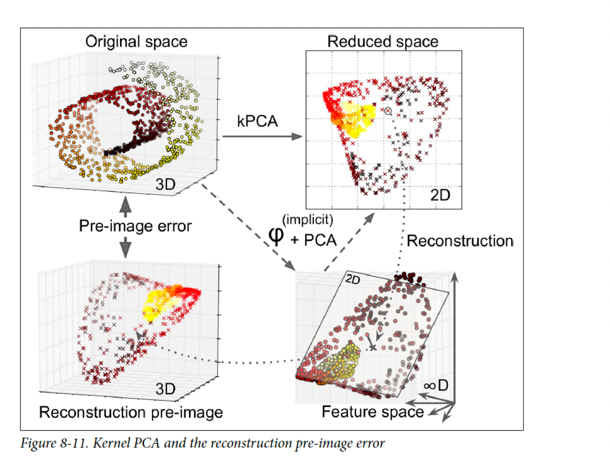

To fix this, we use **Kernel PCA**. It uses the exact same "Kernel Trick" shortcut found in Support Vector Machines:
1.  **The Concept:** It pretends to map the twisted 3D data into a massive, infinite-dimensional space where the Swiss Roll can safely "unroll" and become flat.
2.  **The Trick:** Actually doing the math in infinite dimensions would crash a computer. Instead, the Kernel Trick uses a shortcut function (like the RBF/Gaussian kernel) to calculate the relationships between the data points *as if* they were unrolled, without ever actually unrolling them. It lets us run linear PCA on highly nonlinear data.

---

### 3. The Reversal Problem: Pre-Image Error

One of the best features of standard PCA is that it is easily reversible. If you compress 3D data down to a flat 2D plane, you can just run the math in reverse to pop it back out into 3D. With Kernel PCA, this reversal is incredibly difficult.

*(Insert `image_e71e65.jpg` and `image_e71e5e.jpg` side-by-side or stacked here)*

*   **The Problem:** Because kPCA used a mathematical shortcut to skip the infinite-dimensional space, we don't have the exact coordinates to run the math in reverse. We cannot easily go backward from the 2D Reduced Space to the 3D Original Space.
*   **The Pre-image:** To solve this, the algorithm has to *guess* (approximate) what the original 3D point looked like based on its 2D coordinates. This approximation is called the "pre-image".
*   **The Error:** Because it is only a guess, the reconstructed 3D shape does not perfectly match the original 3D shape. The physical distance between the true original point and our reconstructed guess is called the **pre-image error**. 

---

### 4. Placement Prep: PCA Flashcards

**Q1: In an interview, how would you simply explain what the *V* matrix and the $\Sigma$ matrix represent in SVD?**
*   **Answer:** The *V* matrix contains the Principal Components—the physical directions in which the data varies the most. The $\Sigma$ matrix contains the Singular Values, which tell us the "weight" or importance of each of those directions. We keep the directions with the highest singular values and drop the rest to compress the data.

**Q2: Why is the Kernel Trick necessary for nonlinear dimensionality reduction?**
*   **Answer:** Standard PCA relies on linear projections. If data is highly twisted, a linear projection will crush the structure. The Kernel Trick mathematically simulates mapping the data into a higher-dimensional space where it *is* linearly flat, bypassing the impossible computational cost of actually transforming the coordinates.

**Q3: Explain the "Pre-image error" in Kernel PCA.**
*   **Answer:** Because kPCA uses a mathematical shortcut (the kernel trick) to skip mapping into infinite dimensions, you cannot cleanly invert the function to reconstruct the original high-dimensional data. Instead, the algorithm has to estimate the original points (the pre-image). The difference between this estimation and the true original data point is the pre-image error.


### 5. Locally Linear Embedding (LLE)

While PCA and Kernel PCA are incredibly popular, **Locally Linear Embedding (LLE)** is another powerful nonlinear dimensionality reduction (NLDR) technique. 

Unlike PCA, LLE is a Manifold Learning technique that **does not rely on projections**. Instead, it is particularly excellent at unrolling twisted manifolds, especially when there is not too much noise in the dataset.

It works in two distinct steps: first measuring how instances relate to their immediate neighbors, and then preserving those exact relationships in a lower-dimensional space.

#### Step 1: Linearly Modeling Local Relationships
Instead of looking at the massive, global structure of the dataset, LLE zooms in on local neighborhoods.

*   For each training instance $\mathbf{x}^{(i)}$, the algorithm identifies its *k* closest neighbors.
*   It then attempts to reconstruct that specific instance $\mathbf{x}^{(i)}$ as a linear function of those neighbors.
*   It does this by finding the optimal weights ($w_{i,j}$) so that the squared distance between $\mathbf{x}^{(i)}$ and its reconstructed self ($\sum_{j=1}^{m} w_{i,j} \mathbf{x}^{(j)}$) is as small as possible.
*   **The Constraints:** If a point $\mathbf{x}^{(j)}$ is *not* one of the *k* closest neighbors, its weight is forced to 0. Furthermore, the weights for the neighbors of each instance must be normalized (they must sum to 1).

This creates our first constrained optimization problem, resulting in a weight matrix $\widehat{\mathbf{W}}$ that perfectly encodes the local linear relationships between all training instances:
```math
\widehat{\mathbf{W}} = \underset{\mathbf{W}}{\text{argmin}} \sum_{i=1}^{m} \left( \mathbf{x}^{(i)} - \sum_{j=1}^{m} w_{i,j} \mathbf{x}^{(j)} \right)^2
```
#### Step 2: Reducing Dimensionality While Preserving Relationships
Now that we have a matrix ($\widehat{\mathbf{W}}$) that perfectly describes how every point relates to its neighbors, we want to map the training instances into a new *d*-dimensional space (where $d < n$). 

*   We let $\mathbf{z}^{(i)}$ represent the new image of $\mathbf{x}^{(i)}$ in this lower-dimensional space.
*   We want the squared distance between this new point $\mathbf{z}^{(i)}$ and its reconstructed self in the new space ($\sum_{j=1}^{m} \widehat{w}_{i,j} \mathbf{z}^{(j)}$) to remain as small as possible.
*   **The Reversal:** This looks identical to Step 1, but we flip the variables. Instead of keeping the instances fixed and searching for optimal weights, we now keep the weights fixed ($\widehat{w}_{i,j}$) and search for the optimal physical positions of the new instances ($\mathbf{Z}$) in the low-dimensional space.

This leads to the final unconstrained optimization problem:
```math
\widehat{\mathbf{Z}} = \underset{\mathbf{Z}}{\text{argmin}} \sum_{i=1}^{m} \left( \mathbf{z}^{(i)} - \sum_{j=1}^{m} \widehat{w}_{i,j} \mathbf{z}^{(j)} \right)^2
```
#### The Major Drawback: Computational Complexity
While LLE is brilliant mathematically, you must be careful when using it on large datasets. `scikit-learn`'s implementation scales beautifully for finding neighbors and optimizing weights, but the final step (constructing the low-dimensional representations) has a complexity of $O(dm^2)$. 

Because of that $m^2$ term (where *m* is the number of training instances), this algorithm scales incredibly poorly to very large datasets. 

---

#### 5. Placement Prep: LLE Flashcards

**Q1: How does LLE differ fundamentally from standard PCA in how it reduces dimensions?**
*   **Answer:** Standard PCA relies on finding a global hyperplane and projecting the data onto it to preserve maximum variance. LLE does not use projections. Instead, it is a manifold learning technique that measures how each data point linearly relates to its *k*-nearest neighbors, and then maps the points to a lower dimension while trying to perfectly preserve those local relationships.

**Q2: Describe the two-step optimization process of LLE.**
*   **Answer:** 
    *   **Step 1:** The algorithm keeps the original high-dimensional data points fixed and searches for the optimal *weights* to reconstruct each point from its nearest neighbors. 
    *   **Step 2:** The algorithm keeps those discovered weights fixed and searches for the optimal *coordinates* in the new low-dimensional space that minimize the exact same reconstruction error.

**Q3: Why might you avoid using LLE on a dataset with 1 million rows?**
*   **Answer:** The final step of the LLE algorithm—constructing the low-dimensional representations—has a computational complexity of $O(dm^2)$. The squared number of instances ($m^2$) means the algorithm scales exceptionally poorly and will choke on very large datasets.


## Part 8: Unsupervised Learning — Clustering

While PCA is used for dimensionality reduction (finding the hidden axes of data), **Clustering** is used to group unlabeled data points into distinct, non-overlapping categories based on their similarities. 

The most famous and widely used clustering algorithm is **K-Means**.

### 1. The K-Means Algorithm (Lloyd's Algorithm)

The goal of K-Means is simple: group your data into *k* distinct clusters. But because the data has no labels, the algorithm has to figure out where the center of those clusters should be entirely on its own. 

It does this through an iterative, two-step process:
1.  **Initialization:** The algorithm randomly picks *k* data points to act as the initial cluster centers (called **centroids**).
2.  **Assignment Step:** It measures the Euclidean distance from every single data point to each of the *k* centroids. It assigns each point to the centroid it is closest to.
3.  **Update Step:** Now that the points are assigned to groups, the algorithm recalculates the actual center of each group (the mean of all points in that cluster). It moves the centroid to this new mean coordinate.
4.  **Repeat:** It repeats the Assignment and Update steps until the centroids stop moving (convergence).

### 2. The Objective Function: Inertia (WCSS)

How does K-Means know if it is doing a good job? It tries to minimize a metric called **Inertia** (also known as Within-Cluster Sum of Squares, or WCSS). 

Inertia calculates the squared distance between each data point and its assigned centroid, and sums them all up. A lower inertia means the points are tightly packed around their cluster centers.

### 3. Finding the Optimal *k* (Hyperparameter Tuning)

The biggest challenge in K-Means is that you have to tell the algorithm how many clusters (*k*) to look for *before* it starts. If you guess wrong, the results are useless. There are two primary ways to mathematically determine the best *k*:

#### Method A: The Elbow Method (Using Inertia)
If you train K-Means with $k=1$, $k=2$, $k=3$, etc., and plot the Inertia, the line will always go down (because more clusters mean smaller distances). However, you are looking for the point where the drop in inertia sharply slows down, forming an "elbow."

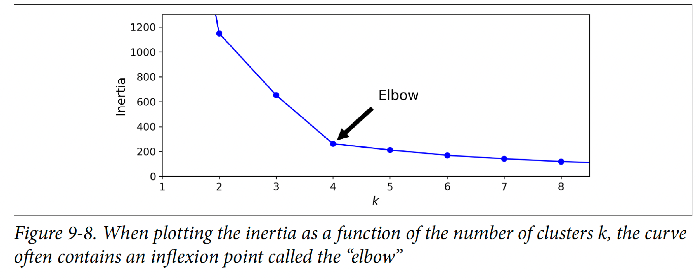

In Figure 9-8, the inertia drops massively from $k=2$ to $k=3$ to $k=4$. But after $k=4$, the improvements become marginal. The inflection point (the elbow) is at $k=4$, suggesting that 4 is the optimal number of clusters for this dataset.

#### Method B: The Silhouette Score (The Superior Metric)
While the Elbow Method is a good quick visual, the **Silhouette Score** is mathematically superior and much more precise. It evaluates the quality of the clusters by measuring both cohesion and separation.

For every single data point, it calculates:
*   *a*: The mean distance to all other points in its *own* cluster (Cohesion).
*   *b*: The mean distance to all points in the *next nearest* cluster (Separation).

The Silhouette Score for a point is: 
```math
s = \frac{b - a}{\max(a, b)}
```
*   **Score = +1:** The point is perfectly inside its own cluster and far from others. (Excellent)
*   **Score = 0:** The point is right on the boundary between two clusters.
*   **Score = -1:** The point was likely assigned to the wrong cluster.

To find the best *k*, you calculate the average Silhouette Score across all points for different values of *k* and pick the *k* that yields the highest average score (closest to +1).

### 4. The Three Fatal Flaws of K-Means (Interview Gold)

Interviewers will always test if you know when *not* to use K-Means.

1.  **The Random Initialization Trap:** If the initial random centroids are placed poorly (e.g., two centroids right next to each other), the algorithm can get stuck in a terrible local minimum. 
    *   *The Fix:* Use **K-Means++**. This is a smart initialization step (the default in `scikit-learn`) that ensures the initial centroids are placed as far away from each other as mathematically possible.
2.  **Sensitivity to Scale:** Because K-Means relies entirely on calculating Euclidean distances, features with larger scales (e.g., Salary in thousands vs. Age in tens) will completely dominate the distance calculations.
    *   *The Fix:* You **must** scale/standardize your data (using `StandardScaler`) before running K-Means.
3.  **Assumption of Spherical Clusters:** K-Means geometrically draws straight boundaries halfway between centroids. It assumes all clusters are perfectly spherical and roughly the same size. 
    *   *The Flaw:* If your data has elongated clusters (like a cigar shape) or concentric circles (a donut shape), K-Means will fail spectacularly. You must use density-based algorithms like DBSCAN instead.

---

### 5. Placement Prep: K-Means Flashcards

**Q1: Explain the difference between Inertia and the Silhouette Score for evaluating clusters.**
*   **Answer:** Inertia only measures *cohesion*—how tightly packed the points are around their centroid (lower is better, but it naturally decreases as *k* increases). The Silhouette Score measures both *cohesion* and *separation*—it evaluates how close a point is to its own cluster compared to how far it is from the next closest cluster. It scales from -1 to 1, making it an absolute metric where a higher score is definitively better.

**Q2: What is K-Means++, and why is it necessary?**
*   **Answer:** Standard K-Means initializes centroids completely at random, which can lead the algorithm to converge on a highly suboptimal local minimum. K-Means++ introduces a probabilistic initialization step where the first centroid is chosen randomly, but subsequent centroids are explicitly chosen to be as far away from the existing centroids as possible, dramatically improving convergence quality and speed.

**Q3: You are given a dataset containing the physical coordinates of customers. Some groupings look like long, winding lines along a highway, while others are dense circles in a city. Will K-Means cluster this data effectively?**
*   **Answer:** No. K-Means heavily assumes that clusters are spherical (isotropic) and have roughly similar variance. It uses strict Euclidean distance from a central point, so it will slice those long, winding highway clusters into arbitrary pieces. A density-based algorithm like DBSCAN would be required here.

**Q4: Is feature scaling required for K-Means? Why or why not?**
*   **Answer:** Yes, it is absolutely required. K-Means calculates the Euclidean distance between points. If one feature ranges from 0 to 100,000 and another ranges from 0 to 1, the algorithm will mathematically treat the larger feature as exponentially more important, completely ignoring the structural variance of the smaller feature.


### 2. DBSCAN (Density-Based Spatial Clustering of Applications with Noise)

Imagine we collected weight and height measurements from a bunch of people. By eye, it is very easy to spot two clusters if the points are packed tightly together in high-density regions. 

However, if one cluster literally *wraps around* another cluster (nested clusters), a standard method like K-Means will completely fail. K-Means assumes clusters are circular and computes distance from a center point, meaning it will draw straight lines directly through nested data, assigning points to the wrong groups!

To identify weirdly shaped or nested clusters, we need a method that groups data strictly by **density**. Let's see how DBSCAN mimics what we do easily by eye. **BAM!**

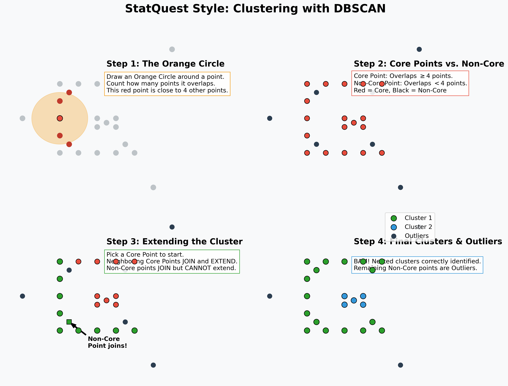

#### The Two Rules of DBSCAN
Before we start, DBSCAN requires two user-defined parameters:
1. **Epsilon ($\epsilon$):** The radius of the "Orange Circle" we draw around each point.
2. **MinPts:** The minimum number of points required inside the Orange Circle to be considered a dense region (For this example, let's assume `MinPts = 4`).

#### Step 1: The Orange Circle and Core Points
Starting with raw, unclustered data, we count the number of points close to every single point.
*   We pick a point and draw an **Orange Circle** around it.
*   We count how many points the circle overlaps.
*   If the Orange Circle overlaps at least 4 points (our `MinPts`), we label that point a **Core Point**. 
*   If a point's circle overlaps fewer than 4 points, it is labeled a **Non-Core Point**.

#### Step 2: Building the First Cluster
We randomly pick a Core Point and assign it to **Cluster 1**. 
*   Next, any neighboring Core Points that overlap with the first one **JOIN** the cluster and **EXTEND** it. They cast their own Orange Circles, pulling in even more Core Points.
*   The cluster grows like a chain reaction until it runs out of neighboring Core Points.

#### Step 3: Handling Non-Core Points
What happens when the growing cluster bumps into a Non-Core Point?
*   Because the Non-Core point is close to the cluster, it is allowed to **JOIN** Cluster 1.
*   However, because it is *not* a Core Point, it does **NOT** get to cast an Orange Circle to pull in new points.
*   *Key Rule:* Non-Core points can only *join* a cluster; they cannot *extend* it!

#### Step 4: Final Clusters and Outliers
Once Cluster 1 can't grow anymore, we move to the next unassigned Core Point and start building **Cluster 2** using the exact same rules. 

Eventually, all Core Points will be assigned to a cluster. Any remaining Non-Core points that are not close to *any* cluster are left out in the cold. These are completely unassigned and officially classified as **Outliers** (or Noise).

**Triple BAM!!!** We successfully identified nested clusters and isolated the outliers.

#### 5. How to Choose Hyperparameters (The K-Distance Graph)
While you don't have to guess the number of clusters $k$, you *do* have to find the perfect value for Epsilon ($\epsilon$). Guessing $\epsilon$ randomly is a terrible idea. Instead, we use the **K-Distance Graph** (also called the Knee Method):

1. **Set MinPts:** A standard rule of thumb is $MinPts = 2 \times D$ (where $D$ is the number of dimensions/features). So for a 2D dataset, $MinPts = 4$.
2. **Calculate Distances:** For every single point in your dataset, calculate the distance to its $k$-th nearest neighbor (e.g., its 4th nearest neighbor).
3. **Sort and Plot:** Sort those distances from smallest to largest and plot them on a line graph.
4. **Find the Knee:** Look for the point of maximum curvature (the "knee" or "elbow"). The distance value at this exact inflection point is your optimal $\epsilon$!

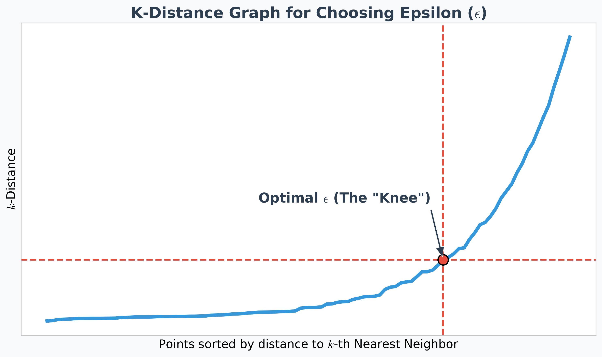

#### 6. K-Means vs. DBSCAN (The Ultimate Cheatsheet)

| Feature | K-Means | DBSCAN |
| :--- | :--- | :--- |
| **Shape Assumption** | Assumes clusters are convex/spherical. | Handles arbitrarily shaped/nested clusters. |
| **Outliers** | Forces all outliers into a cluster, skewing centroids. | Actively identifies and isolates outliers as Noise. |
| **Hyperparameters** | Requires $k$ (number of clusters). | Requires $\epsilon$ (radius) and MinPts. |
| **Cluster Densities** | Handles varying densities well. | **Fails** if clusters have vastly different densities. |
| **Speed** | Extremely fast ($O(N)$). | Slower ($O(N \log N)$ or worse with naive implementation). |

#### 7. Pros and Cons of DBSCAN
**Pros:**
*   You do **not** need to specify the number of clusters (*k*) beforehand!
*   It can find arbitrarily shaped clusters (moons, circles, S-shapes).
*   It is robust to outliers (it actively identifies and ignores them, whereas K-Means gets pulled off-center by them).

**Cons:**
*   **Varying Densities:** If your dataset has one cluster that is extremely dense and another cluster that is very sparse, DBSCAN will fail. You can only pick one `eps` radius. If you make it too small, the sparse cluster becomes "noise." If you make it too big, the dense clusters merge together.
*   **High Dimensions:** Because it relies on Euclidean distance to draw its `eps` circles, DBSCAN suffers heavily from the Curse of Dimensionality.

---

#### 8. Placement Prep: Elite DBSCAN Flashcards

**Q1: In an interview, how would you explain the difference between a Core Point, a Border Point, and a Noise Point in DBSCAN?**
*   **Answer:** A Core Point is in a dense region, meaning it has at least `min_samples` neighbors within a radius of `eps`. A Border Point is in a sparse region (fewer than `min_samples`), but it sits just inside the radius of a Core Point. A Noise Point is completely isolated; it is neither a Core Point nor close to one.

**Q2: What is the single biggest advantage DBSCAN has over K-Means?**
*   **Answer:** DBSCAN can identify clusters of arbitrary, non-linear shapes (like nested rings or crescent moons) because it links points based on continuous local density. K-Means assumes clusters are convex and spherical, causing it to fail on complex geometries. Additionally, DBSCAN naturally identifies and isolates outliers, whereas K-Means forces every outlier into a cluster, skewing the centroids.

**Q3: How does DBSCAN inherently determine the number of clusters ($k$), and how does this contrast with K-Means?**
*   **Answer:** Unlike K-Means, which requires the user to explicitly define $k$ before training, DBSCAN determines the number of clusters dynamically. It simply counts how many separated, contiguous regions of high density exist in the data based on the provided $\epsilon$ and MinPts parameters.

**Q4: What is the main computational bottleneck of DBSCAN, and what is its Big-O complexity?**
*   **Answer:** The primary bottleneck is the neighborhood search (finding all points within the Orange Circle for every single point). A naive implementation calculates the distance between all pairs of points, resulting in a computational complexity of $O(N^2)$. However, this can be optimized to $O(N \log N)$ by using spatial indexing structures like KD-Trees or Ball-Trees to dramatically speed up the radius queries.

**Q5: Can standard DBSCAN cluster data where the different clusters have vastly different densities?**
*   **Answer:** No, this is DBSCAN's fundamental weakness. Because DBSCAN applies a single, global $\epsilon$ radius and MinPts threshold across the entire dataset, it struggles if Cluster A is extremely dense but Cluster B is very sparse. If you set $\epsilon$ small enough to capture Cluster A cleanly, Cluster B might be entirely discarded as outliers. To solve this, you would need to upgrade to **HDBSCAN** (Hierarchical DBSCAN), which mathematically handles varying densities across the dataset.

**Q6: A Border point sits exactly halfway between a Core Point in Cluster A and a Core Point in Cluster B. Which cluster does the Border point join?**
*   **Answer:** DBSCAN builds clusters sequentially. The Border point will be assigned to whichever cluster the algorithm happens to build *first*. Once a point is assigned to a cluster, it cannot be reassigned.


<br><br>

# ==========================================
# 🧠 WELCOME TO DEEP LEARNING 🧠
# ==========================================

## Deep Learning Part 1: Multi-Layer Perceptrons (MLPs) & Non-Linearity

A standard Linear Regression or Logistic Regression model is essentially a single neuron. It takes inputs, multiplies them by weights, adds a bias, and draws a straight line. If your data is highly complex (like a circle inside a circle, or an image of a dog), a single straight line is useless.

A **Multi-Layer Perceptron (MLP)** solves this by stacking hundreds or thousands of neurons together in a specific architecture. 

### 1. The Architecture of an MLP
An MLP is a **Feedforward Neural Network**, meaning data flows strictly in one direction (from left to right) with no loops. It consists of three types of layers:
1.  **Input Layer:** The raw data entering the network. (If your dataset has 10 features, you have 10 input neurons).
2.  **Hidden Layers:** The layers sandwiched in the middle. This is where the network does the actual "thinking" and feature extraction. A network is considered "Deep" Learning if it has two or more hidden layers.
3.  **Output Layer:** The final prediction. (For binary classification, this is a single neuron outputting a probability between 0 and 1).

**Fully Connected (Dense):** In a standard MLP, every single neuron in one layer is physically connected to every single neuron in the next layer. Each connection has its own specific **weight**, and every receiving neuron has its own **bias**.

### 2. The Secret Sauce: Activation Functions
If you build a massive neural network with 10 hidden layers and 1,000 neurons, but you do *not* use an activation function, the entire network will mathematically collapse back into a single linear regression model. 

*Linear + Linear + Linear = Linear.*

To solve complex problems, we must inject **non-linearity** into the network. We do this by passing the output of every neuron through an Activation Function before sending it to the next layer.

#### The Big Three Activation Functions:
1.  **ReLU (Rectified Linear Unit):** The undisputed default for Hidden Layers. It simply outputs the input directly if it is positive; otherwise, it outputs zero. It is computationally incredibly fast and solves major mathematical issues during training.
```math
\text{ReLU}(x) = \max(0, x)
```
2.  **Sigmoid:** Squashes any number into a range between 0 and 1. It is almost exclusively used in the **Output Layer** for binary classification (e.g., Is this spam? 0.99 = Yes). It is rarely used in hidden layers today because it causes the network to stop learning (the Vanishing Gradient problem).
```math
\sigma(x) = \frac{1}{1 + e^{-x}}
```
3.  **Softmax:** Used exclusively in the **Output Layer** for Multi-Class Classification (e.g., Is this a cat, dog, or bird?). It takes a vector of raw scores and turns them into a list of probabilities that perfectly sum to 1.

---

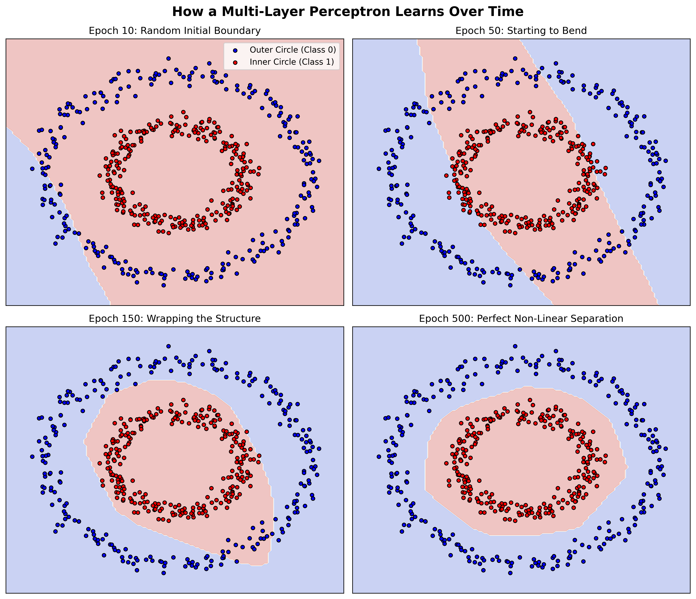

---

### 3. Placement Prep: MLP Flashcards

**Q1: Why is an activation function required in the hidden layers of a Neural Network?**
*   **Answer:** Without non-linear activation functions, the entire neural network is just applying a series of matrix multiplications. Because the product of multiple linear transformations is just another linear transformation, the deep network would be mathematically equivalent to a single-layer linear regression model, entirely unable to learn complex, non-linear patterns.

**Q2: What happens if you initialize all the weights in a Multi-Layer Perceptron to exactly zero before training?**
*   **Answer:** The network will fail to learn. This is called the "Symmetry Problem." If all weights are zero, every neuron in a hidden layer will receive the exact same signal, calculate the exact same gradient during backpropagation, and update by the exact same amount. The network will act as if it only has one neuron per layer, completely destroying its capacity to learn. Weights must be initialized randomly.

**Q3: Why has ReLU replaced Sigmoid as the standard activation function for hidden layers?**
*   **Answer:** The Sigmoid function flattens out (saturates) when inputs are very high or very low, causing its derivative to become almost zero. During backpropagation, these tiny gradients multiply together, completely halting the learning process in deep networks (the Vanishing Gradient Problem). ReLU has a constant derivative of 1 for all positive values, allowing gradients to flow freely backward through the network without vanishing, drastically speeding up convergence.


## Part 2: How Neural Networks Learn (Forward & Backpropagation)

A Neural Network learns in a continuous loop consisting of three phases: making a guess (Forward Propagation), calculating how wrong the guess was (Loss), and adjusting its internal gears to be less wrong next time (Backpropagation and Gradient Descent).

### 1. Forward Propagation (Making the Guess)
Forward propagation is simply the process of passing data from the input layer, through the hidden layers, to the output layer to get a prediction ($\hat{y}$).

For a single artificial neuron, the math is a two-step process:
1.  **The Linear Combination:** Multiply the inputs by their weights and add the bias.
```math
z = (w_1 x_1 + w_2 x_2 + \dots + w_n x_n) + b
```
    *(In linear algebra terms for a whole layer: $\mathbf{z} = \mathbf{W}\mathbf{x} + \mathbf{b}$)*
2.  **The Activation:** Pass that result through an activation function (like ReLU) to introduce non-linearity.
```math
a = \text{ReLU}(z)
```
This output (*a*) is then passed as the input (*x*) to the next layer. This repeats until the final prediction is made.

### 2. The Loss Function (Calculating the Error)
Once the network makes its prediction ($\hat{y}$), we compare it to the actual true label (*y*). The mathematical formula used to measure this distance is the **Loss Function** (or Cost Function).

*   **For Regression:** We usually use **Mean Squared Error (MSE)**.
```math
L = \frac{1}{2}(y - \hat{y})^2
```
*   **For Classification:** We use **Cross-Entropy Loss** (Log Loss), which heavily penalizes the network if it is highly confident in the wrong answer.

### 3. Backpropagation (The Engine of Learning)
Backpropagation is short for "backward propagation of errors." It is the algorithm used to figure out exactly how much every single weight and bias in the network contributed to the final error. 

It does this using the **Chain Rule of Calculus**. We want to find the partial derivative of the Loss with respect to a specific weight ($\frac{\partial L}{\partial w}$). In plain English: *"If I tweak this specific weight by a tiny amount, exactly how much will the final error change?"*

By applying the Chain Rule, we step backward through the network's math:
```math
\frac{\partial L}{\partial w} = \frac{\partial L}{\partial a} \cdot \frac{\partial a}{\partial z} \cdot \frac{\partial z}{\partial w}
```
#### The Mathematical Example (Step-by-Step)
Imagine a tiny network with 1 input, 1 neuron, and 1 output. 
*   **Input (*x*):** 2
*   **Target (*y*):** 0
*   **Current Weight (*w*):** 0.5
*   **Current Bias (*b*):** 0

**Step A: Forward Pass**
1.  $z = w \cdot x + b \implies (0.5 \cdot 2) + 0 = 1$
2.  Pass through ReLU activation: $a = \max(0, 1) = 1$. (Our prediction $\hat{y}$ is 1).
3.  Calculate Loss (MSE): $L = \frac{1}{2}(1 - 0)^2 = 0.5$

**Step B: Backpropagation (Chain Rule)**
We need to find $\frac{\partial L}{\partial w}$.
1.  **Derivative of Loss w.r.t Activation:** $\frac{\partial L}{\partial a} = (a - y) = (1 - 0) = 1$
2.  **Derivative of Activation w.r.t *z*:** The derivative of ReLU for a positive number is exactly 1. So, $\frac{\partial a}{\partial z} = 1$
3.  **Derivative of *z* w.r.t Weight:** Since $z = wx + b$, the derivative with respect to *w* is simply the input *x*. So, $\frac{\partial z}{\partial w} = 2$

Multiply them together: $\frac{\partial L}{\partial w} = 1 \cdot 1 \cdot 2 = \mathbf{2}$
*The gradient is 2. This means that if we increase the weight, the loss will go up. Therefore, we need to decrease the weight!*

### 4. Gradient Descent (The Weight Update)
Now that Backpropagation has given us the gradient (the slope of the error), we use an optimizer algorithm called **Gradient Descent** to physically update the weight.

We update the old weight by subtracting the gradient, scaled by a hyperparameter called the **Learning Rate** ($\alpha$):
```math
w_{\text{new}} = w_{\text{old}} - \alpha \left( \frac{\partial L}{\partial w} \right)
```
If our learning rate $\alpha = 0.1$:
```math
w_{\text{new}} = 0.5 - 0.1(2) = 0.3
```
The weight has been updated from 0.5 to 0.3. The next time the network makes a guess, its error will be smaller!

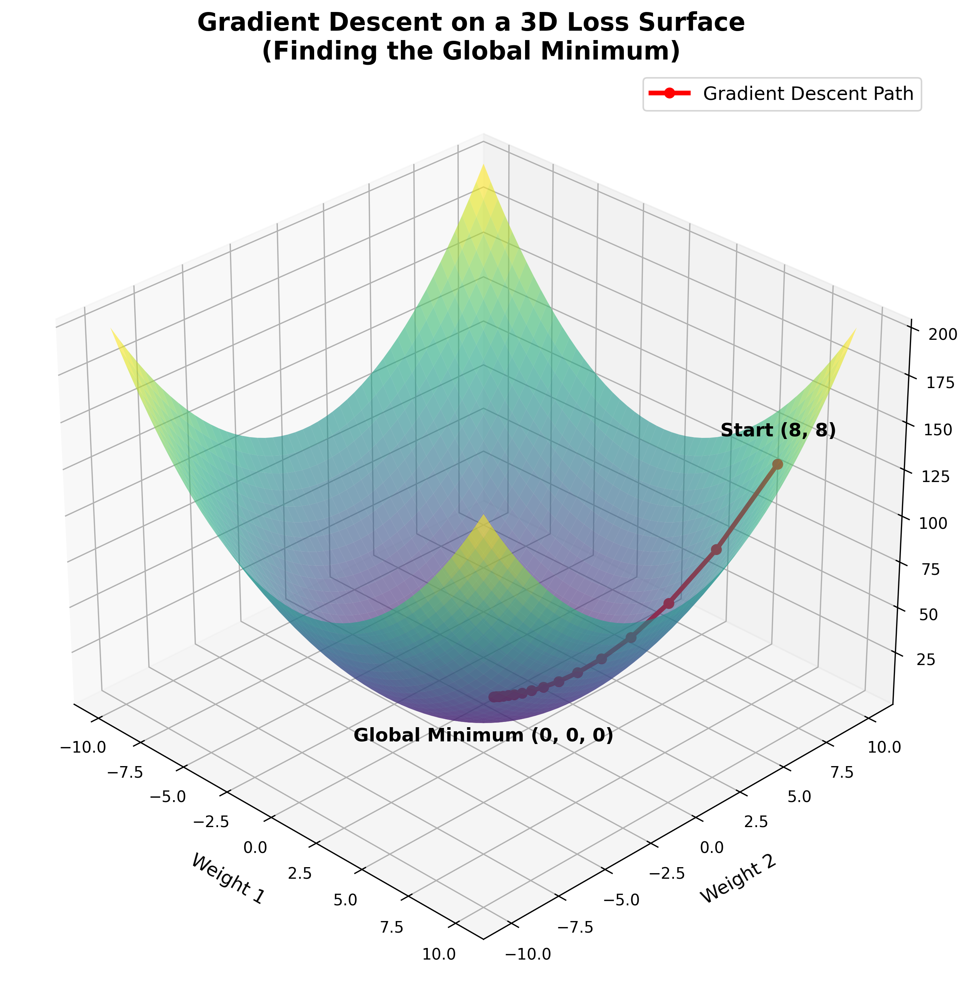

---

### 5. Placement Prep: Forward & Backprop Flashcards

**Q1: Explain the role of the Chain Rule in Backpropagation.**
*   **Answer:** The Chain Rule is used to calculate the gradient of the Loss function with respect to every single weight in the network. Because a neural network is essentially a massive composite function (functions nested inside functions), the Chain Rule allows us to multiply the local gradients of each layer together, passing the error backwards from the output layer all the way to the input layer.

**Q2: What is the Learning Rate, and what happens if it is set too high or too low?**
*   **Answer:** The Learning Rate ($\alpha$) controls the step size the optimizer takes when updating the weights during Gradient Descent. If it is too low, the network will take tiny steps and train incredibly slowly, potentially getting stuck in local minima. If it is too high, the network will take massive steps, constantly overshooting the global minimum, causing the loss to diverge and explode instead of converging.

**Q3: What is the difference between an Epoch and a Batch during training?**
*   **Answer:** A **Batch** (or Mini-batch) is a subset of the training data passed through the network before the weights are updated via backpropagation. An **Epoch** occurs when the network has completed a full forward and backward pass over the *entire* training dataset. (e.g., If you have 1,000 images and a batch size of 100, it takes 10 batches to complete 1 Epoch).

**Q4: In the context of Gradient Descent, what is a "Local Minimum" and how do modern optimizers (like Adam) avoid it?**
*   **Answer:** The loss landscape of a deep neural network is highly non-convex (it looks like a mountain range, not a smooth bowl). A local minimum is a small valley that is not the lowest possible point (the global minimum). Modern optimizers like **Adam** introduce *Momentum*—mathematically simulating a ball rolling down a hill that builds up speed, allowing it to "roll out" of shallow local minima to find deeper, better solutions.


## Part 3: The Engine of Learning — Optimizers

Deep learning models usually have a strong complexity and come up with millions or even billions of trainable parameters. These models are trained using an optimization technique that adjusts parameters to minimize a particular loss function. While standard Stochastic Gradient Descent (SGD) is widely used, advanced techniques like Momentum, RMSProp, and Adam are required to improve convergence speed and stability.

### 1. The Flaw of SGD: Pathological Curvature
The most fundamental algorithm is Gradient Descent, which steps in the exact direction of the calculated gradient. However, this naive approach fails spectacularly when it enters a "ravine" (an area where the surface is much more steep in one dimension than in another).

*   **The Trap:** In a ravine, gradient descent bounces along the ridges, moving a lot slower towards the local minima. Because the surface curves much more steeply in one direction, the optimizer is constantly pulled back and forth across the ravine walls rather than straight down to the minimum.
*   If we use a slower learning rate to prevent the bouncing, the optimization may become too slow to be practical and even appear to halt altogether, creating the false impression of a local minimum.

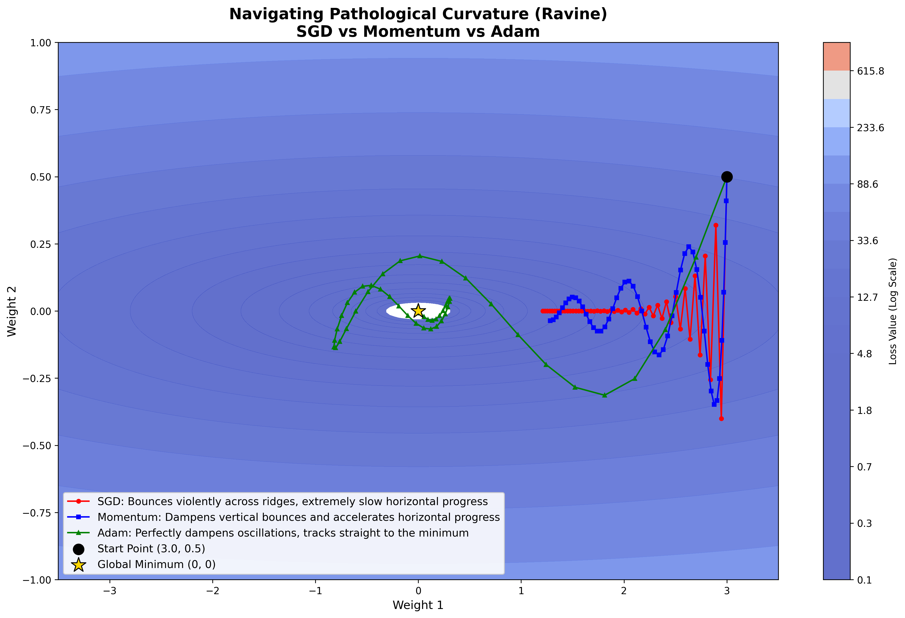

### 2. SGD with Momentum
Momentum accelerates gradient descent by using a moving average of past gradients, helping reduce oscillations and speed up convergence.

*   **The Intuition:** It behaves like a heavy ball rolling down a hill. The momentum term increases updates for dimensions whose gradients point in the same directions and reduces updates for dimensions whose gradients change directions.
*   **The Math:** It uses an exponentially moving average to store trend information about a set of previous gradient values.
```math
v_t = \beta \cdot v_{t-1} + (1 - \beta) \cdot \nabla_\theta J(\theta)
```
```math
\theta_{t+1} = \theta_t - \alpha \cdot v_t
```
    *(Where $v_t$ is the velocity/running average, $\beta$ is the momentum term typically set close to 0.9, and $\alpha$ is the learning rate).*

### 3. AdaGrad (Adaptive Gradient Algorithm)
Standard algorithms keep the learning rate constant throughout the training, which is inefficient. AdaGrad assigns a unique learning rate to each parameter.

*   **The Intuition:** If a weight has been having very huge updates, the learning rate for that specific weight will decrease. Inversely, for smaller gradients, the learning rate will be bigger. This way, Adagrad deals with vanishing and exploding gradient problems.
*   **The Math:** It achieves this by storing the sum of squared historical gradients for each parameter.
```math
\theta_{t+1} = \theta_t - \frac{\alpha}{\sqrt{G_{diag} + \epsilon}} \cdot \nabla_\theta J(\theta)
```
    *(Where $G_{diag}$ is a diagonal matrix containing the sum of past squared gradients, and $\epsilon$ is a very small value to ensure division by zero does not occur).*
*   **The Fatal Flaw:** Because it accumulates squared gradients, the denominator always grows. A limitation of AdaGrad is that it tends to overly decrease the learning rate over time. This causes the algorithm to tend to converge slowly during the last iterations where it becomes very low.

### 4. RMSProp (Root Mean Square Propagation)
RMSprop was devised by the legendary Geoffrey Hinton to specifically fix AdaGrad's diminishing learning rate problem.

*   **The Intuition:** Instead of keeping a sum of all past squared gradients, RMSProp uses an exponentially weighted moving average of squared gradients. This puts more emphasis on recent gradient values rather than equally distributing importance.
*   **The Math:**
```math
S_t = \beta S_{t-1} + (1 - \beta) (\nabla_\theta J)^2
```
```math
\theta_{t+1} = \theta_t - \frac{\alpha}{\sqrt{S_t} + \epsilon} \cdot \nabla_\theta J
```
    *(By prioritizing recent gradients, RMSProp automatically will decrease the size of the gradient steps towards minima when the steps are too large, making the algorithm less prone to overshooting without causing the learning rate to decay to zero).*

### 5. Adam (Adaptive Moment Estimation)
Adam is currently the most famous optimization algorithm in deep learning. Adam combines the advantages of Momentum and RMSprop techniques to adjust learning rates during training.

*   **The Intuition:** It keeps track of the exponentially moving averages for computed gradients (Momentum) and squared gradients (RMSProp) respectively. It works well with large datasets and complex models because it uses memory efficiently and adapts the learning rate for each parameter automatically.
*   **The Math:**
    1.  **Calculate Momentum (First Moment):**
```math
m_t = \beta_1 m_{t-1} + (1 - \beta_1) \nabla_\theta J
```
    2.  **Calculate RMSProp (Second Moment):**
```math
v_t = \beta_2 v_{t-1} + (1 - \beta_2) (\nabla_\theta J)^2
```
    3.  **Bias Correction:** Because *m* and *v* start at zero, they are heavily biased toward zero in the beginning. Adam applies bias correction to prevent instability during early training stages.
```math
\hat{m}_t = \frac{m_t}{1 - \beta_1^t} \quad \text{and} \quad \hat{v}_t = \frac{v_t}{1 - \beta_2^t}
```
    4.  **Final Update:**
```math
\theta_{t+1} = \theta_t - \frac{\alpha \hat{m}_t}{\sqrt{\hat{v}_t} + \epsilon}
```
---

### 6. Placement Prep: Optimizers Flashcards

**Q1: Why does standard Stochastic Gradient Descent (SGD) struggle with "Pathological Curvature"?**
*   **Answer:** In a ravine (pathological curvature), the loss surface curves much more steeply in one dimension than the other. SGD only looks at the immediate gradient, so it ends up bouncing wildly back and forth across the steep ridges instead of moving smoothly down the center of the ravine toward the local minimum.

**Q2: How does the mathematical mechanism of Momentum solve the bouncing problem of SGD?**
*   **Answer:** Momentum uses an exponentially moving average to store trend information about previous gradient values. The momentum term reduces updates for dimensions whose gradients constantly change directions (canceling out the bouncing) and increases updates for dimensions whose gradients consistently point in the same direction, resulting in faster convergence.

**Q3: What is the primary difference in how AdaGrad and RMSProp calculate their adaptive learning rates?**
*   **Answer:** AdaGrad sums up all historical squared gradients from the very first iteration, meaning the learning rate constantly decays and eventually tends to overly decrease over time. RMSProp addresses this by using an exponentially weighted moving average of squared gradients, which puts more emphasis on recent gradient values and prevents the learning rate from prematurely dying.

**Q4: Explain the architecture of the Adam Optimizer.**
*   **Answer:** Adam (Adaptive Moment Estimation) combines the first-order momentum of SGD with the second-order momentum of RMSProp. It adapts the learning rate for each parameter individually based on both the moving average of past gradients and the moving average of squared gradients. It also applies a mathematical bias correction to prevent instability during the early stages of training when the moving averages are initialized at zero.


## Part 4: Regularization (Preventing Memorization)

Deep neural networks contain millions of parameters. Because they are so mathematically powerful, they can easily memorize the exact noise and outliers of your training dataset, resulting in a model that performs perfectly in training but fails spectacularly in the real world. This is called Overfitting (High Variance).

Regularization is a set of techniques used to artificially constrain the network, forcing it to learn the general, underlying patterns rather than memorizing the exact data points.

### 1. Mathematical Weight Penalties (L1 and L2)
The most fundamental way to constrain a network is to alter its Loss Function. We add a "penalty term" ($\Omega$) to the loss function that mathematically punishes the network for having large weights.
```math
L_{\text{total}} = L_{\text{data}} + \Omega(w)
```
*(Where $L_{\text{data}}$ is your standard loss like MSE or Cross-Entropy, and $\Omega(w)$ is the penalty applied to the weights).*

#### L1 Regularization (Lasso / Sparsity)
L1 adds the sum of the absolute values of the weights to the loss function.
```math
\Omega(w) = \lambda \sum \vert{}w_i\vert{}
```
*   **The Effect:** L1 calculates the derivative of an absolute value, which is a constant (either +1 or -1). This physically forces the weights of less important features down to exactly zero. It acts as a built-in feature selection tool, leaving a "sparse" network where only the most critical connections survive.

#### L2 Regularization (Ridge / Weight Decay)
L2 adds the sum of the squared values of the weights to the loss function.
```math
\Omega(w) = \frac{\lambda}{2} \sum w_i^2
```
*   **The Effect:** Because it squares the weights, L2 heavily penalizes outlier weights that are extremely large, but the penalty approaches zero as the weight gets smaller. It smoothly shrinks all weights toward zero, but rarely pushes them to exactly zero. It forces the network to rely on all features a little bit, rather than heavily relying on just one feature.

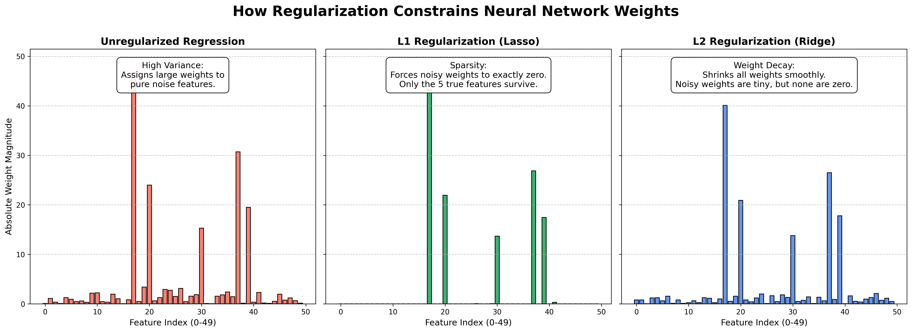

#### L1 vs. L2 Quick Comparison:
| Feature | L1 Regularization | L2 Regularization (Weight Decay) |
| :--- | :--- | :--- |
| **Math Penalty** | Absolute values of weights | Squared values of weights |
| **Effect on Weights** | Pushes unimportant weights to exactly 0 | Shrinks all weights toward 0 (rarely exact 0) |
| **Model Complexity** | Creates sparse, simpler models | Creates dense, distributed models |
| **Best Use Case** | When you have lots of noisy, useless features | The default choice for most neural networks |

### 2. Architectural Regularization Techniques

Beyond altering the mathematical loss function, we can physically change the architecture or the training process itself to prevent memorization.

#### Dropout
In a standard deep neural network, neurons often develop "Co-adaptation." This means a few specific neurons become incredibly strong "super neurons" that make all the decisions, while the rest of the neurons become lazy and just pass along the strong signals. If the testing data slightly deviates from the training data, these "super neurons" fail, and the whole network collapses.

During every single training batch, **Dropout** literally deactivates a random percentage of neurons (usually 20% to 50%) in the hidden layers. 
*   **The Effect:** Because a neuron never knows if its neighboring "super neuron" will be active or dead on any given batch, it cannot rely on it. It is forced to independently learn useful features from the data.
*   **The Result:** The network distributes the learning across the entire architecture, creating a highly robust, ensemble-like model.
*   **Crucial Note:** Dropout is *strictly* turned off during inference/testing. During testing, all neurons are active. However, because a neuron is now receiving 100% of its inputs (instead of, say, 50% during training), the final signal will be twice as large as the network expects, blowing up the activations. To fix this, the outgoing weights are mathematically scaled down by the probability of the neuron being active:
```math
W_{\text{test}} = W_{\text{train}} \times (1 - p)
```
    *(Where *p* is the dropout rate. If $p=0.5$, we multiply all weights by 0.5 during testing to perfectly balance the expected signal).*

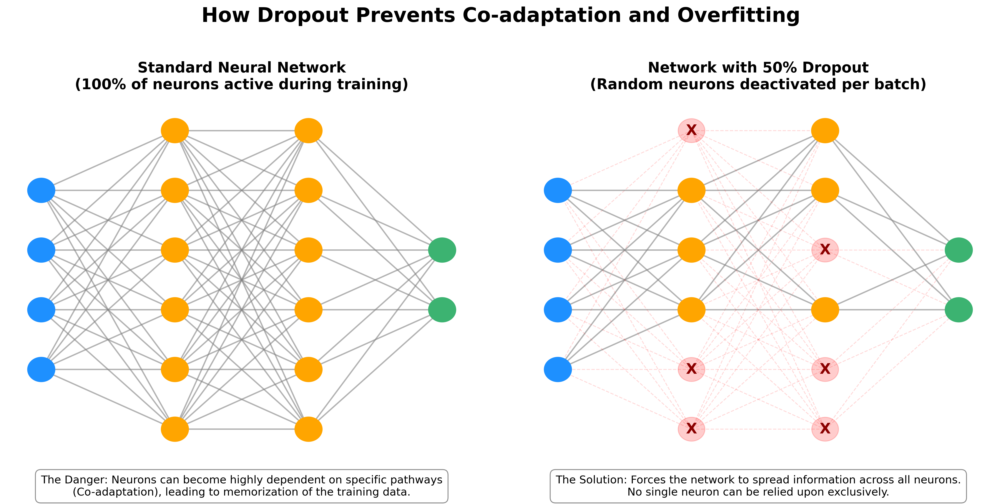

#### Early Stopping
When you train a deep network, you split your data into a Training set and a Validation set. 
As training progresses, the network gets better and better at mapping the training data, so the **Training Loss** will continuously decrease. However, eventually, the network stops learning the underlying patterns and starts purely memorizing the noise and outliers of the training set.

*   **The Divergence Point:** The exact moment the network starts memorizing, its performance on the unseen Validation set will start getting worse. The **Validation Loss** will stop decreasing and will actually spike upward.
*   **The Solution:** Early Stopping acts as a watchdog. It monitors the Validation Loss at the end of every epoch. The moment the Validation Loss stops improving (usually after a "patience" of 5-10 epochs), the algorithm literally halts the training loop and reverts the network's weights to the exact epoch where the Validation Loss was at its absolute minimum.

#### Data Augmentation
The absolute best way to prevent overfitting is not math—it is simply getting more high-quality training data. If a model sees 10 million diverse examples of a cat, it cannot possibly memorize them all, so it is forced to learn what a cat actually is.

If you cannot get more data, you fabricate it using **Data Augmentation**.
*   If training an image classifier on a dataset of 1,000 cats, you can mathematically rotate, crop, flip, zoom, or slightly color-shift the existing images during every training batch.
*   **The Effect:** You have artificially expanded your dataset from 1,000 images to effectively infinite variations. It forces the network to learn the *invariant features* of the object (e.g., a cat is still a cat even if it is upside down or zoomed in), completely destroying the network's ability to memorize exact pixel layouts.

---

### 3. Placement Prep: Regularization Flashcards

**Q1: How does L2 Regularization mathematically prevent exploding gradients and overfitting?**
*   **Answer:** L2 Regularization adds the sum of the squared weights to the loss function. When calculating the gradient during backpropagation, the derivative of $w^2$ is *2w*. This means that in every weight update step, the network artificially subtracts a fraction of the weight's own value from itself (known as Weight Decay). This strictly prevents any single weight from growing too large and dominating the network's output.

**Q2: What is the primary architectural difference between L1 and L2 regularization?**
*   **Answer:** L1 drives the weights of unimportant features to exactly zero, resulting in a sparse model that inherently performs feature selection. L2 shrinks all weights proportionally toward zero but rarely reaches exact zero, resulting in a dense model where all features contribute slightly.

**Q3: Explain the concept of "Co-adaptation" in neural networks and how Dropout solves it.**
*   **Answer:** Co-adaptation happens when a neuron relies too heavily on the output of specific neurons in the previous layer, failing to learn robust features on its own. Dropout randomly deactivates neurons during each training pass, forcing every single neuron to independently learn useful features, as it cannot mathematically guarantee that its "favorite" input neurons will be active during that specific batch.

**Q4: Why must Dropout be turned off during model testing/inference, and what mathematical adjustment is made?**
*   **Answer:** Dropout forces robust learning by randomly deactivating pathways. During inference, we want a stable, deterministic prediction, so we leave 100% of neurons active. However, if we trained a network with 50% dropout, turning all neurons on during testing means the next layer suddenly receives twice as much signal as it is used to. To compensate, we mathematically scale the testing weights by multiplying them by the retention probability $(1 - p)$. For example, if dropout was $p=0.5$, we scale the testing weights by $0.5$ to keep the expected output balanced.

**Q5: You are training a very deep network. Your training loss is at 0.01, but your validation loss is at 2.50. What is happening, and how do you fix it?**
*   **Answer:** The network is severely overfitting. It has memorized the training data but fails to generalize to unseen validation data. To fix this, you should increase regularization (increase Dropout rates or L2 penalty values), apply Data Augmentation to create a more robust training set, or implement Early Stopping to halt training before the divergence occurs.

**Q6: What is the "Patience" parameter in Early Stopping?**
*   **Answer:** The Validation Loss often fluctuates slightly during training. If Early Stopping halted training the very first time the loss ticked upward, it might stop the model prematurely before a breakthrough. The "Patience" parameter tells the algorithm to wait for a specific number of epochs (e.g., 5 or 10) to see if the loss continues to worsen before officially pulling the plug and stopping training.


## Part 5: Computer Vision — Convolutional Neural Networks (CNNs)

If you feed a 1000x1000 pixel image into a standard Multi-Layer Perceptron (MLP), the input layer would need 1,000,000 neurons. If the first hidden layer has 1,000 neurons, you immediately have 1 billion weights to train. The network will instantly overfit, and training will crawl to a halt. 

**Convolutional Neural Networks (CNNs)** solve this through **Parameter Sharing** and **Local Connectivity**. Instead of looking at every pixel at once, a CNN acts like a flashlight, scanning small patches of the image one by one to detect patterns like edges, textures, and eventually, entire objects.

---

### Topic 1: The Convolution Operation (Kernels & Feature Maps)

The core engine of a CNN is the Convolutional Layer. It does not use standard weights. Instead, it uses small, square matrices called **Filters** (or Kernels). 

#### 1. How the "Flashlight" Works
Imagine a 5x5 pixel image and a 3x3 Filter designed to detect vertical edges.
1.  The 3x3 filter is placed over the top-left 3x3 patch of the input image.
2.  The network performs an **element-wise multiplication** between the pixels in the image and the weights in the filter.
3.  It sums all those values together into a single number. 
4.  That single number is placed into a new output matrix called the **Feature Map**.
5.  The filter then slides over by one pixel and repeats the process until it has scanned the entire image.

#### 2. The Mathematical Example (Solved)
Let's look at the exact math for the very first step of a convolution.

**Input Image Patch ($3 \times 3$)**:
```math
\begin{bmatrix} 
1 & 1 & 0 \\ 
1 & 1 & 0 \\ 
1 & 1 & 0 
\end{bmatrix}
```

**Vertical Edge Filter ($3 \times 3$)**:
```math
\begin{bmatrix} 
1 & 0 & -1 \\ 
1 & 0 & -1 \\ 
1 & 0 & -1 
\end{bmatrix}
```

**The Operation:** We multiply each corresponding cell and sum them up.
```math
\begin{aligned}
(1 \cdot 1) + (1 \cdot 0) + (0 \cdot -1) &= 1 \\
(1 \cdot 1) + (1 \cdot 0) + (0 \cdot -1) &= 1 \\
(1 \cdot 1) + (1 \cdot 0) + (0 \cdot -1) &= 1
\end{aligned}
```
**Sum = 3**. 

The number **3** becomes the very first pixel in the top-left corner of the new Feature Map. Because the number is highly positive, the network knows it just found a strong vertical edge!

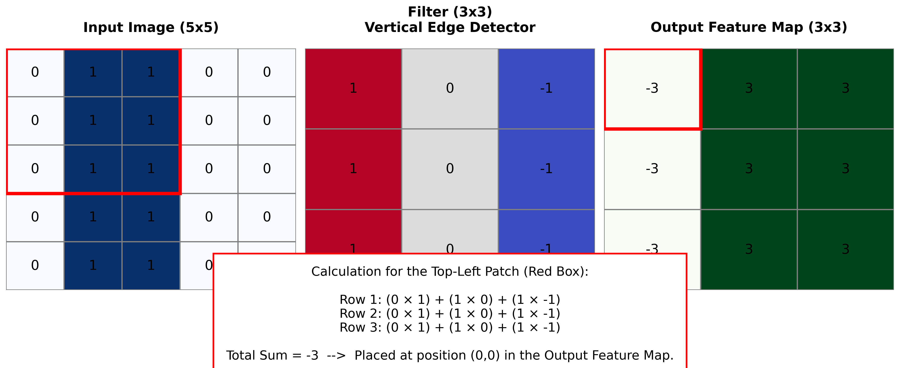

#### 3. Output Dimension Formula (Without Padding)
When you slide a $3 \times 3$ filter over a $5 \times 5$ image, the filter cannot scan the very edges without falling off the image. Therefore, the resulting Feature Map is smaller than the input. 

The mathematical formula to calculate the output size of a feature map (assuming a stride of 1 and no padding) is:
```math
\text{Output Size} = n - f + 1
```
*(Where *n* is the input image size, and *f* is the filter size).*

For our $5 \times 5$ image with a $3 \times 3$ filter:
```math
\text{Output Size} = 5 - 3 + 1 = 3
```
The resulting Feature Map will be a $3 \times 3$ matrix.

---

### Topic 1 Placement Prep: Convolution Flashcards

**Q1: What is the primary advantage of a Convolutional Layer over a standard Fully Connected (Dense) Layer when processing images?**
*   **Answer:** CNNs utilize "Parameter Sharing" and "Local Connectivity." Instead of learning a separate weight for every single pixel (which leads to millions of parameters and overfitting), a CNN learns a single small filter (e.g., $3 \times 3$) and sweeps it across the entire image. This drastically reduces the number of parameters and allows the network to recognize a feature (like an eye) regardless of where it is physically located in the image (Translation Invariance).

**Q2: In a CNN, what exactly is the network "learning" during backpropagation?**
*   **Answer:** It is learning the optimal numerical values inside the Filters/Kernels. While humans manually design filters to find hardcoded features (like a Sobel filter for edges), a CNN starts with random numbers in its filters and uses Gradient Descent to figure out exactly what patterns (edges, textures, shapes) it needs to look for to minimize the loss function.

**Q3: If you pass a 32x32 image through a Convolutional Layer with a 5x5 filter (with a stride of 1 and no padding), what are the dimensions of the resulting feature map?**
*   **Answer:** The output dimension is $28 \times 28$. The formula is $(n - f + 1)$. So, $(32 - 5 + 1) = 28$.


### Topic 2: Padding & Stride (Controlling Dimensions)

In a standard convolution, sliding a filter over an image causes two major problems:
1.  **Shrinking Output:** Every time you pass an image through a convolutional layer, it shrinks. If you have a deep network with 50 layers, the image will mathematically shrink to nothing before it reaches the end.
2.  **Loss of Edge Information:** The pixels in the dead center of the image are scanned multiple times by the sliding filter. The pixels on the very edges or corners are only scanned once. The network is essentially throwing away edge data.

#### 1. Padding (*p*)
To solve both of these problems, we use **Padding**. Before passing the filter over the image, we artificially add a border of pixels around the outside of the original image (usually filling them with zeros, known as "Zero Padding"). 

*   **Valid Padding:** This means *no padding*. The image is allowed to shrink.
*   **Same Padding:** We add just enough padding so that the Output Feature Map has the exact same dimensions as the Input Image. 

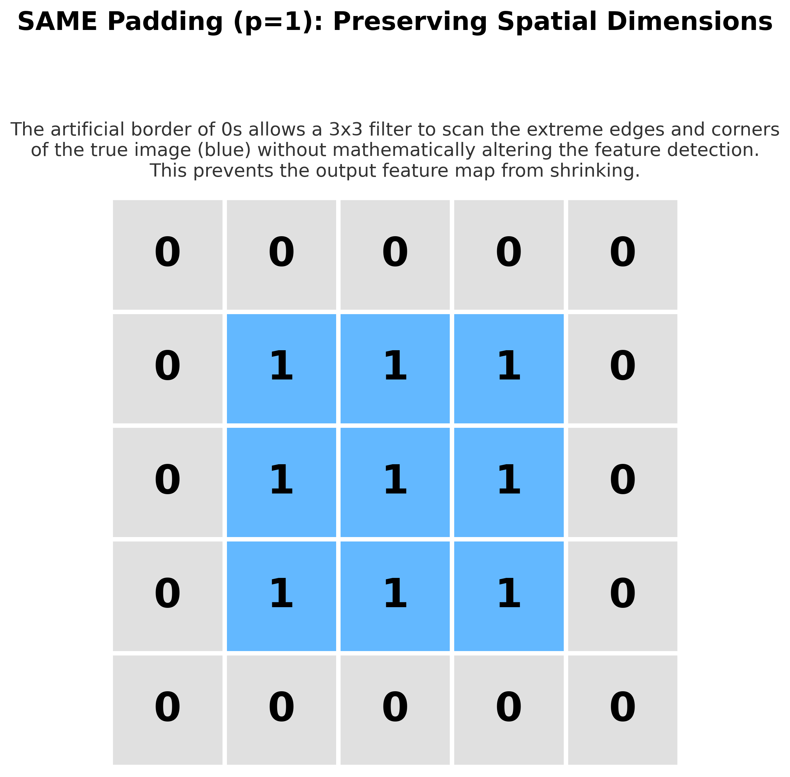

By adding this artificial border of zeros, the filter is now able to slide over the true edge pixels multiple times, preserving that edge information without heavily impacting the math (because adding 0 to the sum does not change the feature detection).

#### 2. Stride (*s*)
By default, a filter slides over by 1 pixel at a time ($s=1$). However, sometimes we *want* to aggressively shrink the image to reduce computational load. 

**Stride** is the number of pixels the filter jumps when it slides. If we set the Stride to 2 ($s=2$), the filter jumps 2 pixels at a time, effectively skipping data. This cuts the spatial dimensions of the feature map roughly in half.

#### 3. The Master Formula for CNN Dimensions
This is the single most important mathematical formula to memorize for Computer Vision interviews. If you are given an Input Image of size $n \times n$, a Filter of size $f \times f$, a Padding of *p*, and a Stride of *s*, the exact spatial dimension of the output feature map is:
```math
\text{Output Size} = \lfloor \frac{n + 2p - f}{s} \rfloor + 1
```
*(Note: $\lfloor \dots \rfloor$ means you round down/floor the result if it is a decimal).*

**The Math Example:**
You have a $7 \times 7$ input image. You apply a $3 \times 3$ filter. You use a Stride of 2, and add a Padding of 1. What is the output size?
*   $n = 7$
*   $f = 3$
*   $p = 1$
*   $s = 2$
```math
\text{Output Size} = \lfloor \frac{7 + 2(1) - 3}{2} \rfloor + 1
```
```math
\text{Output Size} = \lfloor \frac{7 + 2 - 3}{2} \rfloor + 1
```
```math
\text{Output Size} = \lfloor \frac{6}{2} \rfloor + 1 = 3 + 1 = \mathbf{4}
```
The output feature map will be exactly **$4 \times 4$**.

---

### Topic 2 Placement Prep: Padding & Stride Flashcards

**Q1: What are the two primary reasons we use Zero Padding in a Convolutional Layer?**
*   **Answer:** First, to prevent the spatial dimensions of the feature maps from rapidly shrinking as they pass through deep network layers. Second, to prevent the network from throwing away data; padding allows the filter to scan the extreme edges and corners of the image as many times as it scans the center pixels.

**Q2: What is the difference between "Valid" padding and "Same" padding?**
*   **Answer:** "Valid" padding means no padding is applied at all, allowing the output dimensions to naturally shrink via the formula $n - f + 1$. "Same" padding means we artificially add enough zero-padding to ensure the output feature map matches the exact spatial dimensions of the input image.

**Q3: How does increasing the Stride affect the output of a Convolutional Layer?**
*   **Answer:** Increasing the stride forces the filter to skip pixels as it slides across the image. A stride of 2 will roughly halve the width and height of the resulting feature map. It is primarily used as a form of spatial downsampling to reduce computational complexity and increase the receptive field of the deeper layers.

**Q4: Calculate the output dimensions for a $32 \times 32$ image passing through a $5 \times 5$ filter, with a stride of 1 and a padding of 2.**
*   **Answer:** $32 \times 32$. Using the formula $\lfloor \frac{n + 2p - f}{s} \rfloor + 1$: 
    $\lfloor \frac{32 + 2(2) - 5}{1} \rfloor + 1 \implies (32 + 4 - 5) + 1 \implies 31 + 1 = 32$. (This is an exact mathematical example of "Same" padding).

### Topic 2 Placement Prep: Advanced Padding & Stride Flashcards

**Q1: Why are filter sizes in CNNs almost exclusively odd numbers (e.g., $3 \times 3$, $5 \times 5$) when using "Same" padding?**
*   **Answer:** Odd-sized filters have a distinct central pixel, which provides a symmetrical focal point for the convolution. Mathematically, it allows for symmetrical padding on all boundaries of the image. To keep the output size the same with a stride of 1, the padding formula is $p = \frac{f - 1}{2}$. An even-sized filter (like $4 \times 4$) would require asymmetric padding (e.g., 1 pixel on the left, 2 on the right), which artificially shifts and distorts the spatial alignment of the feature maps.

**Q2: Both a Stride of 2 and a $2 \times 2$ Max Pooling layer reduce the spatial dimensions of a feature map by exactly half. Why might a modern network architecture (like a GAN or ResNet) choose a Strided Convolution instead of Max Pooling?**
*   **Answer:** Max Pooling is a fixed, non-differentiable mathematical rule (it simply extracts the maximum value and deletes the rest). A Strided Convolution uses *trainable weights* to step over the image. By replacing pooling layers with strided convolutions, you allow the neural network to explicitly learn its own optimal downsampling technique via backpropagation, often resulting in richer representational learning without throwing data away blindly.

**Q3: You are designing a CNN and want to use a massive $7 \times 7$ filter to capture wide features, keeping a Stride of 1. You must ensure the output has the exact same spatial dimensions as the input. How much padding do you need?**
*   **Answer:** 3 pixels on all sides. To achieve exact "Same" padding when $s = 1$, you use the formula $p = \frac{f - 1}{2}$. For a $7 \times 7$ filter, $p = \frac{7 - 1}{2} = 3$. 

**Q4: You decide to change the very first convolutional layer of your network from a Stride of 1 to a Stride of 2. How does this immediately impact your GPU memory usage and the network's "Receptive Field"?**
*   **Answer:** A stride of 2 halves both the width and height of the resulting feature map. This cuts the GPU RAM required to store that layer's activation maps by a massive **75%** (it is 1/4th the total area). Furthermore, it rapidly accelerates the expansion of the **Receptive Field**—meaning neurons in the subsequent layers will "see" a much larger physical area of the original input image much earlier in the network, though at the cost of losing fine-grained, high-resolution textures.


### Topic 2 Placement Prep: Senior-Level Padding & Stride Flashcards

**Q1: During Backpropagation, how does the error gradient mathematically flow backward through a Convolutional Layer that used a Stride of 2?**
*   **Answer:** A Stride of 2 means the forward pass actively skipped alternating pixels. Because the gradient map must match the exact dimensions of the original input, the backward pass requires creating a sparse matrix. The gradients for the pixels that were actively used in the forward pass are computed normally, but the gradients for the "skipped" pixels are strictly filled with **zeros**. The error does not flow back into pixels that did not contribute to the forward calculation.

**Q2: In deep Generative Adversarial Networks (GANs) or Image-to-Image translation models, using standard "Zero Padding" at every layer often results in visible grid-like artifacts or dark halos around the edges of the generated images. Why? What is the architectural fix?**
*   **Answer:** Repeated zero-padding injects a massive amount of artificial "dead" data at the boundaries of the feature maps. In deep networks, the model learns that these dark, artificial borders are a fundamental statistical feature of the data (known as the "border effect"). To fix this, advanced architectures use **Reflection Padding** or **Replication Padding** instead. These methods mirror the actual edge pixels of the image rather than appending absolute zeros, maintaining the continuous spatial distribution of the image edges.

**Q3: You are building a dense prediction model (like U-Net for semantic segmentation) where you cannot afford to lose spatial resolution, but you desperately need to increase the "Receptive Field" to understand global context. If you cannot use Stride or Pooling, what is the solution?**
*   **Answer:** You use **Dilated Convolutions (Atrous Convolutions)**. Instead of using a Stride to skip pixels as the filter *moves*, dilation injects empty spaces *inside the filter itself*. A $3 \times 3$ filter with a dilation rate of 2 spreads out to cover a $5 \times 5$ physical area of the image, while still only requiring 9 trainable weights. This exponentially increases the receptive field deep in the network without downsampling the spatial resolution.

**Q4: If a Stride of 2 ($s=2$) downsamples an image by half, how do models like Autoencoders conceptually use "Fractional Stride" to upsample a small feature map back into a high-resolution image?**
*   **Answer:** This is achieved using a **Transposed Convolution** (often incorrectly called a deconvolution). A fractional stride (e.g., $s=1/2$) mathematically works by physically injecting zeros *between* the pixels of the input feature map, forcing the matrix to expand. A standard convolutional filter is then passed over this padded, expanded matrix, allowing the network's weights to explicitly learn how to properly interpolate and "paint" the missing high-resolution details.


### Topic 3: Pooling Layers (Downsampling, Invariance, & Receptive Fields)

While Convolutional layers extract features (edges, textures, eyes), Pooling Layers aggressively compress the spatial dimensions of those features. Pooling layers have zero trainable parameters (no weights or biases). They strictly apply a fixed mathematical rule over a sliding window.

#### 1. The Core Operations

*   **Max Pooling:** Slides a window (usually $2 \times 2$ with a stride of 2) over the feature map and extracts the absolute maximum value, discarding all other numbers.
    *   *The Intuition:* A high number in a feature map means "I found the feature!" Max pooling ensures that if the feature was detected anywhere in that window, the signal is preserved and passed to the next layer.
*   **Average Pooling:** Calculates the arithmetic mean of the window. It is rarely used in intermediate layers today because it artificially dilutes strong activations by blending them with dead (zero) pixels.

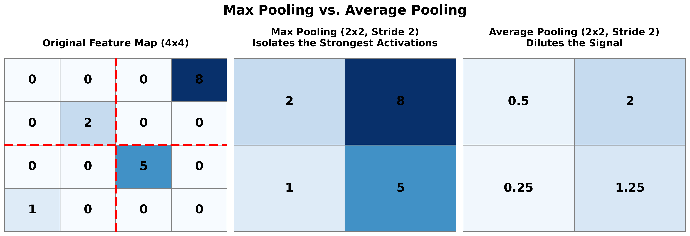

#### 2. Equivariance vs. Invariance (Crucial Distinction)

*   **Convolution is Equivariant:** If you shift a picture of a cat 1 pixel to the right, the activations in the Convolutional layer's feature map will also shift exactly 1 pixel to the right. The features move with the object.
*   **Pooling is Invariant:** Pooling provides **Local Translation Invariance**. Because Max Pooling extracts the highest value from a $2 \times 2$ region, shifting the cat slightly will likely result in the exact same maximum value being pooled. The network learns to recognize that the feature exists, while actively throwing away information about *exactly* where it exists.

#### 3. Receptive Field Expansion

By downsampling the image by half, pooling layers geometrically accelerate the expansion of the **Receptive Field**. Without pooling or strides, a deep convolutional layer can only "see" a tiny patch of the original image. But if a $3 \times 3$ filter acts on a feature map that has already been halved by pooling, that filter is mathematically processing a $6 \times 6$ area of the original input image. Pooling allows deeper layers to understand global context without adding any trainable parameters.

#### 4. Overlapping Pooling

Typically, pooling uses $f=2$ and $s=2$ (non-overlapping). However, pioneering architectures like AlexNet utilized **Overlapping Pooling** ($f=3$, $s=2$). By allowing the pooling windows to overlap, the network became slightly more robust to precise spatial locations, which empirical results showed reduced overfitting by roughly 0.4%.

#### 5. Global Average Pooling (GAP)

In older networks (like VGG16), the final 3D feature maps were physically unrolled (Flattened) into a massive 1D vector and passed through standard dense layers to make a prediction. This resulted in millions of parameters and massive overfitting.

Modern architectures (like ResNet) use **Global Average Pooling (GAP)** instead. GAP takes an entire 2D feature map (e.g., a $7 \times 7$ grid) and averages all 49 pixels into a single number. If you have 512 feature maps, GAP collapses them into a simple 1D vector of length 512, completely eliminating the need for massive fully connected layers.

---

### Topic 3 Placement Prep: Senior-Level Pooling Flashcards

**Q1: Since Pooling layers have no trainable weights, how does the error gradient physically flow through a Max Pooling layer versus an Average Pooling layer during Backpropagation?**
*   **Answer:** During the forward pass, a $2 \times 2$ Max Pool routes only the single highest value. Therefore, during backpropagation, the gradient is routed 100% to the index of that winning pixel, and the other 3 pixels receive a gradient of exactly 0. In a $2 \times 2$ Average Pool, the gradient is distributed equally; each of the 4 pixels receives exactly $\frac{1}{4}$ of the incoming gradient.

**Q2: Differentiate between "Translation Equivariance" and "Translation Invariance" in the context of a CNN.**
*   **Answer:** Convolutional layers are *equivariant*; if the input shifts, the output feature map shifts by the exact same amount. Pooling layers (and the overall CNN prediction) strive to be *invariant*; regardless of where the object shifts in the image, the final classification output ("Cat") remains completely unchanged. Pooling forces invariance by destroying precise spatial coordinates.

**Q3: What is the architectural advantage of replacing traditional Flattening + Dense Layers with a Global Average Pooling (GAP) layer at the end of a CNN?**
*   **Answer:** GAP drastically reduces the total parameter count of the network (often saving tens of millions of weights), which heavily prevents overfitting. Furthermore, because standard Dense layers require a strictly fixed input size, utilizing GAP makes the neural network fully convolutional, meaning it can dynamically accept input images of any resolution (e.g., passing a 1080p image into a model trained on $224 \times 224$ images).

**Q4: Geoffrey Hinton (a godfather of Deep Learning) famously criticized Max Pooling, leading him to develop Capsule Networks. What is the fundamental structural flaw of Max Pooling?**
*   **Answer:** Max Pooling actively destroys spatial hierarchies and positional relationships in the data. It tells the network if a feature exists, but forgets where it is relative to other features. Because of this, a CNN might look at an image where a mouth is physically located above the eyes and still confidently classify it as a "Face," simply because both features triggered high activations that survived the pooling layer.

**Q5: You are building a CNN to read highly fine-grained barcodes, where the exact thickness and spacing of the lines hold all the information. Should you aggressively use Max Pooling?**
*   **Answer:** No. Max Pooling explicitly introduces translation invariance and discards exact spatial data. For highly fine-grained spatial tasks (like reading barcodes or precise medical image segmentation), throwing away spatial resolution will destroy the model's accuracy. You should minimize pooling and rely on Strided Convolutions or Dilated Convolutions to expand the receptive field without completely discarding spatial coordinates.

**Q6: What is "Stochastic Pooling" and what problem does it attempt to solve?**
*   **Answer:** Stochastic pooling is a regularization technique designed to replace standard Max Pooling to prevent overfitting. Instead of always taking the absolute maximum value, it calculates the probabilities of all values in the region and randomly samples one. Stronger activations have a higher chance of being picked, but occasionally weaker ones are chosen, acting similarly to Dropout by forcing the network to not overly rely on a single dominant feature.


## Topic 4: The Classification Head & Dimensionality Manipulation

A CNN acts like an assembly line. The first part (Convolutional layers) extracts 3D features like edges and textures. The final part (the "Classification Head") must take those 3D features and output a simple 1D list of probabilities (e.g., 90% Dog, 10% Cat). 

Historically, this transition was extremely clunky. Modern deep learning has completely redesigned it.

#### 1. The Old Way: Flattening & Dense Layers (The Parameter Explosion)
In classic models like VGG16, to transition from 3D feature maps to a 1D probability, they literally just "flattened" the 3D block of data into one massive, long line of numbers.
*   **The Problem:** Imagine flattening a $7 \times 7$ grid with 512 channels. You get a single vector of $25,088$ numbers. If you connect that to a Dense layer of $4,096$ neurons, every single one of those 25,088 numbers needs a dedicated connection to all 4,096 neurons.
*   **The Result:** $25,088 \times 4,096 \approx \mathbf{102.7 \text{ million parameters}}$. 
*   **The Consequence:** Over 80% of VGG16's brain power is entirely wasted in this final step! Dense layers are greedy and inherently prone to memorizing the exact training images (overfitting). You have to use massive amounts of Dropout just to prevent the network from cheating.

#### 2. The Modern Magic Wand: $1 \times 1$ Convolutions
To avoid this parameter explosion, modern networks use $1 \times 1$ convolutions (also called Pointwise Convolutions). 

Think of a standard $3 \times 3$ convolution as a magnifying glass that looks at a spatial patch of 9 pixels. A $1 \times 1$ convolution is like a laser beam. It looks at exactly **one single pixel**, but it shines straight down through all the depth channels (colors/features) of that pixel.
*   **Why is this useful? (The Dimensionality Bottleneck):** Imagine you have 512 channels of data. Doing a $3 \times 3$ convolution on 512 channels is computationally exhausting. Instead, you can shoot 64 different $1 \times 1$ "lasers" at the image. They will mathematically squash those 512 channels down into just 64 channels, saving massive amounts of computational power before you do your heavy lifting. 
*   **The Math:** It simply calculates the dot product of the input channels at that exact pixel with the filter weights:
```math
Y_{i,j,k} = \sum_{c=1}^{C} W_{k,c} X_{i,j,c}
```
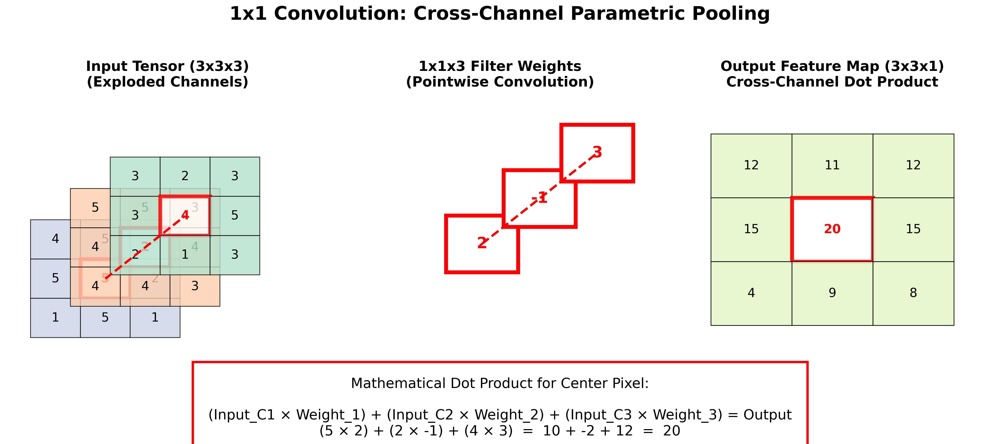

#### 3. The Modern Finisher: Global Average Pooling (GAP)
Instead of flattening 512 feature maps into a massive 25,000-number vector, modern architectures (like ResNet) do something incredibly simple and elegant: **Global Average Pooling (GAP)**.
*   **How it works:** GAP looks at a single 2D feature map (say, a $7 \times 7$ grid of 49 pixels) and simply calculates the **average** of those 49 numbers. 
*   **The Result:** If you have 512 feature maps, GAP outputs exactly 512 numbers. You bypass the parameter explosion entirely. 
*   **GAP vs. GMP:** You could use Global *Max* Pooling (GMP), which takes the single highest number instead of the average. However, GMP encourages the network to only look for one tiny, highly discriminative feature (like a dog's nose). GAP (Average) forces the network to look at the *entire extent* of the dog, resulting in a much more robust understanding of the object.

#### 4. Fully Convolutional Networks (FCNs): Agnostic to Size
Because Dense layers use fixed matrix math, they are incredibly rigid. If a classic CNN is trained on $224 \times 224$ images, it will crash if you give it a $225 \times 225$ image. 

Convolutions, however, are just sliding windows. **They don't care how big the image is.** 
If you build a network using *only* Convolutions and GAP (a Fully Convolutional Network), you can feed it a massive 4K image! Instead of outputting a single "Dog" probability, the sliding windows will naturally produce a spatial *heatmap* showing exactly where the dogs are located across the 4K image. This simple trick is the foundation of modern Object Detection (like YOLO).

---

### Topic 4 Placement Prep: Elite-Level Classification Head Flashcards

**Q1: Prove mathematically how $1 \times 1$ Convolutions create massive computational savings in a "Bottleneck Block" (like in ResNet-50).**
*   **Answer:** Assume we have an input with 256 channels, and we want to apply a $3 \times 3$ convolution and output 256 channels. 
    *   **Standard approach:** $3 \times 3 \times 256 \times 256 = \mathbf{589,824}$ parameters.
    *   **Bottleneck approach:** We use a $1 \times 1$ conv to squash the channels down to 64, apply the $3 \times 3$ conv on just those 64 channels, and then use another $1 \times 1$ conv to expand back to 256.
        *   Step 1 ($1 \times 1$ reduction): $1 \times 1 \times 256 \times 64 = 16,384$
        *   Step 2 ($3 \times 3$ spatial): $3 \times 3 \times 64 \times 64 = 36,864$
        *   Step 3 ($1 \times 1$ expansion): $1 \times 1 \times 64 \times 256 = 16,384$
        *   **Total parameters:** $16,384 + 36,864 + 16,384 = \mathbf{69,632}$.
    *   We reduced the parameter count (and computational cost) by nearly **88%**!

**Q2: Is a $1 \times 1$ Convolution mathematically the exact same thing as a Fully Connected (Dense) Layer?**
*   **Answer:** Yes, but with a spatial twist. A $1 \times 1$ convolution is mathematically identical to a Dense layer that is applied independently to *every single spatial pixel* of the image, sharing the exact same weights as it scans across. If your image has already been pooled down to exactly $1 \times 1$ pixel (e.g., via GAP), then a $1 \times 1$ Conv and a Dense Layer are mathematically indistinguishable.

**Q3: How does removing Dense layers and building a Fully Convolutional Network (FCN) change how we handle input data?**
*   **Answer:** Dense layers require a fixed mathematical matrix size ($W \in \mathbb{R}^{M \times N}$), meaning the input image must always be exactly the same resolution (e.g., $224 \times 224$). By removing Dense layers, the network becomes structurally agnostic to size. You can dynamically pass in a $1080 \text{p}$ image during inference, and the network will seamlessly output a larger spatial feature map instead of crashing.

**Q4: Explain how Global Average Pooling (GAP) helps us look inside the "Black Box" via Class Activation Mapping (CAM).**
*   **Answer:** Because GAP cleanly collapses each 2D feature map into a single number, the final Dense layer assigns a single weight to each specific feature map. To see what the network is "looking at," we take the final weights for a specific class (e.g., "Dog") and multiply them directly by the raw 2D feature maps *before* the pooling happened. Summing these together creates a literal spatial heatmap of exactly which pixels in the image triggered the "Dog" classification.

**Q5: Why is Global Average Pooling (GAP) generally preferred over Global Max Pooling (GMP) for standard image classification?**
*   **Answer:** GMP extracts only the absolute highest activation value from the map. This trains the network to find one single hyper-specific feature (like a dog's nose) and ignore everything else. GAP calculates the average of the whole map, which forces the network's activations to spread out and recognize the *entire extent* of the object (the nose, ears, and body) to maximize its score, leading to much better generalization.


## Topic 5: The Math of CNN Backpropagation

In a standard Dense layer, backpropagation is calculated using simple matrix multiplication. In a Convolutional Neural Network, backpropagation is significantly more complex because of **Weight Sharing**. A single weight in a $3 \times 3$ filter doesn't just affect one output pixel—it slides across the image and affects every single pixel in the resulting feature map.

According to the multivariate chain rule, if a single variable affects multiple outputs, its total gradient is the sum of the gradients from all those outputs.

The beautiful secret of CNNs is that calculating these sums mathematically transforms into another convolution operation. There are two calculations we must perform during the backward pass: updating the weights, and passing the error to the previous layer.

#### 1. Calculating the Gradient of the Weights (*dW*)
We need to know how much to tweak our filter weights to reduce the error.
Let *X* be our Input Image ($3 \times 3$), *W* be our Filter ($2 \times 2$), and *dY* be the error gradient flowing backward from the next layer ($2 \times 2$).

*(Note on *dY*: Where does this error gradient actually come from? *dY* is simply the derivative of the Loss function with respect to the output of this layer. If this convolutional layer was followed immediately by a ReLU activation, *dY* is calculated by taking the error gradient from the layer above and zeroing out any gradients where the forward-pass pixels were zero or negative).*

**The Rule:** The gradient of the weights (*dW*) is calculated by convolving the original Input Image (*X*) with the Error Gradient (*dY*).
```math
dW = X * dY
```
**The Hands-on Math:**
Assume the Input (*X*) and the Error (*dY*) are:
```math
X = \begin{bmatrix} 1 & 2 & 3 \\ 4 & 5 & 6 \\ 7 & 8 & 9 \end{bmatrix}, \quad dY = \begin{bmatrix} 2 & 0 \\ 0 & -1 \end{bmatrix}
```

To find *dW*, we slide *dY* over *X* just like a normal filter:
*   **Top-Left Window:** $(1 \cdot 2) + (2 \cdot 0) + (4 \cdot 0) + (5 \cdot -1) = 2 - 5 = \mathbf{-3}$
*   **Top-Right Window:** $(2 \cdot 2) + (3 \cdot 0) + (5 \cdot 0) + (6 \cdot -1) = 4 - 6 = \mathbf{-2}$
*   **Bottom-Left Window:** $(4 \cdot 2) + (5 \cdot 0) + (7 \cdot 0) + (8 \cdot -1) = 8 - 8 = \mathbf{0}$
*   **Bottom-Right Window:** $(5 \cdot 2) + (6 \cdot 0) + (8 \cdot 0) + (9 \cdot -1) = 10 - 9 = \mathbf{1}$

The resulting gradient matrix for our weights is:
```math
dW = \begin{bmatrix} -3 & -2 \\ 0 & 1 \end{bmatrix}
```
The optimizer (like Adam or SGD) will now use this exact *dW* matrix to update the $2 \times 2$ filter!

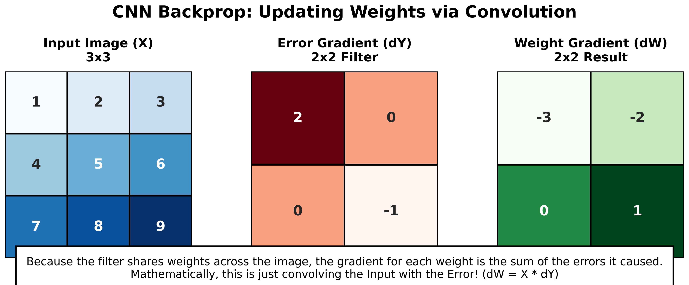

#### 2. Passing the Error Backward (*dX*)
Now that we updated the filter, we must pass the error backward to the previous Convolutional Layer. We need to find *dX* (how much each pixel in the input image contributed to the overall error).

**The Rule:** To calculate the gradient of the input (*dX*), we must perform a **Full Convolution** of the Error Gradient (*dY*) with the flipped Filter (*W*).
*   **The Flipped Filter:** We rotate the original $2 \times 2$ filter weights 180 degrees. (If top-left was $w_1$ and bottom-right was $w_4$, they swap places).
*   **Full Padding:** We add a massive border of zeros around the $2 \times 2$ Error Gradient (*dY*).
*   **The Convolution:** We slide the flipped filter over the heavily padded *dY*. The mathematical result will be a $3 \times 3$ matrix, which perfectly matches the dimensions of our Input Image (*X*), allowing the error to flow seamlessly into the previous layer.

---

### Topic 5 Placement Prep: Elite Backprop Flashcards

**Q1: In standard mathematical terms, deep learning frameworks (like PyTorch and TensorFlow) do not actually perform "Convolutions" during the forward pass. What do they perform, and why does the distinction matter during backpropagation?**
*   **Answer:** They actually perform **Cross-Correlation**. A true mathematical convolution requires the filter matrix to be flipped 180 degrees before sliding it across the input. Deep learning frameworks skip this flipping step during the forward pass to save compute (since the network will just learn the unflipped weights anyway). However, during backpropagation, to correctly calculate the gradient of the input (*dX*), the framework must formally flip the filter to route the gradients back to the correct spatial pixels.

**Q2: Explain why the gradient of a Convolutional Filter (*dW*) is computed by convolving the input with the output error.**
*   **Answer:** Because of Weight Sharing. A single weight in a filter is multiplied against multiple different pixels in the input image as it slides across. By the multivariate chain rule, the total gradient for that single weight is the sum of all the individual local gradients it generated. Convolving the input image with the output error matrix is simply a highly optimized, vectorized way of calculating and summing those exact chain-rule products for every weight simultaneously.

**Q3: If a Convolutional Layer uses a Stride of 2 during the forward pass, how is the Error Gradient (*dY*) handled during the backward pass?**
*   **Answer:** A Stride of 2 means the forward pass actively skipped pixels. During the backward pass, we must perform a **Dilated (or Strided) Backpropagation**. The framework takes the dense Error Gradient (*dY*) and physically injects zeros between its elements (often called "fractionally striding"). This ensures that no error gradient is routed back to the pixels that were skipped and played no mathematical role in the forward pass.

---

## Topic 6: Complete CNN End-to-End Math Walkthrough

To cement the concepts of convolutions, activation functions, and backpropagation, let's trace a single grayscale image through an entire mini-CNN.

**The Mini-CNN Architecture:**
1.  **Input:** $3 \times 3$ image.
2.  **Layer 1 (Conv):** A single $2 \times 2$ filter. No padding, Stride 1.
3.  **Layer 2 (Activation):** ReLU.
4.  **Layer 3 (Flatten):** Flatten to a $1 \times 4$ vector.
5.  **Layer 4 (Dense Output):** A single output neuron for Binary Classification.
6.  **Loss Function:** Binary Cross-Entropy.

### Part 1: The Forward Pass
We push our data from the pixels all the way to a final probability prediction.

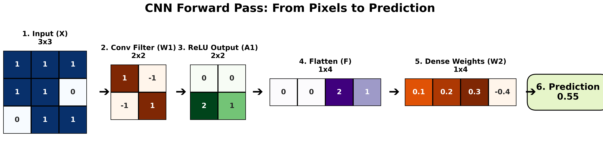

**Step 1: The Input (*X*)**
```math
X = \begin{bmatrix} 1 & 1 & 1 \\ 1 & 1 & 0 \\ 0 & 1 & 1 \end{bmatrix}
```

**Step 2: Convolution ($W_1 \rightarrow Z_1$)**
We slide a $2 \times 2$ filter ($W_1$) over the input.
```math
W_1 = \begin{bmatrix} 1 & -1 \\ -1 & 1 \end{bmatrix}
```
*   **Top-Left:** $(1 \cdot 1) + (1 \cdot -1) + (1 \cdot -1) + (1 \cdot 1) = \mathbf{0}$
*   **Top-Right:** $(1 \cdot 1) + (1 \cdot -1) + (1 \cdot -1) + (0 \cdot 1) = \mathbf{-1}$
*   **Bottom-Left:** $(1 \cdot 1) + (1 \cdot -1) + (0 \cdot -1) + (1 \cdot 1) = \mathbf{2}$
*   **Bottom-Right:** $(1 \cdot 1) + (0 \cdot -1) + (1 \cdot -1) + (1 \cdot 1) = \mathbf{1}$
```math
Z_1 = \begin{bmatrix} 0 & -1 \\ 2 & 1 \end{bmatrix}
```

**Step 3: ReLU Activation ($A_1$)**
We apply $max(0, z)$ to zero out negative values.
```math
A_1 = \begin{bmatrix} 0 & 0 \\ 2 & 1 \end{bmatrix}
```

**Step 4: Flatten (*F*)**
We unravel the $2 \times 2$ matrix into a $1 \times 4$ vector. *(Imagine reading the matrix like a book, left-to-right, top-to-bottom, and writing it out as a single line).*
```math
F = \begin{bmatrix} 0 & 0 & 2 & 1 \end{bmatrix}
```

**Step 5: Dense Layer & Prediction**
We multiply by our dense weights ($W_2$) (assume Bias = 0).
```math
W_2 = \begin{bmatrix} 0.1 \\ 0.2 \\ 0.3 \\ -0.4 \end{bmatrix}
```
*   **Logit (*z*):** $(0 \cdot 0.1) + (0 \cdot 0.2) + (2 \cdot 0.3) + (1 \cdot -0.4) = 0.6 - 0.4 = \mathbf{0.2}$
*   **Prediction (*p*):** We apply the Sigmoid function: $1 / (1 + e^{-0.2}) \approx \mathbf{0.55}$

Our network predicts a $55\%$ probability!

---

### Part 2: The Backward Pass
Assume the true label for this image is $y = 1.0$. Our prediction of $0.55$ means we have some error. We must flow this error backward to update our weights!

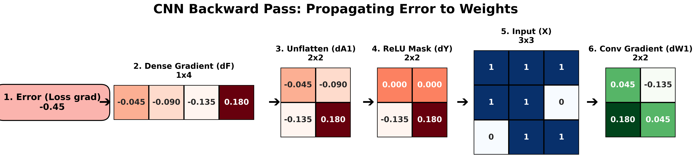

**Step 1: The Error Gradient (Loss $\rightarrow dZ$)**
Using the derivative of Binary Cross-Entropy with Sigmoid, the error gradient at the output is simply $p - y$.
*   $Error = 0.55 - 1.0 = \mathbf{-0.45}$

**Step 2: Dense Weight Gradients ($dW_2$)**
To update the dense weights, we multiply the Error by the inputs to that layer (*F*).
*   $dW_2 = Error \cdot F = -0.45 \cdot [0, 0, 2, 1] = \mathbf{[0, 0, -0.9, -0.45]}$

**Step 3: Propagate to Flatten Layer ($dF \rightarrow dA_1$)**
We push the Error backward through the dense weights to find the gradient of the flattened vector.
*   $dF = Error \cdot W_2 = -0.45 \cdot [0.1, 0.2, 0.3, -0.4] = \mathbf{[-0.045, -0.090, -0.135, 0.180]}$
*   **Unflatten ($dA_1$):** We reshape this $1 \times 4$ gradient back into a $2 \times 2$ matrix. Because we "flattened" by reading left-to-right, we "unflatten" by simply putting the 4 error numbers back into their original $2 \times 2$ grid positions:
```math
dA_1 = \begin{bmatrix} -0.045 & -0.090 \\ -0.135 & 0.180 \end{bmatrix}
```

**Step 4: The ReLU Mask (*dY*)**
The error flows backward through the ReLU layer. ReLU acts as a valve: it only allows error to flow backward through pixels that were *positive* during the forward pass ($Z_1$).
*   Looking back at $Z_1$, only the bottom row was positive. The top row was $\le 0$.
*   Therefore, we zero out the top row of $dA_1$ to get our convolutional error gradient (*dY*):
```math
dY = \begin{bmatrix} 0 & 0 \\ -0.135 & 0.180 \end{bmatrix}
```

**Step 5: Convolutional Weight Gradients ($dW_1$)**
Finally, as learned in Topic 5, we calculate the gradient for our convolution filter by convolving the original Input (*X*) with the ReLU Error Gradient (*dY*).
```math
dW_1 = X * dY
```
*   **Top-Left:** $(1 \cdot 0) + (1 \cdot 0) + (1 \cdot -0.135) + (1 \cdot 0.180) = \mathbf{0.045}$
*   **Top-Right:** $(1 \cdot 0) + (1 \cdot 0) + (1 \cdot -0.135) + (0 \cdot 0.180) = \mathbf{-0.135}$
*   **Bottom-Left:** $(1 \cdot 0) + (1 \cdot 0) + (0 \cdot -0.135) + (1 \cdot 0.180) = \mathbf{0.180}$
*   **Bottom-Right:** $(1 \cdot 0) + (0 \cdot 0) + (1 \cdot -0.135) + (1 \cdot 0.180) = \mathbf{0.045}$

```math
dW_1 = \begin{bmatrix} 0.045 & -0.135 \\ 0.180 & 0.045 \end{bmatrix}
```

**Conclusion:**
We have successfully calculated exactly how much every single weight in both the Dense Layer ($dW_2$) and the Convolutional Filter ($dW_1$) needs to change to reduce the error for this specific image!


## Topic 7: Advanced Architectural Blocks (Modern CNNs)

Classic CNNs simply stacked Conv $\rightarrow$ ReLU $\rightarrow$ Pool in a straight line. As networks grew to 50+ layers, this caused massive computational bottlenecks and gradients completely died during backpropagation. Modern blocks solve this through structural engineering.

### 1. Residual Connections (ResNet)
As standard networks get deeper, they suffer from the **Vanishing Gradient Problem**. By the time the error gradient propagates backward through 50 activation functions, it multiplies down to zero, and early layers stop learning entirely.
*   **The Fix:** ResNet introduced the "Skip Connection" (or Shortcut Connection). Instead of strictly mapping an input through a convolution to get an output ($F(x)$), ResNet physically adds the original input back to the output before the final activation: 
```math
H(x) = F(x) + x
```
*   **The Gradient Superhighway:** During backpropagation, the derivative of *x* is exactly 1. This allows the error gradient to bypass the heavy convolutions and flow straight backward through the network at full strength, allowing networks to scale to 152+ layers.

### 2. Depthwise Separable Convolutions (MobileNet)
A standard convolution mixes spatial data (edges/shapes) and channel data (depth) at the exact same time. This requires an enormous amount of parameters. MobileNet splits this into two hyper-efficient steps to run on edge devices:
*   **Step 1: Depthwise Convolution (Spatial):** We apply a $3 \times 3$ filter to *each channel separately*. (It looks for shapes, but doesn't mix the channels).
*   **Step 2: Pointwise Convolution (Channel):** We apply a $1 \times 1$ convolution across all the channels. (It mixes the depth, but doesn't look at spatial neighbors).
*   **The Math Savings:** For a $3 \times 3$ filter transforming 64 channels to 128 channels:
    *   *Standard:* $3 \times 3 \times 64 \times 128 = \mathbf{73,728}$ parameters.
    *   *Separable:* $(3 \times 3 \times 64) + (1 \times 1 \times 64 \times 128) = 576 + 8,192 = \mathbf{8,768}$ parameters. 
    *   We achieve nearly the same feature extraction with **almost 90% fewer parameters**!

### 3. Inception Modules (GoogLeNet)
Usually, the architect has to guess the best filter size. A $3 \times 3$ captures fine details, while a $5 \times 5$ captures global context. 
*   **The Fix:** The Inception block applies a $1 \times 1$, a $3 \times 3$, a $5 \times 5$, and a Max Pool in parallel on the *exact same input*. 
*   It then concatenates all their outputs together. The network gets to look at local and global features simultaneously and dynamically decides which paths are most useful. ($1 \times 1$ bottleneck convolutions are heavily used before the $3 \times 3$ and $5 \times 5$ to prevent the parameter count from exploding).

---

## Topic 8: Receptive Field Calculation

The **Receptive Field** is the physical dimension of the original input image that a single neuron in a deep layer can actually "see".
If you stack multiple convolutional layers, the receptive field grows linearly without needing larger, parameter-heavy filters.

**The Golden Rule of $3 \times 3$ Stacking:**
*   Layer 1: A $3 \times 3$ filter sees a $3 \times 3$ patch of the original image.
*   Layer 2: A $3 \times 3$ filter applied to Layer 1 now sees a **$5 \times 5$** patch of the original image.
*   Layer 3: A $3 \times 3$ filter applied to Layer 2 now sees a **$7 \times 7$** patch of the original image.

**Why stack instead of using one big filter?**
Two $3 \times 3$ filters have an identical receptive field to one $5 \times 5$ filter. 
*   However, one $5 \times 5$ filter has 25 parameters. 
*   Two $3 \times 3$ filters have $9 + 9 = 18$ parameters. 
*   Stacking reduces parameter count by **28%** and injects *two* non-linear ReLU activations instead of one, creating a much more expressive model!

---

## Topic 9: Spatial Batch Normalization (BatchNorm2d)

Standard 1D Batch Normalization normalizes a batch of flat vectors. But images are 3D tensors (Height $\times$ Width $\times$ Channels). 

**How BatchNorm2d Works:**
Instead of calculating the mean and variance for every single spatial pixel, `BatchNorm2d` calculates the mean and variance across the **Batch, Height, and Width** simultaneously, but maintains a separate learned parameter pair ($\gamma$ and $\beta$) exclusively for **each individual Channel**. 
*   If your feature map has 256 channels, BatchNorm maintains exactly 256 normalizers. 
*   This treats each channel (which represents a specific feature, like an edge detector) as its own statistical distribution, scaling the *intensity* of that feature regardless of where it spatially appears in the image.

---

## Topic 10: CNN-Specific Regularization

Images are highly localized. If a pixel is bright red, the pixel right next to it is almost certainly bright red. This creates massive correlation issues during training.

### 1. Spatial Dropout
*   **The Flaw of Standard Dropout:** If you use standard dropout on a CNN, you drop random individual pixels. Because adjacent pixels are highly correlated, the network simply uses the surviving neighboring pixels to bypass the dropout and infer the feature anyway. It completely fails to prevent overfitting.
*   **The Fix:** **Spatial Dropout** drops *entire 2D feature maps (channels)* at random. If it drops the "dog ear" feature map for that batch, the network is physically forced to look for other features (like a tail or nose) to make its classification, forcing independent learning.

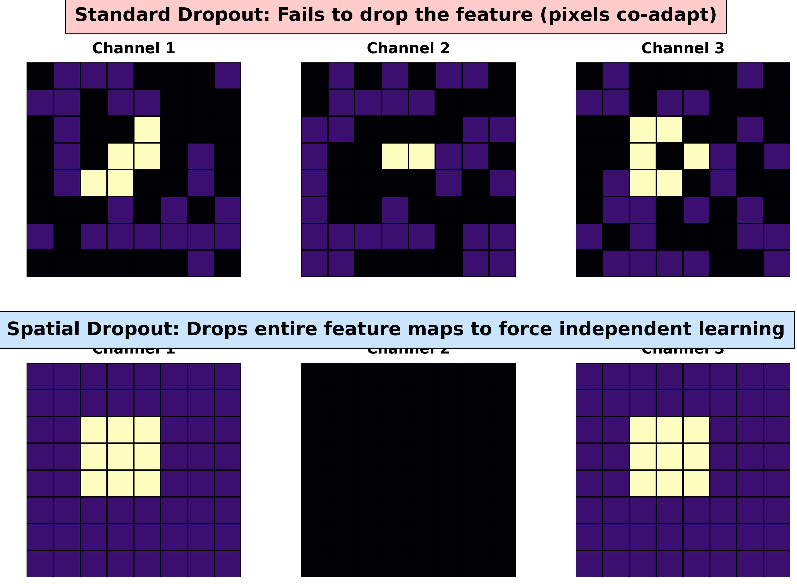

### 2. Modern Augmentation (Mixup & CutMix)
Standard augmentation rotates or flips images. Modern state-of-the-art architectures use data blending to smooth the decision boundaries.
*   **MixUp:** Mathematically blends two completely different images together (e.g., 70% Cat pixels + 30% Dog pixels), and alters the target labels to match (Target: [0.7 Cat, 0.3 Dog]). It forces the network to stop making 100% overconfident predictions.
*   **CutMix:** Instead of blending the pixels (which makes ghost images), CutMix physically cuts a square patch out of the Dog image and pastes it directly over a chunk of the Cat image. The label is updated based on the exact percentage of the area the pasted square took up.

---

### Placement Prep: Elite Architecture Flashcards

**Q1: Prove mathematically how a Residual (Skip) Connection prevents the Vanishing Gradient problem during backpropagation.**
*   **Answer:** In a standard network, the gradient is strictly multiplied by the derivative of the weights ($\frac{\partial L}{\partial w}$). If these derivatives are $< 1$, the gradient multiplies down to zero (vanishes) over deep layers. A Skip connection mathematically adds the input to the output: $H(x) = F(x) + x$. During backpropagation, the derivative of addition routes the gradient through two paths. The derivative of *x* is 1. Therefore, even if the gradient through the convolutional block ($F(x)$) vanishes to 0, the exact same gradient passes cleanly through the "$+ x$" path completely untouched, allowing deep layers to receive strong error signals.

**Q2: What is the primary difference in parameter allocation between an Inception Module and a Depthwise Separable Convolution?**
*   **Answer:** An Inception module runs spatial operations ($1 \times 1$, $3 \times 3$, $5 \times 5$) in parallel to capture multi-scale features, deliberately *increasing* the architectural complexity but bottlenecking parameters via $1 \times 1$ reductions. A Depthwise Separable Convolution actively splits a standard convolution into two serial steps (Spatial filtering per-channel, then $1 \times 1$ pointwise mixing across channels) explicitly to *minimize* the parameter count and FLOPs as heavily as possible for mobile deployment.

**Q3: Why does standard 1D Batch Normalization fail when applied naively to Convolutional feature maps, necessitating `BatchNorm2d`?**
*   **Answer:** Standard 1D batch norm normalizes across the batch for each individual element/pixel. In a 2D feature map, this would mean applying a separate normalizer to the pixel at coordinates (0,0), another for (0,1), etc. This destroys the fundamental CNN property of "Translation Invariance" (the network should recognize a feature regardless of its spatial location). `BatchNorm2d` calculates the statistics across the entire height and width *per channel*, ensuring that the entire feature map is scaled uniformly regardless of spatial shifts.


## Part 6: Sequential Data — Recurrent Neural Networks (RNNs)

Standard Feedforward Networks (MLPs and CNNs) have two fatal flaws when dealing with sequential data (like text sentences or time-series):
1.  They strictly require a fixed input size (e.g., exactly 224x224 pixels). Sentences have highly variable lengths.
2.  They have absolutely no memory. If you feed them the word "Apple," they process it independently, completely forgetting the word that came right before it.

**Recurrent Neural Networks (RNNs)** solve this by introducing a **Hidden State**—a mathematical memory buffer that gets passed forward through time, allowing the network to combine information from the past with the current input.

---

### Topic 1: The Vanilla RNN Architecture & The Hidden State

Instead of processing an entire sentence at once, an RNN processes it one word (time step, *t*) at a time. 

At time step *t*, the RNN takes two distinct inputs:
1.  **$x_t$:** The current input (e.g., the exact word we are looking at right now).
2.  **$h_{t-1}$:** The previous hidden state (the network's mathematical summary of all the words it has seen so far).

The RNN mathematically squashes these two inputs together to create a brand new hidden state ($h_t$). This new hidden state is then used to make a prediction ($y_t$) AND it is passed forward to the next time step ($t+1$). 

#### Temporal Weight Sharing
Just as CNNs share spatial weights (sliding a filter across an image), RNNs share **temporal weights**. An RNN does not learn different weights for the 1st word, 2nd word, and 3rd word. It learns exactly **three global weight matrices** and reuses them at every single time step:
*   **$W_{hx}$**: The weights applied to the new input data.
*   **$W_{hh}$**: The weights applied to the memory of the past (the hidden state).
*   **$W_{yh}$**: The weights applied to the current hidden state to make a final prediction.

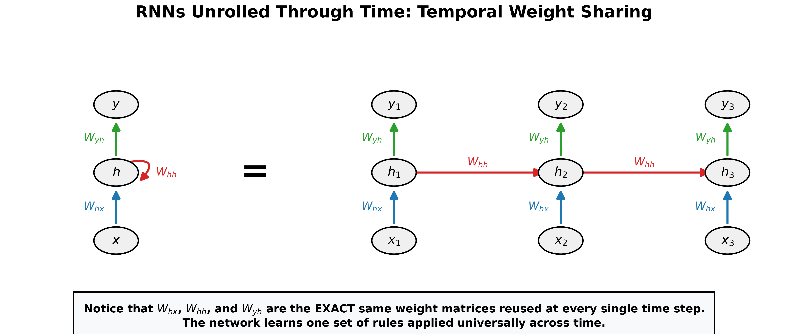

---

### Topic 2: The Math of the Forward Pass

Let's look at the exact mathematical equations happening inside a standard Vanilla RNN at a single time step (*t*).

**Step 1: Update the Hidden State (Memory)**
The network concatenates the current input and the past memory, multiplies them by their respective shared weight matrices, adds a bias, and passes them through a $\tanh$ activation function to keep the values constrained between -1 and 1.
```math
h_t = \tanh(W_{hx} x_t + W_{hh} h_{t-1} + b_h)
```
**Step 2: Calculate the Output (Prediction)**
Once the new hidden state ($h_t$) is calculated, we use it to make a prediction for that specific time step (e.g., "What is the next word in the sentence?"). 
```math
y_t = \text{Softmax}(W_{yh} h_t + b_y)
```
*Note: The initial hidden state at $t=0$ ($h_0$) is usually initialized as a matrix of pure zeros, because the network hasn't seen any past data yet!*

---

### Topic 3: Backpropagation Through Time (BPTT) & The Fatal Flaw

Because an RNN uses the exact same weight matrices repeatedly across time, calculating the error gradient is uniquely difficult. 

To find out how much the weight matrix $W_{hh}$ contributed to the error at time step $t=10$, we have to use the Chain Rule to trace the error backward from $t=10 \rightarrow t=9 \rightarrow t=8 \dots$ all the way to $t=1$. This algorithm is called **Backpropagation Through Time (BPTT)**.

#### The Fatal Flaw: The Vanishing & Exploding Gradient
This creates a massive mathematical disaster. When you backpropagate through time, you are repeatedly multiplying the error gradient by the *exact same weight matrix* ($W_{hh}$) over and over again.

Imagine tracing an error backward across a 50-word sentence. You must multiply $W_{hh}$ by itself 50 times ($W_{hh}^{50}$).
*   **Vanishing Gradients:** If the eigenvalues (values) of the $W_{hh}$ matrix are even slightly less than 1 (e.g., $0.9$), then $0.9^{50} \approx 0.005$. The gradient vanishes to zero. The network completely forgets early words in a long sentence.
*   **Exploding Gradients:** If the values of $W_{hh}$ are slightly greater than 1 (e.g., $1.1$), then $1.1^{50} \approx 117$. The gradient explodes to infinity, and the network mathematically crashes (outputs `NaN`).

Because of this specific structural flaw, Vanilla RNNs are virtually useless for sequences longer than 5 to 10 time steps. 

---

### Topic 3 Placement Prep: Elite RNN Flashcards

**Q1: Contrast the concept of "Weight Sharing" in CNNs versus RNNs. Why do both architectures use it?**
*   **Answer:** CNNs use *Spatial Weight Sharing*; they slide a single filter across different physical locations of an image, allowing them to detect a feature (like an eye) regardless of its coordinates. RNNs use *Temporal Weight Sharing*; they apply the exact same weight matrices ($W_{hx}, W_{hh}$) at every time step. Both use weight sharing to drastically reduce the total parameter count, prevent catastrophic overfitting, and allow the network to handle inputs of variable sizes (variable image resolutions for CNNs, variable sequence lengths for RNNs).

**Q2: Deep MLPs (50 layers) suffer from Vanishing Gradients, and RNNs (unrolled for 50 time steps) also suffer from Vanishing Gradients. Why is the mathematical cause fundamentally worse in an RNN?**
*   **Answer:** In a 50-layer MLP, the gradient is multiplied by 50 *different* weight matrices ($W_{50} \cdot W_{49} \cdot W_{48} \dots$). While it can vanish, careful initialization (like He or Xavier initialization) can usually balance the gradient out. In an RNN, BPTT multiplies the gradient by the *exact same weight matrix* 50 times ($W_{hh}^{50}$). Multiplying a matrix by itself repeatedly is identical to taking it to a power, guaranteeing that the gradient will aggressively collapse to 0 or explode to infinity exponentially faster than in an MLP.

**Q3: How do we practically fix the "Exploding Gradient" problem in Vanilla RNNs during training?**
*   **Answer:** We use a technique called **Gradient Clipping**. Before the optimizer uses the calculated gradients to update the weights, we mathematically check if the L2 norm (magnitude) of the gradient exceeds a specific threshold. If it does, we scale the gradient vector down so its magnitude equals the threshold, while perfectly preserving its *direction*. This prevents the weights from taking a massive, destructive step during optimization.


## Topic 4: Complete End-to-End RNN Math Walkthrough (BPTT)

To truly master Recurrent Neural Networks, you must understand how the error physically flows backward through time. Because an RNN reuses the exact same weight matrices ($W_{hx}$ and $W_{hh}$) at every time step, the **Multivariate Chain Rule** dictates that the final gradient for a weight is the **sum** of the gradients from every time step it was used in.

We will trace a Mini-RNN across $t=1$ and $t=2$, predicting a single value at the very end (Many-to-One Architecture).
*   **Initial Memory:** $h_0 = 0$
*   **Input Sequence:** $x_1 = 1$, $x_2 = 2$
*   **Target Output:** $y = 4$
*   **Shared Weights:** $W_{hx} = 2$, $W_{hh} = 1$, $W_{yh} = 1$ (All biases are 0).
*   **Activation:** ReLU (Derivative is 1 if $z > 0$, else 0).

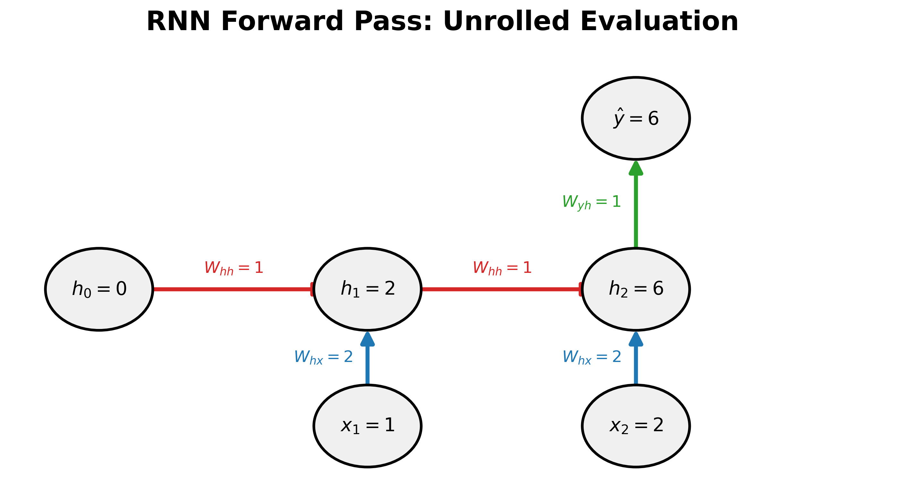

### 1. The Forward Pass (Unrolling Through Time)

**Time Step 1 ($t=1$):**
The network looks at the first input ($x_1$) and combines it with its initial memory ($h_0$).
```math
z_1 = (W_{hx} \cdot x_1) + (W_{hh} \cdot h_0)
```
```math
z_1 = (2 \cdot 1) + (1 \cdot 0) = \mathbf{2}
```
We pass $z_1$ through the ReLU activation to get our first hidden state:
```math
h_1 = \text{ReLU}(2) = \mathbf{2}
```
**Time Step 2 ($t=2$):**
The network looks at the second input ($x_2$) and combines it with the memory of the first step ($h_1$).
```math
z_2 = (W_{hx} \cdot x_2) + (W_{hh} \cdot h_1)
```
```math
z_2 = (2 \cdot 2) + (1 \cdot 2) = 4 + 2 = \mathbf{6}
```
```math
h_2 = \text{ReLU}(6) = \mathbf{6}
```
**The Final Prediction (Output):**
Using the final hidden state ($h_2$), we calculate our prediction ($\hat{y}$).
```math
\hat{y} = W_{yh} \cdot h_2 = 1 \cdot 6 = \mathbf{6}
```
---

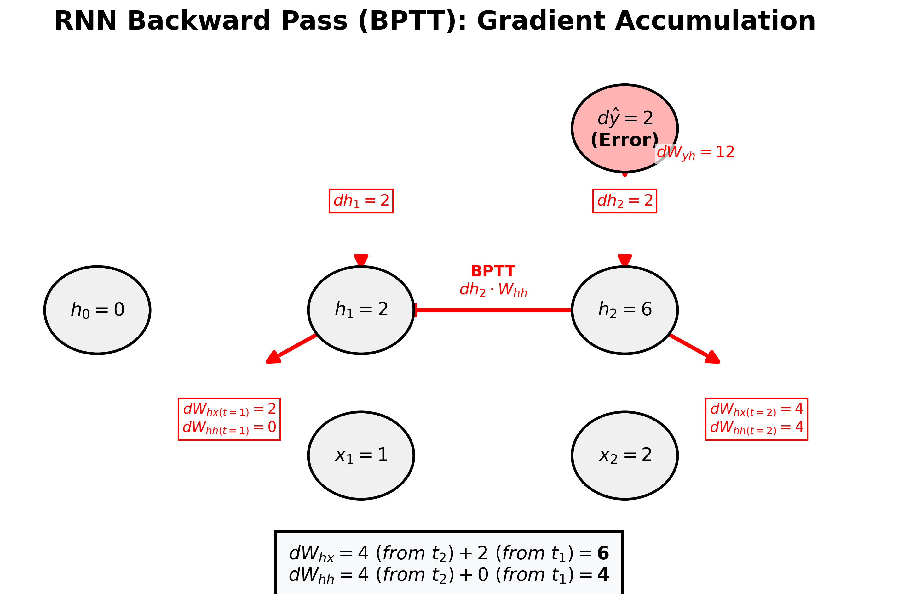

### 2. Backpropagation Through Time (BPTT)

The network predicted 6. The target was 4. Using Mean Squared Error $L = \frac{1}{2}(\hat{y} - y)^2$, the derivative of the loss with respect to our prediction is:
```math
d\hat{y} = \hat{y} - y = 6 - 4 = \mathbf{2}
```
**Step 1: Gradients at the Output**
First, we find the gradient for the output weight ($dW_{yh}$) and pass the error back into the final hidden state ($dh_2$).
```math
dW_{yh} = d\hat{y} \cdot h_2 = 2 \cdot 6 = \mathbf{12}
```
```math
dh_2 = d\hat{y} \cdot W_{yh} = 2 \cdot 1 = \mathbf{2}
```
**Step 2: Gradients at $t=2$**
The error ($dh_2 = 2$) has entered the unrolled network. First, we pass it backward through the ReLU activation to get $dz_2$. (Since $z_2 = 6 > 0$, the derivative of ReLU is 1).
```math
dz_2 = dh_2 \cdot 1 = \mathbf{2}
```
Now, we calculate how much the weights contributed to the error *at this specific time step*:
```math
dW_{hx(t=2)} = dz_2 \cdot x_2 = 2 \cdot 2 = \mathbf{4}
```
```math
dW_{hh(t=2)} = dz_2 \cdot h_1 = 2 \cdot 2 = \mathbf{4}
```
Finally, we pass the error **backward through time** to the previous hidden state ($dh_1$):
```math
dh_1 = dz_2 \cdot W_{hh} = 2 \cdot 1 = \mathbf{2}
```
**Step 3: Gradients at $t=1$**
The error ($dh_1 = 2$) has successfully traveled back in time to the first step. We pass it through ReLU (since $z_1 = 2 > 0$, derivative is 1).
```math
dz_1 = dh_1 \cdot 1 = \mathbf{2}
```
We calculate how much the weights contributed to the error *at this earlier time step*:
```math
dW_{hx(t=1)} = dz_1 \cdot x_1 = 2 \cdot 1 = \mathbf{2}
```
```math
dW_{hh(t=1)} = dz_1 \cdot h_0 = 2 \cdot 0 = \mathbf{0}
```
**Step 4: Gradient Accumulation (The Core Rule of RNNs)**
Because $W_{hx}$ and $W_{hh}$ are global shared weights used at both $t=1$ and $t=2$, we must **sum** their local gradients to find the true, final gradient for the optimizer to use.
```math
dW_{hx} = dW_{hx(t=2)} + dW_{hx(t=1)} = 4 + 2 = \mathbf{6}
```
```math
dW_{hh} = dW_{hh(t=2)} + dW_{hh(t=1)} = 4 + 0 = \mathbf{4}
```
*(The optimizer will now use $dW_{hx}=6$, $dW_{hh}=4$, and $dW_{yh}=12$ to update the weights!)*

---

### Topic 4 Placement Prep: BPTT Flashcards

**Q1: Explain mathematically why Backpropagation Through Time (BPTT) dictates that we must *sum* the gradients across all time steps for $W_{hx}$ and $W_{hh}$.**
*   **Answer:** This is required by the Multivariate Chain Rule. Because an RNN uses *Weight Sharing*, a single weight matrix ($W_{hx}$) directly influences the hidden state at $t=1$, and again at $t=2$, and again at $t=3$. Therefore, $W_{hx}$ is responsible for the error generated at *multiple independent points* in the computational graph. To find the total derivative of the loss with respect to that shared weight, you must calculate its local gradient at each time step and sum them together.

**Q2: During BPTT, what would mathematically happen to the gradient flowing backwards from $t=2$ to $t=1$ if we used a ReLU activation and the forward pass hidden state at $t=2$ was negative?**
*   **Answer:** If the forward pass at $t=2$ resulted in a negative number, the ReLU activation would have output 0. During BPTT, the derivative of ReLU for a negative input is 0. Therefore, $dz_2$ would be 0, which means $dh_1 = dz_2 \cdot W_{hh} = 0$. The error gradient would be completely killed at $t=2$, and absolutely zero error would flow backward to time step 1.

**Q3: If we had a sequence length of 100 time steps instead of 2, how many times would the error gradient be multiplied by $W_{hh}$ as it travels from $t=100$ back to $t=1$? What architectural problem does this cause?**
*   **Answer:** The gradient would be multiplied by $W_{hh}$ exactly 99 times. Because we are repeatedly multiplying by the exact same matrix, if the values of $W_{hh}$ are $< 1$, the gradient will exponentially decay to zero (Vanishing Gradient). If they are $> 1$, it will exponentially grow to infinity (Exploding Gradient). This is why Vanilla RNNs physically cannot maintain long-term dependencies.
---

## Topic 5: Different Types of RNN Architectures

RNNs are highly flexible because they process data step-by-step. By simply changing where we feed the inputs and where we read the outputs, we can solve vastly different problems.

1.  **One-to-Many:** 
    *   **Architecture:** We feed a single input at $t=1$, and the network generates a sequence of outputs at $t=1, t=2, t=3\dots$
    *   **Use Case:** Image Captioning. (Input: A single image. Output: A sequence of words describing the image).
2.  **Many-to-One:**
    *   **Architecture:** We feed a sequence of inputs at $t=1, t=2, t=3\dots$, but we only read the output prediction at the very final time step $t_n$. (This is what we did in the math walkthrough above!)
    *   **Use Case:** Sentiment Analysis. (Input: A sequence of words. Output: A single label, Positive or Negative).
3.  **Many-to-Many (Synced):**
    *   **Architecture:** We feed an input at every time step, and immediately read an output at every time step.
    *   **Use Case:** Video Frame Classification. (Input: A sequence of video frames. Output: A label for what is happening in each specific frame).
4.  **Many-to-Many (Encoder-Decoder / Seq2Seq):**
    *   **Architecture:** We feed an entire input sequence into an "Encoder" RNN to generate a single context vector. Then, a "Decoder" RNN takes that context vector and generates a brand new output sequence.
    *   **Use Case:** Machine Translation. (Input: "How are you" in English. Output: "Comment allez-vous" in French).

---

## Topic 6: Bidirectional RNNs (BiRNN)

Standard RNNs process data purely forward in time ($t=1 \rightarrow t=2 \rightarrow t=3$). However, in natural language, the meaning of a word often depends heavily on the words that come *after* it.
*   *Example:* "The **bank** of the river was muddy." vs "The **bank** was robbed today."

A **Bidirectional RNN** solves this by running two completely separate RNNs simultaneously:
1.  **The Forward RNN:** Reads the sequence from left-to-right (e.g., $x_1 \rightarrow x_2 \rightarrow x_3$).
2.  **The Backward RNN:** Reads the sequence from right-to-left (e.g., $x_3 \rightarrow x_2 \rightarrow x_1$).

At each time step *t*, the network takes the hidden state from the Forward RNN ($\overrightarrow{h_t}$) and concatenates it with the hidden state from the Backward RNN ($\overleftarrow{h_t}$). 
```math
h_t = [\overrightarrow{h_t}, \overleftarrow{h_t}]
```
This combined hidden state now contains complete context from both the past *and* the future, allowing the network to make a highly informed prediction ($y_t$) for that specific word.

*(Note: BiRNNs can only be used when the entire sequence is available at once, like processing a whole document. They cannot be used for real-time forecasting where the future data hasn't happened yet).*


## Topic 5: Long Short-Term Memory (LSTMs) & The Cure for Amnesia

Vanilla RNNs fail on long sequences because Backpropagation Through Time (BPTT) repeatedly multiplies the gradient by the same weight matrix, causing it to vanish to zero. 

**Long Short-Term Memory (LSTM)** networks solve this by adding a secondary memory track and using mathematical "Gates" to strictly control what information is allowed to enter, leave, or be deleted from the network.

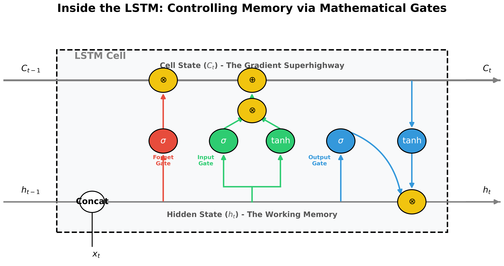

### 1. The Two Memory States
An LSTM has two distinct memory streams flowing through time:
1.  **The Hidden State ($h_t$):** The short-term "working memory." This is what the LSTM outputs to the rest of the network to make immediate predictions. 
2.  **The Cell State ($C_t$):** The long-term "internal memory." It acts like a conveyor belt running straight down the entire chain. It undergoes very minor linear operations, making it extremely easy for information—and error gradients—to flow unchanged across thousands of time steps.

### 2. The Three Mathematical Gates
An LSTM uses neural network layers (Gates) to protect and control the Cell State. These gates primarily use the **Sigmoid ($\sigma$)** activation function, which outputs a number between 0 and 1. 
*   An output of 0 means "delete this completely." 
*   An output of 1 means "let this completely through."

**Gate 1: The Forget Gate ($f_t$)**
Should we remember the past, or wipe the slate clean? The Forget Gate looks at the previous hidden state ($h_{t-1}$) and the current input ($x_t$), and outputs a number between 0 and 1 for each number in the Cell State.
```math
f_t = \sigma(W_f \cdot [h_{t-1}, x_t] + b_f)
```
*(If $f_t = 0$, the LSTM literally erases that piece of memory from the Cell State).*

**Gate 2: The Input Gate ($i_t$ and $\tilde{C}_t$)**
What new information should we store in the Cell State? This is a two-part step:
1.  The **Input Gate ($i_t$)** uses a Sigmoid to decide *which* values we will update (0 to 1).
2.  A **$\tanh$ layer ($\tilde{C}_t$)** creates a vector of *new candidate values* that could be added to the state (scaled between -1 and 1).
We multiply these together to scale the new information, and then **add** it to the Cell State.

**Gate 3: The Output Gate ($o_t$)**
What parts of the long-term Cell State should we expose as our new short-term Hidden State ($h_t$)? 
We use a Sigmoid gate ($o_t$) to decide what parts of the Cell State are currently relevant. We then push the Cell State through a $\tanh$ (to push the values between -1 and 1) and multiply it by our gate.
```math
h_t = o_t \cdot \tanh(C_t)
```


### 4. Why LSTMs Fix the Vanishing Gradient
In a Vanilla RNN, the hidden state is updated using matrix multiplication: $h_t = \tanh(W_{hh}h_{t-1} + \dots)$. During BPTT, this requires multiplying by $W_{hh}$ repeatedly.

In an LSTM, the long-term Cell State ($C_t$) is updated using **Addition**: 
```math
C_t = (f_t \cdot C_{t-1}) + (i_t \cdot \tilde{C}_t)
```
Because the fundamental operation keeping the memory alive is addition ($+$) rather than matrix multiplication, the derivative flowing backward through the Cell State is 1. The LSTM creates a "Gradient Superhighway" (conceptually identical to a ResNet Skip Connection), allowing gradients to flow backward through thousands of time steps without vanishing!

---

### Topic 5 Placement Prep: Elite LSTM Flashcards

**Q1: In an LSTM, why do the Gates use a Sigmoid ($\sigma$) activation function, but the Candidate Values ($\tilde{C}_t$) use a $\tanh$ activation function?**
*   **Answer:** Sigmoid restricts values between 0 and 1. This perfectly mimics a physical "valve" or percentage—0 means the gate is completely closed (block the data), and 1 means the gate is completely open (pass the data). $\tanh$ restricts values between $-1$ and 1. This is required for candidate values because the network must be able to *subtract* (decrease) or *add* (increase) to the state. If candidate values used Sigmoid, the Cell State could only ever grow larger and would eventually explode.

**Q2: Explain how the Forget Gate ($f_t$) physically dictates the flow of gradients during Backpropagation Through Time.**
*   **Answer:** The Cell State update equation is $C_t = f_t \cdot C_{t-1} + \dots$. During backpropagation, the error gradient flowing back to the previous cell state ($C_{t-1}$) is directly multiplied by $f_t$. If the network learned that a piece of memory was useless and set $f_t \approx 0$, it completely shuts off the gradient flow for that path. If $f_t \approx 1$, the gradient flows perfectly backwards without vanishing. The LSTM dynamically learns exactly how far back in time the gradients should travel.

**Q3: What is a GRU (Gated Recurrent Unit), and how does it differ architecturally from an LSTM?**
*   **Answer:** A GRU is a streamlined, more computationally efficient version of an LSTM. The primary difference is that a GRU completely removes the separate Cell State ($C_t$) and relies strictly on the Hidden State ($h_t$) to transfer memory. Furthermore, it merges the Forget and Input gates into a single "Update Gate." It achieves similar performance to an LSTM on many tasks, but requires significantly fewer weights/parameters, making it faster to train.


## Topic 6: End-to-End LSTM Math Walkthrough (StatQuest Style)

To truly understand how LSTMs solve the vanishing gradient problem, we must abandon abstract algebra and run actual numbers through the network. As explained in Josh Starmer's famous *StatQuest*, the secret is that an LSTM splits memory into two completely separate paths.

1.  **The Cell State (Long-Term Memory):** The green line across the top. It has no weights that directly modify it, allowing memories to flow through without exploding or vanishing.
2.  **The Hidden State (Short-Term Memory):** The pink line across the bottom. This is actively manipulated by weights and acts as the network's immediate prediction.

Let's do the math for a single time step. 
*   **Previous Long-Term Memory:** $2.0$
*   **Previous Short-Term Memory:** $1.0$
*   **Current Input Data:** $1.0$

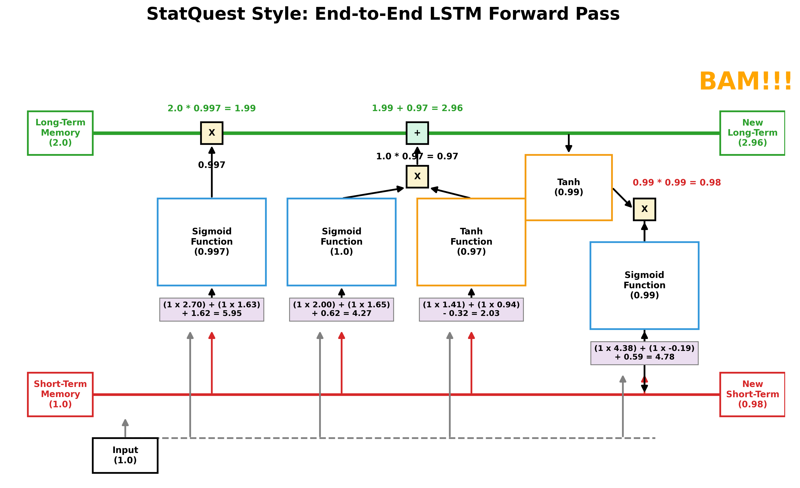

### Stage 1: The Forget Gate (What % of long-term memory is remembered?)
*Terminology Alert! Even though this determines what is remembered, it is called the Forget Gate.*

We use a **Sigmoid** activation function to turn our inputs into a percentage (a number between 0 and 1). We multiply the Short-Term memory and Input by their weights, and add a bias.
*   **Math:** $(1.0 \times 2.70) + (1.0 \times 1.63) + 1.62 = \mathbf{5.95}$
*   **Sigmoid(5.95) = 0.997**

We take this percentage and multiply it against the Long-Term Memory line:
$$ 2.0 \times 0.997 = \mathbf{1.99} $$
*(The network decided to remember 99.7% of the past!)*

---

### Stage 2: The Input Gate (Creating and Adding Potential Memory)
In a nutshell, the block on the right creates a *potential* new long-term memory, and the block on the left decides what *percentage* of it to actually save.

**Part A: The Potential Memory (Tanh)**
We use a **Tanh** function (which bounds values between -1 and 1) to create new candidate data based on our short-term memory and input.
*   **Math:** $(1.0 \times 1.41) + (1.0 \times 0.94) - 0.32 = \mathbf{2.03}$
*   **Tanh(2.03) = 0.97** (This is our potential memory).

**Part B: The Percentage to Add (Sigmoid)**
We use another Sigmoid function to decide how much of the $0.97$ we want to keep.
*   **Math:** $(1.0 \times 2.00) + (1.0 \times 1.65) + 0.62 = \mathbf{4.27}$
*   **Sigmoid(4.27) = 1.0** (The network decided to keep 100% of the potential memory).

**Part C: Update the Long-Term Line**
We multiply the percentage by the potential memory ($1.0 \times 0.97 = 0.97$), and then simply **ADD** it to our Long-Term Memory line.
$$ 1.99 + 0.97 = \mathbf{2.96} $$
**Double BAM!** We have successfully updated the long-term memory.

---

### Stage 3: The Output Gate (Updating the Short-Term Memory)
This final stage creates the new short-term memory, which will also be the actual output prediction of the unit.

First, we squeeze our brand new Long-Term Memory through a Tanh function to bound it between -1 and 1.
*   **Tanh(2.96) = 0.99**

Next, we use our final **Sigmoid** function to decide what percentage of this bounded long-term memory we want to pass down to the short-term line.
*   **Math:** $(1.0 \times 4.38) + (1.0 \times -0.19) + 0.59 = \mathbf{4.78}$
*   **Sigmoid(4.78) = 0.99**

Finally, we multiply them together:
$$ 0.99 \times 0.99 = \mathbf{0.98} $$

**Triple BAM!!!** The number **$0.98$** is the final output of the LSTM for this time step, and it is passed forward as the Short-Term Memory for the next time step.
---

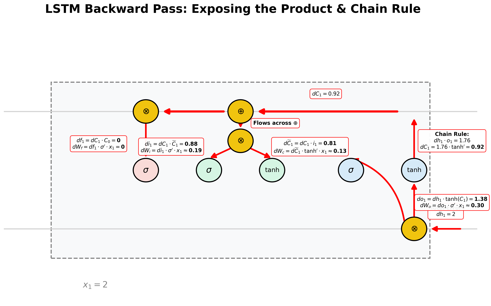

## Topic 7: The Backward Pass (Calculus Trace)

*(Note: To demonstrate the Calculus and Backpropagation Through Time (BPTT), we switch to a simplified scalar LSTM where $x_1 = 2$, $h_0=0$, and $C_0=0$. This resulted in $h_1 = 0.61$ and $C_1 = 0.84$.)*

Assume the loss function sends an error gradient of **$dh_1 = 2$** backward into our cell. We must use the Product Rule and Chain Rule to split this error and route it to our four weights.

**Step 1: Splitting the Error at the Hidden State**
The forward equation was $h_1 = o_1 \cdot \tanh(C_1)$. The error $dh_1 = 2$ splits into two paths:
1.  **Gradient to the Output Gate ($do_1$):**
```math
do_1 = dh_1 \cdot \tanh(C_1) = 2 \cdot 0.69 = \mathbf{1.38}
```
2.  **Gradient entering the Cell State ($dC_1$):**
    The error passes backward through the multiplication, then backward through the $\tanh$ activation. (The derivative of $\tanh(x)$ is $1 - \tanh^2(x)$).
```math
dC_1 = dh_1 \cdot o_1 \cdot (1 - \tanh^2(C_1))
```
```math
dC_1 = 2 \cdot 0.88 \cdot (1 - 0.69^2) = 1.76 \cdot 0.52 \approx \mathbf{0.92}
```
**Step 2: Distributing the Cell State Error ($dC_1$)**
The forward equation was:
```math
C_1 = (f_1 \cdot C_0) + (i_1 \cdot \tilde{C}_1)
```
The error $dC_1 = 0.92$ flows across the addition node.
1.  **Gradient to the Forget Gate ($df_1$):**
```math
df_1 = dC_1 \cdot C_0 = 0.92 \cdot 0 = \mathbf{0}
```
*(Since $C_0=0$, forgetting had no mathematical impact on the error).*

2.  **Gradient to the Input Gate ($di_1$):**
```math
di_1 = dC_1 \cdot \tilde{C}_1 = 0.92 \cdot 0.96 \approx \mathbf{0.88}
```
3.  **Gradient to the Candidate ($\tilde{C}_1$):**
```math
d\tilde{C}_1 = dC_1 \cdot i_1 = 0.92 \cdot 0.88 \approx \mathbf{0.81}
```
**Step 3: Calculating the Final Weight Updates (*dW*)**
We now pass the gate errors through their respective activation function derivatives to update the actual weights. 
*(Note: The derivative of Sigmoid is $\sigma \cdot (1 - \sigma)$).*
```math
\sigma'(2) = 0.88 \cdot 0.12 \approx 0.11
```
*(The derivative of Tanh is $1 - \tanh^2(x)$).*
```math
\tanh'(2) = 1 - 0.96^2 \approx 0.08
```

**Output Weight:** 
```math
dW_o = do_1 \cdot \sigma'(2) \cdot x_1 = 1.38 \cdot 0.11 \cdot 2 \approx \mathbf{0.30}
```
**Input Weight:** 
```math
dW_i = di_1 \cdot \sigma'(2) \cdot x_1 = 0.88 \cdot 0.11 \cdot 2 \approx \mathbf{0.19}
```
**Candidate Weight:** 
```math
dW_c = d\tilde{C}_1 \cdot \tanh'(2) \cdot x_1 = 0.81 \cdot 0.08 \cdot 2 \approx \mathbf{0.13}
```
**Forget Weight:** 
```math
dW_f = df_1 \cdot \sigma'(2) \cdot x_1 = 0 \cdot 0.11 \cdot 2 = \mathbf{0}
```

*(The optimizer will now use these exact gradients to adjust the weights for the next epoch!)*

---

## Topic 8: Modern LSTM Architectural Variants

Standard LSTMs are powerful, but they have a few architectural blind spots that are frequently patched in production environments.

### 1. Bidirectional LSTMs (BiLSTMs)
**The Problem:** A standard LSTM reads a sequence sequentially from left to right (e.g., $t=1 \rightarrow t=2 \rightarrow t=3$). However, in natural language, the context of a word often relies heavily on the words that come *after* it. 
*   *Example:* "I went to the **bank** to deposit my check" vs "I went to the **bank** of the river."
**The Solution:** A Bidirectional LSTM runs two completely independent LSTMs at the exact same time. 
*   One LSTM processes the sequence forward.
*   One LSTM processes the sequence strictly in reverse.
*   The final output for any given time step (*t*) is the concatenation of the forward Hidden State and the backward Hidden State: 
```math
h_t = [\overrightarrow{h_t}, \overleftarrow{h_t}]
```

### 2. Peephole Connections
**The Problem:** In a standard LSTM, the three gates (Forget, Input, Output) are only allowed to look at the short-term memory ($h_{t-1}$) and the current input ($x_t$) to make their decisions. They are completely blind to the long-term Cell State ($C_{t-1}$) when deciding whether to open or close!
**The Solution:** Introduced by Felix Gers, Peephole Connections allow the gates to mathematically "peek" at the Cell State. 
*   The math changes slightly: 
```math
f_t = \sigma(W_f \cdot [C_{t-1}, h_{t-1}, x_t] + b_f)
```
*   This drastically improves the network's ability to count and time exact intervals, as the gates can explicitly read the core memory before altering it.

---

### Placement Prep: Elite LSTM Flashcards

**Q1: In an LSTM, if the Forget Gate outputs exactly 1, and the Input Gate outputs exactly 0, what mathematically happens to the Cell State ($C_t$), and what does this mean for the gradient?**
*   **Answer:** If $f_t = 1$ and $i_t = 0$, the update equation:
```math
C_t = (1 \cdot C_{t-1}) + (0 \cdot \tilde{C}_t)
```
collapses to simply $C_t = C_{t-1}$. The Cell State passes forward completely unaltered. Consequently, during backpropagation, the derivative is exactly 1, meaning the error gradient flows backward through that time step with 100% of its strength preserved (a perfect gradient superhighway).

**Q2: During backpropagation in an LSTM, why is the error gradient entering the Cell State ($dC_1$) smaller than the total error gradient provided by the loss function ($dh_1$)?**
*   **Answer:** Because of the Output Gate ($o_t$). The error $dh_1$ represents the total error of the prediction. However, that prediction was generated by applying the Output Gate as a mathematical filter: 
```math
h_1 = o_1 \cdot \tanh(C_1)
```
By the Product Rule, the error flowing back into the Cell State is multiplied by $o_1$. If the Output Gate was partially closed (e.g., $o_1 = 0.5$), it shielded the internal Cell State from the final output, and therefore shields it from receiving the full magnitude of the resulting error.

## Topic 9: The Fall of the LSTM (Why we needed Transformers)

While LSTMs completely dominated Natural Language Processing from 2014 to 2017, they had two fatal flaws that prevented them from scaling to the level of modern Foundation Models (like GPT-4).

### 1. The Sequential Bottleneck (No Parallelization)
LSTMs are inherently sequential. To process the 100th word in a sentence, the LSTM *mathematically must* process words 1 through 99 first to generate the required hidden state ($h_{99}$). 
*   **The Result:** You cannot parallelize this process across thousands of GPU cores. Training an LSTM on terabytes of text takes an unacceptably long time. Transformers solve this by abandoning recurrence entirely and processing all words simultaneously.

### 2. The Information Bottleneck (Fixed-Length Vector)
No matter how long the input text is (a sentence, a paragraph, or an entire book), an LSTM is forced to compress the *entire meaning* of that text into a single, fixed-size vector (the final hidden state $h_t$). 
*   **The Result:** Information loss is guaranteed for long sequences. It's like trying to summarize a 300-page book on a single sticky note. Transformers solve this via the **Self-Attention Mechanism**, which allows the model to look directly at *every single previous word* simultaneously, rather than relying on a compressed summary.
