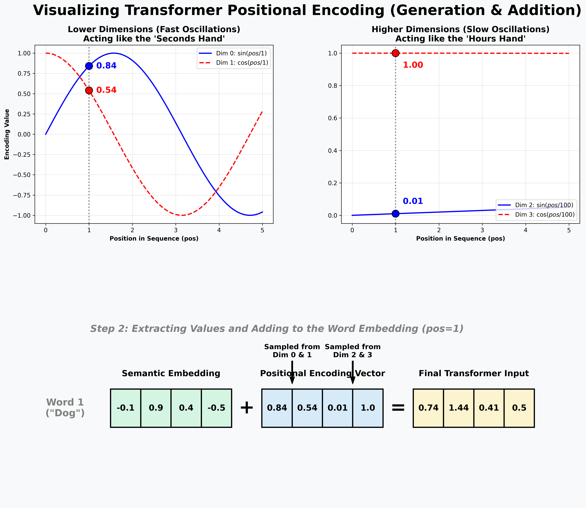
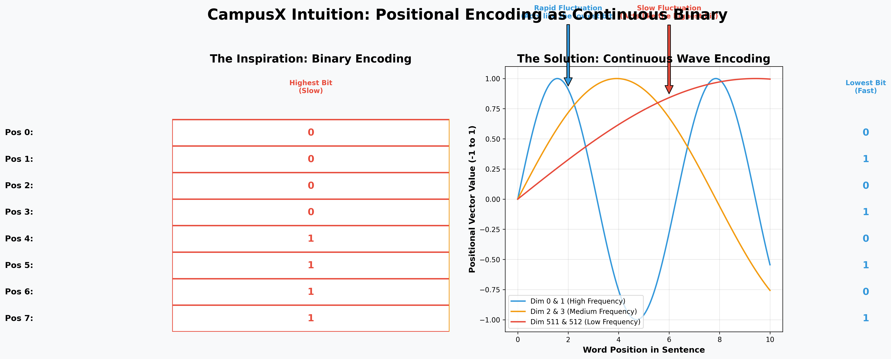
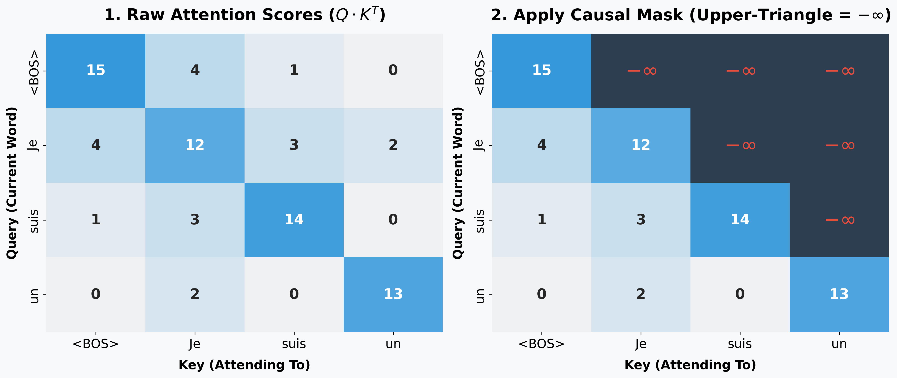
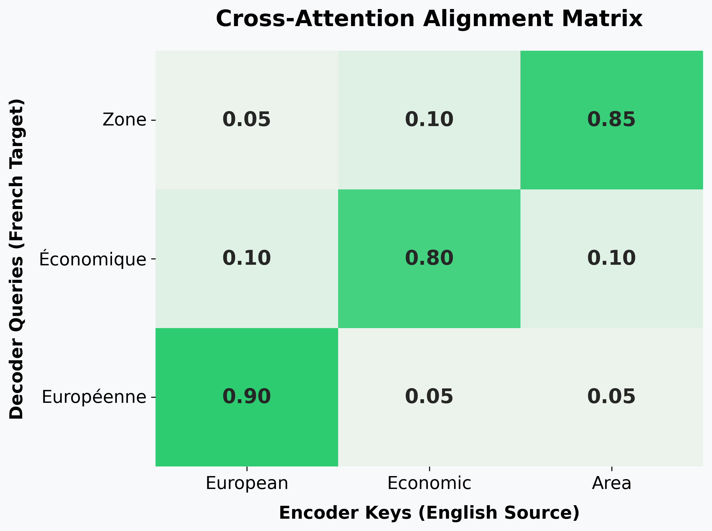
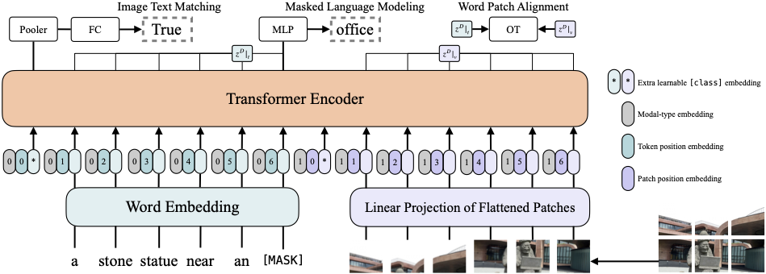
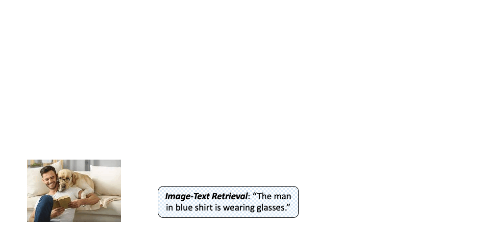
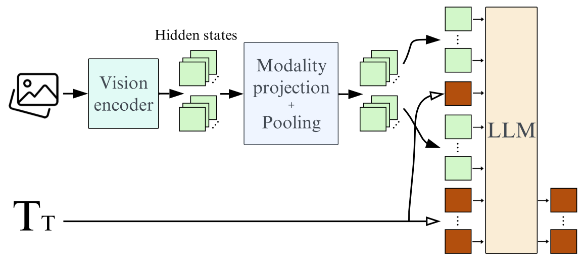

# Advanced AI: Transformers, Foundation Models, & Beyond


**Table of Contents:**

- [Topic 1: Input Processing & Positional Encoding](#topic-1-input-processing--positional-encoding)
  - [1. Tokenization and Dense Embeddings](#1-tokenization-and-dense-embeddings)
  - [2. The Positional Encoding Solution](#2-the-positional-encoding-solution)
  - [3. The Final Input Vector](#3-the-final-input-vector)
  - [Topic 1 Placement Prep: Elite Input Processing Flashcards](#topic-1-placement-prep-elite-input-processing-flashcards)
- [Topic 2: The Core Engine — Scaled Dot-Product Attention](#topic-2-the-core-engine--scaled-dot-product-attention)
  - [1. The Database Analogy](#1-the-database-analogy)
  - [2. The Formula](#2-the-formula)
  - [3. The Step-by-Step Matrix Calculus](#3-the-step-by-step-matrix-calculus)
  - [Topic 2 Placement Prep: Elite Attention Flashcards](#topic-2-placement-prep-elite-attention-flashcards)
  - [4. Geometric Intuition: Moving Through Semantic Space](#4-geometric-intuition-moving-through-semantic-space)
- [Topic 3: Multi-Head Attention](#topic-3-multi-head-attention)
  - [1. The Architecture of Splitting](#1-the-architecture-of-splitting)
  - [2. The Multi-Head Math](#2-the-multi-head-math)
  - [3. Concatenation and the Output Weight ($W^O$)](#3-concatenation-and-the-output-weight-wo)
  - [Topic 3 Placement Prep: Elite Multi-Head Flashcards](#topic-3-placement-prep-elite-multi-head-flashcards)
  - [4. Modern Optimization: Multi-Query (MQA) & Grouped-Query Attention (GQA)](#4-modern-optimization-multi-query-mqa--grouped-query-attention-gqa)
- [Topic 4: Layer Normalization (LayerNorm vs. BatchNorm)](#topic-4-layer-normalization-layernorm-vs-batchnorm)
  - [1. The Flaw of Batch Normalization on Text](#1-the-flaw-of-batch-normalization-on-text)
  - [2. The LayerNorm Solution](#2-the-layernorm-solution)
  - [3. The Explicit LayerNorm Math](#3-the-explicit-layernorm-math)
  - [Topic 4 Placement Prep: Elite LayerNorm Flashcards](#topic-4-placement-prep-elite-layernorm-flashcards)
- [Topic 5: The Encoder Block (Understanding Context)](#topic-5-the-encoder-block-understanding-context)
  - [1. The Architecture of the Encoder](#1-the-architecture-of-the-encoder)
  - [2. The Residual Connections (Add & Norm)](#2-the-residual-connections-add--norm)
  - [3. The Feed-Forward Network (The Transformer's Memory)](#3-the-feed-forward-network-the-transformers-memory)
  - [Topic 5 Placement Prep: Elite Encoder Flashcards](#topic-5-placement-prep-elite-encoder-flashcards)
- [Topic 6: The Decoder Block (The Generative Engine)](#topic-6-the-decoder-block-the-generative-engine)
  - [1. The Architecture of the Decoder](#1-the-architecture-of-the-decoder)
  - [2. Modification 1: Masked Self-Attention (No Cheating!)](#2-modification-1-masked-self-attention-no-cheating)
  - [3. Modification 2: Cross-Attention (Encoder-Decoder Attention)](#3-modification-2-cross-attention-encoder-decoder-attention)
  - [Topic 6 Placement Prep: Elite Decoder Flashcards](#topic-6-placement-prep-elite-decoder-flashcards)
- [Topic 7: Complete Encoder-Decoder Hands-on Trace](#topic-7-complete-encoder-decoder-hands-on-trace)
  - [The Scalar Model:](#the-scalar-model)
  - [Step 1: Input Processing (Both Tracks)](#step-1-input-processing-both-tracks)
  - [Step 2: Encoder Block Forward Pass](#step-2-encoder-block-forward-pass)
  - [Step 3: Decoder Block Forward Pass](#step-3-decoder-block-forward-pass)
  - [Step 4: End-to-End Backpropagation (Calculus Trace)](#step-4-end-to-end-backpropagation-calculus-trace)
- [Topic 8: Foundation Models & LLM Architecture](#topic-8-foundation-models--llm-architecture)
  - [1. The Generative Pre-Trained Transformer (GPT) Era](#1-the-generative-pre-trained-transformer-gpt-era)
  - [2. BERT: The Bidirectional Encoder (Encoder-only)](#2-bert-the-bidirectional-encoder-encoder-only)
  - [3. Tokenization: How Text Becomes Numbers](#3-tokenization-how-text-becomes-numbers)
  - [4. Scaling Laws: The Mathematical Formula for Intelligence](#4-scaling-laws-the-mathematical-formula-for-intelligence)
  - [Topic 8 Placement Prep: Elite LLM Flashcards](#topic-8-placement-prep-elite-llm-flashcards)
- [Topic 9: Rotary Positional Embeddings (RoPE)](#topic-9-rotary-positional-embeddings-rope)
  - [1. The Core Geometric Idea (Intuition)](#1-the-core-geometric-idea-intuition)
  - [2. The Key Proof: The Relative Dot Product](#2-the-key-proof-the-relative-dot-product)
  - [3. Hands-On Math: Scalar (d=2) RoPE Trace](#3-hands-on-math-scalar-d2-rope-trace)
  - [4. Advanced Insight: Efficient Implementation in LLMs](#4-advanced-insight-efficient-implementation-in-llms)
  - [Topic 9 Placement Prep: Elite RoPE Flashcards](#topic-9-placement-prep-elite-rope-flashcards)
- [Topic 10: Vision Transformers (ViT) — An Image is Worth 16x16 Words](#topic-10-vision-transformers-vit--an-image-is-worth-16x16-words)
  - [1. The ViT Architecture: Processing Pixels as Tokens](#1-the-vit-architecture-processing-pixels-as-tokens)
  - [2. Deep Dive: Key ViT Concepts](#2-deep-dive-key-vit-concepts)
  - [3. Hands-On Math Trace: A Mini-ViT (d=2)](#3-hands-on-math-trace-a-mini-vit-d2)
  - [4. Backpropagation: Global Receptive Field vs. CNN](#4-backpropagation-global-receptive-field-vs-cnn)
  - [Topic 10 Placement Prep: Elite ViT Flashcards](#topic-10-placement-prep-elite-vit-flashcards)
- [Topic 11: Vision-Language Models](#topic-11-vision-language-models)
  - [Topic 11.1: OpenAI CLIP (The Baseline Contrastive VLM)](#topic-111-openai-clip-the-baseline-contrastive-vlm)
    - [Topic 11.1 Placement Prep: Elite CLIP Flashcards](#topic-111-placement-prep-elite-clip-flashcards)
  - [Topic 11.2: ViLT (Vision-and-Language Transformer)](#topic-112-vilt-vision-and-language-transformer)
    - [Topic 11.2 Placement Prep: Elite ViLT Flashcards](#topic-112-placement-prep-elite-vilt-flashcards)
  - [Topic 11.3: BLIP (Generative Spatial Reasoning)](#topic-113-blip-generative-spatial-reasoning)
    - [Topic 11.3 Placement Prep: Elite BLIP Flashcards](#topic-113-placement-prep-elite-blip-flashcards)
  - [Topic 11.4: SmolVLM (Architectural Efficiency > Parameter Count)](#topic-114-smolvlm-architectural-efficiency--parameter-count)
    - [Topic 11.4 Placement Prep: Elite SmolVLM Flashcards](#topic-114-placement-prep-elite-smolvlm-flashcards)
- [Topic 12: Autoencoders & Latent Variable Foundations (Classical AE, VAE, VQ-VAE, & MAE)](#topic-12-autoencoders--latent-variable-foundations-classical-ae-vae-vq-vae--mae)
  - [Topic 12.1: Classical & Regularized Autoencoders](#topic-121-classical--regularized-autoencoders)
    - [1. The Autoencoder Paradigm: Compression, Reconstruction & The Bottleneck](#1-the-autoencoder-paradigm-compression-reconstruction--the-bottleneck)
    - [2. Linear Autoencoders vs. Principal Component Analysis (PCA)](#2-linear-autoencoders-vs-principal-component-analysis-pca)
    - [3. Regularized Autoencoders (Sparse, Denoising, & Contractive)](#3-regularized-autoencoders-sparse-denoising--contractive)
    - [4. Modern LLM Revival: Sparse Autoencoders for Mechanistic Interpretability](#4-modern-llm-revival-sparse-autoencoders-for-mechanistic-interpretability)
    - [Topic 12.1 Placement Prep: Elite Classical Autoencoder Flashcards](#topic-121-placement-prep-elite-classical-autoencoder-flashcards)
  - [Topic 12.2: Variational Autoencoders (VAEs) — Probabilistic Latent Spaces](#topic-122-variational-autoencoders-vaes--probabilistic-latent-spaces)
    - [1. Why Standard Autoencoders Fail as Generative Models](#1-why-standard-autoencoders-fail-as-generative-models)
    - [2. The Probabilistic Formulation & The Intractable Marginal](#2-the-probabilistic-formulation--the-intractable-marginal)
    - [3. Complete Mathematical Derivation of the ELBO](#3-complete-mathematical-derivation-of-the-elbo)
    - [4. Closed-Form Gaussian KL Divergence Derivation](#4-closed-form-gaussian-kl-divergence-derivation)
    - [5. The Reparameterization Trick: Bypassing the Stochastic Bottleneck](#5-the-reparameterization-trick-bypassing-the-stochastic-bottleneck)
    - [6. Key Failure Modes: Posterior Collapse & The $\beta$-VAE Solution](#6-key-failure-modes-posterior-collapse--the-beta-vae-solution)
    - [Topic 12.2 Placement Prep: Elite VAE Flashcards](#topic-122-placement-prep-elite-vae-flashcards)
  - [Topic 12.3: Vector Quantized VAEs (VQ-VAE & VQ-VAE-2)](#topic-123-vector-quantized-vaes-vq-vae--vq-vae-2)
    - [1. Continuous vs. Discrete Latent Spaces: Why Blurry Images Occur](#1-continuous-vs-discrete-latent-spaces-why-blurry-images-occur)
    - [2. The Discrete Codebook Quantization Mechanism](#2-the-discrete-codebook-quantization-mechanism)
    - [3. Backpropagation through Discrete Operations: The Straight-Through Estimator (STE)](#3-backpropagation-through-discrete-operations-the-straight-through-estimator-ste)
    - [4. The 3-Part VQ-VAE Loss Function](#4-the-3-part-vq-vae-loss-function)
    - [5. Connections to Modern Generative Foundation Models (DALL-E 1, Stable Diffusion & EnCodec)](#5-connections-to-modern-generative-foundation-models-dall-e-1-stable-diffusion--encodec)
    - [Topic 12.3 Placement Prep: Elite VQ-VAE Flashcards](#topic-123-placement-prep-elite-vq-vae-flashcards)
  - [Topic 12.4: Masked Autoencoders (MAE) — Vision Transformers as Scalable Learners](#topic-124-masked-autoencoders-mae--vision-transformers-as-scalable-learners)
    - [1. The Masked Image Modeling Paradigm (He et al., CVPR 2022)](#1-the-masked-image-modeling-paradigm-he-et-al-cvpr-2022)
    - [2. The Asymmetric ViT Encoder-Decoder Architecture](#2-the-asymmetric-vit-encoder-decoder-architecture)
    - [3. Why High Masking Ratios (75%–80%) are Mandatory for Vision](#3-why-high-masking-ratios-7580-are-mandatory-for-vision)
    - [4. Comprehensive Paradigm Comparison: BERT vs. DAE vs. ViT MAE](#4-comprehensive-paradigm-comparison-bert-vs-dae-vs-vit-mae)
    - [Topic 12.4 Placement Prep: Elite MAE Flashcards](#topic-124-placement-prep-elite-mae-flashcards)
  - [Topic 12.5: Complete Numerical Math Trace: A Mini-VAE Forward & Backward Pass](#topic-125-complete-numerical-math-trace-a-mini-vae-forward--backward-pass)
  - [Topic 12.6: Placement Prep Master Synthesis: Top 15 Autoencoder Interview Questions](#topic-126-placement-prep-master-synthesis-top-15-autoencoder-interview-questions)

---


# Part 1: The Original Transformer Architecture

## Topic 1: Input Processing & Positional Encoding

Before the Transformer can work its magic with Attention, it must convert raw text into a mathematical format it can understand. Unlike Recurrent Neural Networks (RNNs) which read text one word at a time sequentially, a Transformer reads the **entire sentence simultaneously**. This parallel processing is why Transformers are so fast, but it introduces a massive problem: Self-attention by itself is permutation-equivariant, so without positional information the model has no information that distinguishes one ordering of the same tokens from another.

To solve this, Input Processing consists of three distinct steps: Tokenization, Dense Embedding, and Positional Encoding.

### 1. Tokenization and Dense Embeddings

1.  **Tokenization:** The raw text string is chopped into discrete pieces called "tokens." These can be whole words, but in modern models, they are usually subwords (e.g., "unbelievable" $\rightarrow$ "un", "believ", "able"). Each unique token is assigned an integer ID from a fixed vocabulary (e.g., 50,000 possible tokens).
2.  **Dense Embedding Matrix ($E$):** The integer ID is useless for math. The model looks up the ID in a massive, learnable matrix called the Embedding Matrix. This converts the token into a dense, high-dimensional vector (e.g., $d=512$). 
    *   *Analogy:* This embedding vector captures the "semantic meaning" of the word. Words with similar meanings (like "King" and "Queen") will end up mathematically close to each other in this 512-dimensional space.

At this point, we have a $N \times d$ matrix (where $N$ is sequence length and $d=512$), but there is **no temporal information**. If you shuffle the words in the sentence, the model would process them exactly the same way.

### 2. The Positional Encoding Solution

To inject the concept of "time" or "order" into the model, the original *Attention Is All You Need* paper introduced **Sinusoidal Positional Encodings**: one fixed vector per absolute position, generated from a family of sine and cosine waves of different frequencies.

For a given position $pos$ and dimension index $i$:
$$PE_{(pos, 2i)} = \sin(pos / 10000^{2i/d_{model}})$$
$$PE_{(pos, 2i+1)} = \cos(pos / 10000^{2i/d_{model}})$$

**Why Sine and Cosine?**
*   **Bounded Values:** Unlike integers (1, 2, 3...) which grow endlessly and would eventually dwarf the actual word embeddings, Sine and Cosine are strictly bounded between $[-1, 1]$. This keeps the neural network mathematically stable regardless of how long the sentence is.
*   **Unique Fingerprint:** Because each dimension uses a different frequency, every position produces a distinctive pattern over any practical sequence length. (The individual functions are periodic, but the combination across all dimensions is effectively never repeated.)
*   **Relative Distance:** Because of trigonometric identities, for any fixed offset $k$, the encoding at position $pos+k$ can be expressed as a linear transformation of the encoding at $pos$. This makes it easier for the attention mechanism to learn relative distances.

**The Clock Analogy.** The frequency changes drastically with the dimension index $i$. Low dimensions (e.g., Dim 0 & 1) have a tiny denominator, so their waves oscillate rapidly — the **seconds hand**, tracking immediate changes between adjacent words. High dimensions (e.g., Dim 2 & 3) have a huge denominator ($10000^{2/4}$ in our toy model), so their waves oscillate slowly — the **hours hand**, tracking a word's general location within a long document.

### Visualizing Generation: Sampling One Position's Vector




When a word enters the network at position $pos$, the model does not use the whole wave — it takes a vertical "slice" through every wave function exactly at $x = pos$. For the word `"Dog"` at **$pos=1$** in a toy $d=4$ model:
*   Dim 0 (fast sine): $\sin(1) \approx 0.84$
*   Dim 1 (fast cosine): $\cos(1) \approx 0.54$
*   Dim 2 (slow sine): $\approx 0.01$
*   Dim 3 (slow cosine): $\approx 1.00$

Concatenating these points gives the Positional Encoding vector for position 1: `[0.84, 0.54, 0.01, 1.00]`. Because the frequencies differ across dimensions, no two positions in the sequence ever generate the same exact vector.

### 3. The Final Input Vector

The original Transformer **adds** the positional encoding to the word embedding element-wise rather than concatenating it. Addition preserves the model dimension $d_{model}$, so the later layers need no extra projection to shrink the vector back down, and in a 512-dimensional space the network has ample capacity to disentangle the semantic and positional signals that were summed together.


$$Final\_Input = Word\_Embedding + Positional\_Encoding$$

Continuing the `"Dog"` example from above, with a raw semantic embedding of `[-0.1, 0.9, 0.4, -0.5]`:

$$
X_1 = E_1 + PE_1 = \begin{bmatrix} -0.1 \\ 0.9 \\ 0.4 \\ -0.5 \end{bmatrix} + \begin{bmatrix} 0.84 \\ 0.54 \\ 0.01 \\ 1.00 \end{bmatrix} = \begin{bmatrix} 0.74 \\ 1.44 \\ 0.41 \\ 0.50 \end{bmatrix}
$$

This blended vector $X_1$ now carries both the meaning of "dog" and the "position 1" timestamp, and is passed directly into the first Multi-Head Self-Attention block.

---

### Topic 1 Placement Prep: Elite Input Processing Flashcards

**Q1: Why did the Transformer authors choose to add the Positional Encodings to the Word Embeddings, rather than concatenating them?**
*   **Answer:** Addition keeps the combined vector at $d_{model}$, so no extra projection layer (and no extra parameters) is needed to undo the dimensionality increase that concatenation would cause. Empirically it works just as well: a high-dimensional embedding space has more than enough room for the network to separate the semantic and positional components that were summed.

**Q2: Why use complex Sine and Cosine waves for Positional Encoding instead of just assigning simple integers (e.g., Word 1 = 1, Word 2 = 2)?**
*   **Answer:** If we use raw integers, a 5,000-word document would have a final position value of 5,000. This massive number would completely dwarf the values in the word embedding (which are usually normalized around 0), destroying the word's meaning. Furthermore, sine and cosine waves are bounded strictly between -1 and 1, ensuring mathematical stability regardless of sequence length. 

**Q3: What is the specific mathematical property of Sine and Cosine encodings that helps the network learn "relative" positions?**
*   **Answer:** The trigonometric identities of sine and cosine guarantee that for any fixed offset $k$ (e.g., a distance of 3 words), the positional encoding at position $pos+k$ can be represented as a strict linear transformation of the positional encoding at $pos$. Because neural networks are fundamentally built to apply and learn linear transformations (weight matrices), this geometric property allows the Attention Mechanism to easily model relative distances.

**Q4: If you visualize a Transformer's Positional Encoding matrix as a heatmap, what distinct visual pattern emerges and what is its functional significance?**
*   **Answer:** The visualization reveals a distinct "clock-like" pattern. The lower embedding dimensions (left side of the heatmap) oscillate very rapidly between -1 and 1, acting like the "seconds-hand" of a clock to provide fine-grained, localized position data for nearby words. The higher embedding dimensions (right side) oscillate very slowly, acting like the "hours-hand" to provide broad, global context across the entire sequence. The combination of sine and cosine functions produces a distinctive positional representation for each position, with different frequencies capturing both local and long-range positional patterns.


## Topic 2: The Core Engine — Scaled Dot-Product Attention

The absolute heart of a Transformer is the **Attention Mechanism**. In an LSTM, information from previous tokens is propagated sequentially through recurrent hidden and cell states. In a Transformer, each token can directly attend to every other token in the sequence.

To do this, the network relies on the concept of **Queries (*Q*)**, **Keys (*K*)**, and **Values (*V*)**.

### 1. The Database Analogy
Think of a traditional library database:
*   **Query (*Q*):** What you type into the search bar (e.g., "Machine Learning").
*   **Key (*K*):** The titles/tags of all the books in the library (e.g., "Intro to AI", "Cooking 101").
*   **Value (*V*):** The actual text inside the book you retrieve.

In a Transformer, *every single word* in the sentence acts as a Query, a Key, and a Value simultaneously. 
For example, in the sentence *"The bank of the river"*, the word *"bank"* creates a Query asking: *"I am a bank, do any of you other words give me context?"* The word *"river"* has a Key that says *"I am a body of water."* The Query and Key match, so *"bank"* retrieves the Value of *"river"* to understand that it is a muddy riverbank, not a financial institution.

### 2. The Formula
The entire mechanism is defined by one elegant mathematical equation:
$$
\text{Attention}(Q, K, V) = \text{softmax}\left(\frac{Q K^T}{\sqrt{d_k}}\right)V
$$

Let's break down exactly what this matrix math is doing step-by-step.


### 3. The Step-by-Step Matrix Calculus

**Step 1: The Dot Product ($Q \cdot K^T$)**
We take the matrix of all Queries (*Q*) and multiply it by the transposed matrix of all Keys ($K^T$). 
*   **The Math:** The dot product measures alignment between vectors. For vectors with comparable norms, a larger positive dot product generally indicates stronger alignment.
*   This step creates a grid of **Raw Scores**, showing exactly how much every word relates to every other word.

**Step 2: The Scaling Factor ($\div \sqrt{d_k}$)**
We divide the raw scores by the square root of the embedding dimension ($d_k$). 
*   *Why?* If the dimensions are very large, dot products yield massive numbers (e.g., $150, 400$). 
*   If we feed massive numbers into a Softmax function, it gets pushed into the extreme "tails" of the curve, causing the gradient to vanish to 0 during backpropagation. Scaling keeps the numbers small and stabilizes the gradients.

**Step 3: The Softmax ($\text{softmax}$)**
We apply a row-wise Softmax to the scaled scores. 
*   This transforms the raw scores into a clean probability distribution (percentages that sum to 1.0). 
*   These are the **Attention Weights**. (e.g., Word 1 decides to pay 90% attention to itself, and 10% attention to Word 2).

**Step 4: Contextualizing the Values ($\cdot V$)**
Finally, we multiply our Attention Weights by the Value matrix (*V*). 
*   If Word 1's attention weights are $[0.9, 0.1]$, its final output vector will physically be $90\%$ of Word 1's value added to $10\%$ of Word 2's value. 
*   The output is a mathematically blended vector. The word has been perfectly contextualized by its surroundings!

---

### Topic 2 Placement Prep: Elite Attention Flashcards

**Q1: Explain why the operation is called *Scaled* Dot-Product Attention. What specific problem does the scaling factor solve during neural network training?**
*   **Answer:** If the components of $Q$ and $K$ have zero mean and unit variance, the variance of their dot product grows approximately with $d_k$. Dividing by $\sqrt{d_k}$ keeps the variance of the scaled scores approximately constant, preventing the Softmax inputs from becoming unnecessarily large and saturated.

**Q2: What is the computational complexity of the Self-Attention mechanism with respect to the sequence length (*N*), and why is this a massive bottleneck for Large Language Models?**
*   **Answer:** The complexity is $O(N^2 \cdot d)$, where *N* is the sequence length (number of words) and *d* is the embedding dimension. Because every single word (Query) must calculate a dot product with every other word (Key), creating an $N \times N$ attention matrix, the compute and memory requirements scale quadratically. If you double the size of the context window (e.g., from 4,000 to 8,000 tokens), the computational cost quadruples. 

**Q3: In a standard Transformer, how are the *Q*, *K*, and *V* matrices actually created from the input embeddings?**
*   **Answer:** The input embedding matrix (*X*) is multiplied by three separate, distinct, learnable weight matrices ($W^Q$, $W^K$, and $W^V$). So, $Q = X \cdot W^Q$, $K = X \cdot W^K$, and $V = X \cdot W^V$. The network literally learns *how* to ask questions ($W^Q$), *how* to advertise itself to other words ($W^K$), and *what* underlying meaning to provide when selected ($W^V$).


### 4. Geometric Intuition: Moving Through Semantic Space

Instead of just looking at the math, it is incredibly helpful to visualize Self-Attention as physical movement through a 3D semantic coordinate system (as popularized by educators like CampusX).

Imagine an embedding space with a **"Financial Axis"** and a **"Nature Axis"**. 

Let's look at the classic ambiguous word problem: *"I sat on the bank of the river."*

1.  **Before Attention (Raw Embeddings):** The word *"bank"* enters the network as a raw vector. Because "bank" is most commonly associated with money, its raw embedding vector sits high up on the Financial axis, far away from nature.
2.  **The Attention Weights:** During the $Q \cdot K^T$ dot product, the network realizes that the word *"bank"* appears right next to the word *"river"*. The Softmax outputs a probability distribution dictating that *"bank"* should pay $90\%$ of its attention to *"river"*.
3.  **After Attention (The Vector Blend):** We multiply the weights by the Value matrix. Because $90\%$ of the *"river"* vector was poured into the *"bank"* vector, the *"bank"* vector is literally **pulled through the 3D embedding space** toward *"river"*.

The output vector exiting the Attention block has physically migrated away from the Financial corner and now sits closely alongside *"river"* in the Nature corner. The network now definitively knows we are talking about a muddy riverbank!


## Topic 3: Multi-Head Attention

Using a single Attention mechanism (Single-Head Attention) presents a major semantic bottleneck. If a word can only calculate one set of attention weights, it tends to just heavily average itself with the most dominant related word in the sentence, missing out on nuanced grammar.

For example, in the sentence *"The quick brown fox jumps"*, the word *"fox"* needs to simultaneously attend to *"quick"* and *"brown"* (adjectives), as well as *"jumps"* (the verb). 

Furthermore, a single sentence can have multiple ambiguous meanings. Consider the classic syntactic ambiguity: *"I saw a goat with a telescope."* This can mean either "I used a telescope to see the goat" or "The goat was holding a telescope." Multi-Head Attention allows different heads to track these distinct semantic interpretations simultaneously until deeper layers resolve the true context.

To allow the network to track multiple different grammatical relationships and ambiguous meanings at the exact same time, the authors introduced **Multi-Head Attention**.

### 1. The Architecture of Splitting

Instead of calculating one massive attention score for the entire $512$-dimensional embedding, the Transformer logically splits the embedding into multiple smaller "Heads." 

If our model has $d_{model} = 512$ and uses $h = 8$ heads, the dimensionality of each individual head ($d_k$) becomes:

$$
d_k = \frac{d_{model}}{h} = \frac{512}{8} = 64
$$

The network creates 8 completely independent sets of $Q$, $K$, and $V$ weight matrices. Each head projects the input down into a 64-dimensional space, and performs the Scaled Dot-Product Attention completely independently.


### 2. The Multi-Head Math

Because the heads are independent, Head 1 might learn to strictly look for subject-verb relationships, while Head 2 learns to strictly look for negative modifiers (like the word "not"). 

Mathematically, the output of each specific head ($i$) is calculated as:

$$
\text{head}_i = \text{Attention}(QW_i^Q, KW_i^K, VW_i^V)
$$

### 3. Concatenation and the Output Weight ($W^O$)

After all 8 heads have finished their independent attention calculations, they each output a matrix of dimension $64$. 

Because the next layer of the neural network strictly expects an input of dimension $512$, we simply concatenate the 8 heads back together side-by-side ($8 \times 64 = 512$). 

Finally, to allow the network to blend the insights from all 8 heads together into one unified context, the concatenated matrix is multiplied by a final, learnable output weight matrix ($W^O$):

$$
\text{MultiHead}(Q, K, V) = \text{Concat}(\text{head}_1, \dots, \text{head}_h)W^O
$$

---

### Topic 3 Placement Prep: Elite Multi-Head Flashcards

**Q1: Does using 8 heads instead of 1 head increase the computational complexity of the Attention Mechanism?**
*   **Answer:** No, it does not. Because the embedding dimension is divided by the number of heads ($d_k = d_{model} / h$), the total amount of matrix multiplication remains exactly the same. We are simply performing 8 smaller matrix multiplications in parallel instead of 1 massive matrix multiplication. The computational cost is identical, but the semantic capacity is drastically improved.

**Q2: In a standard Transformer, if we increase the number of heads from 8 to 16, what must mathematically happen to the dimension of each head ($d_k$)? What is the potential risk of doing this?**
*   **Answer:** If $d_{model}$ remains 512, increasing to 16 heads means $d_k$ shrinks to exactly 32 ($512 / 16$). The risk is that if $d_k$ becomes too small, the representation capacity of the individual Query and Key vectors becomes too weak. A 32-dimensional vector may not have enough numerical space to accurately encode complex semantic features, causing the dot-product matching to degrade and the model's performance to drop.

**Q3: Explain the role of the final Output Weight matrix ($W^O$) in Multi-Head Attention.**
*   **Answer:** When the individual heads are concatenated back together, their features are completely isolated from one another (e.g., the first 64 dimensions only contain data from Head 1). The $W^O$ matrix acts as a linear projection that mathematically mixes and blends the dimensions across all the heads. It allows the network to synthesize the independent grammatical insights (e.g., subject-verb context combined with adjective-noun context) into a single, cohesive representation before passing it to the Feed-Forward network.
### 4. Modern Optimization: Multi-Query (MQA) & Grouped-Query Attention (GQA)

While standard Multi-Head Attention (MHA) is mathematically elegant, it creates a massive engineering bottleneck during **Inference (Text Generation)**. 
When an LLM generates text one word at a time, it must store all previous Keys and Values in GPU RAM (this is called the **KV Cache**). In standard MHA, because every single head has its own unique $K$ and $V$ matrix, the KV Cache grows uncontrollably, quickly eating up all available GPU VRAM.

To solve this, modern foundation models (like LLaMA 3, Mistral, and Gemini) alter the architecture:
*   **Multi-Query Attention (MQA):** The network still has 8 independent Query ($Q$) heads, but they all **share a single** Key ($K$) and Value ($V$) head. This drastically shrinks the KV cache, making generation lightning fast, though it sacrifices a bit of accuracy.
*   **Grouped-Query Attention (GQA):** The perfect middle ground. If you have 8 Query heads, you might group them into 2 Key/Value heads (4 Queries share 1 KV). This preserves the speed/memory benefits of MQA while maintaining the accuracy of MHA.

---

**Q4: The original Transformer paper states that Multi-Head Attention allows the model to "jointly attend to information from different representation subspaces." What exactly is a representation subspace in this context?**
*   **Answer:** A representation subspace refers to the smaller, lower-dimensional vector space (e.g., 64 dimensions) created when the 512-dimensional embedding is projected by a specific head's weight matrix. Because each head has randomly initialized, independent weights that are learned separately via backpropagation, each head mathematically projects the data into a completely different geometric space. This allows one subspace to specialize in syntax (grammar), another in semantics (meaning), and another in temporal relationships (time/order), all without overwriting or interfering with each other.

**Q5: During autoregressive generation (generating one token at a time), why does the memory requirement of Multi-Head Attention scale dynamically, and how does Multi-Query Attention (MQA) fix it?**
*   **Answer:** Memory scales dynamically because of the **KV Cache**. To avoid recalculating attention for every previous word every time a new word is generated, the model caches the Key and Value vectors of all past tokens in GPU VRAM. In standard MHA, if you have 32 heads, you cache 32 sets of $K$ and $V$ vectors per token. MQA forces all 32 Query heads to share a single $K$ and single $V$ head. If you have 32 heads, this reduces the size of the KV cache by a factor of 32, allowing the model to process much larger batch sizes and longer context windows without running out of memory.


## Topic 4: Layer Normalization (LayerNorm vs. BatchNorm)

Normalization helps stabilize the scale of activations and can make optimization and gradient propagation more stable. Transformers traditionally use LayerNorm rather than BatchNorm because LayerNorm normalizes each token independently across its hidden dimensions and does not depend on batch statistics.

### 1. The Flaw of Batch Normalization on Text
BatchNorm is less convenient for standard Transformer architectures because its statistics are computed across batch-related dimensions, while NLP sequences can have variable lengths and padding. LayerNorm avoids this dependency by computing statistics independently for each token across its feature dimensions.


### 2. The LayerNorm Solution
**Layer Normalization** ignores the batch dimension entirely. Instead of normalizing one feature across all words, LayerNorm calculates the mean and variance across **all $512$ features ($d_{model}$) for a single, individual word**.

*   Because it only looks at one word at a time, it is completely immune to sequence padding.
*   Because it doesn't look at the batch, it behaves exactly the same during training (Batch = 128) as it does in production (Batch = 1).

### 3. The Explicit LayerNorm Math
For a single word's embedding vector $x$ of length $d$ (e.g., $d = 512$):

**Step 1: Calculate the Mean ($\mu$) of the word's vector:**

$$
\mu = \frac{1}{d} \sum_{j=1}^{d} x_j
$$

**Step 2: Calculate the Variance ($\sigma^2$) of the word's vector:**

$$
\sigma^2 = \frac{1}{d} \sum_{j=1}^{d} (x_j - \mu)^2
$$

**Step 3: Normalize and Apply Learned Parameters:**
We subtract the mean, divide by the standard deviation (adding a tiny $\epsilon$ to prevent division by zero), and then multiply by a learned scaling parameter ($\gamma$) and add a learned shift parameter ($\beta$).

$$
\text{LayerNorm}(x) = \gamma \left( \frac{x - \mu}{\sqrt{\sigma^2 + \epsilon}} \right) + \beta
$$

---

### Topic 4 Placement Prep: Elite LayerNorm Flashcards

**Q1: In Layer Normalization, what is the exact mathematical purpose of the learned parameters $\gamma$ (gamma) and $\beta$ (beta)?**
*   **Answer:** When you strictly normalize a vector to have a mean of 0 and a variance of 1, you permanently alter its geometric distribution, which can actually destroy valuable representational data (e.g., the network might *need* a specific word's values to be highly skewed to represent strong attention). The parameters $\gamma$ (scale) and $\beta$ (shift) are learnable weights that allow the neural network to mathematically "undo" the normalization if it decides that the original, un-normalized distribution was optimal for reducing the loss. 

**Q2: Why does the standard Transformer architecture use LayerNorm instead of BatchNorm?**
*   **Answer:** During inference, BatchNorm uses running statistics accumulated during training rather than statistics from the current batch. LayerNorm instead computes statistics directly from each individual token’s hidden features, so its behavior does not depend on batch size.

**Q3: How does Layer Normalization specifically aid the flow of gradients in a deep, 96-layer Transformer?**
*   **Answer:** LayerNorm helps keep the scale of representations controlled throughout a deep network, which can improve optimization and gradient propagation.


## Topic 5: The Encoder Block (Understanding Context)

A Transformer relies on stacking multiple identical blocks on top of each other. The **Encoder Block** is specifically designed to read an input sequence and build a deep, mathematically rich understanding of the context of every single word. 

Models that only use the Encoder half of the Transformer (like Google's **BERT**) are phenomenal at text classification, sentiment analysis, and search engine retrieval, because their entire architecture is dedicated to reading and contextualizing.

### 1. The Architecture of the Encoder
A single Encoder Block contains two main sub-layers:
1.  **Multi-Head Self-Attention:** Routes information between the words.
2.  **Position-wise Feed-Forward Network (FFN):** Memorizes facts and processes the routed information.


### 2. The Residual Connections (Add & Norm)

Notice that around both the Attention mechanism and the FFN, there is a path that completely bypasses the mathematical layers. This is a **Residual Connection** (identical to a ResNet in Computer Vision). 

After the bypass, the original input ($x$) is added back to the output of the sub-layer ($\text{Sublayer}(x)$), and then immediately passed through a Layer Normalization function.

$$
\text{Output} = \text{LayerNorm}(x + \text{Sublayer}(x))
$$

*   **The "Add" (Residual):** Prevents the Vanishing Gradient problem. If you stack 24 Encoder blocks (like in BERT-Large), the gradients during backpropagation would normally multiply down to zero. The residual connections create a "gradient superhighway" straight from layer 24 down to layer 1.
*   **The "Norm" (LayerNorm):** Prevents the values from exponentially exploding as they are repeatedly added together across 24 layers.

### 3. The Feed-Forward Network (The Transformer's Memory)

While the Attention mechanism is famous, it does virtually no "thinking" or "remembering." Attention is strictly a **routing mechanism**—it just moves data from one word to another. 

The actual memorization of world knowledge (e.g., knowing that "Paris" is the capital of "France") happens entirely inside the **Position-wise Feed-Forward Network (FFN)**. Furthermore, while the Softmax function in Attention provides non-linear routing, the output is ultimately just a weighted linear combination of Value vectors. Without the FFN's activation functions (like ReLU or GELU), the Transformer would lack the deep, per-token non-linear feature transformations required to act as a universal function approximator. The FFN does the heavy mathematical lifting for complex pattern recognition.

Every single word vector (dimension $512$) is passed independently through a massive, two-layer Multi-Layer Perceptron (MLP):

$$
\text{FFN}(x) = \text{ReLU}(x W_1 + b_1) W_2 + b_2
$$

**The Massive Expansion:**
In the original Transformer paper, $W_1$ expands the $512$-dimensional embedding into a massive $2048$-dimensional vector space. After applying the non-linear ReLU (or GELU) activation, $W_2$ mathematically compresses it back down to exactly $512$ dimensions. 
*   This expansion allows the network to project the word into a much higher-dimensional space to identify highly complex, abstract features before compressing the most important insights back into the word's primary representation.

---

### Topic 5 Placement Prep: Elite Encoder Flashcards

**Q1: In an Encoder block, does the Feed-Forward Network (FFN) mix information between different words in the sentence?**
*   **Answer:** No, absolutely not. The FFN is "Position-wise," meaning the exact same dense neural network is applied to the 512-dimensional vector of Word 1, and then applied completely independently to the 512-dimensional vector of Word 2. No data crosses between the words during the FFN step. Information *only* mixes between different words during the Self-Attention step.

**Q2: What is the architectural reason for placing the Residual Addition ($x + \text{Sublayer}(x)$) *before* the Layer Normalization, rather than after it? (Note: Pre-LN vs Post-LN).**
*   **Answer:** The original "Attention is All You Need" paper placed normalization *after* the addition (Post-LN). However, in extremely deep networks (e.g., GPT-3 with 96 layers), Post-LN causes the gradients near the output to be massive and the gradients near the input to be tiny, leading to highly unstable training requiring careful learning rate warmups. Modern architectures (like GPT-2/3 and LLaMA) use **Pre-LN**, moving the LayerNorm *inside* the residual block directly before the Attention and FFN layers. This ensures the residual superhighway is pure, un-normalized addition from start to finish, vastly stabilizing deep training.

**Q3: The parameters of the FFN account for roughly two-thirds of a Transformer's total parameter count. If Attention is the core innovation, why is the FFN so massively oversized (e.g., expanding from 512 to 2048)?**
*   **Answer:** Research (like the "Transformer Feed-Forward Layers Are Key-Value Memories" paper) indicates that the FFN acts as a massive, un-normalized Key-Value memory database for the model's world knowledge. The expansion to 2048 dimensions gives the hidden layer enough neurons to store factual associations (e.g., if the input vector activates the pattern for "Eiffel", the expanded neurons trigger the pattern for "Tower" and "Paris"). Without an oversized FFN, the model would be excellent at grammar (via Attention) but would hallucinate facts constantly due to a lack of memory capacity.


**Q4: The original Transformer paper used ReLU in the Feed-Forward Network, but modern models (like GPT-3, LLaMA, and ViT) almost exclusively use GeLU (Gaussian Error Linear Unit) or SwiGLU. Why?**
*   **Answer:** ReLU is a rigid function: it strictly outputs $0$ for any negative input. This can cause the "Dying ReLU" problem, where neurons get permanently stuck outputting zero and stop updating. GeLU is a smoother, probabilistic variation of ReLU. Instead of a hard cutoff at $0$, it has a gentle, smooth curve that allows a tiny amount of negative values to pass through. This smoothness ensures that gradients never completely die, leading to much faster convergence and deeper mathematical representations during training.


## Topic 6: The Decoder Block (The Generative Engine)

While the Encoder half of the Transformer reads and contextualizes (as used in BERT), the **Decoder Block** is fundamentally designed to generate new sequences. This is the exact architecture powering models like **GPT-3, GPT-4, LLaMA, and Claude**—they are essentially just stacks of many identical Decoder Blocks.

The Decoder is "auto-regressive," meaning it generates one word at a time, and its output from one time step becomes its input for the next time step. The critical architectural differences from the Encoder are dedicated to controlling this generation.

### 1. The Architecture of the Decoder
A standard Decoder Block (like used in a neural translation system) contains **three** sub-layers, whereas the Encoder only had two:
1.  **Masked Self-Attention:** Tracks relationships between generated words without "cheating."
2.  **Cross-Attention (Encoder-Decoder Attention):** Looks back at the Encoder's output context.
3.  **Position-wise Feed-Forward Network:** The memorization memory.


### 2. Modification 1: Masked Self-Attention (No Cheating!)

**The Problem: Training vs. Inference**
To understand *why* we need a mask, we must understand how training works differently from inference:
*   **During Inference (Production):** The model is generating text auto-regressively. It generates Word 1, looks at Word 1 to generate Word 2, looks at Words 1 & 2 to generate Word 3. The model literally *cannot* look into the future because the future hasn't been generated yet.
*   **During Training:** If we trained the model auto-regressively, it would take decades. Instead, we use **Teacher Forcing**. The decoder does not receive the exact target sequence as its input.
    *   **Decoder input:** `<BOS> Je suis un`
    *   **Target:** `Je suis un robot`
    The target is shifted right by one position. At each position, the model predicts the next token.

**The Cheating Dilemma**
Because we feed the sequence in during training, standard Self-Attention ($\text{softmax}(\frac{QK^T}{\sqrt{d_k}})V$) will allow the Query for Word 2 (*"suis"*) to calculate a dot product with the Key of Word 3 (*"un"*). To train autoregressively, the decoder receives the target sequence shifted right:
*   **Decoder Input:** `<BOS> Je suis un`
*   **Target Labels:** `Je suis un robot`

If it could see the future, the neural network would immediately realize that the easiest way to minimize the loss is to just copy the next token from the input. It would perfectly memorize the data and learn nothing about generation.

**The Causal Masking Solution**
To achieve massive parallel training speeds without allowing the model to cheat, we apply a mathematical **Causal Mask** to the raw attention scores ($Q \cdot K^T$) before the Softmax.

Imagine predicting the next word in *"Je suis un robot."* 
*   Consider the sequence:
    *   **Position:** `0`, `1`, `2`, `3`
    *   **Input Token:** `<BOS>`, `Je`, `suis`, `un`
    *   **Target:** `Je`, `suis`, `un`, `robot`
*   When calculating the attention for *"suis"* (Input Position 2), we create a Mask vector where past/current positions (0, 1, 2) are 0, but the future position (3, corresponding to *"un"*) is filled with **$-\infty$** (Negative Infinity).



When we apply the Softmax, $e^{-\infty}$ is exactly $0$. The network is mathematically forced to assign $0.000\%$ attention to any future words. The model now acts exactly as it would during inference—it can only rely on the past to predict the future—but it can do it for all words in the sentence simultaneously in a single GPU pass!

### 3. Modification 2: Cross-Attention (Encoder-Decoder Attention)

While pure generative models (like GPT-3 or LLaMA) are "Decoder-only" and use just Masked Self-Attention, Sequence-to-Sequence models (like those used for Translation, Summarization, or Whisper Audio) use a full Encoder-Decoder architecture.

If the Decoder is generating a French sentence from an English prompt, it must have a way to constantly "cross-examine" the original English sentence to ensure its generation remains perfectly faithful to the source material.

**Why is Cross-Attention Important? (The Alignment Problem)**
In older, pre-Transformer sequence models (like standard RNNs), the entire English input sentence had to be compressed into a single, fixed-size vector before the French translation could begin. This caused a massive "bottleneck"—the model would literally forget the start of a long sentence by the time it finished reading it. 

Furthermore, language is rarely a simple 1-to-1 word mapping. For example, the English phrase `"European Economic Area"` translates to French as `"Zone Économique Européenne"`. The order of the adjectives is completely reversed! 

**Cross-Attention** solves this bottleneck and alignment problem entirely. Instead of relying on a single compressed memory vector, Cross-Attention allows the Decoder to look at *all* the individual words in the original English sentence at *every single generation step*, dynamically deciding which specific English words are relevant to the specific French word it is currently writing.


*Notice how Cross-Attention automatically learns complex grammar re-orderings. When generating the French word "Zone" (Query), it dynamically routes its attention (85%) to the English Key for "Area", completely ignoring the sequential word order!*

**The Mechanics of Cross-Attention**
In a standard Self-Attention layer, $Q$, $K$, and $V$ all come from the exact same sentence. 
In a **Cross-Attention** layer, the inputs are split across the two halves of the network:

1.  **Queries ($Q$) come from the Decoder:** The Query matrix is derived from the French words the Decoder has generated so far. You can think of the Query as the Decoder asking: *"Based on the French grammar I just wrote, what piece of information do I need next?"*
2.  **Keys ($K$) & Values ($V$) come from the Encoder:** The Key and Value matrices are pulled directly from the output of the *FINAL* **Encoder Block**. The Encoder has already processed the English prompt and mapped out the perfect semantic relationships. The Keys act as tags saying: *"I have information about an economic zone here,"* and the Values hold the actual context.

**The Math in Action:**
If the Encoder processes the English sentence *"I sat on the bank of the river"*, and the Decoder has currently generated *"Je me suis assis sur la"*, the Decoder creates a Query for the next word. 
That Query calculates a dot product with all the Encoder's Keys. Because the encoder representation associated with 'bank' has been contextualized by surrounding words such as 'river', the decoder can learn to assign higher attention to that representation when generating the appropriate translation. It extracts this Value data to correctly predict the French word *"rive"*.

Without Cross-Attention, the Decoder would simply hallucinate text based on its own past generations, lacking the direct conditioning mechanism necessary to faithfully map the source sequence.

---

### Topic 6 Placement Prep: Elite Decoder Flashcards

**Q1: Contrast *Self-Attention* in the Encoder with *Masked Self-Attention* in the Decoder. Mathematically, what prevents the latter from accessing future tokens?**
*   **Answer:** Self-Attention in the Encoder allows bidirectional context flow (e.g., Word 1 attends to Word 10, and Word 10 attends back to Word 1). In the Decoder, Masked Self-Attention applies an upper-triangular causal mask to the raw attention score matrix ($QK^T$). The elements corresponding to future positions (where target\_pos > current\_pos) are filled with $-\infty$ (negative infinity). Because $e^{-\infty} = 0$, the row-wise Softmax ensures the final attention weights for any future word are exactly $0.000\%$, mathematically blocking any context leak from the future.

**Q2: What is "Sequence-to-Sequence" (Seq2Seq) modeling, and what architectural component bridges the gap between the Encoder and the Decoder in a Seq2Seq Transformer?**
*   **Answer:** Sequence-to-Sequence modeling (like Neural Machine Translation) is the task of mapping one input sequence (e.g., English sentence) to a totally different output sequence (e.g., French sentence). The component that bridges the two halves is the **Cross-Attention** layer within the Decoder block. In this layer, the Queries ($Q$) come from the generated French output (Decoder), but the Keys ($K$) and Values ($V$) are pulled directly from the final contextualized English representation produced by the last Encoder block.

**Q3: Explain the difference between training and inference (production use) for a GPT-style Decoder-only model. Why is training much more efficient?**
*   **Answer:** Training is efficient because of **Teacher Forcing** and **Causal Masking**. We feed the right-shifted target sequence into the model and use the causal mask to compute predictions for *every single position simultaneously* in parallel. The attention computation is $O(N^2 d)$. However, during Inference, we must generate text autoregressively, one word at a time. Without KV caching, recomputing attention over all $t$ tokens at step $t$ costs $O(t^2 d)$, making the total generation cost $O(N^3)$. With KV caching, each step attends to $O(t)$ previous tokens, making the total attention decoding cost $O(N^2 d)$. The true bottleneck of inference is this sequential dependence, not simply that it is "$O(N)$".


## Topic 7: Complete Encoder-Decoder Hands-on Trace

We will now perform a rigorous, element-by-element trace of a complete Transformer Forward and Backward Pass.

> [!NOTE] 
> **The Toy Scalar Model**
> To make this trace mathematically visible, we use a simplified model where $d_{model} = 2$ and heads $h = 1$. This makes the massive matrices small enough to calculate by hand.
> *   **Task:** Translate English to French.
> *   **Encoder Input (X):** `["Good", "morning"]` ($N=2$ tokens)
> *   **Decoder Input (Y):** `["Bonjour"]` ($M=1$ token, prepended with a `<Start>` token)

### Step 1: Input Processing (Both Tracks)

We map the text into initial embedding vectors and add the trigonometric positional encodings.

**Input Sequence for Encoder (X):**
*   **Word 1 ($pos=0$):** `"Good"` $\rightarrow E_0 = [0.8, -0.2]$
*   **Word 2 ($pos=1$):** `"morning"` $\rightarrow E_1 = [-0.1, 0.9]$

*(Note: We assume a simplified fixed semantic embedding space).*

We add the **Positional Encodings** (calculated for $pos \in \{0, 1\}$ and $i \in \{0, 1\}$ with $d=2$):
$PE_0 = [\sin(0), \cos(0)] = [0, 1]$
$PE_1 = [\sin(1), \cos(1)] \approx [0.84, 0.54]$

$$
X_0 = E_0 + PE_0 = [0.8, -0.2] + [0, 1] = \begin{bmatrix} 0.8 & 0.8 \end{bmatrix}
$$
$$
X_1 = E_1 + PE_1 = [-0.1, 0.9] + [0.84, 0.54] = \begin{bmatrix} 0.74 & 1.44 \end{bmatrix}
$$

**Final Input Matrix to Encoder ($X$):**
$$
X = \begin{bmatrix} X_0 \\ X_1 \end{bmatrix} = \begin{bmatrix} 0.8 & 0.8 \\ 0.74 & 1.44 \end{bmatrix}
$$


### Step 2: Encoder Block Forward Pass

The input matrix ($X$) is contextualized by 1 Head ($h=1$) and 1 Layer. We define learnable weight matrices (all $2 \times 2$) for simplicity: $W_Q = I$, $W_K = \begin{bmatrix} 0.5 & 0.5 \\ 0.2 & 0.8 \end{bmatrix}$, $W_V = 2I$.


**Part A: Full Matrix Self-Attention (Tracing the entire sequence simultaneously)**

In practice, GPUs do not trace one word at a time; they multiply the entire sequence matrix at once.

**Step A1 — Generate Query, Key, and Value Matrices ($Q, K, V$):**

$$
Q = X \cdot W_Q = \begin{bmatrix} 0.8 & 0.8 \\ 0.74 & 1.44 \end{bmatrix} \begin{bmatrix} 1 & 0 \\ 0 & 1 \end{bmatrix} = \begin{bmatrix} 0.80 & 0.80 \\ 0.74 & 1.44 \end{bmatrix}
$$

$$
K = X \cdot W_K = \begin{bmatrix} 0.8 & 0.8 \\ 0.74 & 1.44 \end{bmatrix} \begin{bmatrix} 0.5 & 0.5 \\ 0.2 & 0.8 \end{bmatrix} = \begin{bmatrix} 0.56 & 1.04 \\ 0.66 & 1.52 \end{bmatrix}
$$

$$
V = X \cdot W_V = \begin{bmatrix} 0.8 & 0.8 \\ 0.74 & 1.44 \end{bmatrix} \begin{bmatrix} 2 & 0 \\ 0 & 2 \end{bmatrix} = \begin{bmatrix} 1.60 & 1.60 \\ 1.48 & 2.88 \end{bmatrix}
$$

**Step A2 — Calculate Raw Attention Scores ($Q \cdot K^T$):**

We multiply $Q$ by the transpose of $K$ ($K^T$):

$$
\text{Raw Scores} = Q \cdot K^T = \begin{bmatrix} 0.80 & 0.80 \\ 0.74 & 1.44 \end{bmatrix} \begin{bmatrix} 0.56 & 0.66 \\ 1.04 & 1.52 \end{bmatrix} = \begin{bmatrix} 1.28 & 1.74 \\ 1.91 & 2.68 \end{bmatrix}
$$

**Step A3 — Scale and Softmax:**

We scale the entire score matrix by $\sqrt{d_k} = \sqrt{2} \approx 1.41$:

$$
\text{Scaled Scores} = \begin{bmatrix} 1.28/1.41 & 1.74/1.41 \\ 1.91/1.41 & 2.68/1.41 \end{bmatrix} = \begin{bmatrix} 0.91 & 1.23 \\ 1.35 & 1.90 \end{bmatrix}
$$

Apply row-wise Softmax to convert the scores into percentages:

$$
\text{Attention Weights} = \text{Softmax}\left(\begin{bmatrix} 0.91 & 1.23 \\ 1.35 & 1.90 \end{bmatrix}\right) \approx \begin{bmatrix} 0.42 & 0.58 \\ 0.37 & 0.63 \end{bmatrix}
$$

*Row 1 (Word 1) decides to pay 42% attention to itself and 58% to Word 2.*
*Row 2 (Word 2) decides to pay 37% attention to Word 1 and 63% to itself.*

**Step A4 — Multiply by V (The final Contextualized Matrix $Z$):**

$$
Z = \text{Attention Weights} \cdot V = \begin{bmatrix} 0.42 & 0.58 \\ 0.37 & 0.63 \end{bmatrix} \begin{bmatrix} 1.60 & 1.60 \\ 1.48 & 2.88 \end{bmatrix} \approx \begin{bmatrix} 1.53 & 2.34 \\ 1.52 & 2.41 \end{bmatrix}
$$

Every row in $Z$ is now a context-aware blend of the entire sentence!

**Part B: Add & Norm, FFN (Trace to final Blueprint H)**

**1. Add & Norm (Residual + LayerNorm):**
We add the original input $X$ to our attention output $Z$:
$$
X + Z = \begin{bmatrix} 0.80 & 0.80 \\ 0.74 & 1.44 \end{bmatrix} + \begin{bmatrix} 1.53 & 2.34 \\ 1.52 & 2.41 \end{bmatrix} = \begin{bmatrix} 2.33 & 3.14 \\ 2.26 & 3.85 \end{bmatrix}
$$
After applying LayerNorm (normalizing each row to mean 0, std 1, and applying learned $\gamma/\beta$), we get $Z'$:
$$
Z' = \text{LayerNorm}(X + Z) \approx \begin{bmatrix} 1.00 & -1.00 \\ -1.00 & 1.00 \end{bmatrix}
$$

> **Note:** From here on, the LayerNorm $\gamma/\beta$ and the FFN weights are not specified numerically, so the $Z'$, FFN, and $H$ matrices below are **illustrative approximations** (hence the $\approx$), chosen only to keep the trace readable. They are consistent with — but not uniquely determined by — the corrected attention output above.

**2. Feed-Forward Network (FFN):**
$Z'$ is projected into a larger hidden space (e.g., $2 \rightarrow 8$ dims), passed through a ReLU activation, and projected back down to $2$ dims.
$$
\text{FFN Output} = \text{FFN}(Z') \approx \begin{bmatrix} 3.00 & 3.00 \\ -1.00 & 2.00 \end{bmatrix}
$$

**3. Final Add & Norm:**
We add the residual $Z'$ to the FFN output and apply a final LayerNorm to produce the final Encoder Output ($H$).
$$
\text{English Blueprint (Encoder Output H)} = \text{LayerNorm}(Z' + \text{FFN}(Z')) \approx \begin{bmatrix} 1.10 & -0.90 \\ -1.10 & 1.30 \end{bmatrix}
$$

This $2 \times 2$ matrix $H$ is the final contextualized blueprint of our sentence! Every single row is a deep, context-aware representation that the Decoder will use.

### Step 3: Decoder Block Forward Pass

The Decoder is auto-regressive. We provide the `<Start>` token and expect it to generate the French equivalent of "Good morning."

**Input Sequence for Decoder (Y):**
Word $1$ ($pos=0$): `<Start>` $\rightarrow E_0 = [1.0, 1.0]$
Positional Encoding ($PE_0$) = $[0, 1]$.
$Y_0 = [1.0, 1.0] + [0, 1] = \begin{bmatrix} 1.0 & 2.0 \end{bmatrix}$.


#### The Three Sub-Layers:

**Sub-Layer 1 — Masked Self-Attention (Hiding the future):**

Because we only have one input token (`<Start>`), masking is mathematically trivial: Word 1 only dot-products with itself. The output of this layer ($Z_{dec}$) is just Word 1's value.
*(In a full 10-word translation, Word 5's scores would use $-\infty$ on words 6-10, preventing context leakage)*.

**Sub-Layer 2 — Cross-Attention (The English $\leftrightarrow$ French Bridge):**

This is the most important generative step. The generated output so far (`<Start>`) must "cross-examine" the Encoder context.

We source $Q, K, V$:

$$
Q_{dec} = Y_0 \cdot W_Q^{cross} = \begin{bmatrix} 1.0 & 2.0 \end{bmatrix}
$$

$$
K_{enc} = H_{enc} \cdot W_K^{cross} = \begin{bmatrix} 1.10 & -0.90 \\ -1.10 & 1.30 \end{bmatrix}
$$

*(We assume simplified projections where $W_Q=I$ and $W_K=I$ for cross).*

**Calculate Attention Scores (Blended context):**

$$
\text{Score}(Dec0 \rightarrow Enc0) = Q_{dec} \cdot K_{word0}^T = \begin{bmatrix} 1.0 & 2.0 \end{bmatrix} \begin{bmatrix} 1.10 \\ -0.90 \end{bmatrix} = 1.1 - 1.8 = -0.7
$$

$$
\text{Score}(Dec0 \rightarrow Enc1) = Q_{dec} \cdot K_{word1}^T = \begin{bmatrix} 1.0 & 2.0 \end{bmatrix} \begin{bmatrix} -1.10 \\ 1.30 \end{bmatrix} = -1.1 + 2.6 = 1.5
$$

We divide by $\sqrt{d_k}$ and apply Softmax:

$$
\text{Softmax}\left(\begin{bmatrix} \frac{-0.7}{1.41} & \frac{1.5}{1.41} \end{bmatrix}\right) \approx \text{Softmax}\left(\begin{bmatrix} -0.5 & 1.06 \end{bmatrix}\right) \approx \begin{bmatrix} 0.17 & 0.83 \end{bmatrix}
$$

*The generated token decides to pay 17% attention to "Good" and 83% attention to "morning."*

This creates the blended contextualized French vector ($Z_{cross}$), ensuring the Decoder is generating text based *only* on the English blueprint.

**Sub-Layer 3 — Add & Norm, FFN (Trace to final generation):**

$Z_{cross}$ is added with the previous Residual, passed through LayerNorm, expanded in the FFN (projecting context into factual memory space), compressed back, and passed through a final Add&Norm layer.

The final Decoder output vector ($h_{dec}$) is passed through a Linear layer and a Softmax, yielding a probability distribution across the entire French vocabulary:

$$
\text{Prediction} = [0.01, 0.98, \dots]
$$

We select the word with the highest probability (0.98): `"Bonjour"`.


### Step 4: End-to-End Backpropagation (Calculus Trace)

In the forward pass above the model already predicted `"Bonjour"` correctly. A fully converged model would have a loss near $0$ and essentially nothing to backpropagate — so to *illustrate* the backward pass we rewind to an **earlier point in training**, before convergence, when the same prediction still carries a real error signal. (This is a separate pedagogical snapshot, not a continuation of the converged example above.)


At that earlier point, suppose the gradient of the loss with respect to the output score is $dL = \mathbf{2.0}$. This error flows backwards, and the fundamental goal of Backprop is to allocate this $2.0$ penalty among all the initial shared weights ($W_Q, W_K, W_V$) in both the Encoder and Decoder. 

This is a simplified local gradient trace through the $QK^T$ path; a complete attention backward pass also includes gradients through the Softmax, scaling factor, $V$, and the $Q$ path. We will trace a **simplified local derivative** for allocating the gradient within the Encoder Dot Product path.
*(Note: A full attention backpropagation involves passing the gradient through the Softmax output $A$, the values $V$, and the scaling factor. For educational intuition, this trace bypasses those steps to focus purely on how gradients flow from a raw score $S$ into $Q, K$, and ultimately $W_Q, W_K$.)*

#### Allocating the Error at the Dot Product

We start with the Raw Attention score matrix exiting Step 2:

$$
S = Q \cdot K^T = \begin{bmatrix} 1.28 & 1.74 \\ \dots & \dots \end{bmatrix}
$$

Recall from Step A1 that $K_0$ was generated via a learned weight matrix: $K_0 = X_0 \cdot W_K = \begin{bmatrix} 0.56 & 1.04 \end{bmatrix}$. 
We know $Q_0 = [0.8, 0.8]$ and $Score(0 \cdot 0) = 1.28$.

The optimizer reverse-calculates how much $K_0$ *contributed* to that $1.28$ score. The formula for the score is $S = Q_0 \cdot K_0$. Using the matrix derivative and chain rule:

$$
\frac{\partial S_{(0\cdot 0)}}{\partial K_{0}} = Q_0^T = \begin{bmatrix} 0.8 \\ 0.8 \end{bmatrix}
$$

**Distributing the Gradient backwards into Key Matrix (dK):**

Assume an incoming error gradient ($dL = 1.0$) hits the raw score $1.28$. The new gradient for $K_0$ ($dK_{0,dim0}$ and $dK_{0,dim1}$) is:

$$
dK_{0} = dL \cdot Q_0^T = 1.0 \cdot \begin{bmatrix} 0.8 \\ 0.8 \end{bmatrix} = \begin{bmatrix} 0.8 \\ 0.8 \end{bmatrix}
$$

#### Propagating all the way back to the Weights ($W_K$)

The final shared weights $W_K$ were used to create $K_0$ *and* $K_1$ across multiple tokens (Sequence length = 2). The core rule of RNNs and Transformers is that shared weights **sum their local gradients.**

We must calculate the local gradient contribution for $W_K$ from Word 1 ($K_0$) and Word 2 ($K_1$).
The formula was $K = X \cdot W_K$. Using the matrix derivative and chain rule:

$$
\frac{\partial K}{\partial W_K} = X^T
$$

**Allocating Gradient from $K_0$:**

$$
dW_{K(word0)} = X_0^T \cdot dK_0 = \begin{bmatrix} 0.8 \\ 0.8 \end{bmatrix} \cdot \begin{bmatrix} 0.8 \\ 0.8 \end{bmatrix} = \begin{bmatrix} 0.64 & 0.64 \\ 0.64 & 0.64 \end{bmatrix}
$$

**The Final Gradient Accumulation:**

Assume Word 2 ($K_1$) also received an error and generated its own local gradient $dW_{K(word1)}$. The optimizer merges these two unique insights:

$$
\text{Final } dW_K = \sum dW_K = dW_{K(word0)} + dW_{K(word1)} + (\text{all Decoder cross-attn } dW_K)
$$

The optimizer now knows exactly how to adjust $W_K$ to create better Keys in the next epoch. The same matrix-blending logic applies to the other 4 weight paths (Add&Norm, FFN, Attention Q/V).

---

# Part 2: Modern LLMs and Beyond

The deep learning world changed forever when we realized that the Transformer architecture did not just outperform other models—it scaled almost linearly with computational power and data. We have moved past training small, task-specific networks to training massive, general-purpose **Foundation Models**. These massive models are generally just vast stacks of the Encoder or Decoder blocks we just derived.

## Topic 8: Foundation Models & LLM Architecture

### 1. The Generative Pre-Trained Transformer (GPT) Era

While the original Transformer was designed for translation (Sequence-to-Sequence), OpenAI made a massive realization: **We don't actually need the Encoder.**

A modern Large Language Model (LLM) like **GPT-3, GPT-4, or LLaMA** is mathematically a **Decoder-only Transformer**. It performs only one simple mathematical task millions of times a second: **Predict the Next Token.**

#### GPT Architecture vs. Standard Transformer

The original Transformer Decoder had **three** sub-layers per block. A GPT-style Decoder-only model simplifies this to just **two**:

| Feature | Original Decoder (Seq2Seq) | GPT / LLaMA (Decoder-Only) |
|---|---|---|
| Sub-Layer 1 | Masked Self-Attention | Masked Self-Attention (identical) |
| Sub-Layer 2 | Cross-Attention (Q=Decoder, K,V=Encoder) | **Removed entirely** |
| Sub-Layer 3 | Feed-Forward Network | Feed-Forward Network (now Sub-Layer 2) |
| Input | Separate Encoder prompt + Decoder target | Single unified sequence (prompt + generation) |
| Use Case | Translation, Summarization | Chat, Code Generation, Reasoning |

**Why does removing the Encoder work?** In a Decoder-only model, the user's prompt and the model's response are concatenated into a single continuous token sequence. The prompt tokens are processed through the same Masked Self-Attention mechanism, meaning the model "reads" the prompt as naturally as it "writes" the response. There is no need for a separate Encoder because the Decoder's own attention mechanism contextualizes the prompt internally.

#### The KV Cache: Why LLM Inference is Actually Fast

During auto-regressive generation, the model generates tokens one at a time. Without KV caching, each generation step recomputes the keys and values for all previous tokens and performs attention over the entire prefix. The attention computation at step $t$ is $O(t^2d)$, and repeating this for $N$ generated tokens gives a naive $O(N^3d)$ attention cost.

With KV caching, the previous $K$ and $V$ tensors are reused. The new token computes only $Q_t, K_t, V_t$, and $Q_t$ attends to the cached $K,V$. The attention computation for one step becomes $O(td)$, giving $O(N^2d)$ total attention work over $N$ generated tokens.

**Memory Cost:** The KV Cache stores $2 \times L \times h \times d_k \times t$ floating-point numbers (2 for K and V, $L$ layers, $h$ heads, $d_k$ head dimension, $t$ tokens generated so far). For GPT-3’s 96 layers, 96 attention heads, and $d_k=128$, a 2048-token KV cache contains about 4.83 billion FP16 values, requiring roughly 9.7 GB of memory (ignoring implementation overhead).

### 2. BERT: The Bidirectional Encoder (Encoder-only)

Conversely, Google's **BERT** (Bidirectional Encoder Representations from Transformers) is an **Encoder-only Transformer**.

Because it does not have a Decoder, it cannot write text. Its purpose is the opposite: to read a passage and output a deep, flawless contextual blueprint of what the sentence means (NLU - Natural Language Understanding). BERT is used for classification, named entity recognition, question answering, and semantic search.

#### BERT's Unique Training (Masked Language Modeling - MLM)

While GPT trains by looking strictly at the past (Causal Masking), BERT trains by looking **Bidirectionally** — seeing the past AND future simultaneously. This is the standard Self-Attention we derived in Module 2 (no causal mask applied).

To prevent the model from trivially copying the input, we randomly hide 15% of the input tokens using a `[MASK]` token during training:

**Example:** *"The `[MASK]` brown fox `[MASK]` over the lazy dog"*

The Encoder must use the deep, bidirectional context from both *"The"* and *"brown fox"* (left context) AND *"over the lazy dog"* (right context) to predict that the hidden words are *"quick"* and *"jumps"*. This forces every single hidden unit to develop extremely rich representations that capture the full meaning of a sentence.

#### Why BERT Cannot Generate Text

BERT has no causal mask and no auto-regressive mechanism. It processes the entire input simultaneously and outputs a fixed-size contextual vector for each token. It has no mechanism to iteratively produce one new token at a time. Asking BERT to "write" is like asking an X-ray machine to perform surgery — it can see everything, but it cannot act.

### 3. Tokenization: How Text Becomes Numbers

Before any Transformer processes text, the raw string must be converted into integer token IDs. Modern LLMs do NOT tokenize word-by-word. They use **sub-word tokenization**, most commonly **Byte Pair Encoding (BPE)**.

**Why not word-level?** A word-level vocabulary would need millions of entries to cover all languages, technical jargon, typos, and code. Any word not in the vocabulary becomes an `[UNK]` token, losing all information.

**How BPE works (simplified):**
1. Start with individual characters as the base vocabulary: `{a, b, c, ..., z, A, ..., Z, 0, ..., 9, ...}`
2. Scan the entire training corpus and find the most frequent pair of adjacent tokens (e.g., `t` + `h` → `th`).
3. Merge that pair into a single new token and add it to the vocabulary.
4. Repeat steps 2-3 for $V$ merges (e.g., 50,000 times for GPT-2).

**Result:** Common words like *"the"* become a single token. Rare words like *"transformerization"* get split into sub-words: `["transform", "er", "ization"]`. This means the model never encounters an unknown word — it can always decompose it into known sub-word pieces.

**Interview Insight:** GPT-4 uses a vocabulary of ~100,000 BPE tokens. LLaMA uses ~32,000. Larger vocabularies mean fewer tokens per sentence (faster inference) but a larger embedding matrix (more parameters). This is a direct engineering trade-off.

### 4. Scaling Laws: Predicting Loss as Models and Data Scale

One of the most important discoveries in modern AI is that model performance follows a **predictable power law** as you scale up three variables.

The empirical **Chinchilla Scaling Law** (Hoffmann et al., 2022) states:

$$
L(N, D) \approx \frac{A}{N^{\alpha}} + \frac{B}{D^{\beta}} + L_{\infty}
$$

Where:
- $L$ = Cross-entropy loss (lower is better)
- $N$ = Number of model parameters
- $D$ = Number of training tokens
- $A, B, \alpha, \beta$ = Empirically fitted constants
- $L_{\infty}$ = Irreducible loss (entropy of natural language itself)

**The Chinchilla Insight:** The Chinchilla result showed that, under its compute-optimal training assumptions, many large language models were under-trained relative to their parameter count. For a fixed compute budget, substantially more training tokens should be allocated alongside model scaling rather than spending most of the compute on increasing parameter count alone.

**Practical Implication:** This is why LLaMA-2 (70B) trained on 2T tokens matches or beats GPT-3 (175B) trained on 300B tokens. The result emphasizes the importance of balancing model size and training data under a fixed compute budget; architecture and data quality still matter substantially.

---

### Topic 8 Placement Prep: Elite LLM Flashcards

**Q1: In an elite engineering interview, you are asked: "Why are current state-of-the-art LLMs (like GPT-4 and LLaMA) Decoder-only architectures, rather than Encoder-Decoder, even though the original paper used both?" Provide the computational answer.**
*   **Answer:** While Encoder-Decoder models are mathematically powerful for strict input-to-output mapping (like translation), many modern generative LLMs, including GPT-style and LLaMA-style models, use decoder-only Transformer architectures to optimize for generation. In a Decoder-only model, the user prompt and the model response are treated as a single continuous sequence processed by the same attention mechanism. The model reads the prompt through its own Masked Self-Attention and seamlessly transitions to generation. This removes the cross-attention sublayer from each block and eliminates the separate encoder stack, simplifying the architecture and reducing computation and parameters. Combined with the KV Cache, this makes Decoder-only models highly efficient for interactive, long-form generation.

**Q2: Contrast the training methodology of an LLM (Generative Pre-Training) with BERT (Masked Language Modeling).**
*   **Answer:** LLMs (Decoder-only) are trained on the **Causal (Auto-Regressive) Task**. They read a text sequence sequentially and, at every single token position, use only the past context (strictly enforced by the Causal Mask) to predict the next token via Teacher Forcing. BERT (Encoder-only) is trained on the **Masked Language Modeling (MLM) Task**. It is bidirectional and sees the entire sentence. We randomly hide 15% of the input tokens (e.g., with `[MASK]`) and force the Encoder to reconstruct those specific tokens using the deep, bidirectional context provided by all non-hidden words.

**Q3: Explain the KV Cache. What problem does it solve, what is its memory complexity, and why does it make long-context models expensive?**
*   **Answer:** Without a KV Cache, generating token $t$ requires recomputing $K$ and $V$ projections and attention over all $t$ tokens from scratch — an $O(t^2 d)$ operation per step, making total generation $O(N^3)$. The KV Cache stores the $K$ and $V$ vectors from all previous steps and only computes the new $Q_t$, $K_t$, $V_t$ for the latest token, reducing the attention calculation at each step to $O(td)$ and the total generation to $O(N^2 d)$. The memory cost is $2 \times L \times h_{KV} \times d_{head} \times t \times \text{bytes per element}$ (2 for K/V, $L$ layers, $h_{KV}$ heads, $d_{head}$ head dim, $t$ sequence length). Because this memory footprint grows linearly with sequence length, long-context inference often requires multi-GPU setups or techniques like GQA (Grouped-Query Attention) that reduce the number of KV heads ($h_{KV}$).

**Q4: What is "Scaling Laws" in modern Deep Learning, and what is the Chinchilla insight?**
*   **Answer:** Scaling Laws (Kaplan et al., then refined by Hoffmann et al.) are empirical formulas modeling how loss decreases as a power law with model parameters ($N$), dataset size ($D$), and compute ($C$). The critical Chinchilla insight is that for a fixed compute budget, previous models were severely under-trained relative to their size. By demonstrating that allocating substantially more compute to training data improves loss more efficiently than simply increasing parameters, Chinchilla (70B params, 1.4T tokens) matched GPT-3's (175B params, 300B tokens) performance while using 2.5× fewer parameters.

**Q5: Why can't BERT generate text, and why can't GPT perform bidirectional understanding as well as BERT?**
*   **Answer:** BERT cannot generate text because it has no causal mask and no auto-regressive mechanism. It processes the entire input simultaneously and outputs contextual embeddings — it has no iterative "predict next token" loop. GPT cannot match BERT's understanding because the Causal Mask prevents any token from attending to future tokens. When GPT processes the prompt *"The bank of the river"*, the word *"bank"* at position 2 can only see *"The"* — it cannot look ahead to *"river"* to disambiguate. BERT sees the entire sentence bidirectionally, giving it strictly richer contextual representations for understanding tasks.


## Topic 9: Rotary Positional Embeddings (RoPE)

**Why we replaced sine waves:** The classic sine/cosine method only tells the model the absolute position of a word (e.g., "Good morning," where "morning" is Word 2). In extremely long contexts (LLMs like Claude or GPT-4 need 128,000+ words), standard sine waves degrade. The model completely loses track of relative distance—it cannot figure out that Word 10,000 is exactly 10,000 words away from Word 1. This quadratic amnesia breaks the attention mechanism.

We use **Rotary Positional Embeddings (RoPE)** (introduced by Su et al. in the RoFormer paper and now standard in LLaMA, GPT-NeoX, and PaLM) because RoPE injects relative positional information directly into the dot product calculation of self-attention. It is the mathematical key to infinite context windows.

In standard positional encodings, we add a position vector to the semantic embedding.

$$
\text{Final Input} = \text{Embedding} + \text{Positional Vector}
$$

In RoPE, we do not add. Instead, we mathematically **rotate** the Query ($Q$) and Key ($K$) vectors in the embedding space based on their position.

### 1. The Core Geometric Idea (Intuition)

Instead of a standard coordinate grid, think of the embedding space as a set of concentric circles. If we have a $d_{model}=2$ dimensional embedding vector, it is a point on a 2D plane.

*   When applying RoPE to Word 1 ($pos=0$), we don't rotate it.
*   When applying RoPE to Word 2 ($pos=1$), we rotate its vector by a fixed base angle $\theta$ (e.g., 30 degrees).
*   When applying RoPE to Word 100 ($pos=99$), we rotate it by $99 \times \theta$ degrees (acting like the fast-moving seconds-hand on a clock).

We rotate different dimensions at different base speeds, which acts like a multi-level clock (seconds-hand, minutes-hand, hours-hand), giving every token a unique "trigonometric time-stamp."

### 2. The Key Proof: The Relative Dot Product

The absolute stroke of genius in RoPE is that it ensures that when two rotated vectors ($Q_m$ from word $m$ and $K_n$ from word $n$) calculate their dot product, the result mathematically depends *only* on the relative distance ($m-n$).

$$
\text{DotProduct}(\text{RoPE}(q_m, m), \text{RoPE}(k_n, n)) = \text{DotProduct}(q, k) \cdot \cos((m-n)\theta) + \dots
$$

The network doesn't just know that Word $n$ is Word $n$; it immediately knows exactly how far Word $m$ is from Word $n$ via a simple rotation difference. This trigonometric decay naturally guides the attention mechanism to prioritize local context over far-away context, curing the amnesia problem.

### 3. Hands-On Math: Scalar (d=2) RoPE Trace

Let's calculate the RoPE-rotated vectors for two words.
*   **Embedding Dimension:** $d_{model} = 2$. (One Head).
*   **Base Angle:** $\theta_0 = 1$ radian (simplified for tracing).

**Token 1 (Input for Query Path):** Word "Cat" at Position 0 ($m=0$).
Embedding for "Cat": $q_0 = \begin{bmatrix} 0.8 & -0.6 \end{bmatrix}$.

**Token 2 (Input for Key Path):** Word "Eats" at Position 2 ($n=2$).
Embedding for "Eats": $k_2 = \begin{bmatrix} -0.1 & 0.9 \end{bmatrix}$.

#### Step 1: Calculate Rotation Matrices

The 2D rotation matrix for a given position ($pos$) and angle ($\theta$):

$$
R_{(pos \cdot \theta)} = \begin{bmatrix} \cos(pos \cdot \theta) & -\sin(pos \cdot \theta) \\ \sin(pos \cdot \theta) & \cos(pos \cdot \theta) \end{bmatrix}
$$

For "Cat" (pos=0):

$$
R_0 = R_{(0 \cdot 1)} = \begin{bmatrix} \cos(0) & -\sin(0) \\ \sin(0) & \cos(0) \end{bmatrix} = \begin{bmatrix} 1 & 0 \\ 0 & 1 \end{bmatrix} \text{ (No Rotation)}
$$

For "Eats" (pos=2):
*(Note: $\cos(2) \approx -0.42$, $\sin(2) \approx 0.91$)*

$$
R_2 = R_{(2 \cdot 1)} = \begin{bmatrix} -0.42 & -0.91 \\ 0.91 & -0.42 \end{bmatrix}
$$

#### Step 2: Apply RoPE via Matrix Multiplication

We apply the rotation to the Query ($Q$) and Key ($K$) by treating them as column vectors.

Rotate "Cat" Query ($q_0'$):

$$
q_0' = R_0 \cdot q_0^T = \begin{bmatrix} 1 & 0 \\ 0 & 1 \end{bmatrix} \begin{bmatrix} 0.8 \\ -0.6 \end{bmatrix} = \begin{bmatrix} 0.8 \\ -0.6 \end{bmatrix}
$$

Rotate "Eats" Key ($k_2'$):

$$
k_2' = R_2 \cdot k_2^T = \begin{bmatrix} -0.42 & -0.91 \\ 0.91 & -0.42 \end{bmatrix} \begin{bmatrix} -0.1 \\ 0.9 \end{bmatrix}
$$

$$
k_2' = \begin{bmatrix} (-0.42)(-0.1) + (-0.91)(0.9) \\ (0.91)(-0.1) + (-0.42)(0.9) \end{bmatrix}
$$

$$
k_2' = \begin{bmatrix} 0.042 - 0.819 \\ -0.091 - 0.378 \end{bmatrix} = \begin{bmatrix} \mathbf{-0.777} \\ \mathbf{-0.469} \end{bmatrix}
$$

#### Step 3: Calculate the New Attention Score

We now calculate the final attention score in the $QK^T$ path using our newly rotated vectors. The relative distance between words is $m-n = 0-2 = -2$.

$$
\text{Raw Score}(0 \cdot 2) = \text{DotProduct}(q_0', k_2') = (0.8 \cdot -0.777) + (-0.6 \cdot -0.469)
$$

$$
\text{Raw Score}(0 \cdot 2) = -0.6216 + 0.2814 \approx \mathbf{-0.34}
$$

*(Compare this to the un-rotated score: $q_0 \cdot k_2 = (0.8 \cdot -0.1) + (-0.6 \cdot 0.9) = -0.08 - 0.54 = -0.62$. RoPE radically altered the similarity based on the rotation difference of 2 radians).*

### 4. Advanced Insight: Efficient Implementation in LLMs

If you have a 4096-dimensional embedding, creating a $4096 \times 4096$ rotation matrix for every token in a batch is computationally impossible.

We optimize this in models like LLaMA. A standard 2D rotation of vector $[x, y]$ can be rewritten as:

$$
R_\theta \begin{bmatrix} x \\ y \end{bmatrix} = \begin{bmatrix} x\cos\theta - y\sin\theta \\ x\sin\theta + y\cos\theta \end{bmatrix}
$$

We only use this simple, element-wise vector multiplication on the adjacent pairs of dimensions (Dim 0&1, Dim 2&3, etc.) of the Query/Key vectors. We never draw a massive 4096-dim rotation matrix.

---

### Topic 9 Placement Prep: Elite RoPE Flashcards

**Q1: Contrast how standard Positional Encodings (sine waves) and Rotary Positional Encodings (RoPE) physically inject positional information into the Transformer input.**
*   **Answer:** Standard positional encodings are absolute and additive. We generate a sine wave vector for position $n$ and physically add it element-wise to the word embedding. RoPE is relative and multiplicative. Instead of addition, RoPE treats the Query/Key vectors as complex numbers and performs a hardcoded rotation of the vector in the embedding space based on the token's position, ensuring that the dot-product result depends solely on the relative distance between words.

**Q2: What is the "decay property" of RoPE and how does it benefit Large Language Models during inference?**
*   **Answer:** Because the rotation difference ($\theta(m) - \theta(n)$) in the dot product relies on sine and cosine waves, the interaction naturally "decays" or oscillates and gets smaller as the relative distance between words ($m-n$) grows very large. This naturally enforces the common linguistic pattern where local words are more relevant to meaning than far-away words, vastly improving the mathematical stability and reasoning capability of LLMs processing massive, 128k context windows.

**Q3: How does RoPE enable better "extrapolation" than standard sine wave encodings? (The problem of Position 5001).**
*   **Answer:** Standard encodings (Sine/Cosine) fail to extrapolate. If we train a model on sequence lengths up to 5000 and try to inference at position 5001, the unique sine/cosine vector for position 5001 is something the network has never optimized against. It looks like noise and causes semantic interference. RoPE only relies on hardcoded, periodic trigonometric rotation. A rotation difference between Word 1 and Word 2 ($1 \cdot \theta$) is conceptually identical to the rotation difference between Word 5001 and Word 5002 ($1 \cdot \theta$). This bounded periodicity allows RoPE to naturally extend to lengths never seen during training.

## Topic 10: Vision Transformers (ViT) — An Image is Worth 16x16 Words

Since their inception, Convolutional Neural Networks (CNNs) dominated Computer Vision. CNNs use a hardcoded, **local inductive bias**: they slide a small $3 \times 3$ kernel over an image, mathematically forcing the model to prioritize local features (edges, corners). They are excellent at localization but poor at global reasoning.

The **Vision Transformer (ViT)** (2021) made the radical argument that this local bias is *not necessary*. It treats an image as a sequence of "visual tokens." By feeding the image into a standard Transformer Encoder, it relies on the **global self-attention mechanism** to *learn* the relevant context. ViTs can parallelize perfectly, training faster than CNNs on massive datasets, and they exhibit strong *global* understanding (e.g., relating the bottom-left corner to the top-right corner instantly).

### 1. The ViT Architecture: Processing Pixels as Tokens

We cannot just feed $224 \times 224$ pixels (150,000+ dimensions) into a Transformer; the quadratic complexity ($N^2$) would explode. ViT uses a mathematical preprocessing pipeline to turn pixels into standard tokens.


#### The Input Pipeline (Tracing the Red Path in the Diagram):

**Step 1: Divide into Patches**
We take the input image (e.g., $224 \times 224 \times 3$ channels) and divide it into an explicit grid of $N$ square patches.
A standard patch size is $P=16 \times 16$.
Total patches: $N = (\frac{224}{16}) \times (\frac{224}{16}) = 14 \times 14 = \mathbf{196}$.
These $196$ patches act like our sentence sequence length.

**Step 2: Flatten & Linearly Embed (The Learnable Patch E)**
Each $16 \times 16 \times 3$ patch is flattened into a single, massive 768-dimensional vector ($16 \cdot 16 \cdot 3 = 768$). This vector is just raw pixels.
We multiply this raw vector by a **learnable Patch Embedding Matrix (E)** of dimension $768 \times d_{model}$. If our model uses $d=768$:

$$
\text{Patch Token Vector} = \text{Flattened Patch} \cdot E
$$

This projects the raw pixels into the exact same deep semantic embedding space used by text transformers!

**Step 3: The `[CLS]` Token & Positional Encodings**
Similar to BERT, we insert a special, learned **`[CLS]` (Classification) Token** vector to the start of the sequence. (Sequence length is now $196+1 = 197$).
Because the patches are processed in parallel, we must add **Trigonometric Positional Encodings ($PE$)** to inject the grid coordinates ($x, y$) into the vectors.

#### Step 4: The Transformer Encoder

This sequence of $197 \times 768$ vectors is passed through a stack of standard Transformer Encoder blocks (identical to the ones we just derived). They perform Multi-Head Self-Attention, allowing every visual token to attend to every other visual token globally across the entire image.

Finally, the output vector of the special `[CLS]` token is passed through a standard Multi-Layer Perceptron (MLP) for classification:

$$
\text{Output} = \text{softmax}(\text{MLP}(h_{CLS}^{(L)}))
$$

### 2. Deep Dive: Key ViT Concepts

Before the math trace, we must understand *why* the architecture is built this way.

**Why Patches instead of Pixels? (The $N^2$ Problem)**
Standard attention has an $O(N^2)$ time and memory complexity. A $224 \times 224$ image contains 50,176 pixel tokens. The attention matrix alone would contain about 2.5 billion entries before accounting for the vector operations needed to compute them, making pixel-level full attention prohibitively expensive. Grouping pixels into $16 \times 16$ patches reduces the sequence length $N$ down to a highly manageable $196$ tokens.

**The Magic of the `[CLS]` Token**
The original ViT uses a learnable `[CLS]` token as a dedicated global representation for classification. Mean pooling or other pooling strategies can also be used; `[CLS]` is an architectural choice rather than a requirement.

**Positional Encodings (1D vs 2D)**
Although the image is naturally a 2D grid, the original ViT represents the patches as a 1D sequence and adds learned positional embeddings. The model can therefore distinguish patches based on their positions in the sequence. This is a simpler representation than explicitly encoding 2D coordinates, although later vision-transformer variants have explored relative and explicitly 2D positional representations.

### 3. Hands-On Math Trace: A Mini-ViT (d=2)

Let's trace the exact mathematical journey of an image through a simplified Vision Transformer.

**Setup:**
*   **Image:** A tiny grayscale image, $2 \times 4$ pixels.
*   **Patch Size:** $2 \times 2$ pixels ($P=2$).
*   **Total Patches:** $N = 2$ patches (Left patch and Right patch).
*   **Embedding Dimension:** $d_{model} = 2$.

**Step 1: Extract and Flatten Patches**
Assume our image has a dark edge on the left and is bright on the right.

**Patch 1 (Left):**

$$
\begin{bmatrix} 0.1 & 0.1 \\ 0.2 & 0.1 \end{bmatrix} \rightarrow \text{Flattens to } x_1 = \begin{bmatrix} 0.1 & 0.1 & 0.2 & 0.1 \end{bmatrix}
$$

**Patch 2 (Right):**

$$
\begin{bmatrix} 0.9 & 0.8 \\ 0.9 & 0.9 \end{bmatrix} \rightarrow \text{Flattens to } x_2 = \begin{bmatrix} 0.9 & 0.8 & 0.9 & 0.9 \end{bmatrix}
$$

**Step 2: Linear Patch Embedding**
We project the 4-dimensional raw pixels into our $d=2$ embedding space using a learnable weight matrix $E$ ($4 \times 2$). Let's assume the network has learned a generic projection matrix:

$$
E = \begin{bmatrix} 1.0 & -1.0 \\ 1.0 & -1.0 \\ -1.0 & 1.0 \\ -1.0 & 1.0 \end{bmatrix}
$$

Multiply the patches by $E$:

**Token 1:**

$$
t_1 = x_1 \cdot E = \begin{bmatrix} 0.1(1) + 0.1(1) + 0.2(-1) + 0.1(-1) & 0.1(-1) + 0.1(-1) + 0.2(1) + 0.1(1) \end{bmatrix} = \begin{bmatrix} -0.1 & 0.1 \end{bmatrix}
$$

**Token 2:**

$$
t_2 = x_2 \cdot E = \begin{bmatrix} 0.9(1) + 0.8(1) + 0.9(-1) + 0.9(-1) & 0.9(-1) + 0.8(-1) + 0.9(1) + 0.9(1) \end{bmatrix} = \begin{bmatrix} -0.1 & 0.1 \end{bmatrix}
$$

Notice that this toy projection maps two visually different patches to the same embedding. This is possible because the projection reduces a 4-dimensional input to 2 dimensions. A real ViT learns a projection that preserves the visual information useful for the downstream task.

**Step 3: `[CLS]` Token and Positional Encoding**
We prepend a learnable `[CLS]` token ($t_{cls} = \begin{bmatrix} 0.5 & 0.5 \end{bmatrix}$) and add fixed positional encodings to inject location data back into the flattened sequence.

**Positional Encodings:**

$$
PE_{cls} = \begin{bmatrix} 0.0 & 0.0 \end{bmatrix}
$$

$$
PE_1 = \begin{bmatrix} 0.0 & 1.0 \end{bmatrix} \text{ (Position 1 encoding)}
$$

$$
PE_2 = \begin{bmatrix} 0.8 & 0.5 \end{bmatrix} \text{ (Position 2 encoding)}
$$

**Final Input Sequence Matrix ($X$):**

$$
X_{cls} = t_{cls} + PE_{cls} = \begin{bmatrix} 0.5 & 0.5 \end{bmatrix} + \begin{bmatrix} 0.0 & 0.0 \end{bmatrix} = \begin{bmatrix} 0.5 & 0.5 \end{bmatrix}
$$

$$
X_1 = t_1 + PE_1 = \begin{bmatrix} -0.1 & 0.1 \end{bmatrix} + \begin{bmatrix} 0.0 & 1.0 \end{bmatrix} = \begin{bmatrix} -0.1 & 1.1 \end{bmatrix}
$$

$$
X_2 = t_2 + PE_2 = \begin{bmatrix} -0.1 & 0.1 \end{bmatrix} + \begin{bmatrix} 0.8 & 0.5 \end{bmatrix} = \begin{bmatrix} 0.7 & 0.6 \end{bmatrix}
$$

**Step 4: Global Self-Attention in the Encoder**
The sequence $X$ enters the Transformer Encoder. Let's look exclusively at how the `[CLS]` token makes its decision by calculating the dot-product of its Query ($Q_{cls}$) with the Keys ($K$) of the image patches. Assume $W_Q$ and $W_K$ are Identity matrices ($I$) for simplicity.

**Query and Keys:**

$$
Q_{cls} = X_{cls} = \begin{bmatrix} 0.5 & 0.5 \end{bmatrix}
$$

$$
K_1 = X_1 = \begin{bmatrix} -0.1 & 1.1 \end{bmatrix}
$$

$$
K_2 = X_2 = \begin{bmatrix} 0.7 & 0.6 \end{bmatrix}
$$

**Calculate Raw Attention Scores:**

$$
\text{Score}(cls \rightarrow \text{Patch 1}) = Q_{cls} \cdot K_1^T = (0.5)(-0.1) + (0.5)(1.1) = -0.05 + 0.55 = \mathbf{0.50}
$$

$$
\text{Score}(cls \rightarrow \text{Patch 2}) = Q_{cls} \cdot K_2^T = (0.5)(0.7) + (0.5)(0.6) = 0.35 + 0.30 = \mathbf{0.65}
$$

After applying Softmax to these scores, the `[CLS]` token will dynamically pull more $V$ (Value) data from Patch 2 than Patch 1 to formulate its final classification output. The `[CLS]` token can directly attend to every patch in a single self-attention layer, giving it a global receptive field after one attention operation.

### 4. Backpropagation: Global Receptive Field vs. CNN

Let's look at the Red backpropagation path in the bottom of the diagram, where the error for the classification output `"Cat: 98%"` is reverse-allocated.

**CNN Limitations:** The $3 \times 3$ CNN only slides locally. Its receptive field grows very slowly. It takes dozens of layers to see the whole image. The gradients are always restricted to the fixed local grid.

**ViT Global Attention:** During backpropagation, the error hits the $QK^T$ attention matrix of the special `[CLS]` token. This matrix shows the entire image at once. The error ($dL$) is reverse-calculated and allocated backward into the learnable weight matrices ($W_Q, W_K, W_V$) of the *original patch embedding layers*. The error from predicting "Cat" instantly updates the mathematical meaning of the *pixels* of both the 'Tail Patch' and the 'Ear Patch', because they were connected globally in Step 1.

This global connectivity allows ViTs to excel at tasks requiring high-level semantic understanding, while CNNs continue to lead at tasks requiring precise local segmentation or detection.

---

### Topic 10 Placement Prep: Elite ViT Flashcards

**Q1: Explain the main differences between how a standard CNN uses local receptive fields and how a Vision Transformer uses global receptive fields to process an image.**
*   **Answer:** CNNs have a hardcoded **local inductive bias**. Their fundamental operation (3x3 Convolution) slides locally, forcing the network to prioritize local grid connectivity. A CNN must stack many layers before a single pixel in the bottom-left can "see" a pixel in the top-right. Transformers have no fixed local grid; they rely on **Global Self-Attention**. In the very first layer of a ViT, the Special `[CLS]` token (Query) can directly attend to the Key of a corner patch. ViTs don't assume locality; they *learn* it dynamically from the data.

**Q2: Describe the Vision Transformer's complete Input Processing pipeline (how pixels are formatted for the Encoder). List three major operations.**
*   **Answer:** The input (e.g., $224 \times 224$ image) is: (1) Divided into an explicit grid of $N$ fixed patches (e.g., 16x16 pixels). (2) These patches are flattened into vectors and passed through a learnable **Linear Patch Embedding matrix ($E$)**, which projects the raw pixel values into the deep embedding dimension (e.g., $d=768$). (3) A special **learnable Classification `[CLS]` token** is inserted at the start, and **Trigonometric Positional Encodings** are added to inject grid coordinates into all vectors before they enter the Encoder.

**Q3: ViTs are often noted to require *much* larger datasets (like JFT-300M or ImageNet-21k) to reach peak performance compared to standard CNNs (like ResNet). Why is this mathematically the case?**
*   **Answer:** CNNs have a strong local inductive bias hardcoded into their mathematics: they slide a fixed local grid, assuming that adjacent pixels are related. This bias acts like a mathematical "shortcut," allowing CNNs to achieve high accuracy with less data because the core rule of vision is pre-programmed. ViTs completely abandon this bias in favor of universal attention (everything can attend to everything). Without the shortcut, the ViT must literally *learn* from scratch that "Adjacent pixels are related" by observing millions of images. This is computationally expensive, but once it has enough data, the global flexibility allows ViTs to achieve superior accuracy and generalization on complex, SOTA tasks.


## Topic 11: Vision-Language Models

The Vision Transformer showed that a pure Transformer can *see*. The natural next step is to make one model handle images **and** text together. This topic walks through four milestones: CLIP (contrastive dual-encoder), ViLT (minimalist single-transformer fusion), BLIP (generative encoder-decoder), and SmolVLM (compression-first efficiency).

### Topic 11.1: OpenAI CLIP (The Baseline Contrastive VLM)

OpenAI's CLIP fundamentally changed multimodal AI by proving that models trained on massive, noisy web-crawled image-text pairs (400M pairs) could learn highly transferable, zero-shot representations. 

#### 1. Architecture and The InfoNCE Loss
CLIP relies on a strict **Dual-Encoder Architecture**. It passes text through a Text Encoder (Transformer) and images through an Image Encoder (e.g., ViT-B/32, where the image is chopped into $32 \times 32$ patches). The two modalities never interact until the very end, where they are mapped to a shared linear projection space.


The model is optimized using the symmetric **InfoNCE (Softmax Contrastive) Loss**. For a batch of $N$ image-text pairs, the network calculates an $N \times N$ matrix of cosine similarities. 

$$
\mathcal{L} = -\frac{1}{N} \sum_{i=1}^{N} \log \frac{\exp(\text{sim}(I_i, T_i) / \tau)}{\sum_{j=1}^{N} \exp(\text{sim}(I_i, T_j) / \tau)}
$$

*The network minimizes the loss by maximizing the cosine similarity of the $N$ true pairs (the highlighted diagonal of the matrix) while minimizing the similarity of the $N^2 - N$ incorrect pairs (the off-diagonal cells).*

#### 2. Zero-Shot Inference Mechanism
Because CLIP maps images and text into the same mathematical space, it can perform "Zero-Shot" classification on datasets it has never explicitly trained on.
*   **Step 1:** Define the target classes (e.g., "dog", "cat", "car").
*   **Step 2:** Convert them into full sentences using a prompt template (e.g., *"A photo of a dog"*, *"A photo of a cat"*).
*   **Step 3:** Pass all $K$ text prompts through the Text Encoder to get $K$ text embeddings.
*   **Step 4:** Pass the target image through the Image Encoder to get 1 image embedding.
*   **Step 5:** Calculate the cosine similarity between the image embedding and all $K$ text embeddings. The text with the highest score is the predicted class.

#### 3. Multiscale Diagnostics: The Global Feature Bias
Because CLIP's loss function only cares about aligning the *global* image representation (often just the `[CLS]` token) with a *global* text snippet, it completely ignores fine-grained local details. 

When evaluated on datasets requiring local precision like PASCAL VOC, CLIP exhibits catastrophic scale sensitivity. Its zero-shot accuracy plummets from **81.5% on huge objects** to a devastatingly low **18.9% on tiny objects**. It is heavily biased towards large, visually dominant objects that drive the global embedding, making it poor at tasks like counting, precise localization, or detecting small anomalies.

---

### Topic 11.1 Placement Prep: Elite CLIP Flashcards

**Q1: How does CLIP perform zero-shot classification on a new dataset (like CIFAR-10) without any fine-tuning?**
*   **Answer:** CLIP frames classification as an image-text matching retrieval task. It takes all possible class labels (e.g., "A photo of a dog", "A photo of a cat"), passes them through the text encoder to get $N$ text embeddings, passes the target image through the vision encoder to get $1$ image embedding, and calculates cosine similarity. The label with the highest similarity is the predicted class.

**Q2: Why does CLIP struggle with tasks like counting, object localization, or fine-grained details?**
*   **Answer:** Because it uses a global contrastive objective. The InfoNCE loss only aligns the overall representation of the image (often just the `[CLS]` token) with the overall text. It lacks pixel-level or patch-level alignment, making it heavily biased towards dominant global features rather than local structures or tiny objects.

**Q3: Explain the role of the temperature parameter ($\tau$) in the InfoNCE loss formula.**
*   **Answer:** $\tau$ controls the sharpness of the softmax distribution. A lower $\tau$ makes the loss function penalize hard negative examples much more aggressively, helping the model learn fine-grained distinctions between highly similar incorrect pairs. In CLIP, $\tau$ is a learnable parameter that optimizes itself during training to dynamically adjust the penalty scale.


### Topic 11.2: ViLT (Vision-and-Language Transformer)

Before ViLT, models like CLIP relied on massive, computationally expensive deep visual encoders (like a heavy ViT or ResNet) and deep text encoders before fusing the features. **ViLT (Vision-and-Language Transformer)** took a radically minimalist approach: it threw away the deep independent encoders entirely.

#### 1. The Monolithic Architecture
ViLT operates on the hypothesis that the self-attention mechanism is powerful enough to handle raw multimodal fusion from the very first layer. 
*   **Minimal Feature Extraction:** Text is converted to word embeddings. Images are simply chopped into patches and passed through a shallow linear projection.
*   **The Single Transformer:** Both the text embeddings and the visual patch embeddings are concatenated into one long sequence and fed directly into a single, unified Transformer encoder.
*   **Modal-Type Embeddings:** To help the model distinguish between a word and a pixel, a special learnable "Modal-Type" vector (0 for text, 1 for image) is added to every token in the sequence.



#### 2. The Speed vs. Performance Trade-off
What makes ViLT unique is its extreme **inference speed**. By eliminating the heavy unimodal encoders, ViLT is significantly faster and lighter than its predecessors. However, because it lacks dedicated towers to pre-process complex visual structures, it historically struggles to match the peak accuracy of heavier dual-encoder models on complex diagnostic tasks.

---

### Topic 11.2 Placement Prep: Elite ViLT Flashcards

**Q1: What is the primary architectural difference between ViLT and traditional VLMs like CLIP?**
*   **Answer:** CLIP uses a "heavy" dual-encoder architecture, meaning text and images go through deep, separate transformers before interacting. ViLT uses a "monolithic" architecture: it applies shallow linear projections to patches and words, concatenates them immediately, and uses a single transformer to process both modalities simultaneously from layer 1.

**Q2: Since ViLT processes text and images in the exact same transformer pipeline, how does it know which tokens are words and which are pixels?**
*   **Answer:** Alongside positional encodings (to denote sequence order), ViLT adds a learnable "Modal-Type Embedding" to every token. It adds vector `A` to all text tokens and vector `B` to all visual tokens, allowing the attention mechanism to distinguish the source modality.

**Q3: What is the main advantage and main disadvantage of the ViLT architecture?**
*   **Answer:** **Advantage:** Blistering inference speed and computational efficiency, as it drops the heavy, independent visual backbone (like ResNet or deep ViT). **Disadvantage:** A lower performance ceiling. Without a dedicated deep visual encoder to extract complex hierarchical image features first, it struggles to match the accuracy of heavier models on difficult spatial tasks.


### Topic 11.3: BLIP (Generative Spatial Reasoning)

Standard contrastive models can match images to text, but they cannot generate text. **BLIP** solves this using a Multimodal Mixture of Encoder-Decoder (MED) architecture.

#### 1. The Multimodal Mixture of Encoder-Decoder (MED)
BLIP structurally modifies the BERT architecture so it can operate in three distinct modes, using shared weights to maximize efficiency. It trains on three specific losses simultaneously:
1.  **Image-Text Contrastive (ITC):** A unimodal text encoder aligns the global visual and textual embedding spaces, similar to CLIP. 
2.  **Image-Text Matching (ITM):** An image-grounded text encoder applies **Cross-Attention** to the visual tokens. It solves a binary classification task to predict if an image-text pair is a true match, forcing the model to learn fine-grained spatial alignments between specific words and specific image patches.
3.  **Language Modeling (LM):** An image-grounded text decoder auto-regressively generates a caption token-by-token. 



#### 2. CapFilt: Data Bootstrapping
A major limitation of models like CLIP is their reliance on noisy web-crawled data (e.g., ALT text like "IMG_1234.jpg"). BLIP introduced **CapFilt (Captioning and Filtering)**:
*   The model uses its LM decoder to generate synthetic, highly descriptive captions for web images.
*   The model uses its ITM encoder to score and filter out noisy or inaccurate original web captions.
Training on this bootstrapped, high-quality dataset leads to massive zero-shot performance gains.

#### 3. Multiscale Diagnostics: The Generative Advantage
Because BLIP is forced to *generate* text (LM loss) and map specific words to specific visual tokens via cross-attention (ITM loss), it is forced to learn fine-grained spatial reasoning. 
As a result, BLIP achieves **53.4% accuracy on tiny objects** in PASCAL VOC (destroying CLIP's 18.9%), and successfully scales up to **95.7% on huge objects**. The cross-attention mechanism proves that deep generative interactions adapt far better to small-object recognition than global contrastive loss.

---

### Topic 11.3 Placement Prep: Elite BLIP Flashcards

**Q1: How does BLIP's Multimodal Mixture of Encoder-Decoder (MED) architecture differ from a standard dual-encoder like CLIP?**
*   **Answer:** While CLIP isolates the image and text encoders entirely until the final global projection, BLIP allows deep multimodal interaction via Cross-Attention. Its text transformer is flexible: it acts as a unimodal text encoder (for contrastive loss), an image-grounded text encoder (for binary matching), and an auto-regressive image-grounded text decoder (for caption generation).

**Q2: Why does the Image-Text Matching (ITM) loss improve fine-grained spatial reasoning over the standard Contrastive (ITC) loss?**
*   **Answer:** The ITC loss only aligns the overall global representation of the image and text (dot product of two vectors). The ITM loss is applied *after* cross-attention, forcing the network to look at specific visual patches alongside specific words. This determines if the text accurately describes the structural details within the image, rather than just recognizing dominant global objects.

**Q3: Explain the purpose of "CapFilt" (Captioning and Filtering) in BLIP's training methodology.**
*   **Answer:** Web-crawled image-text datasets are extremely noisy. BLIP uses a "Filter" (driven by its ITM head) to remove bad image-text pairs from the web data, and uses its generative "Captioner" (driven by its LM head) to synthesize new, highly descriptive captions for images. Training on this synthetic, high-quality data drastically improves downstream performance compared to raw web data.

### Topic 11.4: SmolVLM (Architectural Efficiency > Parameter Count)

In deep learning, the standard assumption is that larger models (more parameters) yield better performance. **SmolVLM** shatters this assumption, proving that architectural design principles supersede raw parameter count.

#### 1. Lightweight Visual Encoding & Interleaved Processing
SmolVLM contains only **256M parameters** (compared to BLIP's 385M or OpenCLIP's massive variants). It introduces radical image compression: regardless of the original image resolution, large image patches are heavily compressed and encoded into exactly **81 visual tokens** per image. 

These 81 tokens are treated mathematically identically to text tokens, allowing them to be arbitrarily interleaved within a sequence (e.g., `Text -> Image 1 (81 tokens) -> Text -> Image 2 (81 tokens)`). This creates an ultra-efficient, fully generative model capable of multi-image storytelling, VQA, and classification on edge devices without exploding the KV Cache.



#### 2. Multiscale Diagnostics: The Scale-Invariant King
When tested on multiscale diagnostics across varied datasets, SmolVLM represents an absolute architectural breakthrough. 
It achieves a virtually flat, near-ceiling performance curve: **98.5% to 99.7% accuracy** across *all* object size categories (from tiny to huge) on both the complex PASCAL VOC dataset and the African Wildlife dataset. 

The fact that a 256M parameter model exhibits almost zero degradation between a $1\%$ tiny bounding box and a $40\%$ huge bounding box proves that efficient, token-compressed generative architectures are capable of outperforming massive models via superior architectural design.

---

### Topic 11.4 Placement Prep: Elite SmolVLM Flashcards

**Q1: How does SmolVLM handle multimodal inputs more efficiently than standard Vision-Language Models?**
*   **Answer:** SmolVLM radically compresses visual information. Instead of letting sequence lengths explode with high-resolution image patches, it heavily compresses images into exactly 81 visual tokens. This drastically reduces the $O(N^2)$ attention computation and KV Cache memory footprint, allowing it to run efficiently on edge devices (like smartphones) with only 256M total parameters.

**Q2: What is "arbitrary interleaving," and why is it important for models like SmolVLM?**
*   **Answer:** Because the visual information is compressed into standard tokens (just like text), the model can process sequences that alternate between text and images fluidly (e.g., "Look at [Image 1] and compare it to [Image 2]"). This is critical for complex tasks like multi-image reasoning, video frame analysis, or multimodal storytelling, which rigid dual-encoders cannot handle.

**Q3: How does SmolVLM challenge the standard "scaling law" assumption in Deep Learning?**
*   **Answer:** The standard assumption is that larger parameter counts inherently yield better performance (especially for fine-grained tasks). SmolVLM shatters this by achieving a nearly flat 98-99% accuracy curve across both tiny and huge objects on complex datasets, outperforming much larger models. It proves that architectural efficiency (token compression and generative interleaving) can supersede raw parameter count for real-world robustness.

# Part 3: Latent Representations & Generative Encoders

## Topic 12: Autoencoders & Latent Variable Foundations (Classical AE, VAE, VQ-VAE, & MAE)

Autoencoders represent the foundational bridge connecting unsupervised dimensionality reduction, probabilistic latent variable modeling, and state-of-the-art generative foundation models. From classical bottleneck compression to modern **Masked Autoencoders (MAE)** in Vision Transformers and **Vector-Quantized VAEs (VQ-VAE)** in Latent Diffusion Models (Stable Diffusion) and DALL-E, understanding the mathematics and mechanics of autoencoders is essential for machine learning engineers and researchers.

```
                    THE UNIFIED AUTOENCODER EVOLUTION
┌──────────────────┐      ┌──────────────────┐      ┌──────────────────┐      ┌──────────────────┐
│   Classical AE   │ ──►  │    Variational   │ ──►  │  Vector-Quantized│ ──►  │   Masked ViT     │
│  (Deterministic  │      │     VAE (ELBO,   │      │   VQ-VAE (STE,   │      │    MAE (75%      │
│   Bottleneck)    │      │ Reparameterize)  │      │ Discrete Codebook│      │ Asymmetric Patch)│
└──────────────────┘      └──────────────────┘      └──────────────────┘      └──────────────────┘
```

---

### Topic 12.1: Classical & Regularized Autoencoders

#### 1. The Autoencoder Paradigm: Compression, Reconstruction & The Bottleneck

An **Autoencoder** is a neural network designed to solve an unsupervised representation learning task: replicate its input $\mathbf{x} \in \mathbb{R}^D$ at its output $\hat{\mathbf{x}} \in \mathbb{R}^D$ through an informational bottleneck $\mathbf{z} \in \mathbb{R}^d$ (where $d < D$).

```
                           CLASSICAL AUTOENCODER ARCHITECTURE
     Input x ∈ R^D          Encoder f_θ          Bottleneck z ∈ R^d       Decoder g_ϕ        Reconstruction x̂ ∈ R^D
  ┌─────────────────┐                       ┌─────────────────┐                       ┌─────────────────┐
  │  x_1, x_2, ...  │ ────────────────────► │  z_1, z_2, ...  │ ────────────────────► │  x̂_1, x̂_2, ...  │
  │     (Dim = D)   │     z = σ(W_e x + b_e)│     (Dim = d < D)│    x̂ = σ(W_d z + b_d)│     (Dim = D)   │
  └─────────────────┘                       └─────────────────┘                       └─────────────────┘
                                                     ▲
                                            Information Bottleneck
                                         (Forces Latent Compression)
```

1.  **The Encoder Network ($f_\theta$):** Maps the high-dimensional input vector $\mathbf{x}$ to a lower-dimensional latent space $\mathbf{z}$:
    $$\mathbf{z} = f_\theta(\mathbf{x}) = \sigma\left(W_e \mathbf{x} + \mathbf{b}_e\right)$$
    where $W_e \in \mathbb{R}^{d \times D}$, $\mathbf{b}_e \in \mathbb{R}^d$, and $\sigma$ is a non-linear activation function (e.g. GELU, ReLU).

2.  **The Decoder Network ($g_\phi$):** Maps the latent vector $\mathbf{z}$ back to the original data dimension to reconstruct $\hat{\mathbf{x}}$:
    $$\hat{\mathbf{x}} = g_\phi(\mathbf{z}) = \sigma\left(W_d \mathbf{z} + \mathbf{b}_d\right)$$
    where $W_d \in \mathbb{R}^{D \times d}$, $\mathbf{b}_d \in \mathbb{R}^D$.

3.  **The Objective Function (Reconstruction Loss):**
    *   **Continuous / Gaussian Data (Mean Squared Error - MSE):**
        $$\mathcal{L}_{\text{MSE}}(\mathbf{x}, \hat{\mathbf{x}}) = \frac{1}{2} \|\mathbf{x} - \hat{\mathbf{x}}\|_2^2 = \frac{1}{2} \sum_{j=1}^D (x_j - \hat{x}_j)^2$$
    *   **Binary / Normalized Pixel Probabilities (Binary Cross-Entropy - BCE):**
        $$\mathcal{L}_{\text{BCE}}(\mathbf{x}, \hat{\mathbf{x}}) = -\sum_{j=1}^D \left[ x_j \log \hat{x}_j + (1 - x_j) \log (1 - \hat{x}_j) \right]$$

4.  **Undercomplete vs. Overcomplete Bottlenecks:**
    *   **Undercomplete ($d < D$):** The latent dimension is smaller than the input dimension. The network cannot trivially learn the identity mapping $g(f(\mathbf{x})) = \mathbf{x}$; it is forced to discover the lowest-dimensional nonlinear manifold containing the data variance.
    *   **Overcomplete ($d > D$):** The latent dimension is larger than the input dimension. Without regularization, the network trivially learns a lookup table / identity function $\hat{\mathbf{x}} = \mathbf{x}$ with zero compression or generalization. Overcomplete networks require **sparsity** or **stochastic noise** constraints to learn meaningful structure.

---

#### 2. Linear Autoencoders vs. Principal Component Analysis (PCA)

A fundamental theoretical question in machine learning is: *What happens if we remove all non-linear activation functions from an Autoencoder?*

```
                 PCA VS. LINEAR AUTOENCODER MANIFOLD SPAN
         y                                            y
         │         PCA Projection                     │     Linear Autoencoder Span
         │          (Orthogonal Axes)                 │      (Non-orthogonal Span)
         │           / λ_1 (PC 1)                     │           / v_1
         │          /                                 │          / 
         │  ● ● ●  /                                  │  ● ● ●  /   / v_2
         │ ●●●●●● /                                   │ ●●●●●● /   /
         │  ● ●  / ──► λ_2 (PC 2)                     │  ● ●  /───/
         └──────┴──────────────► x                    └──────┴──────────────► x
            Orthogonal: v_1 ⊥ v_2                        Identical Subspace, Arbitrary Basis
```

*   **The Equivalence Theorem (Bourlard & Kamp, 1988; Baldi & Hornik, 1989):**
    Let $f(\mathbf{x}) = W_e \mathbf{x}$ and $g(\mathbf{z}) = W_d \mathbf{z}$ be linear functions with MSE loss:
    $$\mathcal{L}(W_e, W_d) = \frac{1}{n} \sum_{i=1}^n \|\mathbf{x}_i - W_d W_e \mathbf{x}_i\|_2^2$$
    The global minimum of this loss function occurs when the product matrix $P = W_d W_e$ is an **orthogonal projection operator** onto the subspace spanned by the first $d$ principal components (eigenvectors of the sample covariance matrix $\Sigma = \frac{1}{n} X_c^T X_c$).

*   **The Crucial Differences:**
    1.  **Orthogonality of Basis:** PCA explicitly enforces that all principal eigenvectors are orthonormal ($v_i^T v_j = 0$ for $i \neq j$ and $\|v_i\|_2 = 1$). A linear autoencoder spans the **exact same $d$-dimensional subspace**, but its individual weight vectors in $W_e$ and $W_d$ are generally **non-orthogonal and un-ordered** (any invertible rotation $R \in \mathbb{R}^{d \times d}$ produces $(W_d R)(R^{-1} W_e) = W_d W_e$ with identical loss).
    2.  **Convexity & Optimization:** PCA is solved via direct eigendecomposition or SVD (exact, non-iterative analytical solution). A linear autoencoder is solved via Gradient Descent (non-convex loss surface with flat saddle points, though all local minima are global minima).
    3.  **Non-Linear Extensibility:** Adding non-linear activations $\sigma(\cdot)$ allows the Autoencoder to learn curved, non-linear Riemannian manifolds, which linear PCA cannot capture.

---

#### 3. Regularized Autoencoders (Sparse, Denoising, & Contractive)

To prevent overcomplete or deep autoencoders from learning the trivial identity mapping, we apply structural regularization:

```
                            REGULARIZED AUTOENCODER FAMILIES
   ┌───────────────────────────┬───────────────────────────┬───────────────────────────┐
   │ Sparse Autoencoders (SAE) │ Denoising Autoencoder(DAE)│Contractive Autoencoder(CAE│
   ├───────────────────────────┼───────────────────────────┼───────────────────────────┤
   │ Latent Sparsity Penalty   │ Corrupted Input Injection │ Jacobian Frobenius Penalty│
   │  L_recon + λ ||z||_1      │   x̃ = x + ε  -->  x̂ = x   │  L_recon + λ ||J_f(x)||_F │
   │ Disentangles Monosemantic │ Learns Vector Score Field │ Forces Local Perturbation │
   │ Concepts in LLM Activations│ ∇_x log p(x) for Diffusion│ Invariance on Manifold    │
   └───────────────────────────┴───────────────────────────┴───────────────────────────┘
```

##### A. Sparse Autoencoders (SAE)
Sparse Autoencoders constrain the latent units so that only a tiny fraction of neurons fire for any given input:
$$\mathcal{L}_{\text{SAE}} = \mathcal{L}_{\text{recon}}(\mathbf{x}, \hat{\mathbf{x}}) + \lambda \sum_{j=1}^d |z_j|$$
Alternatively, using the Kullback-Leibler (KL) divergence penalty against an ultra-low target average activation $\rho$ (e.g. $\rho = 0.01$):
$$\mathcal{L}_{\text{KL-SAE}} = \mathcal{L}_{\text{recon}}(\mathbf{x}, \hat{\mathbf{x}}) + \beta \sum_{j=1}^d \text{KL}(\rho \parallel \hat{\rho}_j)$$
where $\hat{\rho}_j = \frac{1}{m} \sum_{i=1}^m z_j(\mathbf{x}_i)$ is the average activation of neuron $j$ across batch size $m$, and:
$$\text{KL}(\rho \parallel \hat{\rho}_j) = \rho \log \frac{\rho}{\hat{\rho}_j} + (1 - \rho) \log \frac{1 - \rho}{1 - \hat{\rho}_j}$$

##### B. Denoising Autoencoders (DAE)
Instead of reconstructing the clean input $\mathbf{x}$, the DAE is fed an intentionally corrupted version $\tilde{\mathbf{x}} \sim q(\tilde{\mathbf{x}}|\mathbf{x})$ (e.g. Gaussian noise $\tilde{\mathbf{x}} = \mathbf{x} + \epsilon$ or salt-and-pepper masking), and tasked with predicting the **original clean input $\mathbf{x}$**:
$$\mathcal{L}_{\text{DAE}} = \mathbb{E}_{\mathbf{x} \sim p_{\text{data}}, \tilde{\mathbf{x}} \sim q(\tilde{\mathbf{x}}|\mathbf{x})} \left[ \|\mathbf{x} - g_\phi(f_\theta(\tilde{\mathbf{x}}))\|_2^2 \right]$$

```
                   DENOISING AUTOENCODER & THE SCORE FIELD
           x_2 ▲                                
               │         /  /  /  /  Clean Data Manifold M
               │        /  /  /  /   
               │       ● (Clean x)
               │      ▲ 
               │     /  Vector Field: g(f(x̃)) - x̃ = σ^2 ∇_x log p(x)
               │    /   (Points directly toward highest density manifold!)
               │   x̃ (Corrupted input off manifold)
               └──────────────────────► x_1
```

*   **The Deep Theoretical Breakthrough (Alain & Bengio, 2014):**
    Minimizing the DAE reconstruction error with small Gaussian noise $\tilde{\mathbf{x}} = \mathbf{x} + \mathcal{N}(0, \sigma^2 I)$ forces the reconstruction vector $g_\phi(f_\theta(\tilde{\mathbf{x}})) - \tilde{\mathbf{x}}$ to estimate the **Score Function of the data distribution**:
    $$g_\phi(f_\theta(\tilde{\mathbf{x}})) - \tilde{\mathbf{x}} \approx \sigma^2 \nabla_{\tilde{\mathbf{x}}} \log p(\tilde{\mathbf{x}})$$
    *This fundamental result is the exact mathematical ancestor of modern Score-Based Generative Models and Denoising Diffusion Probabilistic Models (DDPM)!*

##### C. Contractive Autoencoders (CAE)
Contractive Autoencoders penalize the sensitivity of the learned latent code with respect to perturbations in the input space by adding the **Frobenius norm of the Encoder Jacobian Matrix** $J_f(\mathbf{x})$:
$$\mathcal{L}_{\text{CAE}} = \mathcal{L}_{\text{recon}}(\mathbf{x}, \hat{\mathbf{x}}) + \lambda \|J_f(\mathbf{x})\|_F^2$$
where:
$$\|J_f(\mathbf{x})\|_F^2 = \sum_{i=1}^d \sum_{j=1}^D \left( \frac{\partial z_i}{\partial x_j} \right)^2$$
*   **Intuition:** The Frobenius penalty tries to flatten the encoder mapping (forces $\frac{\partial z_i}{\partial x_j} \to 0$), making the latent code invariant to small local noise. The reconstruction loss fights back, requiring the code to preserve directions with large data variance. Together, they force the network to only learn the tangent planes of the true data manifold.

---

#### 4. Modern LLM Revival: Sparse Autoencoders for Mechanistic Interpretability

In modern Large Language Models (e.g. GPT-4, Claude 3, LLaMA-3), individual neurons in the residual stream and MLP layers are **polysemantic** — a single neuron might fire for French text, Python syntax, and quantum mechanics simultaneously. This occurs because the model packs millions of real-world concepts into a smaller dimensional space via **Superposition** ($D_{\text{concepts}} \gg d_{\text{model}}$).

```
          SUPERPOSITION & SPARSE AUTOENCODER DICTIONARY LEARNING
    LLM Residual Stream x (Dim d_model = 4096)
               │
               ▼  Overcomplete Sparse Encoder W_enc ∈ R^(65536 x 4096)
    Sparse Monosemantic Latents z (Dim = 65536, only ~20 active!)
               │  [Feature 42: "The Golden Gate Bridge"]
               │  [Feature 819: "SQL Injection Attacks"]
               ▼  Decoder W_dec ∈ R^(4096 x 65536)
    Reconstructed LLM Activation x̂ ≈ x
```

*   **Anthropic & OpenAI's Breakthrough (2023–2024):**
    By training an overcomplete Sparse Autoencoder (e.g. $d_{\text{SAE}} = 16\times$ to $64\times d_{\text{model}}$) directly on the internal activation vectors $\mathbf{x} \in \mathbb{R}^{d_{\text{model}}}$ of an LLM:
    $$\mathbf{z} = \text{ReLU}\left(W_{\text{enc}}(\mathbf{x} - \mathbf{b}_{\text{dec}}) + \mathbf{b}_{\text{enc}}\right), \quad \hat{\mathbf{x}} = W_{\text{dec}} \mathbf{z} + \mathbf{b}_{\text{dec}}$$
    $$\mathcal{L}_{\text{LLM-SAE}} = \|\mathbf{x} - \hat{\mathbf{x}}\|_2^2 + \lambda \sum_{i} |z_i|$$
    The overcomplete sparse features $\mathbf{z}$ become completely **monosemantic**: individual latent units correspond to human-interpretable concepts (such as "deception", "the Golden Gate Bridge", or "API keys"). Clamping these SAE features during inference allows direct steerability of foundation model behavior.

---

### Topic 12.1 Placement Prep: Elite Classical Autoencoder Flashcards

**Q1: Why is an unregularized linear autoencoder with MSE loss mathematically equivalent to PCA, and how do their learned coordinate frames differ?**
*   **Answer:** Both methods find the $d$-dimensional hyperplane that minimizes orthogonal reconstruction error, which spans the subspace of the top $d$ eigenvectors of the sample covariance matrix $X_c^T X_c$. However, PCA enforces strict orthonormality ($v_i^T v_j = \delta_{ij}$) and orders components by eigenvalue magnitude. A linear autoencoder has an unconstrained continuous rotational symmetry (for any invertible $R$, $(W_d R)(R^{-1} W_e) = W_d W_e$), meaning its basis vectors span the same subspace but are neither orthogonal nor ordered.

**Q2: What is "Superposition" in neural networks, and why do Sparse Autoencoders solve it in Mechanistic Interpretability?**
*   **Answer:** Superposition occurs when a neural network represents more features than it has dimensions ($N > d$) by assigning non-orthogonal directional vectors to features and relying on feature sparsity (almost all features are inactive simultaneously). This makes raw neurons polysemantic. Overcomplete Sparse Autoencoders expand the activation dimension ($d \to K$ where $K \gg d$) and enforce an $L_1$ penalty, disentangling the dense superposition vector into discrete, monosemantic, single-concept directions.

**Q3: How does a Denoising Autoencoder connect to score matching and modern Diffusion Models?**
*   **Answer:** Alain & Bengio (2014) proved that the optimal reconstruction vector of a Denoising Autoencoder trained with small Gaussian noise $\sigma^2$ directly computes the Score Function: $g(f(\tilde{\mathbf{x}})) - \tilde{\mathbf{x}} = \sigma^2 \nabla_{\tilde{\mathbf{x}}} \log p(\tilde{\mathbf{x}})$. Diffusion models leverage this exact principle: neural networks are trained to predict the added noise (denoise), which is mathematically equivalent to estimating the score vector field pointing toward high-density data manifolds.

---

### Topic 12.2: Variational Autoencoders (VAEs) — Probabilistic Latent Spaces

#### 1. Why Standard Autoencoders Fail as Generative Models

If we train a standard autoencoder on MNIST digits and randomly sample a latent point $\mathbf{z} \sim \mathcal{N}(0, I)$ to pass through the decoder, the output is almost always **blurry noise or garbled artifacts**.

```
                  DETERMINISTIC AE VS. VARIATIONAL AE LATENT SPACE
      Deterministic Autoencoder Latent Space           Variational Autoencoder Latent Space
          z_2 ▲                                             z_2 ▲
              │    [Cluster 1: Digits "1"]                      │       Digit "1"   Digit "7"
              │       ● ● ●                                     │         (μ_1,σ_1) (μ_2,σ_2)
              │                                                 │           ╭─╮       ╭─╮
              │        ??? "Dead Zone"                          │           │●│       │●│
              │       (Garbled Output!)                         │           ╰─╯       ╰─╯
              │               ● ● ●                             │         Continuous, Smooth
              │       [Cluster 2: Digits "7"]                   │       Gaussian Manifold N(0,I)
              └─────────────────────────► z_1                   └─────────────────────────► z_1
```

*   **The Cause:** Deterministic autoencoders have **no continuity or completeness** in their latent space. The encoder maps each training sample to an isolated point in $\mathbb{R}^d$. The optimizer has no incentive to organize the empty space between clusters, creating massive "dead zones" where the decoder has never been trained.
*   **The VAE Solution:** Instead of mapping $\mathbf{x}$ to a fixed coordinate vector $\mathbf{z}$, the encoder maps $\mathbf{x}$ to a **probability distribution** $q_\phi(\mathbf{z}|\mathbf{x}) = \mathcal{N}(\boldsymbol{\mu}(\mathbf{x}), \text{diag}(\boldsymbol{\sigma}^2(\mathbf{x})))$, and regularizes that distribution to match a standard normal prior $p(\mathbf{z}) = \mathcal{N}(\mathbf{0}, I)$.

---

#### 2. The Probabilistic Formulation & The Intractable Marginal

A Variational Autoencoder (Kingma & Welling, 2013; Rezende et al., 2014) is a directed probabilistic graphical model:

```
                  PROBABILISTIC GRAPHICAL MODEL FOR VAE
         Generative Process (Decoder):      Inference Process (Encoder):
                    z ~ p(z) = N(0, I)                   x ~ p_data(x)
                         │                                     │
                         ▼ p_θ(x|z)                            ▼ q_ϕ(z|x)
                    x (Generated Data)                    z ~ N(μ(x), σ^2(x))
```

1.  **The Prior:** $p(\mathbf{z}) = \mathcal{N}(\mathbf{0}, I)$ (a simple, isotropic Gaussian distribution).
2.  **The Likelihood (Decoder):** $p_\theta(\mathbf{x}|\mathbf{z}) = \mathcal{N}(\hat{\mathbf{x}}(\mathbf{z}), \sigma^2 I)$ or $\text{Bernoulli}(\hat{\mathbf{x}}(\mathbf{z}))$.
3.  **The Marginal Data Likelihood:**
    $$p(\mathbf{x}) = \int p_\theta(\mathbf{x}|\mathbf{z}) p(\mathbf{z}) d\mathbf{z}$$
    *The Intractability:* For high-dimensional $\mathbf{z}$, this continuous integral cannot be computed analytically or evaluated via Monte Carlo sampling (almost all random samples $\mathbf{z}$ yield $p_\theta(\mathbf{x}|\mathbf{z}) \approx 0$).
4.  **The True Posterior:**
    $$p_\theta(\mathbf{z}|\mathbf{x}) = \frac{p_\theta(\mathbf{x}|\mathbf{z}) p(\mathbf{z})}{p(\mathbf{x})}$$
    Because the denominator $p(\mathbf{x})$ is intractable, the true posterior $p_\theta(\mathbf{z}|\mathbf{x})$ is also intractable.

---

#### 3. Complete Mathematical Derivation of the ELBO

To maximize $\log p(\mathbf{x})$, we introduce a parameterized variational approximation $q_\phi(\mathbf{z}|\mathbf{x})$ (the Encoder) to approximate $p_\theta(\mathbf{z}|\mathbf{x})$:

$$\log p(\mathbf{x}) = \log \int p_\theta(\mathbf{x}, \mathbf{z}) d\mathbf{z} = \log \int q_\phi(\mathbf{z}|\mathbf{x}) \frac{p_\theta(\mathbf{x}, \mathbf{z})}{q_\phi(\mathbf{z}|\mathbf{x})} d\mathbf{z} = \log \mathbb{E}_{q_\phi(\mathbf{z}|\mathbf{x})} \left[ \frac{p_\theta(\mathbf{x}, \mathbf{z})}{q_\phi(\mathbf{z}|\mathbf{x})} \right]$$

Applying **Jensen's Inequality** (since $\log(\cdot)$ is a concave function, $\log \mathbb{E}[Y] \ge \mathbb{E}[\log Y]$):
$$\log p(\mathbf{x}) \ge \mathbb{E}_{q_\phi(\mathbf{z}|\mathbf{x})} \left[ \log \frac{p_\theta(\mathbf{x}, \mathbf{z})}{q_\phi(\mathbf{z}|\mathbf{x})} \right] \equiv \text{ELBO}(\theta, \phi; \mathbf{x})$$

Expanding the joint distribution $p_\theta(\mathbf{x}, \mathbf{z}) = p_\theta(\mathbf{x}|\mathbf{z}) p(\mathbf{z})$:
$$\text{ELBO}(\theta, \phi; \mathbf{x}) = \mathbb{E}_{q_\phi(\mathbf{z}|\mathbf{x})} \left[ \log \frac{p_\theta(\mathbf{x}|\mathbf{z}) p(\mathbf{z})}{q_\phi(\mathbf{z}|\mathbf{x})} \right]$$
$$= \mathbb{E}_{q_\phi(\mathbf{z}|\mathbf{x})} [\log p_\theta(\mathbf{x}|\mathbf{z})] + \mathbb{E}_{q_\phi(\mathbf{z}|\mathbf{x})} \left[ \log \frac{p(\mathbf{z})}{q_\phi(\mathbf{z}|\mathbf{x})} \right]$$
$$= \underbrace{\mathbb{E}_{q_\phi(\mathbf{z}|\mathbf{x})} [\log p_\theta(\mathbf{x}|\mathbf{z})]}_{\text{Reconstruction Term (Loss)}} - \underbrace{\mathcal{D}_{\text{KL}}\left( q_\phi(\mathbf{z}|\mathbf{x}) \parallel p(\mathbf{z}) \right)}_{\text{KL Divergence Regularizer}}$$

```
                       THE DUAL TENSION OF THE ELBO LOSS
   Maximize ELBO  <===>  Minimize Total VAE Loss:  L_VAE = L_recon + D_KL
   
     1. Reconstruction Loss: E_q[ -log p_θ(x|z) ]   2. KL Divergence: D_KL( q_ϕ(z|x) || p(z) )
     ──────────────────────────────────────────     ──────────────────────────────────────────
     • Forces sharp, accurate reconstruction        • Forces latents to form standard Gaussian N(0,I)
     • Pulls latent clusters apart for clarity      • Compresses all distributions to center (origin)
     • Encourages deterministic encoding (σ -> 0)   • Prevents overfitting, ensures smooth interpolation
```

---

#### 4. Closed-Form Gaussian KL Divergence Derivation

When $q_\phi(\mathbf{z}|\mathbf{x}) = \mathcal{N}(\boldsymbol{\mu}, \text{diag}(\boldsymbol{\sigma}^2))$ and $p(\mathbf{z}) = \mathcal{N}(\mathbf{0}, I)$, the KL divergence has an **exact, closed-form analytical solution**, eliminating any need for Monte Carlo approximation on the regularizer!

**Derivation:**
For a single latent dimension $j$:
$$\mathcal{D}_{\text{KL}}(q_j \parallel p_j) = \int q(z_j) \log \frac{q(z_j)}{p(z_j)} dz_j = \int q(z_j) [\log q(z_j) - \log p(z_j)] dz_j$$

Substituting the 1D Gaussian probability density functions:
$$q(z_j) = \frac{1}{\sqrt{2\pi \sigma_j^2}} \exp\left( -\frac{(z_j - \mu_j)^2}{2\sigma_j^2} \right) \implies \log q(z_j) = -\frac{1}{2}\log(2\pi) - \frac{1}{2}\log(\sigma_j^2) - \frac{(z_j - \mu_j)^2}{2\sigma_j^2}$$
$$p(z_j) = \frac{1}{\sqrt{2\pi}} \exp\left( -\frac{z_j^2}{2} \right) \implies \log p(z_j) = -\frac{1}{2}\log(2\pi) - \frac{z_j^2}{2}$$

Taking the expectation $\mathbb{E}_{q(z_j)}[\log q(z_j) - \log p(z_j)]$:
1.  $\mathbb{E}\left[ -\frac{1}{2}\log(\sigma_j^2) \right] = -\frac{1}{2}\log(\sigma_j^2)$
2.  $\mathbb{E}\left[ -\frac{(z_j - \mu_j)^2}{2\sigma_j^2} \right] = -\frac{1}{2\sigma_j^2} \mathbb{E}[(z_j - \mu_j)^2] = -\frac{1}{2\sigma_j^2}(\sigma_j^2) = -\frac{1}{2}$
3.  $\mathbb{E}\left[ \frac{z_j^2}{2} \right] = \frac{1}{2} (\mu_j^2 + \sigma_j^2)$

Summing across all $d$ independent latent dimensions yields the famous closed-form equation:
$$\mathcal{D}_{\text{KL}}\left( \mathcal{N}(\boldsymbol{\mu}, \boldsymbol{\sigma}^2) \parallel \mathcal{N}(\mathbf{0}, I) \right) = -\frac{1}{2} \sum_{j=1}^d \left( 1 + \log(\sigma_j^2) - \mu_j^2 - \sigma_j^2 \right)$$

*Numerical Check:* If $\mu_j = 0$ and $\sigma_j^2 = 1$ (exact standard normal), $\mathcal{D}_{\text{KL}} = -\frac{1}{2}(1 + 0 - 0 - 1) = 0 \quad \checkmark$.

---

#### 5. The Reparameterization Trick: Bypassing the Stochastic Bottleneck

To evaluate the reconstruction loss $\mathbb{E}_{q_\phi(\mathbf{z}|\mathbf{x})}[\log p_\theta(\mathbf{x}|\mathbf{z})]$, the network must draw a sample $\mathbf{z} \sim q_\phi(\mathbf{z}|\mathbf{x})$.

```
                    THE REPARAMETERIZATION TRICK
      ❌ Original Stochastic Graph (Breaks Backprop):
         [Input x] ──► [Encoder ϕ] ──► ( μ, σ ) ──► [Sample z ~ N(μ, σ^2)] ──► [Decoder θ]
                                                          ▲
                                             No Gradient Flow Possible!
                                             (Random Sampling Node)

      ✅ Reparameterized Computational Graph (Allows Backprop via Chain Rule):
         [Auxiliary Noise ε ~ N(0, I)] (External Random Node)
                    │
                    ▼
         [Input x] ──► [Encoder ϕ] ──► ( μ, σ ) ──► [ z = μ + σ ⊙ ε ] ──────► [Decoder θ]
                                                          │
                                     Continuous Deterministic Gradient Path!
                                           ∂z/∂μ = 1,  ∂z/∂σ = ε
```

*   **The Problem:** In standard stochastic sampling, $\mathbf{z}$ is generated directly by a random node. The operation $\mathbf{z} \sim \mathcal{N}(\mu, \sigma^2)$ is non-deterministic and has no derivative with respect to encoder weights $\phi$. Standard backpropagation halts at the sampling step.
*   **The Solution (The Reparameterization Trick):**
    Decompose the random variable $\mathbf{z}$ into a deterministic, differentiable transformation of $\boldsymbol{\mu}$ and $\boldsymbol{\sigma}$, modulated by an independent standard normal noise vector $\boldsymbol{\epsilon}$:
    $$\mathbf{z} = g(\boldsymbol{\mu}, \boldsymbol{\sigma}, \boldsymbol{\epsilon}) = \boldsymbol{\mu}(\mathbf{x}) + \boldsymbol{\sigma}(\mathbf{x}) \odot \boldsymbol{\epsilon}, \quad \text{where } \boldsymbol{\epsilon} \sim \mathcal{N}(\mathbf{0}, I)$$
    where $\odot$ represents the element-wise Hadamard product.

*   **Gradient Flow via Chain Rule:**
    $$\frac{\partial \mathbf{z}}{\partial \boldsymbol{\mu}} = 1, \quad \frac{\partial \mathbf{z}}{\partial \boldsymbol{\sigma}} = \boldsymbol{\epsilon}$$
    $$\frac{\partial \mathcal{L}}{\partial \phi} = \frac{\partial \mathcal{L}}{\partial \mathbf{z}} \frac{\partial \mathbf{z}}{\partial \boldsymbol{\mu}} \frac{\partial \boldsymbol{\mu}}{\partial \phi} + \frac{\partial \mathcal{L}}{\partial \mathbf{z}} \frac{\partial \mathbf{z}}{\partial \boldsymbol{\sigma}} \frac{\partial \boldsymbol{\sigma}}{\partial \phi}$$
    *Randomness is pushed to an external auxiliary input $\boldsymbol{\epsilon}$, turning the entire internal network into a continuous, differentiable computational graph!*

---

#### 6. Key Failure Modes: Posterior Collapse & The $\beta$-VAE Solution

##### A. Posterior Collapse
*   **What It Is:** When training a VAE with an expressive, autoregressive decoder (like a PixelCNN or a causal Transformer), the decoder can predict $x_t$ using only previous context $x_{<t}$, completely ignoring the latent variable $\mathbf{z}$.
*   **Mathematical Symptom:** The encoder sets $\boldsymbol{\mu}(\mathbf{x}) \to \mathbf{0}$ and $\boldsymbol{\sigma}^2(\mathbf{x}) \to \mathbf{1}$ for all inputs, driving $\mathcal{D}_{\text{KL}} \to 0$. The latent space collapses into an uninformative prior, and the VAE degrades into an unconditional language model / density estimator.
*   **Mitigations:**
    1.  **KL Annealing / Warmup:** Multiply the KL divergence term by a scheduling coefficient $\beta_t \in [0, 1]$, starting at $\beta_0 = 0$ (letting reconstruction learn first) and slowly increasing $\beta_t \to 1$.
    2.  **Free Bits (KL Thresholding):** Enforce a minimum cost on the KL divergence per latent dimension: $\max(\tau, \mathcal{D}_{\text{KL}}(q_j \parallel p_j))$.

##### B. $\beta$-VAE and Disentangled Representations
Higgins et al. (ICLR 2017) introduced **$\beta$-VAE**, scaling the KL regularization penalty by a hyperparameter $\beta > 1$:
$$\mathcal{L}_{\beta\text{-VAE}} = \mathbb{E}_{q_\phi(\mathbf{z}|\mathbf{x})}[-\log p_\theta(\mathbf{x}|\mathbf{z})] + \beta \mathcal{D}_{\text{KL}}\left(q_\phi(\mathbf{z}|\mathbf{x}) \parallel p(\mathbf{z})\right)$$

*   **Impact:** Setting $\beta > 1$ imposes a severe informational capacity bottleneck on the latent channel. This forces the network to find statistically independent, **disentangled generative factors** (e.g. one dimension strictly controls 3D object rotation, another controls scale, another controls lighting color).

---

### Topic 12.2 Placement Prep: Elite VAE Flashcards

**Q1: Why does a standard Autoencoder produce blur/artifacts when used for random generation, and how does a VAE mathematically solve this?**
*   **Answer:** Standard Autoencoders map inputs to discrete, unconstrained points in latent space. The space between training clusters is completely unpopulated ("holes/dead zones"), so the decoder produces artifacts when fed random points. A VAE forces the encoder to output a distribution $q_\phi(\mathbf{z}|\mathbf{x})$ and penalizes its divergence from a standard Gaussian prior $p(\mathbf{z}) = \mathcal{N}(\mathbf{0}, I)$ via the KL divergence term in the ELBO. This ensures the latent space is continuous (close points decode to similar images) and complete (any point sampled from $\mathcal{N}(\mathbf{0}, I)$ generates a valid sample).

**Q2: What is the exact mathematical derivation and purpose of the Reparameterization Trick?**
*   **Answer:** In a VAE, backpropagation cannot pass through a stochastic node $\mathbf{z} \sim \mathcal{N}(\boldsymbol{\mu}, \boldsymbol{\sigma}^2)$ because sampling is non-deterministic. The reparameterization trick rewrites the random variable as a deterministic function: $\mathbf{z} = \boldsymbol{\mu} + \boldsymbol{\sigma} \odot \boldsymbol{\epsilon}$, where $\boldsymbol{\epsilon} \sim \mathcal{N}(\mathbf{0}, I)$ is an external auxiliary noise input. This makes the gradient flow continuous: $\frac{\partial \mathbf{z}}{\partial \boldsymbol{\mu}} = 1$ and $\frac{\partial \mathbf{z}}{\partial \boldsymbol{\sigma}} = \boldsymbol{\epsilon}$, enabling end-to-end backpropagation via the standard Chain Rule.

**Q3: What is "Posterior Collapse" in VAEs, and why does it occur when paired with powerful autoregressive decoders?**
*   **Answer:** Posterior collapse occurs when the variational posterior matches the prior everywhere ($q_\phi(\mathbf{z}|\mathbf{x}) = p(\mathbf{z}) \implies \mathcal{D}_{\text{KL}} = 0$), causing the model to completely ignore the latent code $\mathbf{z}$. This happens when the decoder is expressive enough (e.g. an autoregressive Transformer or PixelCNN) to model the data distribution $p(\mathbf{x})$ using only its own autoregressive autoregressive context, rendering the latent bottleneck redundant. It is solved using KL annealing (gradually ramping up the KL penalty) or setting a minimum KL threshold ("free bits").

---

### Topic 12.3: Vector Quantized VAEs (VQ-VAE & VQ-VAE-2)

#### 1. Continuous vs. Discrete Latent Spaces: Why Blurry Images Occur

While standard VAEs generate smooth interpolations, they suffer from two major problems when generating high-resolution images:
1.  **Averaging & Blurry Details:** Continuous Gaussian priors force variance averaging, which blurs high-frequency textures (like hair, fur, and sharp edges).
2.  **Mismatched Data Inductive Biases:** Many modalities are inherently discrete (e.g. language is composed of words/phonemes, visual structures are composed of discrete parts and textures).

**VQ-VAE (Vector Quantized Variational AutoEncoder; van den Oord et al., NeurIPS 2017)** discards continuous Gaussian latent distributions in favor of a **discrete codebook of learnable embedding vectors**.

```
                         VQ-VAE DISCRETE CODEBOOK QUANTIZATION
   Input x          Encoder z_e(x)           Nearest Codebook Vector z_q(x)       Decoder x̂
 ┌─────────┐       ┌─────────────┐             ┌─────────────────────┐          ┌─────────┐
 │  Image  │ ──►   │ Latent Map  │  ──Quantize─►│  Discrete Codebook  │  ──►   │ Reconst.│
 │ 256x256 │       │   32x32xD   │   (Argmin)  │      Indices K      │        │  Image  │
 └─────────┘       └─────────────┘             └─────────────────────┘          └─────────┘
                          │                               ▲
                          └────── Straight-Through ───────┘
                                   Estimator (STE)
```

---

#### 2. The Discrete Codebook Quantization Mechanism

1.  **The Discrete Codebook:** Define a discrete codebook dictionary $E = \{\mathbf{e}_1, \mathbf{e}_2, \dots, \mathbf{e}_K\} \subset \mathbb{R}^D$, where $K$ is the number of discrete latent categories (e.g. $K=512$ or $8192$) and $D$ is the embedding dimension.
2.  **Encoder Output:** The encoder outputs a continuous feature grid $\mathbf{z}_e(\mathbf{x}) \in \mathbb{R}^{H' \times W' \times D}$.
3.  **Vector Quantization (Nearest Neighbor Lookup):**
    For each spatial location $(h, w)$, the continuous vector $\mathbf{z}_e(\mathbf{x})_{h,w}$ is replaced by the single closest codebook vector $\mathbf{e}_k$:
    $$\mathbf{z}_q(\mathbf{x})_{h,w} = \mathbf{e}_k, \quad \text{where } k = \arg\min_{j \in \{1, \dots, K\}} \|\mathbf{z}_e(\mathbf{x})_{h,w} - \mathbf{e}_j\|_2$$
4.  **Decoder Input:** The quantized discrete grid $\mathbf{z}_q(\mathbf{x})$ is passed into the decoder network to reconstruct $\hat{\mathbf{x}} = g_\phi(\mathbf{z}_q(\mathbf{x}))$.

---

#### 3. Backpropagation through Discrete Operations: The Straight-Through Estimator (STE)

The $\arg\min$ vector quantization operation is a **step function**: its derivative is zero everywhere, and it is non-differentiable with respect to continuous encoder activations.

*   **The Straight-Through Estimator (STE; Bengio et al., 2013):**
    During the forward pass, we use the discrete quantized vectors $\mathbf{z}_q(\mathbf{x})$. During the backward pass, we **copy the gradients of the reconstruction loss directly from the decoder input to the encoder output**, completely bypassing the non-differentiable quantization step:
    $$\mathbf{z}_q(\mathbf{x}) = \mathbf{z}_e(\mathbf{x}) + \text{sg}\left[\mathbf{z}_q(\mathbf{x}) - \mathbf{z}_e(\mathbf{x})\right]$$
    where $\text{sg}[\cdot]$ denotes the **Stop-Gradient operator** (evaluates to identity on forward pass, zero derivative on backward pass: $\frac{\partial \text{sg}[u]}{\partial u} = 0$).

---

#### 4. The 3-Part VQ-VAE Loss Function

Because gradients from the reconstruction loss flow directly into the encoder $\mathbf{z}_e(\mathbf{x})$ without updating the codebook embeddings $\mathbf{e}$, VQ-VAE introduces a tailored 3-part loss function:

$$\mathcal{L}_{\text{VQ-VAE}} = \underbrace{\mathcal{L}_{\text{recon}}(\mathbf{x}, g_\phi(\mathbf{z}_q(\mathbf{x})))}_{\text{1. Reconstruction Loss}} + \underbrace{\|\text{sg}[\mathbf{z}_e(\mathbf{x})] - \mathbf{z}_q(\mathbf{x})\|_2^2}_{\text{2. Vector Quantization (Codebook) Loss}} + \beta \underbrace{\|\mathbf{z}_e(\mathbf{x}) - \text{sg}[\mathbf{z}_q(\mathbf{x})]\|_2^2}_{\text{3. Commitment Loss}}$$

1.  **Reconstruction Loss:** Trains both the Decoder ($g_\phi$) and Encoder ($f_\theta$) via the Straight-Through Estimator.
2.  **Vector Quantization (Codebook) Loss:** Uses an $L_2$ dictionary learning penalty to move the selected codebook vector $\mathbf{e}_k$ toward the encoder output $\mathbf{z}_e(\mathbf{x})$ (learning the best cluster centers).
3.  **Commitment Loss (scaled by $\beta$, e.g. $\beta = 0.25$):** Prevents the encoder outputs $\mathbf{z}_e(\mathbf{x})$ from fluctuating wildly from one codebook vector to another by penalizing the encoder if its output grows too far from the chosen codebook vector.

---

#### 5. Connections to Modern Generative Foundation Models

```
               HOW VQ-VAE & LATENT AUTOENCODERS POWER MODERN AI
   ┌───────────────────────────────────┬───────────────────────────────────┐
   │    DALL-E 1 (OpenAI, 2021)        │  Stable Diffusion (CompVis, 2022) │
   ├───────────────────────────────────┼───────────────────────────────────┤
   │ 1. Train dVAE / VQ-VAE Codebook   │ 1. Train Spatial KL-Autoencoder   │
   │    (256x256 image -> 32x32 tokens)│    (512x512x3 -> 64x64x4 latent)  │
   │ 2. Flatten image tokens to 1024   │ 2. Run Diffusion Process ONLY     │
   │ 3. Autoregressive GPT predicts:   │    in the 64x64 latent space!     │
   │    [Text Prompt] -> [Image Tokens]│ 3. Slashes compute cost by 64x!   │
   └───────────────────────────────────┴───────────────────────────────────┘
```

1.  **OpenAI DALL-E 1:** Trained a discrete VAE (dVAE) with an $8192$-token codebook to compress $256 \times 256$ images into $32 \times 32 = 1024$ discrete integer tokens. An autoregressive Transformer (GPT) was then trained on concatenated sequence `[256 Text Tokens + 1024 Image Tokens]`.
2.  **Latent Diffusion Models (Stable Diffusion):** Standard pixel-space diffusion models (like Imagen or DDPM) require calculating score functions across $512 \times 512 \times 3 = 786,432$ values per diffusion step. By first pretraining a spatial Autoencoder (AutoencoderKL / VQ-reg), images are compressed to $64 \times 64 \times 4 = 16,384$ continuous latent features (a **$48\times$ to $64\times$ reduction in tensor volume**), enabling real-time consumer GPU generation.
3.  **Audio & Speech Tokenization:** Neural audio codecs (Meta EnCodec, Google SoundStream) use Residual Vector Quantization (RVQ) to compress raw audio waveforms into discrete speech tokens for Audio-LLMs.

---

### Topic 12.3 Placement Prep: Elite VQ-VAE Flashcards

**Q1: How does the Straight-Through Estimator (STE) enable backpropagation in VQ-VAE despite the non-differentiable $\arg\min$ operation?**
*   **Answer:** The operation $\mathbf{z}_q = \arg\min_j \|\mathbf{z}_e - \mathbf{e}_j\|_2$ has zero derivative. STE defines the forward tensor as $\mathbf{z}_q = \mathbf{z}_e + \text{sg}[\mathbf{z}_q - \mathbf{z}_e]$. On the forward pass, this evaluates exactly to $\mathbf{z}_q$. On the backward pass, because the stop-gradient $\text{sg}[\cdot]$ has zero gradient, the derivative $\frac{\partial \mathbf{z}_q}{\partial \mathbf{z}_e} = 1$, seamlessly copying the decoder loss gradient $\nabla_{\mathbf{z}_q} \mathcal{L}$ directly to the encoder output $\mathbf{z}_e$.

**Q2: What is the purpose of the "Commitment Loss" in the VQ-VAE objective?**
*   **Answer:** The codebook dictionary vectors $\mathbf{e}$ have arbitrary learning dynamics. If the encoder activations $\mathbf{z}_e(\mathbf{x})$ can grow infinitely without penalty, the encoder will fluctuate wildly between different codebook entries. The commitment loss $\beta \|\mathbf{z}_e(\mathbf{x}) - \text{sg}[\mathbf{z}_q(\mathbf{x})]\|_2^2$ regularizes the encoder to "commit" to its chosen codebook cluster center, stabilizing the discrete codebook allocation.

**Q3: How does VQ-VAE avoid the "blurry image" problem commonly observed in standard Gaussian VAEs?**
*   **Answer:** Standard VAEs assume a continuous Gaussian prior and Gaussian likelihood, which forces the model to maximize probability by outputting the conditional mean of the data distribution—averaging across high-frequency textural possibilities and creating blurry images. VQ-VAE replaces the Gaussian distribution with a discrete categorical codebook, completely eliminating the continuous variance-averaging constraint and preserving crisp high-frequency boundaries.

---

### Topic 12.4: Masked Autoencoders (MAE) — Vision Transformers as Scalable Learners

#### 1. The Masked Image Modeling Paradigm (He et al., CVPR 2022)

In Natural Language Processing, **BERT** revolutionized self-supervised learning by masking 15% of text tokens and training a Transformer to predict the missing words. 

Applying this idea naively to Vision Transformers (ViTs) failed for years because:
1.  **Low Information Density:** Language is human-generated and dense in information (every word is a high-level semantic concept). Images are raw physical signals with massive spatial redundancy (adjacent pixels are almost identical).
2.  **Trivial Local Interpolation:** Masking only 15% of image patches allows a network to reconstruct missing pixels via simple low-level texture blurring / linear interpolation from neighboring pixels, without learning any high-level semantic scene understanding.

```
                         BERT (NLP) VS. MAE (VISION)
       BERT: 15% Masking (Language)                  MAE: 75% Masking (Vision)
   [The] [MASK] [sat] [on] [the] [mat]           ■■■■■■■■■■■■■■■■■■■■■■■■■■■■■■■■
   (15% is enough: words are dense               ■■■■ [Visible Patch] ■■■■■■■■■■■
    and semantic)                                ■■■■■■■■■■■■■■■■ [Visible Patch]
                                                 (75% is MANDATORY: prevents trivial
                                                  pixel interpolation, forces scene reasoning!)
```

*   **He et al.'s Radical Solution:** Mask **75% to 80%** of all image patches and use an **Asymmetric Encoder-Decoder Architecture**.

---

#### 2. The Asymmetric ViT Encoder-Decoder Architecture

```
                  MASKED AUTOENCODER (MAE) ASYMMETRIC PIPELINE
   Raw Image (224x224) ──► Patch Extraction (196 Patches)
                                  │
                                  ▼ Random 75% Masking
                      ┌───────────────────────┐
                      │ 25% Visible Patches   │ (Only 49 Patches!)
                      └───────────────────────┘
                                  │
                                  ▼ Heavy ViT Encoder (e.g. ViT-Large, 24 Layers)
                      ┌───────────────────────┐
                      │ Encoded Latent Tokens │ (Only 49 Vectors in Self-Attention!)
                      └───────────────────────┘
                                  │
                                  ▼ Concatenate with 147 Learnable [MASK] Tokens
                      ┌───────────────────────┐
                      │ Full 196 Token Grid   │ (Restored Spatial Order + Pos Encodings)
                      └───────────────────────┘
                                  │
                                  ▼ Lightweight ViT Decoder (e.g. 8 Layers, 512 Dim)
                      ┌───────────────────────┐
                      │ Full Reconstructed    │ ---> Loss computed ONLY on 75% masked pixels!
                      │ Image (224x224)       │
                      └───────────────────────┘
```

1.  **Patchification & Random Masking:** The image $\mathbf{x} \in \mathbb{R}^{H \times W \times C}$ is divided into non-overlapping patches (e.g. $16 \times 16$). For a $224 \times 224$ image, this yields $N = 14 \times 14 = 196$ patches. A uniform random sample of **75% (147 patches) is discarded**.
2.  **Heavy Encoder Operates ONLY on Visible Patches:** The remaining **25% (49 visible patches)** are linear-projected and passed through a large Vision Transformer encoder (e.g. ViT-Large or ViT-Huge). 
    *   *The Efficiency Miracle:* Because self-attention complexity is $O(N^2)$, computing attention on only $N/4 = 49$ tokens reduces computation and memory by:
        $$\left(\frac{1}{4}\right)^2 = \frac{1}{16} \implies \mathbf{16\times \text{ faster self-attention!}}$$
3.  **Lightweight Decoder Operates on Full Token Sequence:**
    *   The encoded visible tokens are padded with shared, learnable `[MASK]` vectors to restore the original 196-token sequence.
    *   Positional Encodings are added to all tokens to inform the decoder of each patch's spatial location.
    *   A small, lightweight Transformer decoder (e.g. 8 layers, $<10\%$ of total compute) reconstructs the raw pixel values.
4.  **Reconstruction Loss on Masked Pixels Only:**
    $$\mathcal{L}_{\text{MAE}} = \frac{1}{|\mathcal{M}|} \sum_{i \in \mathcal{M}} \|\mathbf{p}_i - \hat{\mathbf{p}}_i\|_2^2$$
    where $\mathcal{M}$ is the set of masked patch indices, $\mathbf{p}_i$ is the normalized ground truth pixel patch, and $\hat{\mathbf{p}}_i$ is the predicted patch.

---

#### 3. Comprehensive Paradigm Comparison: BERT vs. DAE vs. ViT MAE

| Feature / Metric | BERT (Devlin et al., 2018) | Denoising Autoencoder (DAE) | Masked Autoencoder (MAE) |
| :--- | :--- | :--- | :--- |
| **Data Modality** | Natural Language (Text) | Continuous / Images / Tabular | Vision (Images & Video) |
| **Masking Ratio** | **15%** of Tokens | Continuous Gaussian noise ($\sigma$) | **75% to 80%** of Patches |
| **Encoder Input** | Full sequence (with `[MASK]` tokens) | Full corrupted input $	ilde{\mathbf{x}}$ | **Visible patches only (No `[MASK]`!)** |
| **Encoder Compute** | $O(N^2)$ on full length | $O(N^2)$ or Conv on full image | **$O((0.25 N)^2) pprox 16	imes$ Compute Reduction** |
| **Loss Target** | Categorical Cross-Entropy on vocabulary | Mean Squared Error on all pixels | Mean Squared Error on **masked pixels only** |
| **Downstream Use** | Fine-tune full Transformer on NLP tasks | Feature extraction / Pretraining | Fine-tune Heavy Encoder on Classification/Det |

---

### Topic 12.4 Placement Prep: Elite MAE Flashcards

**Q1: Why does Masked Autoencoding in vision require an ultra-high masking ratio (75-80%) compared to BERT's 15% in NLP?**
*   **Answer:** Language is human-engineered, dense, and symbolic; each word contains rich semantic meaning, so masking 15% creates a challenging conceptual puzzle. Images, however, are raw natural signals with high spatial redundancy; adjacent pixels and patches share almost identical color and texture. If only 15% of image patches are masked, the model can trivially interpolate missing pixels from immediate neighbors without learning high-level visual concepts. Masking 75-80% removes local continuity and forces the network to understand global scene composition, geometry, and object semantics.

**Q2: What is the computational advantage of MAE's "Asymmetric" Encoder-Decoder design?**
*   **Answer:** In standard masking (like BERT), `[MASK]` tokens are passed through the entire deep encoder, which wastes massive compute processing blank placeholders. MAE's asymmetric design feeds *only* the 25% visible patches into the deep, heavy encoder (ViT-Large/Huge), reducing the $O(N^2)$ self-attention computation by $(1/4)^2 = 1/16	imes$. The `[MASK]` tokens are only inserted right before the shallow, lightweight decoder, resulting in over $3	imes$ to $4	imes$ total training speedups and drastically lower memory consumption.

**Q3: How does normalizing target patch pixels ($	ext{Normalize Pixels} = 	ext{True}$) affect MAE representation learning?**
*   **Answer:** Normalizing each patch by its local mean and standard deviation ($\mathbf{p}'_i = (\mathbf{p}_i - \mu_i) / \sqrt{\sigma_i^2 + \epsilon}$) before computing the MSE loss forces the MAE to ignore global illumination variations and focus entirely on structural edges, shapes, and fine contrast boundaries. Experiments in He et al. show that per-patch normalization consistently boosts downstream transfer accuracy by $+0.5\%$ to $+1.0\%$ on ImageNet-1K.

---

### Topic 12.5: Complete Numerical Math Trace: A Mini-VAE Forward & Backward Pass

To solidify intuition, let's walk through an explicit, step-by-step numerical calculation of a 1D VAE forward pass, loss calculation, and backward gradient computation.

```
                           MINI-VAE NUMERICAL WALKTHROUGH SETUP
       Input x = 1.0 ──► [Encoder ϕ] ──► μ = 0.5, log(σ^2) = -0.2
                                               │
                           Sample ε = 0.4 ─────┴──► z = μ + σ * ε
                                                          │
       Recon x̂ = 0.9 ◄── [Decoder θ] ◄────────────────────┘
```

#### Step 1: Input & Encoder Forward Pass
*   **Input Data:** A single scalar sample $x = 1.0$.
*   **Encoder Output:**
    *   Mean parameter: $\mu = 0.5$.
    *   Log-variance parameter: $v \equiv \log(\sigma^2) = -0.2$.
    *   Standard deviation: $\sigma = \sqrt{e^{-0.2}} = e^{-0.1} \approx 0.9048$.

---

#### Step 2: Reparameterization Sampling
*   **Auxiliary Noise Drawn:** Sample $\epsilon \sim \mathcal{N}(0, 1)$. Let $\epsilon = 0.4000$.
*   **Latent Sample $z$:**
    $$z = \mu + \sigma \cdot \epsilon = 0.5000 + (0.9048)(0.4000) = 0.5000 + 0.3619 = \mathbf{0.8619}$$

---

#### Step 3: Decoder Forward Pass & Reconstruction Loss
*   Let the single-weight linear decoder be $\hat{x} = w_d \cdot z$, with initial decoder weight $w_d = 1.05$.
*   **Reconstructed Value:**
    $$\hat{x} = (1.05)(0.8619) = \mathbf{0.9050}$$
*   **MSE Reconstruction Loss:**
    $$\mathcal{L}_{\text{recon}} = \frac{1}{2}(x - \hat{x})^2 = \frac{1}{2}(1.0000 - 0.9050)^2 = \frac{1}{2}(0.0950)^2 = \mathbf{0.00451}$$

---

#### Step 4: Analytical KL Divergence Computation
Using the closed-form 1D Gaussian formula with $\mu = 0.5$ and $\sigma^2 = e^{-0.2} = 0.8187$:
$$\mathcal{D}_{\text{KL}} = -\frac{1}{2} \left( 1 + \log(\sigma^2) - \mu^2 - \sigma^2 \right)$$
$$\mathcal{D}_{\text{KL}} = -\frac{1}{2} \left( 1 + (-0.2000) - (0.5)^2 - 0.8187 \right)$$
$$\mathcal{D}_{\text{KL}} = -\frac{1}{2} \left( 1 - 0.2000 - 0.2500 - 0.8187 \right) = -\frac{1}{2}(-0.2687) = \mathbf{0.13435}$$

*   **Total VAE Loss:**
    $$\mathcal{L}_{\text{total}} = \mathcal{L}_{\text{recon}} + \mathcal{D}_{\text{KL}} = 0.00451 + 0.13435 = \mathbf{0.13886}$$

---

#### Step 5: End-to-End Backpropagation & Parameter Gradients

1.  **Gradient with respect to Decoder Output $\hat{x}$:**
    $$\frac{\partial \mathcal{L}_{\text{recon}}}{\partial \hat{x}} = -(x - \hat{x}) = -(1.0000 - 0.9050) = -0.0950$$

2.  **Gradient with respect to Latent Variable $z$:**
    $$\frac{\partial \mathcal{L}}{\partial z} = \frac{\partial \mathcal{L}_{\text{recon}}}{\partial \hat{x}} \cdot \frac{\partial \hat{x}}{\partial z} = (-0.0950) \cdot (w_d) = (-0.0950)(1.05) = \mathbf{-0.09975}$$

3.  **Gradient with respect to Encoder Mean $\mu$:**
    *   From reconstruction: $\frac{\partial \mathcal{L}_{\text{recon}}}{\partial \mu} = \frac{\partial \mathcal{L}}{\partial z} \frac{\partial z}{\partial \mu} = (-0.09975)(1) = -0.09975$.
    *   From KL divergence: $\frac{\partial \mathcal{D}_{\text{KL}}}{\partial \mu} = -\frac{1}{2}(-2\mu) = \mu = 0.5000$.
    *   **Total Gradient on $\mu$:**
        $$\frac{\partial \mathcal{L}_{\text{total}}}{\partial \mu} = -0.09975 + 0.5000 = \mathbf{+0.40025}$$

4.  **Gradient with respect to Log-Variance $v = \log(\sigma^2)$:**
    *   Recall $\sigma = e^{v/2} \implies \frac{\partial \sigma}{\partial v} = \frac{1}{2} e^{v/2} = \frac{\sigma}{2} = \frac{0.9048}{2} = 0.4524$.
    *   From reconstruction: $\frac{\partial \mathcal{L}_{\text{recon}}}{\partial v} = \frac{\partial \mathcal{L}}{\partial z} \frac{\partial z}{\partial \sigma} \frac{\partial \sigma}{\partial v} = (-0.09975)(\epsilon)\left(\frac{\sigma}{2}\right) = (-0.09975)(0.4)(0.4524) = -0.01805$.
    *   From KL divergence: $\frac{\partial \mathcal{D}_{\text{KL}}}{\partial v} = -\frac{1}{2}\left( 1 - e^v \right) = -\frac{1}{2}(1 - 0.8187) = -\frac{1}{2}(0.1813) = -0.09065$.
    *   **Total Gradient on $v$:**
        $$\frac{\partial \mathcal{L}_{\text{total}}}{\partial v} = -0.01805 - 0.09065 = \mathbf{-0.10870}$$

*Insight:* The negative gradient on $v = \log(\sigma^2)$ indicates that the optimizer will increase $\sigma^2$ toward $1.0$ (satisfying the prior), while the positive gradient on $\mu$ pulls the mean back toward $0.0$.

---

### Topic 12.6: Placement Prep Master Synthesis: Top 15 Autoencoder Interview Questions

1.  **Q: What is the fundamental difference between an Autoencoder and PCA?**
    *   *A:* PCA is a linear orthogonal projection technique that finds the directions of maximum variance analytically via eigendecomposition. A linear autoencoder learns the same subspace via gradient descent, but without orthogonal or ordered axes. A nonlinear autoencoder with activation functions can model complex, curved non-linear manifolds that PCA cannot capture.
2.  **Q: Why does minimizing MSE in a linear autoencoder not guarantee orthogonal latent features?**
    *   *A:* For any invertible rotation matrix $R \in \mathbb{R}^{d \times d}$, $(W_d R)(R^{-1} W_e) = W_d W_e$. Because the product matrix and reconstruction loss remain mathematically unchanged under any coordinate rotation $R$, gradient descent will converge to an arbitrary valid rotation of the principal subspace.
3.  **Q: What is an Overcomplete Autoencoder and why does it need regularization?**
    *   *A:* An overcomplete autoencoder has a latent bottleneck larger than its input ($d > D$). Without constraints, it can simply learn the identity function $\hat{\mathbf{x}} = \mathbf{x}$ by copying inputs directly. Regularization (such as $L_1$ sparsity, noise corruption, or Jacobian contraction) forces the network to capture meaningful underlying data distributions instead of trivial replication.
4.  **Q: How do Sparse Autoencoders (SAEs) solve the "Superposition" problem in Large Language Models?**
    *   *A:* LLMs represent more conceptual features than residual stream dimensions ($N \gg d$) by packing concepts into non-orthogonal, polysemantic directions. SAEs expand activations into a high-dimensional sparse space ($16\times$ to $64\times d_{\text{model}}$) with an $L_1$ penalty, isolating individual monosemantic concepts into dedicated single-neuron activations.
5.  **Q: What is the mathematical connection between Denoising Autoencoders and modern Diffusion Models?**
    *   *A:* DAEs trained with Gaussian noise reconstruct the clean manifold by calculating $g(f(\tilde{\mathbf{x}})) - \tilde{\mathbf{x}} = \sigma^2 \nabla_x \log p(x)$. This estimates the Score Function of the data distribution, which is the foundational training objective used by Denoising Diffusion Probabilistic Models (DDPM).
6.  **Q: Why is the marginal data likelihood $p(\mathbf{x}) = \int p(\mathbf{x}|\mathbf{z})p(\mathbf{z})d\mathbf{z}$ intractable in VAEs?**
    *   *A:* The integration over all continuous latent dimensions $\mathbf{z} \in \mathbb{R}^d$ cannot be computed analytically when $p(\mathbf{x}|\mathbf{z})$ is parameterized by a non-linear neural network. Monte Carlo sampling also fails because in high dimensions, almost all random samples of $\mathbf{z}$ have near-zero probability of generating $\mathbf{x}$.
7.  **Q: State the ELBO equation and explain what each of the two terms optimizes.**
    *   *A:* $\text{ELBO} = \mathbb{E}_{q_\phi(\mathbf{z}|\mathbf{x})}[\log p_\theta(\mathbf{x}|\mathbf{z})] - \mathcal{D}_{\text{KL}}(q_\phi(\mathbf{z}|\mathbf{x}) \parallel p(\mathbf{z}))$. The first term maximizes reconstruction fidelity (ensuring the latent code can recreate $\mathbf{x}$). The second term penalizes the divergence between the encoder posterior and the standard normal prior $\mathcal{N}(\mathbf{0}, I)$ (ensuring a smooth, continuous, and sampleable latent space).
8.  **Q: Explain the Reparameterization Trick and why it is mathematically necessary.**
    *   *A:* Stochastic sampling $\mathbf{z} \sim \mathcal{N}(\boldsymbol{\mu}, \boldsymbol{\sigma}^2)$ creates a random node with no analytical derivative, breaking backpropagation. The trick reformulates $\mathbf{z} = \boldsymbol{\mu} + \boldsymbol{\sigma} \odot \boldsymbol{\epsilon}$ where $\boldsymbol{\epsilon} \sim \mathcal{N}(\mathbf{0}, I)$. This isolates randomness into an auxiliary input, allowing continuous gradient computation: $\frac{\partial \mathbf{z}}{\partial \boldsymbol{\mu}} = 1$ and $\frac{\partial \mathbf{z}}{\partial \boldsymbol{\sigma}} = \boldsymbol{\epsilon}$.
9.  **Q: What is Posterior Collapse in VAEs and how can you prevent it?**
    *   *A:* Posterior collapse occurs when the encoder outputs the prior for all inputs ($q_\phi(\mathbf{z}|\mathbf{x}) \to p(\mathbf{z}) \implies \mathcal{D}_{\text{KL}} \to 0$), meaning the latent representation is completely ignored by the decoder. It is prevented via KL annealing (gradually scaling the KL loss from 0 to 1) or Free Bits (enforcing a minimum KL divergence cost per dimension).
10. **Q: What is $\beta$-VAE and what trade-off does $\beta > 1$ introduce?**
    *   *A:* $\beta$-VAE scales the KL divergence term by $\beta > 1$. This tightens the information bottleneck, encouraging the network to discover disentangled, statistically independent latent factors (e.g. separate dimensions for object shape, color, and azimuth), at the cost of slightly higher reconstruction error.
11. **Q: What is the core difference between VAE and VQ-VAE?**
    *   *A:* A VAE uses a continuous Gaussian latent space regularized by KL divergence, which can cause blurred reconstructions due to variance averaging. A VQ-VAE uses a discrete codebook of learned embeddings and nearest-neighbor vector quantization, preserving sharp boundaries and structural detail.
12. **Q: How does the Straight-Through Estimator (STE) work in VQ-VAE?**
    *   *A:* Because vector quantization ($\arg\min$) is non-differentiable, STE copies the gradient from the decoder input directly to the encoder output during the backward pass: $\mathbf{z}_q = \mathbf{z}_e + \text{sg}[\mathbf{z}_q - \mathbf{z}_e]$.
13. **Q: What are the three components of the VQ-VAE loss function?**
    *   *A:* (1) Reconstruction Loss $\mathcal{L}_{\text{recon}}(\mathbf{x}, \hat{\mathbf{x}})$ updates encoder and decoder; (2) Vector Quantization / Codebook Loss $\|\text{sg}[\mathbf{z}_e(\mathbf{x})] - \mathbf{e}\|_2^2$ pulls codebook vectors toward encoder outputs; (3) Commitment Loss $\beta \|\mathbf{z}_e(\mathbf{x}) - \text{sg}[\mathbf{e}]\|_2^2$ prevents encoder outputs from oscillating between different codebook vectors.
14. **Q: Why does Masked Autoencoding (MAE) mask 75-80% of image patches, whereas BERT masks only 15% of text tokens?**
    *   *A:* Images have high spatial redundancy; adjacent pixels are strongly correlated. Masking 15% allows the model to trivially interpolate missing pixels from immediate neighbors without semantic scene understanding. Masking 75-80% removes local redundancy, forcing the model to understand global visual semantics.
15. **Q: How does MAE's asymmetric design reduce computation during pretraining?**
    *   *A:* MAE feeds only the 25% visible patches into its heavy ViT encoder (reducing $O(N^2)$ self-attention by $(1/4)^2 = 1/16\times$). The learnable `[MASK]` tokens are only appended before a shallow, lightweight decoder, resulting in over $3\times$ to $4\times$ wall-clock training speedups.

---
