# Advanced AI: Transformers, Foundation Models, & Beyond

**Table of Contents:**

- [Part 7: Transformers and the Attention Mechanism](#part-7-transformers-and-the-attention-mechanism)
  - [Topic 1: Input Processing (Replacing the Sequence)](#topic-1-input-processing-replacing-the-sequence)
  - [Topic 1 Placement Prep: Elite Input Processing Flashcards](#topic-1-placement-prep-elite-input-processing-flashcards)
- [Topic 2: The Core Engine — Scaled Dot-Product Attention](#topic-2-the-core-engine--scaled-dot-product-attention)
  - [1. The Database Analogy](#1-the-database-analogy)
  - [2. The Formula](#2-the-formula)
  - [3. The Step-by-Step Matrix Calculus](#3-the-step-by-step-matrix-calculus)
  - [Topic 2 Placement Prep: Elite Attention Flashcards](#topic-2-placement-prep-elite-attention-flashcards)
  - [4. Geometric Intuition: Moving Through Semantic Space](#4-geometric-intuition-moving-through-semantic-space)
- [Topic 3: Multi-Head Attention](#topic-3-multi-head-attention)
  - [1. The Architecture of Splitting](#1-the-architecture-of-splitting)
  - [2. The Multi-Head Math](#2-the-multi-head-math)
  - [3. Concatenation and the Output Weight ($W^O$)](#3-concatenation-and-the-output-weight-wo)
  - [Topic 3 Placement Prep: Elite Multi-Head Flashcards](#topic-3-placement-prep-elite-multi-head-flashcards)
  - [4. Modern Optimization: Multi-Query (MQA) & Grouped-Query Attention (GQA)](#4-modern-optimization-multi-query-mqa--grouped-query-attention-gqa)
- [Topic 4: Layer Normalization (LayerNorm vs. BatchNorm)](#topic-4-layer-normalization-layernorm-vs-batchnorm)
  - [1. The Flaw of Batch Normalization on Text](#1-the-flaw-of-batch-normalization-on-text)
  - [2. The LayerNorm Solution](#2-the-layernorm-solution)
  - [3. The Explicit LayerNorm Math](#3-the-explicit-layernorm-math)
  - [Topic 4 Placement Prep: Elite LayerNorm Flashcards](#topic-4-placement-prep-elite-layernorm-flashcards)
- [Topic 5: The Encoder Block (Understanding Context)](#topic-5-the-encoder-block-understanding-context)
  - [1. The Architecture of the Encoder](#1-the-architecture-of-the-encoder)
  - [2. The Residual Connections (Add & Norm)](#2-the-residual-connections-add--norm)
  - [3. The Feed-Forward Network (The Transformer's Memory)](#3-the-feed-forward-network-the-transformers-memory)
  - [Topic 5 Placement Prep: Elite Encoder Flashcards](#topic-5-placement-prep-elite-encoder-flashcards)
- [Topic 6: The Decoder Block (The Generative Engine)](#topic-6-the-decoder-block-the-generative-engine)
  - [1. The Architecture of the Decoder](#1-the-architecture-of-the-decoder)
  - [2. Modification 1: Masked Self-Attention (No Cheating!)](#2-modification-1-masked-self-attention-no-cheating)
  - [3. Modification 2: Cross-Attention (Encoder-Decoder Attention)](#3-modification-2-cross-attention-encoder-decoder-attention)
  - [Topic 6 Placement Prep: Elite Decoder Flashcards](#topic-6-placement-prep-elite-decoder-flashcards)
- [7. Complete Encoder-Decoder Hands-on Trace](#7-complete-encoder-decoder-hands-on-trace)
  - [The Scalar Model:](#the-scalar-model)
  - [Step 1: Input Processing (Both Tracks)](#step-1-input-processing-both-tracks)
  - [Step 2: Encoder Block Forward Pass](#step-2-encoder-block-forward-pass)
  - [Step 3: Decoder Block Forward Pass](#step-3-decoder-block-forward-pass)
  - [Step 4: End-to-End Backpropagation (Calculus Trace)](#step-4-end-to-end-backpropagation-calculus-trace)
- [Topic 1: Foundation Models & LLM Architecture](#topic-1-foundation-models--llm-architecture)
  - [1. The Generative Pre-Trained Transformer (GPT) Era](#1-the-generative-pre-trained-transformer-gpt-era)
  - [2. BERT: The Bidirectional Encoder (Encoder-only)](#2-bert-the-bidirectional-encoder-encoder-only)
  - [3. Tokenization: How Text Becomes Numbers](#3-tokenization-how-text-becomes-numbers)
  - [4. Scaling Laws: The Mathematical Formula for Intelligence](#4-scaling-laws-the-mathematical-formula-for-intelligence)
  - [Topic 1 Placement Prep: Elite LLM Flashcards](#topic-1-placement-prep-elite-llm-flashcards)
- [Topic 2: Rotary Positional Embeddings (RoPE)](#topic-2-rotary-positional-embeddings-rope)
  - [1. The Core Geometric Idea (Intuition)](#1-the-core-geometric-idea-intuition)
  - [2. The Key Proof: The Relative Dot Product](#2-the-key-proof-the-relative-dot-product)
  - [3. Hands-On Math: Scalar (d=2) RoPE Trace](#3-hands-on-math-scalar-d2-rope-trace)
  - [4. Advanced Insight: Efficient Implementation in LLMs](#4-advanced-insight-efficient-implementation-in-llms)
  - [Topic 2 Placement Prep: Elite RoPE Flashcards](#topic-2-placement-prep-elite-rope-flashcards)
- [Topic 3: Vision Transformers (ViT) — An Image is Worth 16x16 Words](#topic-3-vision-transformers-vit--an-image-is-worth-16x16-words)
  - [1. The ViT Architecture: Processing Pixels as Tokens](#1-the-vit-architecture-processing-pixels-as-tokens)
  - [2. Deep Dive: Key ViT Concepts](#2-deep-dive-key-vit-concepts)
  - [3. Hands-On Math Trace: A Mini-ViT (d=2)](#3-hands-on-math-trace-a-mini-vit-d2)
  - [4. Backpropagation: Global Receptive Field vs. CNN](#4-backpropagation-global-receptive-field-vs-cnn)
  - [Topic 3 Placement Prep: Elite ViT Flashcards](#topic-3-placement-prep-elite-vit-flashcards)

---

Recurrent Neural Networks (RNNs/LSTMs) revolutionized natural language processing, but they had a fatal bottleneck: **Sequential Processing**. To process word 100, an LSTM mathematically must process words 1 through 99 first. This means they cannot be parallelized across GPUs, making them incredibly slow to train on massive datasets.

In 2017, Google published *Attention is All You Need*, introducing the **Transformer**. The Transformer completely abandons recurrence. Instead, it feeds the *entire sentence into the network at the exact same time*.

---

### Topic 1: Input Processing (Replacing the Sequence)

Because the Transformer reads everything simultaneously, the network natively has no concept of order. To a basic Transformer, the sentence *"The dog bit the man"* and *"The man bit the dog"* look mathematically identical. We must artificially inject the concept of "time" and "order" into the data before the network reads it.

#### Step 1: Tokenization and Embeddings
First, we convert raw text into a format the network can compute.
1.  **Tokenization:** The text is split into chunks (words or sub-words) and mapped to integer IDs based on a dictionary. (e.g., "AI" $\rightarrow$ `894`).
2.  **Embedding:** Each integer is mapped to a massive, learnable vector (usually $d_{model} = 512$). This vector represents the semantic meaning of the word. 

#### Step 2: Positional Encoding (The Mathematical Timestamp)
To tell the network *where* a word sits in a sentence, we generate a brand new vector of the exact same size ($d_{model} = 512$) called a **Positional Encoding**. 

Instead of using learned weights, the authors used fixed, hardcoded Sine and Cosine waves of varying frequencies. 

**The Formulas:**
For a given position in the sentence (*pos*) and a given dimension index in the vector (*i*):
$$
PE_{(pos, 2i)} = \sin\left(\frac{pos}{10000^{2i/d_{model}}}\right)
$$
$$
PE_{(pos, 2i+1)} = \cos\left(\frac{pos}{10000^{2i/d_{model}}}\right)
$$
*   *Even dimensions (*2i*) use Sine.*
*   *Odd dimensions ($2i+1$) use Cosine.*

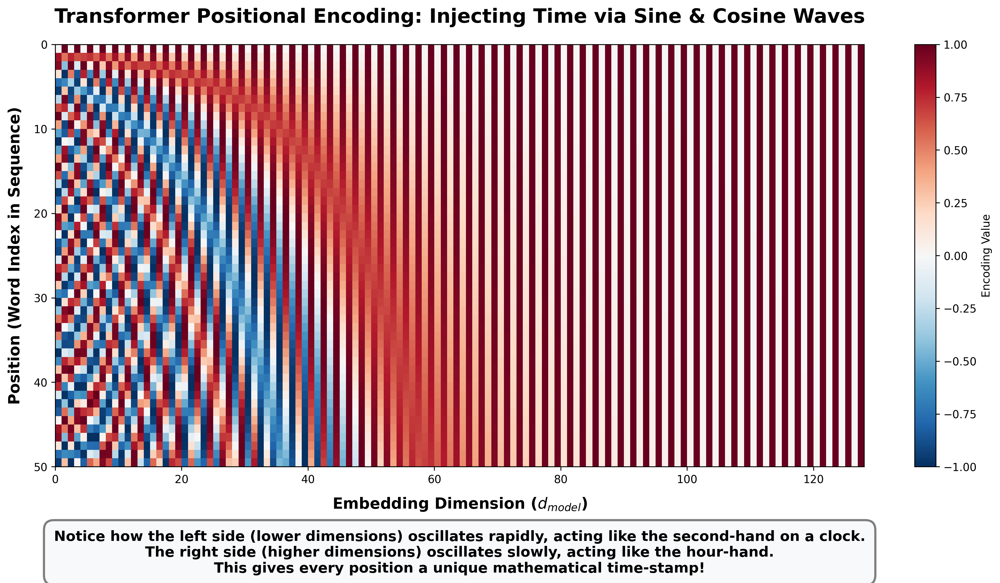

#### Step 3: The Hands-On Math
Let's calculate the Positional Encoding for a tiny embedding where $d_{model} = 4$. We want the encoding for the **first word** in the sentence ($pos = 0$) and the **second word** ($pos = 1$).

**For $pos = 0$ (The First Word):**
*   Dim 0 (Even, $i=0$): $\sin(0 / 10000^0) = \sin(0) = \mathbf{0}$
*   Dim 1 (Odd, $i=0$): $\cos(0 / 10000^0) = \cos(0) = \mathbf{1}$
*   Dim 2 (Even, $i=1$): $\sin(0 / 10000^{2/4}) = \sin(0) = \mathbf{0}$
*   Dim 3 (Odd, $i=1$): $\cos(0 / 10000^{2/4}) = \cos(0) = \mathbf{1}$
*   $PE_0 = [0, 1, 0, 1]$

**For $pos = 1$ (The Second Word):**
*   Dim 0 (Even, $i=0$): $\sin(1 / 10000^0) = \sin(1) \approx \mathbf{0.84}$
*   Dim 1 (Odd, $i=0$): $\cos(1 / 10000^0) = \cos(1) \approx \mathbf{0.54}$
*   Dim 2 (Even, $i=1$): The denominator is $10000^{2/4} = 100$. $\sin(1 / 100) = \sin(0.01) \approx \mathbf{0.01}$
*   Dim 3 (Odd, $i=1$): $\cos(1 / 100) = \cos(0.01) \approx \mathbf{1.00}$
*   $PE_1 = [0.84, 0.54, 0.01, 1.00]$

Notice how the lower dimensions (Dim 0 and 1) changed drastically from word 0 to word 1. However, the higher dimensions (Dim 2 and 3) barely changed at all. This acts like a clock: the lower dimensions are the fast-moving seconds hand, and the higher dimensions are the slow-moving hours hand. Every position gets a totally unique "timestamp."

#### Step 4: Addition (The Final Input)
The final input that gets passed into the Transformer's Attention layers is simply the element-wise **addition** of the Semantic Embedding and the Positional Encoding.
$$
\text{Final Input} = \text{Embedding} + \text{Positional Encoding}
$$

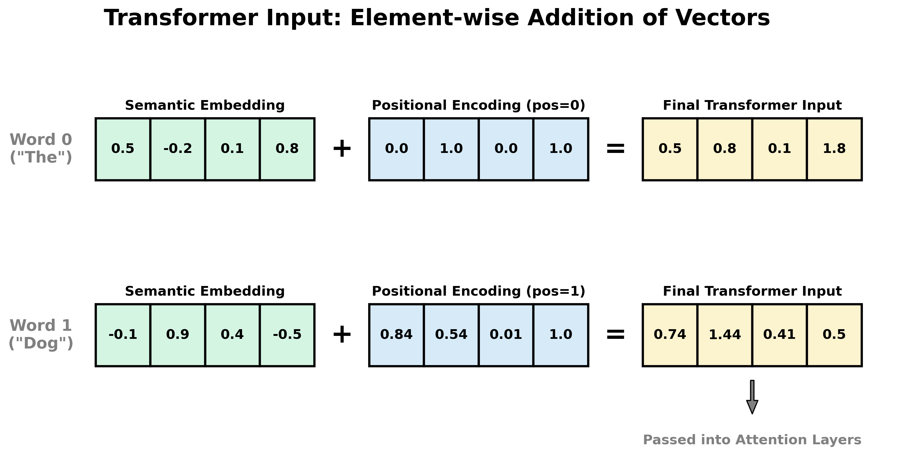

---

### Topic 1 Placement Prep: Elite Input Processing Flashcards

**Q1: Why did the Transformer authors choose to add the Positional Encodings to the Word Embeddings, rather than concatenating them? Doesn't adding them destroy the semantic meaning of the word?**
*   **Answer:** They used addition to save memory and parameters. If you concatenate a 512-dim embedding with a 512-dim positional encoding, your input suddenly becomes 1024 dimensions, which explodes the parameter count of the initial dense layers. Adding them does introduce a slight amount of "noise" to the semantic meaning, but in extremely high-dimensional space (like 512D), vectors have enough capacity to store both spatial and semantic information simultaneously without catastrophic interference. 

**Q2: Why use complex Sine and Cosine waves for Positional Encoding instead of just assigning simple integers (e.g., Word 1 = 1, Word 2 = 2)?**
*   **Answer:** If we use raw integers, a 5,000-word document would have a final position value of 5,000. This massive number would completely dwarf the values in the word embedding (which are usually normalized around 0), destroying the word's meaning. Furthermore, sine and cosine waves are bounded strictly between -1 and 1, ensuring mathematical stability regardless of sequence length. 

**Q3: What is the specific mathematical property of Sine and Cosine encodings that helps the network learn "relative" positions (e.g., understanding that Word A is exactly 3 words away from Word B)?**
*   **Answer:** For any fixed offset *k* (e.g., a distance of 3 words), the positional encoding at position $pos+k$ can be represented as a strict linear transformation (a rotation matrix) of the positional encoding at *pos*. Because neural networks are highly optimized for learning linear transformations, this trigonometric property makes it incredibly easy for the Attention Mechanism to learn relative distances between words.

**Q4: If you visualize a Transformer's Positional Encoding matrix as a heatmap, what distinct visual pattern emerges and what is its functional significance?**
*   **Answer:** The visualization reveals a distinct "clock-like" pattern. The lower embedding dimensions (left side of the heatmap) oscillate very rapidly between -1 and 1, acting like the "seconds-hand" of a clock to provide fine-grained, localized position data for nearby words. The higher embedding dimensions (right side) oscillate very slowly, acting like the "hours-hand" to provide broad, global context across the entire sequence. Together, they generate a mathematically unique, continuous fingerprint for every single position.

## Topic 2: The Core Engine — Scaled Dot-Product Attention

The absolute heart of a Transformer is the **Attention Mechanism**. In an LSTM, a word gets its context solely from the hidden state of the word immediately before it. In a Transformer, every single word looks at *every other word in the sentence simultaneously* and mathematically decides which words are most relevant to its own meaning.

To do this, the network relies on the concept of **Queries (*Q*)**, **Keys (*K*)**, and **Values (*V*)**.

### 1. The Database Analogy
Think of a traditional library database:
*   **Query (*Q*):** What you type into the search bar (e.g., "Machine Learning").
*   **Key (*K*):** The titles/tags of all the books in the library (e.g., "Intro to AI", "Cooking 101").
*   **Value (*V*):** The actual text inside the book you retrieve.

In a Transformer, *every single word* in the sentence acts as a Query, a Key, and a Value simultaneously. 
For example, in the sentence *"The bank of the river"*, the word *"bank"* creates a Query asking: *"I am a bank, do any of you other words give me context?"* The word *"river"* has a Key that says *"I am a body of water."* The Query and Key match, so *"bank"* retrieves the Value of *"river"* to understand that it is a muddy riverbank, not a financial institution.

### 2. The Formula
The entire mechanism is defined by one elegant mathematical equation:
$$
\text{Attention}(Q, K, V) = \text{softmax}\left(\frac{Q K^T}{\sqrt{d_k}}\right)V
$$

Let's break down exactly what this matrix math is doing step-by-step.

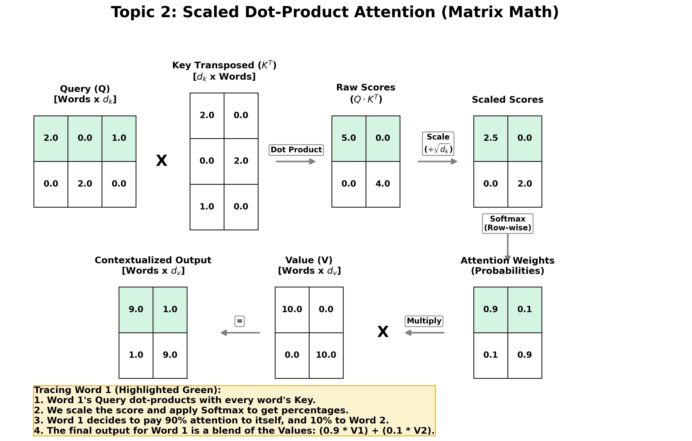

### 3. The Step-by-Step Matrix Calculus

**Step 1: The Dot Product ($Q \cdot K^T$)**
We take the matrix of all Queries (*Q*) and multiply it by the transposed matrix of all Keys ($K^T$). 
*   Mathematically, a dot product measures *similarity*. If two vectors point in the same direction, their dot product is a large positive number. 
*   This step creates a grid of **Raw Scores**, showing exactly how much every word relates to every other word.

**Step 2: The Scaling Factor ($\div \sqrt{d_k}$)**
We divide the raw scores by the square root of the embedding dimension ($d_k$). 
*   *Why?* If the dimensions are very large, dot products yield massive numbers (e.g., $150, 400$). 
*   If we feed massive numbers into a Softmax function, it gets pushed into the extreme "tails" of the curve, causing the gradient to vanish to 0 during backpropagation. Scaling keeps the numbers small and stabilizes the gradients.

**Step 3: The Softmax ($\text{softmax}$)**
We apply a row-wise Softmax to the scaled scores. 
*   This transforms the raw scores into a clean probability distribution (percentages that sum to 1.0). 
*   These are the **Attention Weights**. (e.g., Word 1 decides to pay 90% attention to itself, and 10% attention to Word 2).

**Step 4: Contextualizing the Values ($\cdot V$)**
Finally, we multiply our Attention Weights by the Value matrix (*V*). 
*   If Word 1's attention weights are $[0.9, 0.1]$, its final output vector will physically be $90\%$ of Word 1's value added to $10\%$ of Word 2's value. 
*   The output is a mathematically blended vector. The word has been perfectly contextualized by its surroundings!

---

### Topic 2 Placement Prep: Elite Attention Flashcards

**Q1: Explain why the operation is called *Scaled* Dot-Product Attention. What specific problem does the scaling factor solve during neural network training?**
*   **Answer:** It is scaled by dividing the dot product by $\sqrt{d_k}$ (the square root of the dimension of the key vectors). As the dimension $d_k$ grows, the dot product of *Q* and *K* produces exponentially larger numbers. When these large numbers are passed into the Softmax function, the Softmax becomes a "hard max" (outputting 1 for the highest value and 0 for everything else). Because the curve of Softmax is completely flat at these extremes, the derivative becomes 0, completely killing the gradient and halting learning. Scaling stabilizes the variance to 1, ensuring healthy gradient flow.

**Q2: What is the computational complexity of the Self-Attention mechanism with respect to the sequence length (*N*), and why is this a massive bottleneck for Large Language Models?**
*   **Answer:** The complexity is $O(N^2 \cdot d)$, where *N* is the sequence length (number of words) and *d* is the embedding dimension. Because every single word (Query) must calculate a dot product with every other word (Key), creating an $N \times N$ attention matrix, the compute and memory requirements scale quadratically. If you double the size of the context window (e.g., from 4,000 to 8,000 tokens), the computational cost quadruples. 

**Q3: In a standard Transformer, how are the *Q*, *K*, and *V* matrices actually created from the input embeddings?**
*   **Answer:** The input embedding matrix (*X*) is multiplied by three separate, distinct, learnable weight matrices ($W^Q$, $W^K$, and $W^V$). So, $Q = X \cdot W^Q$, $K = X \cdot W^K$, and $V = X \cdot W^V$. The network literally learns *how* to ask questions ($W^Q$), *how* to advertise itself to other words ($W^K$), and *what* underlying meaning to provide when selected ($W^V$).

### 4. Geometric Intuition: Moving Through Semantic Space

Instead of just looking at the math, it is incredibly helpful to visualize Self-Attention as physical movement through a 3D semantic coordinate system (as popularized by educators like CampusX).

Imagine an embedding space with a **"Financial Axis"** and a **"Nature Axis"**. 

Let's look at the classic ambiguous word problem: *"I sat on the bank of the river."*

1.  **Before Attention (Raw Embeddings):** The word *"bank"* enters the network as a raw vector. Because "bank" is most commonly associated with money, its raw embedding vector sits high up on the Financial axis, far away from nature.
2.  **The Attention Weights:** During the $Q \cdot K^T$ dot product, the network realizes that the word *"bank"* appears right next to the word *"river"*. The Softmax outputs a probability distribution dictating that *"bank"* should pay $90\%$ of its attention to *"river"*.
3.  **After Attention (The Vector Blend):** We multiply the weights by the Value matrix. Because $90\%$ of the *"river"* vector was poured into the *"bank"* vector, the *"bank"* vector is literally **pulled through the 3D embedding space** toward *"river"*.

The output vector exiting the Attention block has physically migrated away from the Financial corner and now sits closely alongside *"river"* in the Nature corner. The network now definitively knows we are talking about a muddy riverbank!

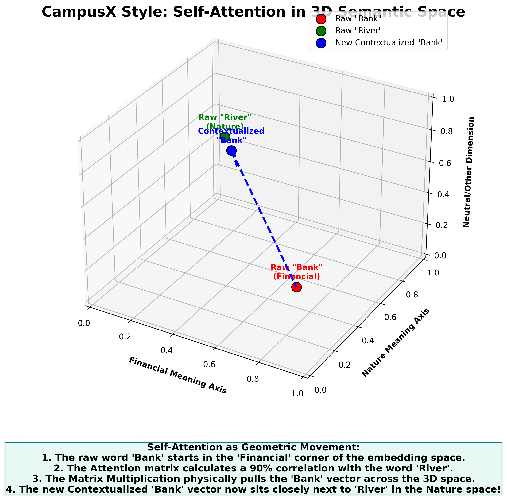

## Topic 3: Multi-Head Attention

Using a single Attention mechanism (Single-Head Attention) presents a major semantic bottleneck. If a word can only calculate one set of attention weights, it tends to just heavily average itself with the most dominant related word in the sentence, missing out on nuanced grammar.

For example, in the sentence *"The quick brown fox jumps"*, the word *"fox"* needs to simultaneously attend to *"quick"* and *"brown"* (adjectives), as well as *"jumps"* (the verb). 

To allow the network to track multiple different grammatical relationships at the exact same time, the authors introduced **Multi-Head Attention**.

### 1. The Architecture of Splitting

Instead of calculating one massive attention score for the entire $512$-dimensional embedding, the Transformer logically splits the embedding into multiple smaller "Heads." 

If our model has $d_{model} = 512$ and uses $h = 8$ heads, the dimensionality of each individual head ($d_k$) becomes:

$$
d_k = \frac{d_{model}}{h} = \frac{512}{8} = 64
$$

The network creates 8 completely independent sets of $Q$, $K$, and $V$ weight matrices. Each head projects the input down into a 64-dimensional space, and performs the Scaled Dot-Product Attention completely independently.

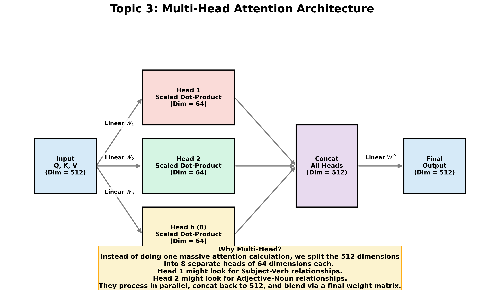

### 2. The Multi-Head Math

Because the heads are independent, Head 1 might learn to strictly look for subject-verb relationships, while Head 2 learns to strictly look for negative modifiers (like the word "not"). 

Mathematically, the output of each specific head ($i$) is calculated as:

$$
\text{head}_i = \text{Attention}(QW_i^Q, KW_i^K, VW_i^V)
$$

### 3. Concatenation and the Output Weight ($W^O$)

After all 8 heads have finished their independent attention calculations, they each output a matrix of dimension $64$. 

Because the next layer of the neural network strictly expects an input of dimension $512$, we simply concatenate the 8 heads back together side-by-side ($8 \times 64 = 512$). 

Finally, to allow the network to blend the insights from all 8 heads together into one unified context, the concatenated matrix is multiplied by a final, learnable output weight matrix ($W^O$):

$$
\text{MultiHead}(Q, K, V) = \text{Concat}(\text{head}_1, \dots, \text{head}_h)W^O
$$

---

### Topic 3 Placement Prep: Elite Multi-Head Flashcards

**Q1: Does using 8 heads instead of 1 head increase the computational complexity of the Attention Mechanism?**
*   **Answer:** No, it does not. Because the embedding dimension is divided by the number of heads ($d_k = d_{model} / h$), the total amount of matrix multiplication remains exactly the same. We are simply performing 8 smaller matrix multiplications in parallel instead of 1 massive matrix multiplication. The computational cost is identical, but the semantic capacity is drastically improved.

**Q2: In a standard Transformer, if we increase the number of heads from 8 to 16, what must mathematically happen to the dimension of each head ($d_k$)? What is the potential risk of doing this?**
*   **Answer:** If $d_{model}$ remains 512, increasing to 16 heads means $d_k$ shrinks to exactly 32 ($512 / 16$). The risk is that if $d_k$ becomes too small, the representation capacity of the individual Query and Key vectors becomes too weak. A 32-dimensional vector may not have enough numerical space to accurately encode complex semantic features, causing the dot-product matching to degrade and the model's performance to drop.

**Q3: Explain the role of the final Output Weight matrix ($W^O$) in Multi-Head Attention.**
*   **Answer:** When the individual heads are concatenated back together, their features are completely isolated from one another (e.g., the first 64 dimensions only contain data from Head 1). The $W^O$ matrix acts as a linear projection that mathematically mixes and blends the dimensions across all the heads. It allows the network to synthesize the independent grammatical insights (e.g., subject-verb context combined with adjective-noun context) into a single, cohesive representation before passing it to the Feed-Forward network.
### 4. Modern Optimization: Multi-Query (MQA) & Grouped-Query Attention (GQA)

While standard Multi-Head Attention (MHA) is mathematically elegant, it creates a massive engineering bottleneck during **Inference (Text Generation)**. 
When an LLM generates text one word at a time, it must store all previous Keys and Values in GPU RAM (this is called the **KV Cache**). In standard MHA, because every single head has its own unique $K$ and $V$ matrix, the KV Cache grows uncontrollably, quickly eating up all available GPU VRAM.

To solve this, modern foundation models (like LLaMA 3, Mistral, and Gemini) alter the architecture:
*   **Multi-Query Attention (MQA):** The network still has 8 independent Query ($Q$) heads, but they all **share a single** Key ($K$) and Value ($V$) head. This drastically shrinks the KV cache, making generation lightning fast, though it sacrifices a bit of accuracy.
*   **Grouped-Query Attention (GQA):** The perfect middle ground. If you have 8 Query heads, you might group them into 2 Key/Value heads (4 Queries share 1 KV). This preserves the speed/memory benefits of MQA while maintaining the accuracy of MHA.

---

**Q4: The original Transformer paper states that Multi-Head Attention allows the model to "jointly attend to information from different representation subspaces." What exactly is a representation subspace in this context?**
*   **Answer:** A representation subspace refers to the smaller, lower-dimensional vector space (e.g., 64 dimensions) created when the 512-dimensional embedding is projected by a specific head's weight matrix. Because each head has randomly initialized, independent weights that are learned separately via backpropagation, each head mathematically projects the data into a completely different geometric space. This allows one subspace to specialize in syntax (grammar), another in semantics (meaning), and another in temporal relationships (time/order), all without overwriting or interfering with each other.

**Q5: During autoregressive generation (generating one token at a time), why does the memory requirement of Multi-Head Attention scale dynamically, and how does Multi-Query Attention (MQA) fix it?**
*   **Answer:** Memory scales dynamically because of the **KV Cache**. To avoid recalculating attention for every previous word every time a new word is generated, the model caches the Key and Value vectors of all past tokens in GPU VRAM. In standard MHA, if you have 32 heads, you cache 32 sets of $K$ and $V$ vectors per token. MQA forces all 32 Query heads to share a single $K$ and single $V$ head. This reduces the size of the KV cache by a factor of 32, allowing the model to process much larger batch sizes and longer context windows without running out of memory.

## Topic 4: Layer Normalization (LayerNorm vs. BatchNorm)

Before passing data through the deep neural network blocks of a Transformer, we must normalize the outputs of the Attention mechanism. Normalization prevents gradients from exploding and keeps the mathematical scale of the vectors stable. 

However, Transformers completely abandon **Batch Normalization (BatchNorm)** in favor of **Layer Normalization (LayerNorm)**. Understanding *why* is a highly tested concept in Deep Learning interviews.

### 1. The Flaw of Batch Normalization on Text
BatchNorm calculates the mean and variance for a single feature (e.g., Feature #5) across the *entire batch* of data. 
This works beautifully for images (which are all identically sized, like $224 \times 224$), but it completely breaks down on text for two reasons:
1.  **Variable Sequence Lengths:** In a batch of text, Sentence A might have 5 words, while Sentence B has 50 words. To create a mathematical matrix, we pad Sentence A with 45 "Empty/Zero" tokens. If we calculate a batch mean across these padded tokens, the statistics become completely heavily distorted by zeros, ruining the normalization.
2.  **Batch Dependency:** During inference (running the model in production), you might only send the model one sentence at a time (Batch Size = 1). BatchNorm cannot calculate a variance on a batch of 1, forcing it to rely on frozen, inaccurate historical statistics.

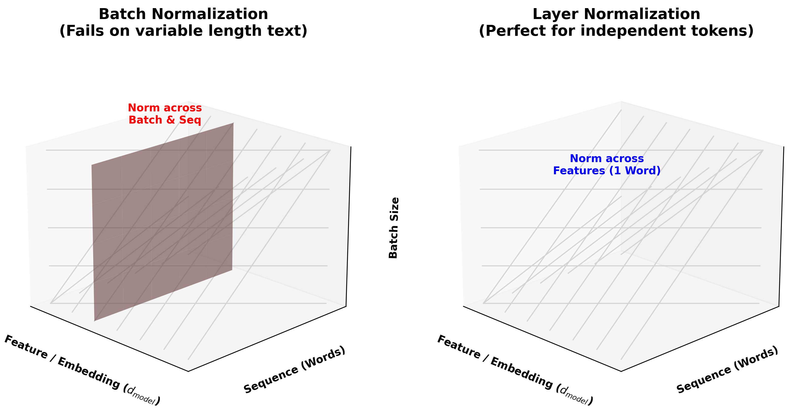

### 2. The LayerNorm Solution
**Layer Normalization** ignores the batch dimension entirely. Instead of normalizing one feature across all words, LayerNorm calculates the mean and variance across **all $512$ features ($d_{model}$) for a single, individual word**.

*   Because it only looks at one word at a time, it is completely immune to sequence padding.
*   Because it doesn't look at the batch, it behaves exactly the same during training (Batch = 128) as it does in production (Batch = 1).

### 3. The Explicit LayerNorm Math
For a single word's embedding vector $x$ of length $d$ (e.g., $d = 512$):

**Step 1: Calculate the Mean ($\mu$) of the word's vector:**

$$
\mu = \frac{1}{d} \sum_{j=1}^{d} x_j
$$

**Step 2: Calculate the Variance ($\sigma^2$) of the word's vector:**

$$
\sigma^2 = \frac{1}{d} \sum_{j=1}^{d} (x_j - \mu)^2
$$

**Step 3: Normalize and Apply Learned Parameters:**
We subtract the mean, divide by the standard deviation (adding a tiny $\epsilon$ to prevent division by zero), and then multiply by a learned scaling parameter ($\gamma$) and add a learned shift parameter ($\beta$).

$$
\text{LayerNorm}(x) = \gamma \left( \frac{x - \mu}{\sqrt{\sigma^2 + \epsilon}} \right) + \beta
$$

---

### Topic 4 Placement Prep: Elite LayerNorm Flashcards

**Q1: In Layer Normalization, what is the exact mathematical purpose of the learned parameters $\gamma$ (gamma) and $\beta$ (beta)?**
*   **Answer:** When you strictly normalize a vector to have a mean of 0 and a variance of 1, you permanently alter its geometric distribution, which can actually destroy valuable representational data (e.g., the network might *need* a specific word's values to be highly skewed to represent strong attention). The parameters $\gamma$ (scale) and $\beta$ (shift) are learnable weights that allow the neural network to mathematically "undo" the normalization if it decides that the original, un-normalized distribution was optimal for reducing the loss. 

**Q2: Contrast how BatchNorm and LayerNorm handle a Batch Size of 1 during inference.**
*   **Answer:** BatchNorm relies on batch statistics. With a batch size of 1, variance is mathematically undefined (you cannot calculate the variance of a single number). Therefore, during inference, BatchNorm must use a running average computed during training, which may not perfectly match the live input. LayerNorm calculates statistics across the feature dimension ($d_{model}$). Even if the batch size is 1, a single word still has 512 features, meaning LayerNorm can compute exact, live statistics for that specific word on the fly.

**Q3: How does Layer Normalization specifically aid the flow of gradients in a deep, 96-layer Transformer?**
*   **Answer:** Without normalization, the repeated matrix multiplications in the Attention and Feed-Forward layers cause the variance of the embeddings to exponentially explode, pushing the values deep into the flat regions of activation functions (like Softmax or GeLU). In these flat regions, the derivative approaches zero, killing the gradients. By repeatedly re-centering the embedding vectors back to a unit variance at every layer, LayerNorm keeps the values in the "steep" regions of the activation functions, ensuring strong, healthy gradients can backpropagate all the way to layer 1.

## Topic 5: The Encoder Block (Understanding Context)

A Transformer relies on stacking multiple identical blocks on top of each other. The **Encoder Block** is specifically designed to read an input sequence and build a deep, mathematically rich understanding of the context of every single word. 

Models that only use the Encoder half of the Transformer (like Google's **BERT**) are phenomenal at text classification, sentiment analysis, and search engine retrieval, because their entire architecture is dedicated to reading and contextualizing.

### 1. The Architecture of the Encoder
A single Encoder Block contains two main sub-layers:
1.  **Multi-Head Self-Attention:** Routes information between the words.
2.  **Position-wise Feed-Forward Network (FFN):** Memorizes facts and processes the routed information.

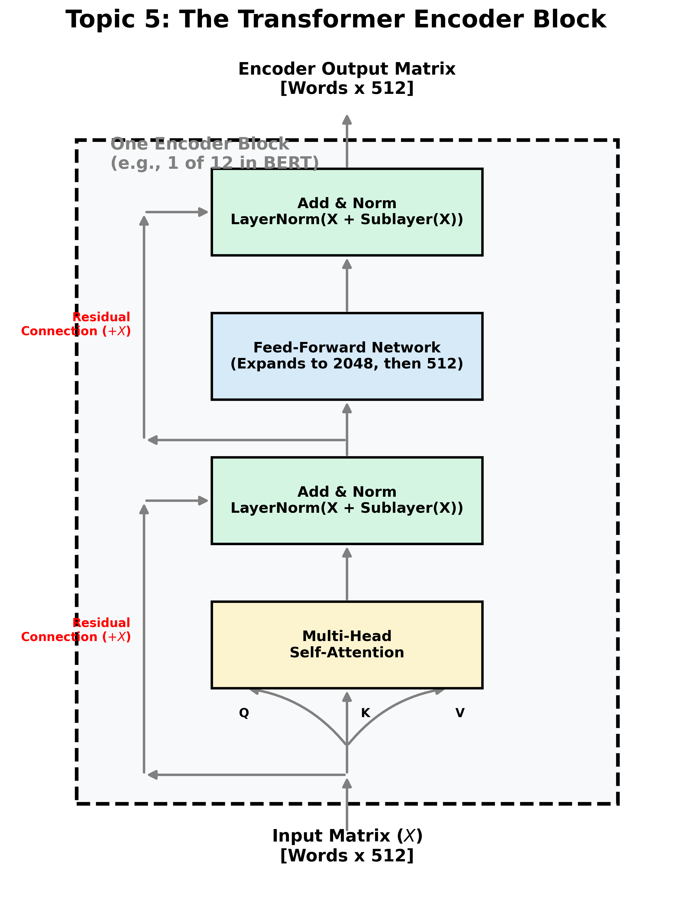

### 2. The Residual Connections (Add & Norm)

Notice that around both the Attention mechanism and the FFN, there is a path that completely bypasses the mathematical layers. This is a **Residual Connection** (identical to a ResNet in Computer Vision). 

After the bypass, the original input ($x$) is added back to the output of the sub-layer ($\text{Sublayer}(x)$), and then immediately passed through a Layer Normalization function.

$$
\text{Output} = \text{LayerNorm}(x + \text{Sublayer}(x))
$$

*   **The "Add" (Residual):** Prevents the Vanishing Gradient problem. If you stack 24 Encoder blocks (like in BERT-Large), the gradients during backpropagation would normally multiply down to zero. The residual connections create a "gradient superhighway" straight from layer 24 down to layer 1.
*   **The "Norm" (LayerNorm):** Prevents the values from exponentially exploding as they are repeatedly added together across 24 layers.

### 3. The Feed-Forward Network (The Transformer's Memory)

While the Attention mechanism is famous, it does virtually no "thinking" or "remembering." Attention is strictly a **routing mechanism**—it just moves data from one word to another. 

The actual memorization of world knowledge (e.g., knowing that "Paris" is the capital of "France") happens entirely inside the **Position-wise Feed-Forward Network (FFN)**. 

Every single word vector (dimension $512$) is passed independently through a massive, two-layer Multi-Layer Perceptron (MLP):

$$
\text{FFN}(x) = \text{ReLU}(x W_1 + b_1) W_2 + b_2
$$

**The Massive Expansion:**
In the original Transformer paper, $W_1$ expands the $512$-dimensional embedding into a massive $2048$-dimensional vector space. After applying the non-linear ReLU (or GELU) activation, $W_2$ mathematically compresses it back down to exactly $512$ dimensions. 
*   This expansion allows the network to project the word into a much higher-dimensional space to identify highly complex, abstract features before compressing the most important insights back into the word's primary representation.

---

### Topic 5 Placement Prep: Elite Encoder Flashcards

**Q1: In an Encoder block, does the Feed-Forward Network (FFN) mix information between different words in the sentence?**
*   **Answer:** No, absolutely not. The FFN is "Position-wise," meaning the exact same dense neural network is applied to the 512-dimensional vector of Word 1, and then applied completely independently to the 512-dimensional vector of Word 2. No data crosses between the words during the FFN step. Information *only* mixes between different words during the Self-Attention step.

**Q2: What is the architectural reason for placing the Residual Addition ($x + \text{Sublayer}(x)$) *before* the Layer Normalization, rather than after it? (Note: Pre-LN vs Post-LN).**
*   **Answer:** The original "Attention is All You Need" paper placed normalization *after* the addition (Post-LN). However, in extremely deep networks (e.g., GPT-3 with 96 layers), Post-LN causes the gradients near the output to be massive and the gradients near the input to be tiny, leading to highly unstable training requiring careful learning rate warmups. Modern architectures (like GPT-2/3 and LLaMA) use **Pre-LN**, moving the LayerNorm *inside* the residual block directly before the Attention and FFN layers. This ensures the residual superhighway is pure, un-normalized addition from start to finish, vastly stabilizing deep training.

**Q3: The parameters of the FFN account for roughly two-thirds of a Transformer's total parameter count. If Attention is the core innovation, why is the FFN so massively oversized (e.g., expanding from 512 to 2048)?**
*   **Answer:** Research (like the "Transformer Feed-Forward Layers Are Key-Value Memories" paper) indicates that the FFN acts as a massive, un-normalized Key-Value memory database for the model's world knowledge. The expansion to 2048 dimensions gives the hidden layer enough neurons to store factual associations (e.g., if the input vector activates the pattern for "Eiffel", the expanded neurons trigger the pattern for "Tower" and "Paris"). Without an oversized FFN, the model would be excellent at grammar (via Attention) but would hallucinate facts constantly due to a lack of memory capacity.

**Q4: The original Transformer paper used ReLU in the Feed-Forward Network, but modern models (like GPT-3, LLaMA, and ViT) almost exclusively use GeLU (Gaussian Error Linear Unit) or SwiGLU. Why?**
*   **Answer:** ReLU is a rigid function: it strictly outputs $0$ for any negative input. This can cause the "Dying ReLU" problem, where neurons get permanently stuck outputting zero and stop updating. GeLU is a smoother, probabilistic variation of ReLU. Instead of a hard cutoff at $0$, it has a gentle, smooth curve that allows a tiny amount of negative values to pass through. This smoothness ensures that gradients never completely die, leading to much faster convergence and deeper mathematical representations during training.

## Topic 6: The Decoder Block (The Generative Engine)

While the Encoder half of the Transformer reads and contextualizes (as used in BERT), the **Decoder Block** is fundamentally designed to generate new sequences. This is the exact architecture powering models like **GPT-3, GPT-4, LLaMA, and Claude**—they are essentially just stacks of many identical Decoder Blocks.

The Decoder is "auto-regressive," meaning it generates one word at a time, and its output from one time step becomes its input for the next time step. The critical architectural differences from the Encoder are dedicated to controlling this generation.

### 1. The Architecture of the Decoder
A standard Decoder Block (like used in a neural translation system) contains **three** sub-layers, whereas the Encoder only had two:
1.  **Masked Self-Attention:** Tracks relationships between generated words without "cheating."
2.  **Cross-Attention (Encoder-Decoder Attention):** Looks back at the Encoder's output context.
3.  **Position-wise Feed-Forward Network:** The memorization memory.

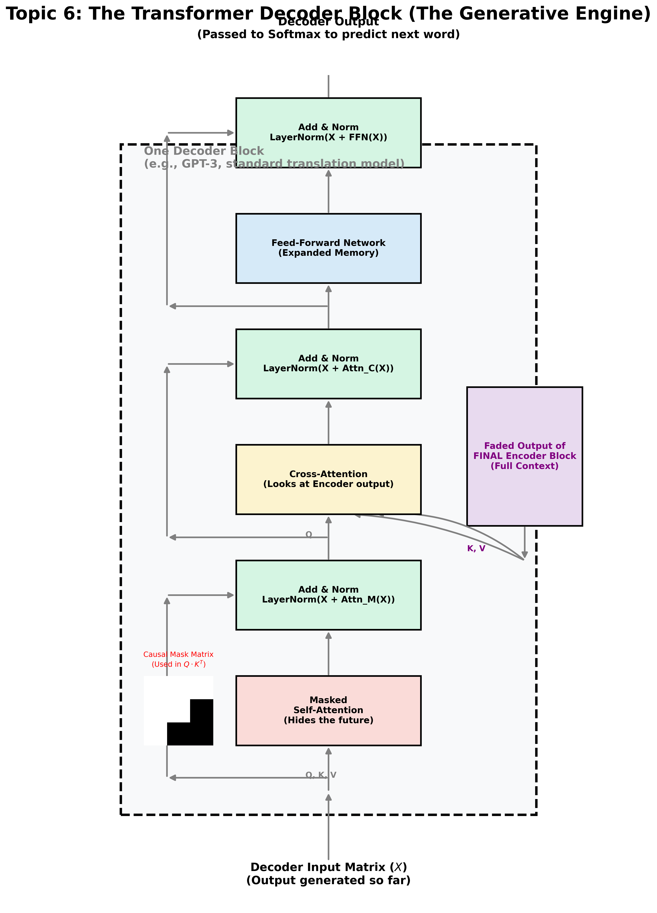

### 2. Modification 1: Masked Self-Attention (No Cheating!)

**The Problem: Training vs. Inference**
To understand *why* we need a mask, we must understand how training works differently from inference:
*   **During Inference (Production):** The model is generating text auto-regressively. It generates Word 1, looks at Word 1 to generate Word 2, looks at Words 1 & 2 to generate Word 3. The model literally *cannot* look into the future because the future hasn't been generated yet.
*   **During Training:** If we trained the model auto-regressively (waiting for it to guess a word, calculating loss, and then guessing the next), training a model like GPT-4 would take decades. Instead, we use **Teacher Forcing**. We feed the *entire* target sentence (e.g., *"Je suis un robot"*) into the Decoder all at once in a single massive batch. 

**The Cheating Dilemma**
Because we feed the entire sentence in at once during training, standard Self-Attention ($\text{softmax}(\frac{QK^T}{\sqrt{d_k}})V$) will allow the Query for Word 2 (*"suis"*) to calculate a dot product with the Key of Word 3 (*"un"*). The neural network will immediately realize that the easiest way to minimize the loss function is to just copy the future word. It will perfectly memorize the target data and learn absolutely nothing about grammar or generation.

**The Causal Masking Solution**
To achieve massive parallel training speeds without allowing the model to cheat, we apply a mathematical **Causal Mask** to the raw attention scores ($Q \cdot K^T$) before the Softmax.

Imagine predicting the next word in *"Je suis un robot."* 
*   When calculating the attention for *"suis"* ($pos=1$), we create a Mask vector where past/current positions are 0, but the future words *"un"* ($pos=2$) and *"robot"* ($pos=3$) are filled with **$-\infty$** (Negative Infinity).

$$
\text{Raw Attention scores } (Q \cdot K^T) \approx \begin{bmatrix} 15 & 4 & 1 & 0 \\ \mathbf{4} & \mathbf{12} & \mathbf{3} & \mathbf{2} \\ 1 & 3 & 14 & 0 \\ 0 & 2 & 0 & 13 \end{bmatrix}
$$

Apply **Causal Mask** (Upper-Triangle set to $-\infty$):

$$
\text{Masked Attention scores } (Q \cdot K^T) \approx \begin{bmatrix} 15 & -\infty & -\infty & -\infty \\ \mathbf{4} & \mathbf{12} & -\infty & -\infty \\ 1 & 3 & 14 & -\infty \\ 0 & 2 & 0 & 13 \end{bmatrix}
$$

When we apply the Softmax, $e^{-\infty}$ is exactly $0$. The network is mathematically forced to assign $0.000\%$ attention to any future words. The model now acts exactly as it would during inference—it can only rely on the past to predict the future—but it can do it for all words in the sentence simultaneously in a single GPU pass!

### 3. Modification 2: Cross-Attention (Encoder-Decoder Attention)

While pure generative models (like GPT-3 or LLaMA) are "Decoder-only" and use just the Masked Self-Attention, Sequence-to-Sequence models (like those used for Translation, Summarization, or Whisper Audio) use an Encoder-Decoder architecture.

If the Decoder is generating a French sentence, it must have a way to constantly "cross-examine" the original English sentence to ensure its generation remains perfectly faithful to the prompt.

**The Mechanics of Cross-Attention**
In a standard Self-Attention layer, $Q$, $K$, and $V$ all come from the exact same sentence. 
In a **Cross-Attention** layer, the inputs are split across the two halves of the network:

1.  **Queries ($Q$) come from the Decoder:** The Query matrix is derived from the French words the Decoder has generated so far. You can think of the Query as the Decoder asking: *"Based on the French grammar I just wrote, what piece of information do I need next?"*
2.  **Keys ($K$) & Values ($V$) come from the Encoder:** The Key and Value matrices are pulled directly from the output of the *FINAL* **Encoder Block**. The Encoder has already processed the English prompt and mapped out the perfect semantic relationships. The Keys act as tags saying: *"I have information about a verb here,"* and the Values hold the actual context.

**The Math in Action:**
If the Encoder processes the English sentence *"I sat on the bank of the river"*, and the Decoder has currently generated *"Je me suis assis sur la"*, the Decoder creates a Query for the next word. 
That Query calculates a dot product with all the Encoder's Keys. It will find a massive similarity score with the Encoder's Key for *"bank"*. It will extract the Value of the contextualized *"bank"* vector (which the Encoder already determined means a muddy riverbank, not a financial institution), and use that data to correctly predict the French word *"rive"*.

Without Cross-Attention, the Decoder would just hallucinate grammatically correct French text that has nothing to do with the original English prompt.

---

### Topic 6 Placement Prep: Elite Decoder Flashcards

**Q1: Contrast *Self-Attention* in the Encoder with *Masked Self-Attention* in the Decoder. Mathematically, what prevents the latter from accessing future tokens?**
*   **Answer:** Self-Attention in the Encoder allows bidirectional context flow (e.g., Word 1 attends to Word 10, and Word 10 attends back to Word 1). In the Decoder, Masked Self-Attention applies an upper-triangular causal mask to the raw attention score matrix ($QK^T$). The elements corresponding to future positions (where target\_pos > current\_pos) are filled with $-\infty$ (negative infinity). Because $e^{-\infty} = 0$, the row-wise Softmax ensures the final attention weights for any future word are exactly $0.000\%$, mathematically blocking any context leak from the future.

**Q2: What is "Sequence-to-Sequence" (Seq2Seq) modeling, and what architectural component bridges the gap between the Encoder and the Decoder in a Seq2Seq Transformer?**
*   **Answer:** Sequence-to-Sequence modeling (like Neural Machine Translation) is the task of mapping one input sequence (e.g., English sentence) to a totally different output sequence (e.g., French sentence). The component that bridges the two halves is the **Cross-Attention** layer within the Decoder block. In this layer, the Queries ($Q$) come from the generated French output (Decoder), but the Keys ($K$) and Values ($V$) are pulled directly from the final contextualized English representation produced by the last Encoder block.

**Q3: Explain the difference between training and inference (production use) for a GPT-style Decoder-only model. Why is training much more efficient?**
*   **Answer:** Training is highly efficient because of **Teacher Forcing** and **Causal Masking**. We feed the *entire* target sentence into the model at once and use the causal mask to predict the next word for *every single position simultaneously* ($O(N^2)$ complexity). We don't wait for Word 1's output to predict Word 2. However, during Inference, we cannot use the mask because we do not know the target. The model must generate text auto-regressively, one word at a time, feeding its last prediction back as its next input. This serial dependency makes inference fundamentally $O(N)$ and impossible to parallelize, which is why text generation is slow and expensive.

# Module 4: Standard Deep Learning (Synthesis Block)

## 7. Complete Encoder-Decoder Hands-on Trace

We will now perform a rigorous, element-by-element trace of a complete Transformer Forward and Backward Pass.

### The Scalar Model:
To make this trace mathematically visible, we are using a **Scalar Transformer Model** ($d_{model} = 2$, $h = 1$). Full matrices will become visually manageable.

**Problem Statement:** Translate English to French.
**Encoder Input (X):** `["Good", "morning"]` ($N=2$ tokens)
**Decoder Input (Target Y):** `["Bonjour"]` ($M=1$ token, with an implied `<Start>` token)

### Step 1: Input Processing (Both Tracks)

We map the text into initial embedding vectors and add the trigonometric positional encodings.

**Input Sequence for Encoder (X):**
Word $1$ ($pos=0$): "Good" $\rightarrow E_0 = [0.8, -0.2]$
Word $2$ ($pos=1$): "morning" $\rightarrow E_1 = [-0.1, 0.9]$
*Note: We assume a simplified fixed semantic embedding.*

We add the **Positional Encodings** (calculated for $pos \in \{0, 1\}$ and $i \in \{0, 1\}$ with $d=2$):
$PE_0 = [\sin(0), \cos(0)] = [0, 1]$
$PE_1 = [\sin(1), \cos(1)] \approx [0.84, 0.54]$

$$
X_0 = E_0 + PE_0 = [0.8, -0.2] + [0, 1] = \begin{bmatrix} 0.8 & 0.8 \end{bmatrix}
$$
$$
X_1 = E_1 + PE_1 = [-0.1, 0.9] + [0.84, 0.54] = \begin{bmatrix} 0.74 & 1.44 \end{bmatrix}
$$

**Final Input Matrix to Encoder ($X$):**
$$
X = \begin{bmatrix} X_0 \\ X_1 \end{bmatrix} = \begin{bmatrix} 0.8 & 0.8 \\ 0.74 & 1.44 \end{bmatrix}
$$

### Step 2: Encoder Block Forward Pass

The input matrix ($X$) is contextualized by 1 Head ($h=1$) and 1 Layer. We define learnable weight matrices (all $2 \times 2$) for simplicity: $W_Q = I$, $W_K = \begin{bmatrix} 0.5 & 0.5 \\ 0.2 & 0.8 \end{bmatrix}$, $W_V = 2I$.

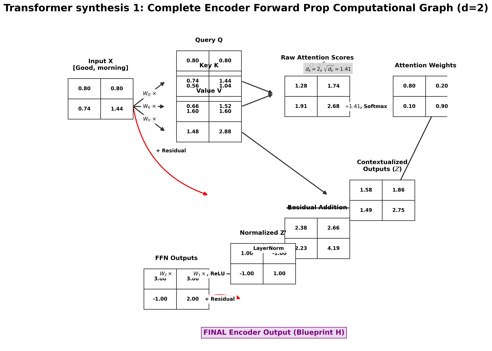

**Part A: Self-Attention mechanism (Tracing Word 1 "Good")**

Word 1 ($X_0 = [0.8, 0.8]$) must look at Word 1 and Word 2.

**Step A1 — Generate Queries, Keys, Values (Q, K, V):**

$$
Q_0 = X_0 \cdot W_Q = [0.8, 0.8] \begin{bmatrix} 1 & 0 \\ 0 & 1 \end{bmatrix} = \begin{bmatrix} 0.8 & 0.8 \end{bmatrix}
$$

$$
K_0 = X_0 \cdot W_K = [0.8, 0.8] \begin{bmatrix} 0.5 & 0.5 \\ 0.2 & 0.8 \end{bmatrix} = \begin{bmatrix} 0.56 & 1.04 \end{bmatrix}
$$

$$
K_1 = X_1 \cdot W_K = [0.74, 1.44] \begin{bmatrix} 0.5 & 0.5 \\ 0.2 & 0.8 \end{bmatrix} = \begin{bmatrix} 0.66 & 1.52 \end{bmatrix}
$$

**Step A2 — Calculate Raw Attention Scores (Dot Products):**

$Score(0 \cdot 0) = Q_0 \cdot K_0 = (0.8 \cdot 0.56) + (0.8 \cdot 1.04) = 0.448 + 0.832 = 1.28$

$Score(0 \cdot 1) = Q_0 \cdot K_1 = (0.8 \cdot 0.66) + (0.8 \cdot 1.52) = 0.528 + 1.216 = 1.74$

**Step A3 — Scale and Softmax:**

$d_k = 2$, so $\sqrt{d_k} \approx 1.41$. We scale the scores:
Scaled Scores = $[1.28/1.41, 1.74/1.41] = [0.91, 1.23]$. Apply row-wise Softmax:

$$
\text{softmax}([0.91, 1.23]) \approx \begin{bmatrix} 0.42 & 0.58 \end{bmatrix}
$$

*Word 1 decides to pay 42% attention to itself and 58% to Word 2.*

**Step A4 — Multiply by V (The final blend for Word 1):**

The values are $V_0 = X_0 W_V = [1.6, 1.6]$ and $V_1 = X_1 W_V = [1.48, 2.88]$.

$$
Z_0 = (0.42 \cdot V_0) + (0.58 \cdot V_1) \approx \begin{bmatrix} 1.53 & 2.34 \end{bmatrix}
$$

This blended vector ($Z_0$) is now fully aware of both "Good" and "morning." The process repeats for all tokens.

**Part B: Add & Norm, FFN (Trace to final Blueprint H)**

The contextualized matrix ($Z$) is combined with the original input via the Residual connection ($X$), passed through LayerNorm, expanded to a massive $2 \times 4$ hidden space inside the FFN, compressed back to $2 \times 2$, and another Add&Norm layer applied.

The final output is a $2 \times 2$ matrix, the **English Blueprint H**, where every row is a deep, context-aware representation.

$$
\text{English Blueprint (Encoder Output H)} = \begin{bmatrix} 1.1 & -0.9 \\ -1.1 & 1.3 \end{bmatrix}
$$

### Step 3: Decoder Block Forward Pass

The Decoder is auto-regressive. We provide the `<Start>` token and expect it to generate the French equivalent of "Good morning."

**Input Sequence for Decoder (Y):**
Word $1$ ($pos=0$): `<Start>` $\rightarrow E_0 = [1.0, 1.0]$
Positional Encoding ($PE_0$) = $[0, 1]$.
$Y_0 = [1.0, 1.0] + [0, 1] = \begin{bmatrix} 1.0 & 2.0 \end{bmatrix}$.

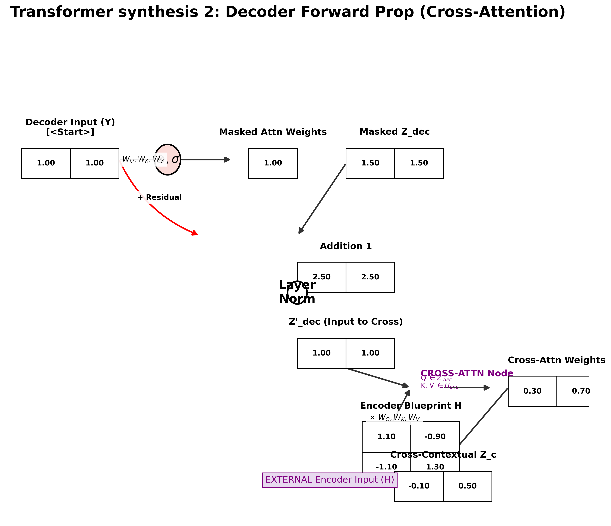

#### The Three Sub-Layers:

**Sub-Layer 1 — Masked Self-Attention (Hiding the future):**

Because we only have one input token (`<Start>`), masking is mathematically trivial: Word 1 only dot-products with itself. The output of this layer ($Z_{dec}$) is just Word 1's value.
*(In a full 10-word translation, Word 5's scores would use $-\infty$ on words 6-10, preventing context leakage)*.

**Sub-Layer 2 — Cross-Attention (The English $\leftrightarrow$ French Bridge):**

This is the most important generative step. The generated output so far (`<Start>`) must "cross-examine" the Encoder context.

We source $Q, K, V$:

$$
Q_{dec} = Y_0 \cdot W_Q^{cross} = \begin{bmatrix} 1.0 & 2.0 \end{bmatrix}
$$

$$
K_{enc} = H_{enc} \cdot W_K^{cross}
$$

$$
K_{word0} = [1.1, -0.9], \quad K_{word1} = [-1.1, 1.3]
$$

*(We assume simplified projections where $W_Q=I$ and $W_K=I$ for cross).*

**Calculate Attention Scores (Blended context):**

$Score(Dec0 \cdot Enc0) = [1.0, 2.0] \cdot [1.1, -0.9] = 1.1 - 1.8 = -0.7$

$Score(Dec0 \cdot Enc1) = [1.0, 2.0] \cdot [-1.1, 1.3] = -1.1 + 2.6 = 1.5$

We divide by $\sqrt{d_k}$ and apply Softmax:

$$
\text{softmax}([-0.7/1.41, 1.5/1.41]) \approx \text{softmax}([-0.5, 1.06]) \approx \begin{bmatrix} 0.17 & 0.83 \end{bmatrix}
$$

*The generated token decides to pay 17% attention to "Good" and 83% attention to "morning."*

This creates the blended contextualized French vector ($Z_{cross}$), ensuring the Decoder is generating text based *only* on the English blueprint.

**Sub-Layer 3 — Add & Norm, FFN (Trace to final generation):**

$Z_{cross}$ is added with the previous Residual, passed through LayerNorm, expanded in the FFN (projecting context into factual memory space), compressed back, and passed through a final Add&Norm layer.

The final Decoder output vector ($h_{dec}$) is passed through a Linear layer and a Softmax, yielding a probability distribution across the entire French vocabulary:

$$
\text{Prediction} = [0.01, 0.98, \dots]
$$

We select the word with the highest probability (0.98): `"Bonjour"`.

### Step 4: End-to-End Backpropagation (Calculus Trace)

Assume the Decoder output `"Bonjour"`. Our French target was `"Bonjour"`. The Loss ($L$) is $0.00$.

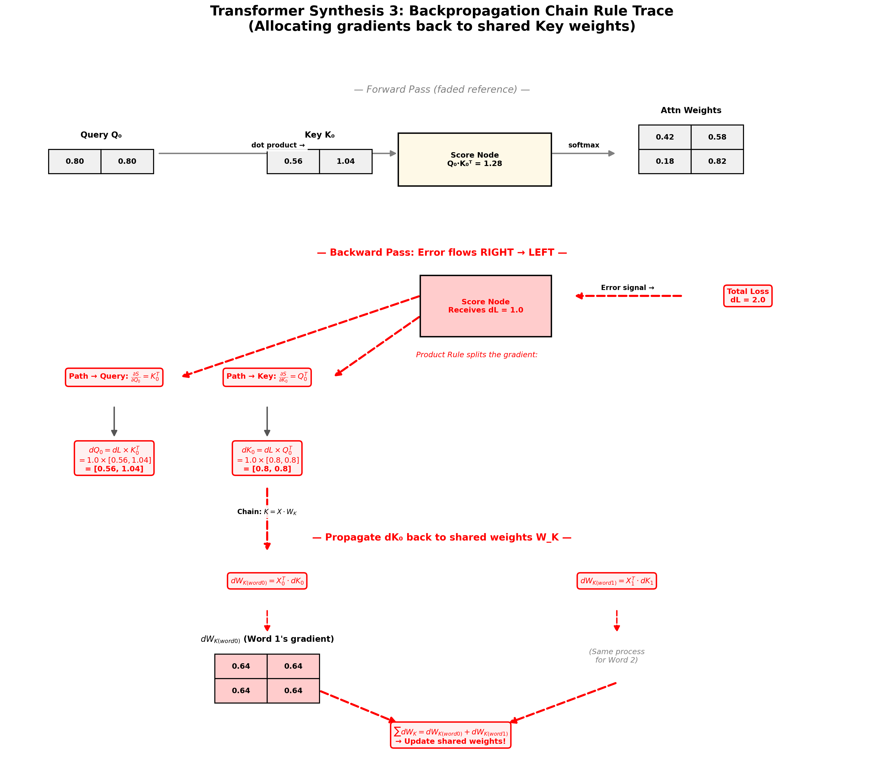

But let's assume we are *training*. The error ($dL = \mathbf{2.0}$) flows backwards. The fundamental goal of Backprop is to allocate this $2.0$ penalty among all the initial shared weights ($W_Q, W_K, W_V$) in both the Encoder and Decoder. 

We will trace the explicit calculus for **allocating the gradient within the Encoder Dot Product path**.

#### Allocating the Error at the Dot Product (Chain Rule Walkthrough)

We start with the Raw Attention score matrix exiting Step 2:

$$
S = Q \cdot K^T = \begin{bmatrix} 1.28 & 1.74 \\ \dots & \dots \end{bmatrix}
$$

We know $Q_0 = [0.8, 0.8]$, $K_0 = [0.56, 1.04]$, and $Score(0 \cdot 0) = 1.28$.

The optimizer reverse-calculates how much $K_0$ *contributed* to that $1.28$ score. The formula for the score is $S = Q_0 \cdot K_0 = Q_{0,dim0}K_{0,dim0} + Q_{0,dim1}K_{0,dim1}$. By the Product Rule:

$$
\frac{\partial S_{(0\cdot 0)}}{\partial K_{0}} = Q_0^T = \begin{bmatrix} 0.8 \\ 0.8 \end{bmatrix}
$$

**Distributing the Gradient backwards into Key Matrix (dK):**

Assume an incoming error gradient ($dL = 1.0$) hits the raw score $1.28$. The new gradient for $K_0$ ($dK_{0,dim0}$ and $dK_{0,dim1}$) is:

$$
dK_{0} = dL \cdot Q_0^T = 1.0 \cdot \begin{bmatrix} 0.8 \\ 0.8 \end{bmatrix} = \begin{bmatrix} 0.8 \\ 0.8 \end{bmatrix}
$$

#### Propagating all the way back to the Weights ($W_K$)

The final shared weights $W_K$ were used to create $K_0$ *and* $K_1$ across multiple tokens (Sequence length = 2). The core rule of RNNs and Transformers is that shared weights **sum their local gradients.**

We must calculate the local gradient contribution for $W_K$ from Word 1 ($K_0$) and Word 2 ($K_1$).
The formula was $K = X \cdot W_K$. By the Product Rule:

$$
\frac{\partial K}{\partial W_K} = X^T
$$

**Allocating Gradient from $K_0$:**

$$
dW_{K(word0)} = X_0^T \cdot dK_0 = \begin{bmatrix} 0.8 \\ 0.8 \end{bmatrix} \cdot \begin{bmatrix} 0.8 \\ 0.8 \end{bmatrix} = \begin{bmatrix} 0.64 & 0.64 \\ 0.64 & 0.64 \end{bmatrix}
$$

**The Final Gradient Accumulation:**

Assume Word 2 ($K_1$) also received an error and generated its own local gradient $dW_{K(word1)}$. The optimizer merges these two unique insights:

$$
\text{Final } dW_K = \sum dW_K = dW_{K(word0)} + dW_{K(word1)} + (\text{all Decoder cross-attn } dW_K)
$$

The optimizer now knows exactly how to adjust $W_K$ to create better Keys in the next epoch. The same matrix-blending logic applies to the other 4 weight paths (Add&Norm, FFN, Attention Q/V).

# Module 5: Modern Deep Learning & Elite Placement Prep

The deep learning world changed forever when we realized that the Transformer architecture did not just outperform other models—it scaled almost linearly with computational power and data. We have moved past training small, task-specific networks to training massive, general-purpose **Foundation Models**.

These massive models are generally just vast stacks of the Encoder or Decoder blocks we just derived.

## Topic 1: Foundation Models & LLM Architecture

### 1. The Generative Pre-Trained Transformer (GPT) Era

While the original Transformer was designed for translation (Sequence-to-Sequence), OpenAI made a massive realization: **We don't actually need the Encoder.**

A modern Large Language Model (LLM) like **GPT-3, GPT-4, or LLaMA** is mathematically a **Decoder-only Transformer**. It performs only one simple mathematical task millions of times a second: **Predict the Next Token.**

#### GPT Architecture vs. Standard Transformer

The original Transformer Decoder had **three** sub-layers per block. A GPT-style Decoder-only model simplifies this to just **two**:

| Feature | Original Decoder (Seq2Seq) | GPT / LLaMA (Decoder-Only) |
|---|---|---|
| Sub-Layer 1 | Masked Self-Attention | Masked Self-Attention (identical) |
| Sub-Layer 2 | Cross-Attention (Q=Decoder, K,V=Encoder) | **Removed entirely** |
| Sub-Layer 3 | Feed-Forward Network | Feed-Forward Network (now Sub-Layer 2) |
| Input | Separate Encoder prompt + Decoder target | Single unified sequence (prompt + generation) |
| Use Case | Translation, Summarization | Chat, Code Generation, Reasoning |

**Why does removing the Encoder work?** In a Decoder-only model, the user's prompt and the model's response are concatenated into a single continuous token sequence. The prompt tokens are processed through the same Masked Self-Attention mechanism, meaning the model "reads" the prompt as naturally as it "writes" the response. There is no need for a separate Encoder because the Decoder's own attention mechanism contextualizes the prompt internally.

#### The KV Cache: Why LLM Inference is Actually Fast

During auto-regressive generation, the model generates tokens one at a time. Without optimization, at step $t$, we would need to recompute the $Q$, $K$, and $V$ projections for all $t$ tokens — an $O(t^2)$ operation at every single step, making total generation $O(N^3)$.

The **KV Cache** eliminates this redundancy. The key insight: the $K$ and $V$ vectors for tokens $1$ through $t-1$ are identical to what we computed in the previous step. Only token $t$ produces a new $K_t$ and $V_t$.

**How it works:**
- At step $t$, we compute $Q_t$, $K_t$, $V_t$ for **only the new token**.
- We append $K_t$ and $V_t$ to the cached $K_{1:t-1}$ and $V_{1:t-1}$ from all previous steps.
- We compute attention: $\text{Attention}(Q_t, K_{1:t}, V_{1:t})$ — a single query vector against the full cached context.
- This reduces each generation step from $O(t^2)$ to $O(t)$, and total generation from $O(N^3)$ to $O(N^2)$.

**Memory Cost:** The KV Cache stores $2 \times L \times h \times d_k \times t$ floating-point numbers (2 for K and V, $L$ layers, $h$ heads, $d_k$ head dimension, $t$ tokens generated so far). For GPT-3 (96 layers, 96 heads, $d_k = 128$), generating 2048 tokens requires approximately **12 GB** of KV Cache memory alone — this is why long-context models are so memory-hungry.

### 2. BERT: The Bidirectional Encoder (Encoder-only)

Conversely, Google's **BERT** (Bidirectional Encoder Representations from Transformers) is an **Encoder-only Transformer**.

Because it does not have a Decoder, it cannot write text. Its purpose is the opposite: to read a passage and output a deep, flawless contextual blueprint of what the sentence means (NLU - Natural Language Understanding). BERT is used for classification, named entity recognition, question answering, and semantic search.

#### BERT's Unique Training (Masked Language Modeling - MLM)

While GPT trains by looking strictly at the past (Causal Masking), BERT trains by looking **Bidirectionally** — seeing the past AND future simultaneously. This is the standard Self-Attention we derived in Module 2 (no causal mask applied).

To prevent the model from trivially copying the input, we randomly hide 15% of the input tokens using a `[MASK]` token during training:

**Example:** *"The `[MASK]` brown fox `[MASK]` over the lazy dog"*

The Encoder must use the deep, bidirectional context from both *"The"* and *"brown fox"* (left context) AND *"over the lazy dog"* (right context) to predict that the hidden words are *"quick"* and *"jumps"*. This forces every single hidden unit to develop extremely rich representations that capture the full meaning of a sentence.

#### Why BERT Cannot Generate Text

BERT has no causal mask and no auto-regressive mechanism. It processes the entire input simultaneously and outputs a fixed-size contextual vector for each token. It has no mechanism to iteratively produce one new token at a time. Asking BERT to "write" is like asking an X-ray machine to perform surgery — it can see everything, but it cannot act.

### 3. Tokenization: How Text Becomes Numbers

Before any Transformer processes text, the raw string must be converted into integer token IDs. Modern LLMs do NOT tokenize word-by-word. They use **sub-word tokenization**, most commonly **Byte Pair Encoding (BPE)**.

**Why not word-level?** A word-level vocabulary would need millions of entries to cover all languages, technical jargon, typos, and code. Any word not in the vocabulary becomes an `[UNK]` token, losing all information.

**How BPE works (simplified):**
1. Start with individual characters as the base vocabulary: `{a, b, c, ..., z, A, ..., Z, 0, ..., 9, ...}`
2. Scan the entire training corpus and find the most frequent pair of adjacent tokens (e.g., `t` + `h` → `th`).
3. Merge that pair into a single new token and add it to the vocabulary.
4. Repeat steps 2-3 for $V$ merges (e.g., 50,000 times for GPT-2).

**Result:** Common words like *"the"* become a single token. Rare words like *"transformerization"* get split into sub-words: `["transform", "er", "ization"]`. This means the model never encounters an unknown word — it can always decompose it into known sub-word pieces.

**Interview Insight:** GPT-4 uses a vocabulary of ~100,000 BPE tokens. LLaMA uses ~32,000. Larger vocabularies mean fewer tokens per sentence (faster inference) but a larger embedding matrix (more parameters). This is a direct engineering trade-off.

### 4. Scaling Laws: The Mathematical Formula for Intelligence

One of the most important discoveries in modern AI is that model performance follows a **predictable power law** as you scale up three variables.

The empirical **Chinchilla Scaling Law** (Hoffmann et al., 2022) states:

$$
L(N, D) \approx \frac{A}{N^{\alpha}} + \frac{B}{D^{\beta}} + L_{\infty}
$$

Where:
- $L$ = Cross-entropy loss (lower is better)
- $N$ = Number of model parameters
- $D$ = Number of training tokens
- $A, B, \alpha, \beta$ = Empirically fitted constants
- $L_{\infty}$ = Irreducible loss (entropy of natural language itself)

**The Chinchilla Insight:** For a given compute budget $C$, the optimal strategy is to scale parameters $N$ and data $D$ equally. GPT-3 (175B parameters, 300B tokens) was **massively over-parameterized and under-trained**. Chinchilla (70B parameters, 1.4T tokens) achieved the same performance with 2.5× fewer parameters by simply training on more data.

**Practical Implication:** This is why LLaMA-2 (70B) trained on 2T tokens matches or beats GPT-3 (175B) trained on 300B tokens. Architecture matters far less than the compute-optimal balance of size and data.

---

### Topic 1 Placement Prep: Elite LLM Flashcards

**Q1: In an elite engineering interview, you are asked: "Why are current state-of-the-art LLMs (like GPT-4 and LLaMA) Decoder-only architectures, rather than Encoder-Decoder, even though the original paper used both?" Provide the computational answer.**
*   **Answer:** While Encoder-Decoder models are mathematically powerful for strict input-to-output mapping (like translation), they introduce severe limitations at scale. In a Decoder-only model, the user prompt and the model response are treated as a single continuous sequence processed by the same attention mechanism. The model reads the prompt through its own Masked Self-Attention and seamlessly transitions to generation. This eliminates the redundant Encoder re-processing and the Cross-Attention layer entirely, reducing parameter count per block by ~33% and simplifying the inference pipeline. Combined with the KV Cache, this makes Decoder-only models dramatically faster for interactive, long-form generation.

**Q2: Contrast the training methodology of an LLM (Generative Pre-Training) with BERT (Masked Language Modeling).**
*   **Answer:** LLMs (Decoder-only) are trained on the **Causal (Auto-Regressive) Task**. They read a text sequence sequentially and, at every single token position, use only the past context (strictly enforced by the Causal Mask) to predict the next token via Teacher Forcing. BERT (Encoder-only) is trained on the **Masked Language Modeling (MLM) Task**. It is bidirectional and sees the entire sentence. We randomly hide 15% of the input tokens (e.g., with `[MASK]`) and force the Encoder to reconstruct those specific tokens using the deep, bidirectional context provided by all non-hidden words.

**Q3: Explain the KV Cache. What problem does it solve, what is its memory complexity, and why does it make long-context models expensive?**
*   **Answer:** Without a KV Cache, generating token $t$ requires recomputing $K$ and $V$ projections for all $t$ tokens from scratch — an $O(t^2)$ operation per step. The KV Cache stores the $K$ and $V$ vectors from all previous steps and only computes the new $Q_t$, $K_t$, $V_t$ for the latest token, reducing each step to $O(t)$. The memory cost is $2 \times L \times h \times d_k \times t$ floats (2 for K/V, $L$ layers, $h$ heads, $d_k$ head dim, $t$ sequence length). For a 70B model generating 128K tokens, this cache alone can consume 40+ GB of GPU memory, which is why long-context inference requires multi-GPU setups or techniques like GQA (Grouped-Query Attention) that reduce the number of KV heads.

**Q4: What is "Scaling Laws" in modern Deep Learning, and what is the Chinchilla insight?**
*   **Answer:** Scaling Laws (Kaplan et al., then refined by Hoffmann et al.) are empirical formulas proving that loss decreases as a power law with model parameters ($N$), dataset size ($D$), and compute ($C$). The critical Chinchilla insight is that for a fixed compute budget, $N$ and $D$ should be scaled equally. GPT-3 was over-parameterized (175B params) and under-trained (300B tokens). Chinchilla (70B params, 1.4T tokens) matched GPT-3's performance using 2.5× fewer parameters — proving that more data with a smaller model is compute-optimal.

**Q5: Why can't BERT generate text, and why can't GPT perform bidirectional understanding as well as BERT?**
*   **Answer:** BERT cannot generate text because it has no causal mask and no auto-regressive mechanism. It processes the entire input simultaneously and outputs contextual embeddings — it has no iterative "predict next token" loop. GPT cannot match BERT's understanding because the Causal Mask prevents any token from attending to future tokens. When GPT processes the prompt *"The bank of the river"*, the word *"bank"* at position 2 can only see *"The"* — it cannot look ahead to *"river"* to disambiguate. BERT sees the entire sentence bidirectionally, giving it strictly richer contextual representations for understanding tasks.

## Topic 2: Rotary Positional Embeddings (RoPE)

**Why we replaced sine waves:** The classic sine/cosine method only tells the model the absolute position of a word (e.g., "Good morning," where "morning" is Word 2). In extremely long contexts (LLMs like Claude or GPT-4 need 128,000+ words), standard sine waves degrade. The model completely loses track of relative distance—it cannot figure out that Word 10,000 is exactly 10,000 words away from Word 1. This quadratic amnesia breaks the attention mechanism.

We use **Rotary Positional Embeddings (RoPE)** (introduced by Su et al. in the RoFormer paper and now standard in LLaMA, GPT-NeoX, and PaLM) because RoPE injects relative positional information directly into the dot product calculation of self-attention. It is the mathematical key to infinite context windows.

In standard positional encodings, we add a position vector to the semantic embedding.

$$
\text{Final Input} = \text{Embedding} + \text{Positional Vector}
$$

In RoPE, we do not add. Instead, we mathematically **rotate** the Query ($Q$) and Key ($K$) vectors in the embedding space based on their position.

### 1. The Core Geometric Idea (Intuition)

Instead of a standard coordinate grid, think of the embedding space as a set of concentric circles. If we have a $d_{model}=2$ dimensional embedding vector, it is a point on a 2D plane.

*   When applying RoPE to Word 1 ($pos=0$), we don't rotate it.
*   When applying RoPE to Word 2 ($pos=1$), we rotate its vector by a fixed base angle $\theta$ (e.g., 30 degrees).
*   When applying RoPE to Word 100 ($pos=99$), we rotate it by $99 \times \theta$ degrees (acting like the fast-moving seconds-hand on a clock).

We rotate different dimensions at different base speeds, which acts like a multi-level clock (seconds-hand, minutes-hand, hours-hand), giving every token a unique "trigonometric time-stamp."

### 2. The Key Proof: The Relative Dot Product

The absolute stroke of genius in RoPE is that it ensures that when two rotated vectors ($Q_m$ from word $m$ and $K_n$ from word $n$) calculate their dot product, the result mathematically depends *only* on the relative distance ($m-n$).

$$
\text{DotProduct}(\text{RoPE}(q_m, m), \text{RoPE}(k_n, n)) = \text{DotProduct}(q, k) \cdot \cos((m-n)\theta) + \dots
$$

The network doesn't just know that Word $n$ is Word $n$; it immediately knows exactly how far Word $m$ is from Word $n$ via a simple rotation difference. This trigonometric decay naturally guides the attention mechanism to prioritize local context over far-away context, curing the amnesia problem.

### 3. Hands-On Math: Scalar (d=2) RoPE Trace

Let's calculate the RoPE-rotated vectors for two words.
*   **Embedding Dimension:** $d_{model} = 2$. (One Head).
*   **Base Angle:** $\theta_0 = 1$ radian (simplified for tracing).

**Token 1 (Input for Query Path):** Word "Cat" at Position 0 ($m=0$).
Embedding for "Cat": $q_0 = \begin{bmatrix} 0.8 & -0.6 \end{bmatrix}$.

**Token 2 (Input for Key Path):** Word "Eats" at Position 2 ($n=2$).
Embedding for "Eats": $k_2 = \begin{bmatrix} -0.1 & 0.9 \end{bmatrix}$.

#### Step 1: Calculate Rotation Matrices

The 2D rotation matrix for a given position ($pos$) and angle ($\theta$):

$$
R_{(pos \cdot \theta)} = \begin{bmatrix} \cos(pos \cdot \theta) & -\sin(pos \cdot \theta) \\ \sin(pos \cdot \theta) & \cos(pos \cdot \theta) \end{bmatrix}
$$

For "Cat" (pos=0):

$$
R_0 = R_{(0 \cdot 1)} = \begin{bmatrix} \cos(0) & -\sin(0) \\ \sin(0) & \cos(0) \end{bmatrix} = \begin{bmatrix} 1 & 0 \\ 0 & 1 \end{bmatrix} \text{ (No Rotation)}
$$

For "Eats" (pos=2):
*(Note: $\cos(2) \approx -0.42$, $\sin(2) \approx 0.91$)*

$$
R_2 = R_{(2 \cdot 1)} = \begin{bmatrix} -0.42 & -0.91 \\ 0.91 & -0.42 \end{bmatrix}
$$

#### Step 2: Apply RoPE via Matrix Multiplication

We apply the rotation to the Query ($Q$) and Key ($K$).

Rotate "Cat" Query ($q_0'$):

$$
q_0' = q_0 \cdot R_0 = \begin{bmatrix} 0.8 & -0.6 \end{bmatrix} \begin{bmatrix} 1 & 0 \\ 0 & 1 \end{bmatrix} = \begin{bmatrix} 0.8 & -0.6 \end{bmatrix}
$$

Rotate "Eats" Key ($k_2'$):

$$
k_2' = k_2 \cdot R_2 = \begin{bmatrix} -0.1 & 0.9 \end{bmatrix} \begin{bmatrix} -0.42 & -0.91 \\ 0.91 & -0.42 \end{bmatrix}
$$

$$
k_2' = \begin{bmatrix} (-0.1)(-0.42) + (0.9)(0.91) \\ (-0.1)(-0.91) + (0.9)(-0.42) \end{bmatrix}^T
$$

$$
k_2' = \begin{bmatrix} 0.042 + 0.819 \\ 0.091 - 0.378 \end{bmatrix}^T \approx \begin{bmatrix} \mathbf{0.86} & \mathbf{-0.29} \end{bmatrix}
$$

#### Step 3: Calculate the New Attention Score

We now calculate the final attention score in the $QK^T$ path using our newly rotated vectors. The relative distance between words is $m-n = 0-2 = -2$.

$$
\text{Raw Score}(0 \cdot 2) = \text{DotProduct}(q_0', k_2') = (0.8 \cdot 0.86) + (-0.6 \cdot -0.29)
$$

$$
\text{Raw Score}(0 \cdot 2) = 0.688 + 0.174 = \mathbf{0.86}
$$

*(Compare this to the un-rotated score: $q_0 \cdot k_2 = (0.8 \cdot -0.1) + (-0.6 \cdot 0.9) = -0.08 - 0.54 = -0.62$. RoPE radically altered the similarity based on the rotation difference of 2 radians).*

### 4. Advanced Insight: Efficient Implementation in LLMs

If you have a 4096-dimensional embedding, creating a $4096 \times 4096$ rotation matrix for every token in a batch is computationally impossible.

We optimize this in models like LLaMA. A standard 2D rotation of vector $[x, y]$ can be rewritten as:

$$
\begin{bmatrix} x \\ y \end{bmatrix} \cdot R_\theta = \begin{bmatrix} x\cos\theta - y\sin\theta \\ x\sin\theta + y\cos\theta \end{bmatrix}
$$

We only use this simple, element-wise vector multiplication on the adjacent pairs of dimensions (Dim 0&1, Dim 2&3, etc.) of the Query/Key vectors. We never draw a massive 4096-dim rotation matrix.

---

### Topic 2 Placement Prep: Elite RoPE Flashcards

**Q1: Contrast how standard Positional Encodings (sine waves) and Rotary Positional Encodings (RoPE) physically inject positional information into the Transformer input.**
*   **Answer:** Standard positional encodings are absolute and additive. We generate a sine wave vector for position $n$ and physically add it element-wise to the word embedding. RoPE is relative and multiplicative. Instead of addition, RoPE treats the Query/Key vectors as complex numbers and performs a hardcoded rotation of the vector in the embedding space based on the token's position, ensuring that the dot-product result depends solely on the relative distance between words.

**Q2: What is the "decay property" of RoPE and how does it benefit Large Language Models during inference?**
*   **Answer:** Because the rotation difference ($\theta(m) - \theta(n)$) in the dot product relies on sine and cosine waves, the interaction naturally "decays" or oscillates and gets smaller as the relative distance between words ($m-n$) grows very large. This naturally enforces the common linguistic pattern where local words are more relevant to meaning than far-away words, vastly improving the mathematical stability and reasoning capability of LLMs processing massive, 128k context windows.

**Q3: How does RoPE enable better "extrapolation" than standard sine wave encodings? (The problem of Position 5001).**
*   **Answer:** Standard encodings (Sine/Cosine) fail to extrapolate. If we train a model on sequence lengths up to 5000 and try to inference at position 5001, the unique sine/cosine vector for position 5001 is something the network has never optimized against. It looks like noise and causes semantic interference. RoPE only relies on hardcoded, periodic trigonometric rotation. A rotation difference between Word 1 and Word 2 ($1 \cdot \theta$) is conceptually identical to the rotation difference between Word 5001 and Word 5002 ($1 \cdot \theta$). This bounded periodicity allows RoPE to naturally extend to lengths never seen during training.

## Topic 3: Vision Transformers (ViT) — An Image is Worth 16x16 Words

Since their inception, Convolutional Neural Networks (CNNs) dominated Computer Vision. CNNs use a hardcoded, **local inductive bias**: they slide a small $3 \times 3$ kernel over an image, mathematically forcing the model to prioritize local features (edges, corners). They are excellent at localization but poor at global reasoning.

The **Vision Transformer (ViT)** (2021) made the radical argument that this local bias is *not necessary*. It treats an image as a sequence of "visual tokens." By feeding the image into a standard Transformer Encoder, it relies on the **global self-attention mechanism** to *learn* the relevant context. ViTs can parallelize perfectly, training faster than CNNs on massive datasets, and they exhibit strong *global* understanding (e.g., relating the bottom-left corner to the top-right corner instantly).

### 1. The ViT Architecture: Processing Pixels as Tokens

We cannot just feed $224 \times 224$ pixels (150,000+ dimensions) into a Transformer; the quadratic complexity ($N^2$) would explode. ViT uses a mathematical preprocessing pipeline to turn pixels into standard tokens.

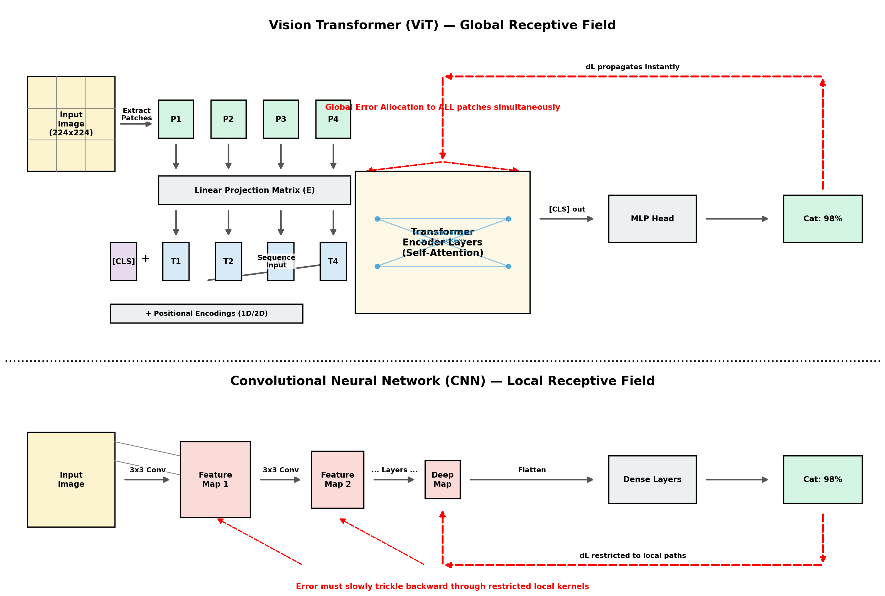

#### The Input Pipeline (Tracing the Red Path in the Diagram):

**Step 1: Divide into Patches**
We take the input image (e.g., $224 \times 224 \times 3$ channels) and divide it into an explicit grid of $N$ square patches.
A standard patch size is $P=16 \times 16$.
Total patches: $N = (\frac{224}{16}) \times (\frac{224}{16}) = 14 \times 14 = \mathbf{196}$.
These $196$ patches act like our sentence sequence length.

**Step 2: Flatten & Linearly Embed (The Learnable Patch E)**
Each $16 \times 16 \times 3$ patch is flattened into a single, massive 768-dimensional vector ($16 \cdot 16 \cdot 3 = 768$). This vector is just raw pixels.
We multiply this raw vector by a **learnable Patch Embedding Matrix (E)** of dimension $768 \times d_{model}$. If our model uses $d=768$:

$$
\text{Patch Token Vector} = \text{Flattened Patch} \cdot E
$$

This projects the raw pixels into the exact same deep semantic embedding space used by text transformers!

**Step 3: The `[CLS]` Token & Positional Encodings**
Similar to BERT, we insert a special, learned **`[CLS]` (Classification) Token** vector to the start of the sequence. (Sequence length is now $196+1 = 197$).
Because the patches are processed in parallel, we must add **Trigonometric Positional Encodings ($PE$)** to inject the grid coordinates ($x, y$) into the vectors.

#### Step 4: The Transformer Encoder

This sequence of $197 \times 768$ vectors is passed through a stack of standard Transformer Encoder blocks (identical to the ones we just derived). They perform Multi-Head Self-Attention, allowing every visual token to attend to every other visual token globally across the entire image.

Finally, the output vector of the special `[CLS]` token is passed through a standard Multi-Layer Perceptron (MLP) for classification:

$$
\text{Output} = \text{softmax}(\text{MLP}(h_{CLS}^{(L)}))
$$

### 2. Deep Dive: Key ViT Concepts

Before the math trace, we must understand *why* the architecture is built this way.

**Why Patches instead of Pixels? (The $N^2$ Problem)**
Standard attention has an $O(N^2)$ time and memory complexity. A $224 \times 224$ image has $50,176$ pixels. If each pixel was a token, the attention matrix would be $50,176 \times 50,176 \approx 2.5$ billion operations per layer, which is impossible to compute. Grouping pixels into $16 \times 16$ patches reduces the sequence length $N$ down to a highly manageable $196$ tokens.

**The Magic of the `[CLS]` Token**
Why not just average all the patch outputs? Self-attention is *permutation invariant*—it doesn't inherently care about order. By prepending a blank, learnable `[CLS]` token to the sequence, we provide a dedicated "aggregator." Because it is at position 0, it interacts equally with all image patches, mathematically pooling the global context into a single vector purely dedicated to the classification task.

**Positional Encodings (1D vs 2D)**
Even though the image is a 2D grid, ViT flattens the patches into a 1D sequence ($1, 2, \dots, 196$) and adds standard 1D positional encodings. The paper authors found that the Transformer's global attention is so powerful that it naturally *learns* the 2D grid structure (e.g., it learns that patch 1 and patch 15 are vertically adjacent) without needing explicit 2D mathematical formulas.

### 3. Hands-On Math Trace: A Mini-ViT (d=2)

Let's trace the exact mathematical journey of an image through a simplified Vision Transformer.

**Setup:**
*   **Image:** A tiny grayscale image, $2 \times 4$ pixels.
*   **Patch Size:** $2 \times 2$ pixels ($P=2$).
*   **Total Patches:** $N = 2$ patches (Left patch and Right patch).
*   **Embedding Dimension:** $d_{model} = 2$.

**Step 1: Extract and Flatten Patches**
Assume our image has a dark edge on the left and is bright on the right.

**Patch 1 (Left):**

$$
\begin{bmatrix} 0.1 & 0.1 \\ 0.2 & 0.1 \end{bmatrix} \rightarrow \text{Flattens to } x_1 = \begin{bmatrix} 0.1 & 0.1 & 0.2 & 0.1 \end{bmatrix}
$$

**Patch 2 (Right):**

$$
\begin{bmatrix} 0.9 & 0.8 \\ 0.9 & 0.9 \end{bmatrix} \rightarrow \text{Flattens to } x_2 = \begin{bmatrix} 0.9 & 0.8 & 0.9 & 0.9 \end{bmatrix}
$$

**Step 2: Linear Patch Embedding**
We project the 4-dimensional raw pixels into our $d=2$ embedding space using a learnable weight matrix $E$ ($4 \times 2$). Let's assume the network has learned a generic projection matrix:

$$
E = \begin{bmatrix} 1.0 & -1.0 \\ 1.0 & -1.0 \\ -1.0 & 1.0 \\ -1.0 & 1.0 \end{bmatrix}
$$

Multiply the patches by $E$:

**Token 1:**

$$
t_1 = x_1 \cdot E = \begin{bmatrix} 0.1(1) + 0.1(1) + 0.2(-1) + 0.1(-1) & 0.1(-1) + 0.1(-1) + 0.2(1) + 0.1(1) \end{bmatrix} = \begin{bmatrix} -0.1 & 0.1 \end{bmatrix}
$$

**Token 2:**

$$
t_2 = x_2 \cdot E = \begin{bmatrix} 0.9(1) + 0.8(1) + 0.9(-1) + 0.9(-1) & 0.9(-1) + 0.8(-1) + 0.9(1) + 0.9(1) \end{bmatrix} = \begin{bmatrix} -0.1 & 0.1 \end{bmatrix}
$$

*(Notice how raw pixel grids have now become abstract mathematical semantic tokens, exactly like word embeddings in an LLM).*

**Step 3: `[CLS]` Token and Positional Encoding**
We prepend a learnable `[CLS]` token ($t_{cls} = \begin{bmatrix} 0.5 & 0.5 \end{bmatrix}$) and add fixed positional encodings to inject location data back into the flattened sequence.

**Positional Encodings:**

$$
PE_{cls} = \begin{bmatrix} 0.0 & 0.0 \end{bmatrix}
$$

$$
PE_1 = \begin{bmatrix} 0.0 & 1.0 \end{bmatrix} \text{ (Position 1 encoding)}
$$

$$
PE_2 = \begin{bmatrix} 0.8 & 0.5 \end{bmatrix} \text{ (Position 2 encoding)}
$$

**Final Input Sequence Matrix ($X$):**

$$
X_{cls} = t_{cls} + PE_{cls} = \begin{bmatrix} 0.5 & 0.5 \end{bmatrix} + \begin{bmatrix} 0.0 & 0.0 \end{bmatrix} = \begin{bmatrix} 0.5 & 0.5 \end{bmatrix}
$$

$$
X_1 = t_1 + PE_1 = \begin{bmatrix} -0.1 & 0.1 \end{bmatrix} + \begin{bmatrix} 0.0 & 1.0 \end{bmatrix} = \begin{bmatrix} -0.1 & 1.1 \end{bmatrix}
$$

$$
X_2 = t_2 + PE_2 = \begin{bmatrix} -0.1 & 0.1 \end{bmatrix} + \begin{bmatrix} 0.8 & 0.5 \end{bmatrix} = \begin{bmatrix} 0.7 & 0.6 \end{bmatrix}
$$

**Step 4: Global Self-Attention in the Encoder**
The sequence $X$ enters the Transformer Encoder. Let's look exclusively at how the `[CLS]` token makes its decision by calculating the dot-product of its Query ($Q_{cls}$) with the Keys ($K$) of the image patches. Assume $W_Q$ and $W_K$ are Identity matrices ($I$) for simplicity.

**Query and Keys:**

$$
Q_{cls} = X_{cls} = \begin{bmatrix} 0.5 & 0.5 \end{bmatrix}
$$

$$
K_1 = X_1 = \begin{bmatrix} -0.1 & 1.1 \end{bmatrix}
$$

$$
K_2 = X_2 = \begin{bmatrix} 0.7 & 0.6 \end{bmatrix}
$$

**Calculate Raw Attention Scores:**

$$
\text{Score}(cls \rightarrow \text{Patch 1}) = Q_{cls} \cdot K_1^T = (0.5)(-0.1) + (0.5)(1.1) = -0.05 + 0.55 = \mathbf{0.50}
$$

$$
\text{Score}(cls \rightarrow \text{Patch 2}) = Q_{cls} \cdot K_2^T = (0.5)(0.7) + (0.5)(0.6) = 0.35 + 0.30 = \mathbf{0.65}
$$

After applying Softmax to these scores, the `[CLS]` token will dynamically pull more $V$ (Value) data from Patch 2 than Patch 1 to formulate its final classification output. This proves that the `[CLS]` token has immediate, $O(1)$ global access to the entire image.

### 4. Backpropagation: Global Receptive Field vs. CNN

Let's look at the Red backpropagation path in the bottom of the diagram, where the error for the classification output `"Cat: 98%"` is reverse-allocated.

**CNN Limitations:** The $3 \times 3$ CNN only slides locally. Its receptive field grows very slowly. It takes dozens of layers to see the whole image. The gradients are always restricted to the fixed local grid.

**ViT Global Attention:** During BPTT, the error hits the $QK^T$ attention matrix of the special `[CLS]` token. This matrix shows the entire image at once. The error ($dL$) is reverse-calculated and allocated backward into the learnable weight matrices ($W_Q, W_K, W_V$) of the *original patch embedding layers*. The error from predicting "Cat" instantly updates the mathematical meaning of the *pixels* of both the 'Tail Patch' and the 'Ear Patch', because they were connected globally in Step 1.

This global connectivity allows ViTs to excel at tasks requiring high-level semantic understanding, while CNNs continue to lead at tasks requiring precise local segmentation or detection.

---

### Topic 3 Placement Prep: Elite ViT Flashcards

**Q1: Explain the main differences between how a standard CNN uses local receptive fields and how a Vision Transformer uses global receptive fields to process an image.**
*   **Answer:** CNNs have a hardcoded **local inductive bias**. Their fundamental operation (3x3 Convolution) slides locally, forcing the network to prioritize local grid connectivity. A CNN must stack many layers before a single pixel in the bottom-left can "see" a pixel in the top-right. Transformers have no fixed local grid; they rely on **Global Self-Attention**. In the very first layer of a ViT, the Special `[CLS]` token (Query) can dot-product with the Key of a corner patch, allowing information to travel across the entire image instantly ($O(1)$ relationship distance). ViTs don't assume locality; they *learn* it dynamically from the data.

**Q2: Describe the Vision Transformer's complete Input Processing pipeline (how pixels are formatted for the Encoder). List three major operations.**
*   **Answer:** The input (e.g., $224 \times 224$ image) is: (1) Divided into an explicit grid of $N$ fixed patches (e.g., 16x16 pixels). (2) These patches are flattened into vectors and passed through a learnable **Linear Patch Embedding matrix ($E$)**, which projects the raw pixel values into the deep embedding dimension (e.g., $d=768$). (3) A special **learnable Classification `[CLS]` token** is inserted at the start, and **Trigonometric Positional Encodings** are added to inject grid coordinates into all vectors before they enter the Encoder.

**Q3: ViTs are often noted to require *much* larger datasets (like JFT-300M or ImageNet-21k) to reach peak performance compared to standard CNNs (like ResNet). Why is this mathematically the case?**
*   **Answer:** CNNs have a strong local inductive bias hardcoded into their mathematics: they slide a fixed local grid, assuming that adjacent pixels are related. This bias acts like a mathematical "shortcut," allowing CNNs to achieve high accuracy with less data because the core rule of vision is pre-programmed. ViTs completely abandon this bias in favor of universal attention (everything can attend to everything). Without the shortcut, the ViT must literally *learn* from scratch that "Adjacent pixels are related" by observing millions of images. This is computationally expensive, but once it has enough data, the global flexibility allows ViTs to achieve superior accuracy and generalization on complex, SOTA tasks.
